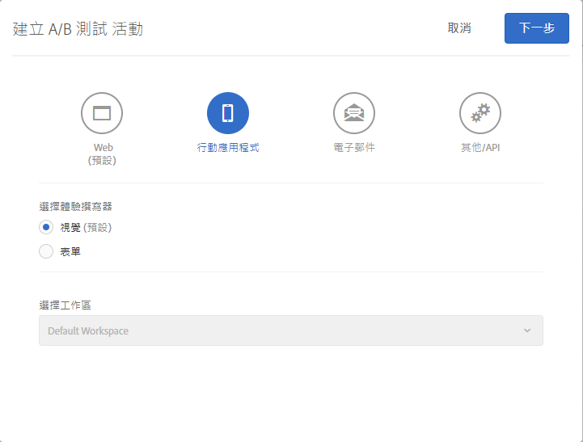
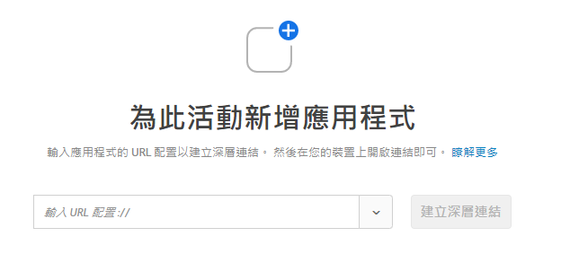

# 行動應用程式可視化體驗撰寫器{#mobile-app-visual-experience-composer}

適用原生行動應用程式的可視化體驗撰寫器 (VEC) 可讓您在原生行動應用程式中，自己動手建立活動與個人化內容，不必再經過不斷的開發相依性及應用程式發行週期。

現有的[可視化體驗撰寫器](../../c-experiences/experiences.md#section_34265986611B4AB8A0E4D6ACC25EF91D)能讓您全部自己動手操作，建立活動與個人化體驗，並能透過 Target 的全域 Mbox 動態傳送到您的網頁屬性，完全不會受到開發人員干涉。您現在也能在原生應用程式中充分利用 VEC 的這項功能。適用於 [AEP SDK v的Mobile App CMS](https://aep-sdks.gitbook.io/docs/using-mobile-extensions/adobe-target-vec)可用來建立 [行動應用程式的A/B測試](/help/c-activities/t-test-ab/test-ab.md) 和 [體驗定位(XT)](/help/c-activities/t-experience-target/experience-target.md) 活動。未來會支援其他活動類型。

Mobile App CMS支援 [在支援瀏覽器](../../c-implementing-target/c-considerations-before-you-implement-target/supported-browsers.md#reference_01B4BF99E7D545A7998773202A2F6100)中列出的瀏覽器。

## 使用適用原生行動應用程式的可視化體驗撰寫器 {#using-the-mobile-vec}

下圖說明使用Mobile App CMS的程序：

| 程序 | 詳細資料 |
|--- |--- |
| 配對 | 以安全的方式授權行動應用程式與裝置可以使用 Target。裝置只需要一次這個步驟。 |
| 編寫 | 編寫 [Target 活動](/help/c-activities/activities.md)，並可即時預覽 Target UI 中執行的動作。 |
| 傳送 | Target 會自動傳送原生行動應用程式的活動。 |

**配對:**

Mobile App CMS會即時連線至行銷人員的行動應用程式，以製作Target活動。若要啟用此功能，第一步便是以安全的方式，將行動裝置和應用程式與 Target 配對 (授權)。

1. 舉例來說，在建立 A/B 測試活動時，選取**[!UICONTROL 「行動應用程式」]**，再選取**[!UICONTROL 「視覺 (預設)」]**，然後選取**[!UICONTROL 「下一步」]**。

   

1. 輸入應用程式 URL，然後按一下**[!UICONTROL 「建立深層連結」]**。

   

配對程序包含下列步驟:

1. 輸入可用來產生深層連結的應用程式 URL 配置。一般深層連結看起來如下：

   `mymobileapp://path?params`

1. 深層連結可以使用 QR 碼或 URL。使用者可將QR Code從手機掃描，或透過電子郵件/電子郵件/訊息自行傳送。深層連結 URL 具有授權 Token，用來將行動裝置和應用程式與 Target 安全配對。
1. 在行動裝置上開啟深層連結 URL。啟動行動應用程式。SDK 會識別應用程式已啟動，並要在 VEC 中配對與編寫。

   SDK 會向 Target 伺服器發出要求並註冊本身。Target 伺服器會授權 Token，並與裝置建立即時連線 (目前使用網頁通訊端)。

   連線建立後，Target 介面中會出現應用程式即時檢視畫面。應用程式有一個紅色邊界重疊區域，這個指標代表應用程式已連線至 Target，如下圖所示。

   

   已配對的裝置可透過啟動應用程式並開啟編寫介面，來重新連線。

**編寫:**

在應用程式連線且 VEC 中出現應用程式即時檢視畫面後，您就可以開始編寫活動。此時支援下列操作：

| Action | 詳細資料 |
|--- |--- |
| 交換影像 | 選擇不同的影像選件或直接設定影像的CDN URL，以另一個方式交換影像。Target中的影像選件可透過 [Adobe Scene提供](/help/administrating-target/scene7-settings.md)。 |
| 變更文字 | 變更文字元素、按鈕或標籤中的文字內容、顏色或字體大小。 |
| 變更背景 | 變更文字區域或按鈕的內容或元素背景。 |

VEC 中執行的操作可在應用程式中即時查看，因此可在編寫時即時預覽。各項操作會與相關的行動裝置畫面或檢視以對應的方式建立關聯。

## 疑難排解 {#troubleshooting}

**行動App CMS表示我的應用程式已中斷連線。**

您的網際網路連線可能已中斷。在恢復網際網路後重新啟動應用程式，便會建立新的連線。建議您在WiFi連線上編寫行動應用程式CMS活動。

**行動應用程式CMS與我的行動應用程式不同步。**

在 VEC 中按一下[!UICONTROL 「重新整理」]按鈕，即可同步顯示畫面。

## Target 檢視與行動應用程式 {#target-views}

行動應用程式CMS運用全新的檢視概念：組成行動應用程式體驗的邏輯元素群組。

**Target 視圖簡介**

讓我們以購買花卉的購物應用程式作為例子。此應用程式可讓使用者執行下列作業:

* 列出現有的花卉與花束
* 檢視詳細資訊
* 訂購花卉
* 付款選項和地址等控制設定

在此應用程式中，每項作業都可以在行動應用程式的各別畫面中完成。當使用者在應用程式中瀏覽時，系統會呈現畫面，讓他們可以執行下列其中一項作業。如果您是 Android 開發人員，很有可能會建立四個不同的 Android Activity 類別，每個類別各自與其中一項作業建立關聯。

在這情況下，每個作業都可當作視圖，您的行動應用程式可在其間切換。我們將其稱為「Target檢視」-每一個皆具有唯一性。Target 視圖 (簡稱「視圖」) 是視覺化元素的邏輯容器，會顯示在行動裝置畫面上。視圖可以是畫面或 Android 的 Activity 類別。

行動應用程式的設計很少會如此簡單。實際一點吧! 第一個作業要列出現有的花卉與花束。來新增可以建立多種版面配置的功能吧! 這樣就會產生不同的畫面。舉例來說，新增有三個選項的「排序依據」功能:

* 依人氣
* 依價格 (由低至高)
* 依價格 (由高至低)

在這個範例中，只要使用者選取不同的「排序依據」選項，便會顯示新畫面 (即使 Activity 類別相同)。因此，每個畫面都能視為不同的 Target 視圖。

身為行銷人員的您，想要在每個檢視中建立不同的體驗，並採行專屬選件，且不要麻煩開發人員設定本地 Mbox，或要經過一整套應用程式發行週期。

## 設定Target Mobile應用程式CMS {#setting-up}

開發人員必須執行下列動作，才能針對行動應用程式啓用Mobile App CMS：

* 在Launch中設定Adobe Target CMS擴充功能
   * CMS擴充功能視Adobe [Target擴充功能](/help/c-implementing-target/c-implementing-target-for-client-side-web/how-to-deployatjs/cmp-implementing-target-using-adobe-launch.md)而定。請確定Adobe Target延伸模組已設定並啓用。
* 將Target CMS擴充功能新增至您的應用程式。
   * [Android - 設定行動應用程式](/help/c-target-mobile-app/c-mobile-visual-experience-composer/mobile-visual-experience-composer-android.md)
   * [iOS - 設定行動應用程式](/help/c-target-mobile-app/c-mobile-visual-experience-composer/mobile-visual-experience-composer-ios.md)

## Target CMS的實施方法

Target CMS擴充功能會透過網路要求擷取您應用程式的相關Target體驗。選件會透過此網路呼叫擷取，並自動套用在目標螢幕上。在使用者瀏覽多個應用程式畫面時，不會要求後續的網路要求擷取CMS體驗。

延伸功能的預設行為是在應用程式啓動時進行同步網路要求(封鎖呼叫)。您可以使用Launch來控制此網路要求的行為，以滿足您的應用程式行為。

### 自動擷取目標活動

此為Target CMS擴充功能自動起始網路要求的預設行為。您可以使用下列其中一個選項來要求封鎖呼叫或非同步請求。

* 同步呼叫中的擷取(背景已關閉)

   在選取後，Target CMS擴充功能會在應用程式啓動時做為封鎖呼叫進行網路要求。選件會立即套用，應用程式中不會閃爍。這是擴充功能的預設行為。

* 非同步呼叫中的Fetch(背景為ON)

   選取後，Target CMS擴充功能會在應用程式啓動時在背景中發出網路請求，但不會封鎖應用程式載入。如果您的體驗是在應用程式的主畫面上編寫，則如果在呼叫完成前顯示畫面，選件可能不會套用到主畫面。應用程式畫面演算通常會透過生命週期事件 `didFinishLaunchingWithOptions` 以及iOS `onActivityResumed` 和Android分別識別。選件會自動套用至所有後續畫面。

### 以程式設計方式擷取目標活動

您可以停用Target CMS擴充功能以自動進行網路要求，並決定以程式設計方式呼叫Extension API。這可讓您的開發人員控制他們如何在應用程式中整合Target CMS選件。Target CMS擴充功能有兩種靜態方法 `prefetchOffers` ，可 `prefetchOffersBackground` 用來程式設計擷取Target CMS選件。

* `prefetchOffers` 方法會隱藏目前畫面，直到Target CMS提供為止。選件會自動套用至目前畫面(如果適用)，畫面就會再次顯示。
* `prefetchOffersBackground` 此方法不會隱藏目前畫面，並進行呼叫以擷取相關的Target選件。目標選件 ** 不會套用在目前畫面上，而且沒有閃爍。當使用者導覽至後續畫面時，會自動套用選件。

### 處理Target工作區限制

您可以使用Launch介面來設定工作區 `at_property` 的值。如此可確保只有該工作區中的活動會傳送至您的行動應用程式。

## Target API呼叫的一般准則 {#section_C7276795F02540DCA230AEEDF882A833}

若要正確在 Android 新增 Target 視圖，下方簡表條列出放置 `targetView` 呼叫的正確位置:

| 接受的 TargetView 位置 | 正確的新增條件 |
|--- |--- |
| 在 `Activity::onStart`、`Activity::onResume` 結尾 | 開發人員可自行決定 `OnStart` 和 `OnResume` 是否要為相同或不同的 `targetViews`。若相同，則使用相同的 `viewName`。若不同，則使用不同的 `viewNames`。SDK 會自動新增這些事件。 |
| 接續 `Activity::SetContent` 呼叫之後 | 如果 UI 不會變更，可以插入 `targetView` 呼叫。 |
| 在 `View::willAppear` 內 | 如果選取的檢視在一個特定檢視階層中唯一顯示。 |
| 接續 `Activity::SetContentView` 呼叫之後 | 如果活動沒有變更或修改下列程式碼的任何內容。 |

若為 Android，下表為 `targetView` 呼叫的錯誤放置位置:

| 不接受的 TargetView 位置 | 原因 |
|--- |--- |
| 在 `Activity::onCreate` 內 | 活動已建立，但與活動相關的檢視不保證已完成及/或附加至視窗。這樣的放置位置可能會導致編寫畫面未取樣或取樣不正確，和/或選件套用的方式未定。 |
| 在 `View::didAppear` 內 | 視圖已經顯示，若再套用選件，會產生不良的 UI 體驗，造成忽隱忽現的情形。 |
| 在 `View::didLoad` 內 | 視圖並未附加於主檢視階層，且可能已個體化，但不保證會顯示在應用程式 UI 中。 |

## 傳送 {#delivery}

使用行動App CMS撰寫的Target活動會自動在行動應用程式中傳送。這些活動會在應用程式啓動時預先擷取(根據啓動設定)，並在使用者瀏覽不同的Target檢視時套用，通常會直接對應至畫面。

呼叫 `TargetVEC.prefetchOffersBackground()` API方法時，Target Edge會擷取Target選件並在本機快取。當 `targetView()` 呼叫觸發 Target 視圖，就能立即從快取套用 Target 選件，而不必透過網路擷取，藉此提供更流暢的使用者體驗。

如需額外的彈性，您也可以呼叫API，此 `TargetVEC.prefetchOffers()` API會先隱藏目前版面，直到Target選件預先擷取並套用至顯示「目標檢視」(可能造成閃爍)為止。

當使用者導覽客戶應用程式時，也可以重複呼叫 `TargetVEC.prefetchOffersBackground()`，以最新的適當內容重新整理本機 Target 選件快取 (待更新完目前使用者的 Target 個人資料的最新情形)。

請注意，每一次 Target 選件預先擷取時，可能的話，亦會套用 `AdobeTargetMobile.targetView()` 觸發的最後一個 Target 視圖所屬選件。

## 已知限制 {#limitations}

* Mobile App CMS目前可用來建立 [行動應用程式的A/B測試](/help/c-activities/t-test-ab/test-ab.md) 和 [體驗定位(XT)](/help/c-activities/t-experience-target/experience-target.md) 活動。未來會支援其他活動類型。
* 尚未支援「預覽」功能。將於即將發行的版本中提供。
* 嘗試將應用程式重新連線至Mobile App CMS時，您必須完全退出應用程式並重新啓動應用程式。

   如果行動應用程式已在下方所列情況期間開啟，您必須關閉應用程式，然後重新開啟。請注意，您*必須*從「最近使用的應用程式」區段關閉行動應用程式，而*非*按下「返回」按鈕。如果使用「返回」按鈕關閉應用程式，可能會發生斷斷續續的連線問題。

   如果應用程式已開啓，您必須重新啓動應用程式，才能連線至Mobile App CMS：

   * 建立新活動時，在您選取行動應用程式後，畫面顯示裝置清單對話方塊。如果應用程式已開啟，您必須關閉然後重新啟動應用程式，裝置才會顯示為可供選取。
   * 在您開始編輯活動時，畫面會顯示裝置對話方塊。如果應用程式已開啟，您必須關閉然後重新啟動應用程式，裝置才會顯示為可供選取。
   * 在您從「目標與設定」一步導覽回「編寫」步驟 (步驟 1) 時，畫面會顯示裝置對話方塊。如果應用程式已開啓，您必須關閉並重新啓動應用程式，才能連線至Mobile App CMS。
   請確定您是從「最近使用的應用程式」區段關閉行動應用程式，而非按下[!UICONTROL 「返回」]按鈕。

## 訓練影片：Adobe Target Mobile App Visual Exposer(3：33) {#video}

>[!VIDEO](https://video.tv.adobe.com/v/27528)