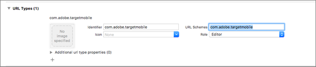
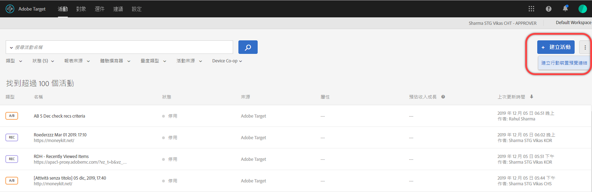
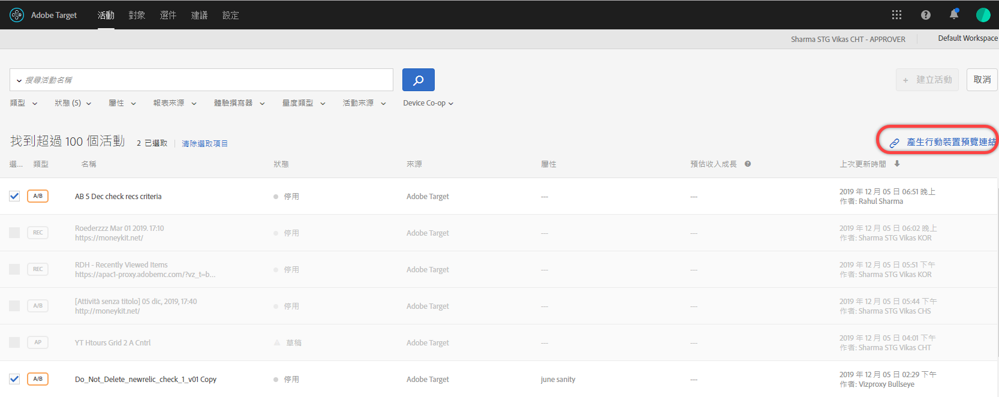
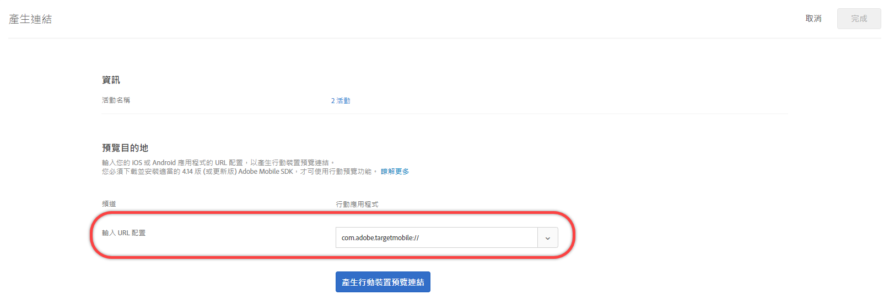
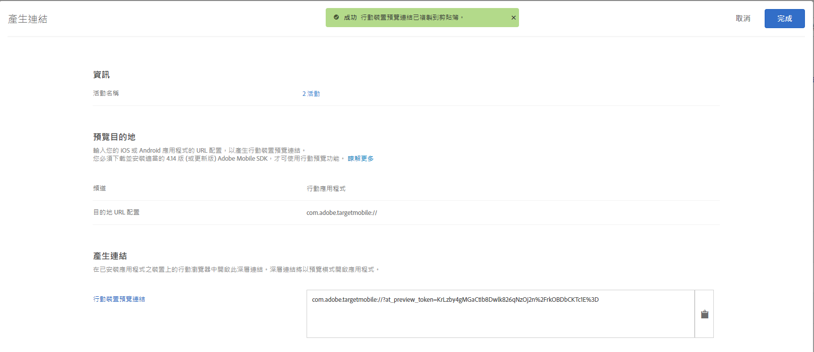

# Target 行動裝置預覽{#target-mobile-preview}

使用行動裝置預覽連結為行動應用程式活動執行簡單的端對端品質確保措施，並且無需任何特殊測試裝置，即可在您的裝置上註冊不同的體驗。

>[!NOTE]
>
>行動裝置預覽功能需要您下載並安裝適當的 Adobe Mobile SDK 4.14 (或更新版本) 版本。

## 概述 {#section_981D6FA4AEE64098809EA606E89E4A5E}

行動裝置預覽功能可讓您在讓活動上線啟動之前，完整測試您的行動應用程式活動。

## 必要條件 {#section_A763C564C9E84B0EB448237B5B1E4068}

1. **使用支援的 SDK 版本:** 行動裝置預覽功能需要在您的對應應用程式中下載並安裝適當的 Adobe Mobile SDK 4.14 (或更新版本) 版本。

   如需下載適當 SDK 的說明，請參閱:

   * **iOS:**[在您開始使用](https://experienceleague.adobe.com/docs/mobile-services/ios/getting-started-ios/requirements.html) 「 *Mobile Services iOS說明」之前*。
   * **Android:**[在您開始使用](https://experienceleague.adobe.com/docs/mobile-services/android/getting-started-android/requirements.html) 「 *Mobile Services Android說明」之前*。

1. **設定 URL 配置:** 預覽連結使用 URL 配置來開啟您的應用程式。您必須針對預覽指定唯一的 URL 配置。

   下列插圖是 iOS 上的範例:

   

   下列插圖是 Android 上的範例:

   

1. **追蹤 Adobe DeepLink**

   **iOS:** 當要求委派使用先前步驟中指定的 URL 配置開啟資源時，請在應用程式委派中呼叫 `[ADBMobile trackAdobeDeepLink:url`。

   下列程式碼片段為範例:

   ```javascript
   - (BOOL) application:(UIApplication *)app openURL:(NSURL *)url 
                options:(NSDictionary<NSString *,id> *)options { 
   
       if ([[url scheme] isEqualToString:@"com.adobe.targetmobile"]) { 
           [ADBMobile trackAdobeDeepLink:url]; 
           return YES; 
       } 
       return NO; 
   } 
   ```

   **Android:** 當要求呼叫端使用先前的步驟中指定的 URL 配置開啟資源時，請在應用程式中呼叫 `Config.trackAdobeDeepLink(URL);`。

   ```javascript
    private Boolean shouldOpenDeeplinkUrl() { 
        Intent appLinkIntent = getIntent(); 
        String appLinkAction = appLinkIntent.getAction(); 
        Uri appLinkData = appLinkIntent.getData; 
        if (appLinkData.toString().startsWith("com.adobe.targetmobile")) { 
            Config.trackAdobeDeepLink(appLinkData); 
            return true; 
        } 
        return false; 
     }
   ```

   若要讓「行動裝置預覽」可對 Android 正常運作，您也必須在 [!DNL AndroidManifest.xml] 中新增下列程式碼片段:

   ```javascript
   <activity android:name="com.adobe.marketing.mobile.FullscreenMessageActivity" />
   ```

## 產生預覽連結 {#section_D9D58173FFF34E9BB75EBF357273F128}

1. 在 Target UI 中，按一下&#x200B;**[!UICONTROL 「更多選項」]**&#x200B;圖示 (三個垂直的點)，然後選取&#x200B;**[!UICONTROL 「建立行動裝置預覽」]**。

   

1. 選取您要預覽的活動，然後按一下&#x200B;**[!UICONTROL 「產生行動裝置預覽連結」]**。

   >[!NOTE]
   >
   >僅能選取表單式 AB 和 XT 活動。

   

1. 指定您應用程式的 URL 配置。

   這需要與您 iOS 或 Android 應用程式中所呈現的內容相同。分別對 iOS 和 Android 重複此程序 (如必要)。

   

1. 按一下&#x200B;**[!UICONTROL 「產生行動裝置預覽連結」]**，然後複製連結。

   

## 在您的裝置上預覽 {#section_521F0D46F3DE4A2A98283A1B73FF69F6}

在您安裝應用程式所在裝置上的行動瀏覽器中開啟連結。此應用程式可以是您從 Apple App Store 或 Google Play 商店下載的生產應用程式。不需要是某個特殊版本。如果您有使用中預覽連結，將可以在裝置上檢視體驗。

1. 在您的行動瀏覽器中開啟連結。

   以便利的方式 (例如使用文字、電子郵件或 Slack) 將您在先前的步驟中從 Target UI 複製的連結共用至您的行動裝置。

   |||

   您的應用程式即會開啟，並啟動 Target Mobile 預覽模式。

1. 選取您要查看的體驗組合，然後按一下&#x200B;**[!UICONTROL 「啟動體驗」]**。

   ||||
||||

## 限制 {#section_4E9BDED0F718485292527EFB508305BD}

* 按一下[!UICONTROL 「啟動體驗」]按鈕之後，必須重新載入檢視新內容才會顯示。最容易的方式是切換至不同畫面，然後回到您預期會發生變更的畫面。
* Android 早於 API-19 (KitKat) 的版本不支援行動裝置預覽。