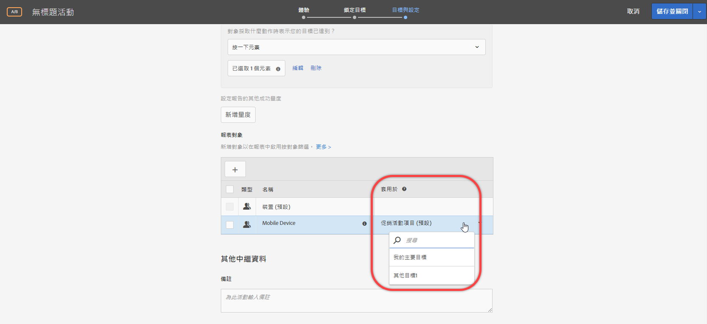
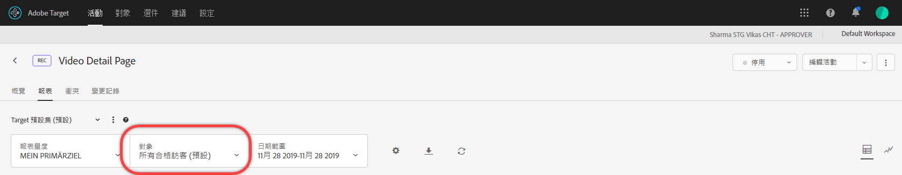

# 套用報表對象至成功量度

選擇符合報表對象使用者資格的成功量度。

對於所有活動，[!UICONTROL 「套用於」]下拉式清單可讓您將對象套用至成功量度，在達到量度之後和針對後續動作，您就可以檢視報表數字。

例如，假設您已經為所有從首頁進入並抵達轉換頁面的訪客建立活動，但對於轉換之前已在購物車中增加 $50 以上的訪客，您還想要進一步向下鑽研。

「套用於」下拉式清單可能提供三種類別: 進入活動的任何訪客、僅限到達活動中特定步驟的訪客，或僅限達到轉換的訪客。或者，換一種說法，您可以指定訪客必須到達活動進入頁面上的 Mbox、定義活動中途某一點的 Mbox，或活動最後的轉換 Mbox。

[成功量度](/help/c-activities/r-success-metrics/success-metrics.md#reference_D011575C85DA48E989A244593D9B9924)必須先設定給活動才可使用。如果您尚未定義成功量度，則從下拉式清單中只會看到兩個選項: 「促銷活動項目」和「轉換」。

將報表對象套用至成功量度時，請考量下列資訊:

* 對於已套用成功量度的動作之前的動作，Target 不會套用分段對象。
* 對於套用的成功量度之後的動作，Target 會套用分段對象。

若要在報表中檢視分段，請從活動報表的「對象」下拉式清單中選取所需的對象。

