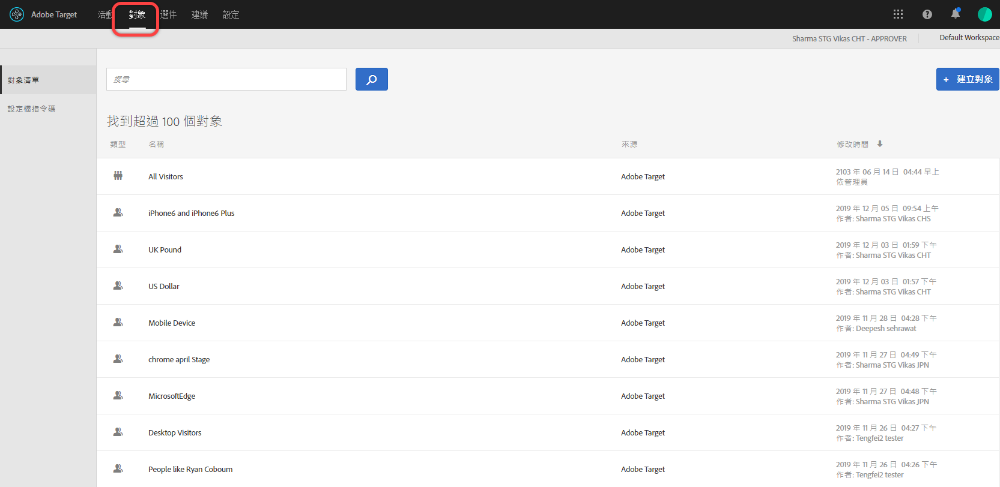
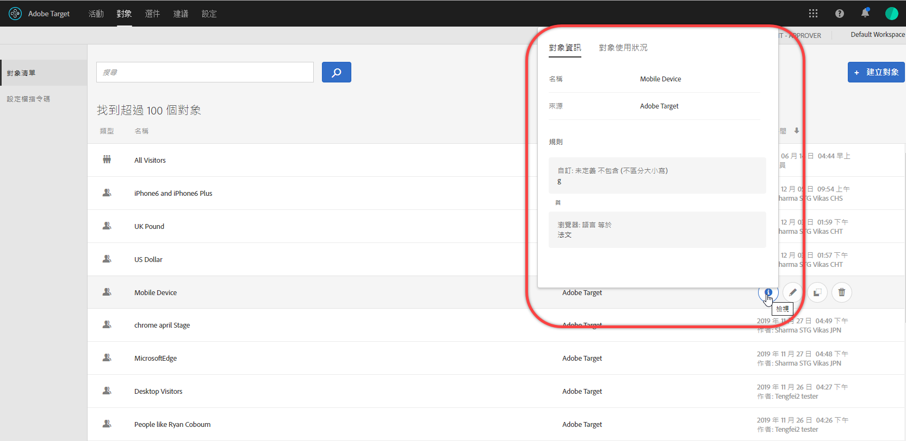
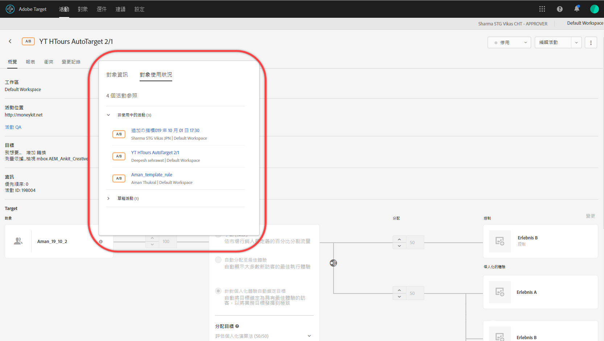
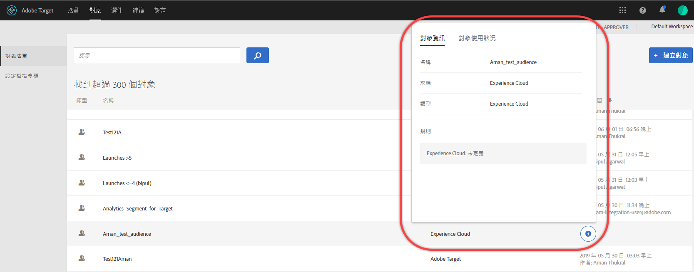

# 建立對象

[!DNL Adobe Target]中的對象會決定誰可以看到鎖定目標活動中的內容和體驗。

可使用鎖定目標之處皆可使用對象。定位活動時，您有下列選項：

* 從[!UICONTROL 對象]清單中選取可重複使用的對象
* [建立活動特定對象](/help/c-target/creating-activity-only-audience.md) 並將其定位
* [結合多](/help/c-target/combining-multiple-audiences.md#concept_A7386F1EA4394BD2AB72399C225981E5) 個對象以建立隨選對象

您也可以使用[!DNL Adobe Analytics]收集的對象資料，在[!DNL Target]和其他[!DNL Adobe Experience Cloud]應用程式中用於即時鎖定目標和個人化。 請參閱&#x200B;*Experience Cloud中心介面元件*&#x200B;指南中的[Experience Cloud對象](https://experienceleague.adobe.com/docs/core-services/interface/audiences/audience-library.html??lang=zh-Hant)。

[!DNL Target]中有兩種對象：

* **鎖定目標對象：** 用於傳送不同內容給不同類型的訪客。
* **報表對象：** 用於判斷不同類型的訪客如何回應相同內容，以便您分析測試結果。

   在 [!DNL Target] 中，只有在使用 [!DNL Target] 作為報表來源時，才可設定報表對象。如果您使用 [ Adobe Analytics 作為報表來源](/help/c-integrating-target-with-mac/a4t/a4t.md) (A4T)，則必須在 [!DNL Analytics] 內設定報表對象。

## 使用[!UICONTROL Audiences]清單

若要存取[!UICONTROL 「對象」]清單，請按一下頂端功能表列中的&#x200B;**[!UICONTROL 「對象」]**:

[!UICONTROL 對象]清單包含您可在活動中使用的對象。 使用[!UICONTROL 對象]清單來建立、編輯、複製、複製或結合對象。 清單也會顯示建立對象的來源：

* [!DNL Adobe Target]
* [!DNL Adobe Target Classic]
* [!DNL Experience Cloud]
* [!DNL Adobe Experience Platform]

   >[!NOTE]
   >
   >[!DNL Adobe Experience Platform]來源位於測試版測試程式中，但可供使用[Adobe Experience Platform Web SDK](/help/c-implementing-target/c-implementing-target-for-client-side-web/aep-web-sdk.md)的所有[!DNL Target]客戶使用。 [!DNL Adobe Experience Platform]中可用的對象可如同或[結合現有對象](/help/c-target/combining-multiple-audiences.md)使用。

無法重新命名預先定義的對象，例如「[!UICONTROL 新訪客]」和「[!UICONTROL 回訪訪客]」。

使用原本於[!DNL Experience Cloud]或[!DNL Adobe Experience Platform]中建立的對象時，如果您參考[!DNL Target]活動中的對象，而後又在[!DNL Experience Cloud]或[!DNL Adobe Experience Platform]中刪除， [!DNL Target]會提醒您。

* 如果對象已在[!DNL Experience Cloud]或[!DNL Adobe Experience Platform]中刪除， [!UICONTROL Audience]清單和對象選擇器中皆會顯示警告圖示。 [!DNL Target] UI中的工具提示也指出閱聽眾已在[!DNL Experience Cloud]或[!DNL Adobe Experience Platform]中刪除。
* 若嘗試將多個對象與已刪除的對象合併，或嘗試儲存參考已刪除對象的活動，系統會顯示警告訊息。

您也可以鎖定自訂設定檔參數和 `user.` 參數。建立對象時，將您要用來定位活動的屬性拖曳至對象產生器視窗中。 如果未顯示所需的屬性，則mbox尚未觸發屬性。 在[!UICONTROL 「自訂參數」]下拉式清單中可取得其他自訂 mbox 參數。

使用[!UICONTROL Filters]按鈕，依來源篩選[!UICONTROL  Audiences]清單：[!DNL Adobe Target]、[!DNL Adobe Target Classic]、[!DNL Experience Cloud]和[!DNL Adobe Experience Platform]。

使用「[!UICONTROL 搜尋對象]」方塊來搜尋您的[!UICONTROL 對象]清單。 您可以搜尋對象名稱的任何部分，或您可以將特定字串放在引號內。

您可以依對象名稱或上次修改日期來排序[!UICONTROL 「對象」]清單。若要依名稱排序，請按一下欄標題，然後選擇依遞增或遞減順序來顯示對象。

## 檢視受眾定義 {#section_11B9C4A777E14D36BA1E925021945780}

您可以在[!DNL Target] UI中不同位置的快顯卡上檢視對象定義詳細資料，而不需開啟對象。 此功能適用於在[!DNL Target Standard/Premium]中建立的對象，以及從[!DNL Target Classic]匯入或透過API建立的對象。

例如，您可以按一下所需對象的[!UICONTROL 檢視詳細資料]圖示，來存取下列對象定義卡：

按一下活動[!UICONTROL 概述]頁面上的[!UICONTROL 檢視詳細資料]圖示，即可存取下列對象定義卡：

受眾定義卡片會顯示受眾的類型、來源和屬性。 按一下「**[!UICONTROL 檢視完整詳細資料]**」，查看參考該對象的其他活動（若適用）。 如果您是從活動的[!UICONTROL 概述]頁面檢視對象定義卡片，請按一下&#x200B;**[!UICONTROL 對象使用狀況]**。

受眾使用資訊可協助您避免在編輯受眾時對其他活動造成意外影響。 資訊包括[!UICONTROL 即時活動]、[!UICONTROL 非活動活動]、[!UICONTROL 已封存活動]和[!UICONTROL 同步活動]。 此功能適用於所有對象（資料庫對象和[僅限於此活動的對象](/help/c-target/creating-activity-only-audience.md#concept_A6BADCF530ED4AE1852E677FEBE68483)）。

如果對象是[與另一個對象](/help/c-target/combining-multiple-audiences.md)結合，且結合的對象是用來建立活動，則兩個對象的使用資訊會列出新建立的活動。

<!--The following audience definition card is for an audience imported from the Adobe Experience Cloud. In this instance, the audience was imported from Adobe Audience Manager (AAM).

The following details are available for these imported audience types:

| Audience Type | Details |
|--- |--- |
|Mobile audience|Marketing Name, Vendor, and Model. The `matches | does not match` operator displays instead of `equals | does not equal` .|
|Visitor-behavior audience|**user.categoryAffinity:** `categoryAffinity` with `FAVORITE` parameter.  **Monitoring:** Monitoring service equals true. **No Monitoring Service:** Monitoring service equals false. |
|Audiences using the NOT operator|**Single Rule:** Target displays the audience in the format `[All Visitor AND [NOT [rule]`. Single NOT rule displays with AND with `AllVisitor` audience. |

Keep the following points in mind as you work with imported audiences:

* Expression target audiences are no longer supported in Target Standard/Premium. 
* Target Standard/Premium does not support some deprecated audiences or has improved operators for ease of use. Because of this, the definition of an imported audience, although working as per definition, does not mean that same is now available for creation in the Standard/Premium interface. For example, Social Audiences are visible with their rules but Target Standard/Premium does not allow social audiences to be created.-->

## 訓練影片：使用對象

此影片包括關於使用對象的資訊。

* 說明詞語「對象」
* 說明將對象用於最佳化的兩個方式
* 在對象清單中尋找對象
* 將活動鎖定至對象
* 對活動中的被動報表使用對象

>[!VIDEO](https://video.tv.adobe.com/v/17398)
