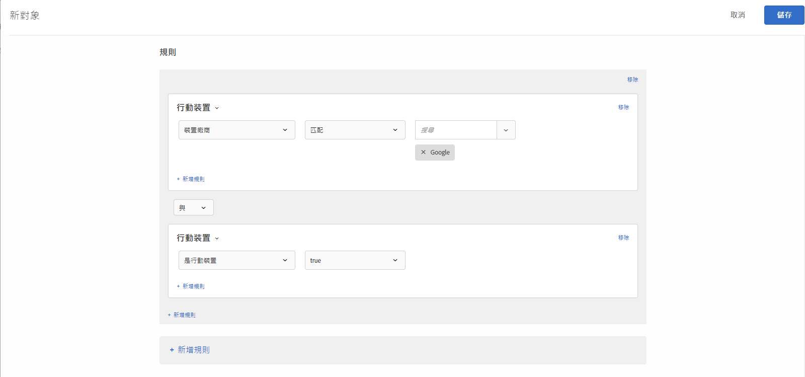

# 行動{#mobile}

建立受眾，根據行動裝置、裝置類型、裝置廠商、畫面維度 (依像素) 等參數來鎖定行動裝置。

例如，對於從手機進入您頁面的使用者和從電腦造訪的使用者，您想要分別顯示不同內容。在此情況下，您可以選取「行動裝置對象」，再選取&#x200B;**[!UICONTROL 「是手機」]**&#x200B;選項，然後新增您認為重要的任何特定詳細資料，例如手機類型、螢幕大小 (畫素）等。

行動定位是由 [DeviceAtlas](https://deviceatlas.com/device-data/user-agent-tester) 所提供，這是一項 DotMobi 服務。DeviceAtlas 是全面性的行動裝置資料庫，其中包含從眾多來源 (包括製造商及網路營運商) 彙整而成的資料。這些資料會經過確認、交叉參考及驗證，以建立準確的大型行動裝置資料庫。

裝置偵測是經由分析 User-Agent 字串來完成。某些裝置製造商 (例如 Apple) 在 UA 中不提供足夠資訊，所以會停用此功能。

例如，Apple 裝置不會在 UA 中透露裝置型號專屬 Token。結果就是不可能以簡單的關鍵字方法來偵測 iPhone 型號 (例如 iPhone 5S、iPhone SE、iPhone 6 等等)。

為解決此問題，Target 會使用下列參數來收集額外資訊，以精確偵測 iPhone 和其他 Apple 裝置:

| 參數 | 類型 | 說明 |
|--- |--- |--- |
| devicePixelRatio | 字串 | 瀏覽器上實體畫素和裝置獨立畫素 (DIP) 之間的比例。例如:「1.5」或「2」 |
| screenOrientation | 字串 | 裝置和瀏覽器的 JavaScript 引擎支援裝置方向切換。可為橫向或縱向。 |
| webGLRenderer | 字串 | 顯示卡驅動程式的瀏覽器轉譯器。 |

>[!NOTE]
>
>使用 Mobile SDK 的客戶不須採取任何動作，即可使用這項功能。使用 at.js 的客戶必須[升級至 at.js 版本 1.5.0](/help/c-implementing-target/c-implementing-target-for-client-side-web/target-atjs-versions.md#reference_DBB5EDB79EC44E558F9E08D4774A0F7A) (或更新版本)。

您可以選擇多個行動裝置屬性。多個選擇是利用 OR 來結合。

使用自訂整合 (不使用 at.js 或 Mobile SDK) 的客戶可自行收集這些參數，然後以 mbox 參數傳遞。

1. 在 [!DNL Target] 介面中，按一下&#x200B;**[!UICONTROL 「對象」]**>**[!UICONTROL 「建立對象」]**。
1. 為對象命名。
1. 按一下「**[!UICONTROL 新增規則]** > **[!UICONTROL 行動裝置]**」。
1. 按一下&#x200B;**[!UICONTROL 「選取」]**，然後選取下列其中一個選項:

   * 裝置行銷名稱
   * 裝置型號
   * 裝置供應商
   * 是行動裝置
   * 是行動電話
   * 是平板電腦
   * 作業系統
   * 螢幕高度 (px)
   * 螢幕寬度 (px)

   >[!NOTE]
   >
   >由於 iOS 12.2 中推出的新變更，若使用指定 iPhone 機型之裝置行銷名稱和裝置型號所定義的規則來建立受眾，則會受到影響。我們無法再鎖定在 iPhone 上安裝 iOS 12.2 的使用者。不過，如果這些使用者沒有 iOS 12.2，iPhone 機型鎖定目標功能則可繼續正常運作。
   >
   >iOS 12.2 更新不會影響下列機型的識別，因為這些機型不支援升級至 iOS 12.2: iPhone、iPhone 3G、iPhone 3GS、iPhone 4、iPhone 4s、iPhone 5、iPhone 5c、iPad、iPad 2、iPad / Retina 顯示器、iPad Retina (第 4 代)、iPod Touch 4 和 iPod Touch 5。

   >[!NOTE]
   >
   >您可以依行動裝置電信業者來鎖定目標，請使用[地理設定](/help/c-target/c-audiences/c-target-rules/geo.md#concept_5B4D99DE685348FB877929EE0F942670)。

1. (可選) 按一下&#x200B;**[!UICONTROL 「新增規則」]**&#x200B;並設定對象的其他規則。
1. 按一下&#x200B;**[!UICONTROL 「儲存」]**。

下圖顯示受眾鎖定目標訪客，這些訪客使用 Google 所製造的行動裝置。

## 訓練影片: 建立對象

此影片包括關於使用對象類別的資訊。

* 建立對象
* 定義對象類別

>[!VIDEO](https://video.tv.adobe.com/v/17392)
