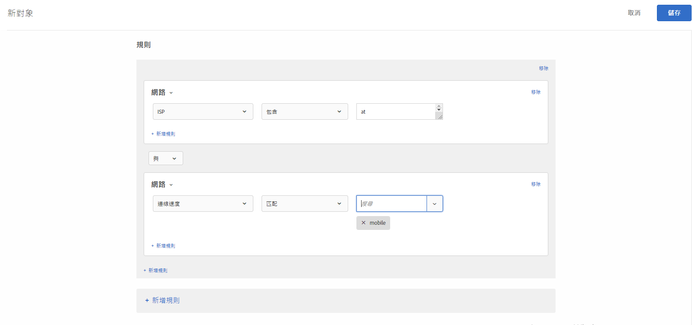

# 網路{#network}

您可以根據網路詳細資料建立對象。

1. 在 [!DNL Target] 介面中，按一下&#x200B;**[!UICONTROL 「對象」]**>**[!UICONTROL 「建立對象」]**。
1. 為對象命名。
1. 按一下「**[!UICONTROL 新增規則]** > **[!UICONTROL 網路]**」。
1. 按一下&#x200B;**[!UICONTROL 「選取」]**，然後選取下列其中一個選項:

   * **ISP:** ISP 是一個為用戶提供網際網路存取的機構，通常是繳月費或年費。許多 ISP 都提供額外服務，例如虛擬主機或電子郵件。ISP 欄位是商業 ISP (例如 Comcast 或 TimeWarner) 或另一個實體，例如商業或教育機構。

      以下為美國境內幾個熱門 ISP 的例子:

      | 熱門名稱 | ISP 名稱 | 網域名稱 | IP 位址範例 |
      |---|---|---|---|
      | Cablevision | Cablevision Systems Corp. | *.optonline.net | 68.196.130.239 |
      | CenturyLink | Qwest Communications Company, LLC | *.centurylink.net | 64.40.65.0 |
      | Charter Communications | 憲章通訊 | *.charter.com | 71.85.225.124 |
      | Comcast | Comcast Cable Communications, Inc. | *.comcast.net | 76.27.24.28 |
      | Cox | Cox Communications Inc. | *cox.net | 68.224.174.22 |
      | Speakeasy | MegaPath Corporation | *.speakeasy.net | 66.93.240.0 |
      | Time Warner | Time Warner Cable Internet LLC | *.res.rr.com | 72.229.28.185 |
      | Verizon FiOS | MCI Communications Services, Inc. d/b/a Verizon Business | *.fios.verizon.net | 173.68.112.34 |
      | Vivint | Smartrove Inc. | *.vivintwireless.net | 170.72.26.105 |
      | AT&amp;T Wireless | AT | *.mycingular.net |  |
      | Sprint mobile | Sprint Personal Communications Systems | IP 位址 |  |
      | T-Mobile | T-Mobile USA, Inc. | IP 位址 | 208.54.86.0 |
      | Verizon Wireless | Cellco Parternship DBA Verizon Wireless | *.myvzw.com | 70.195.74.199 |

      >[!NOTE]
      >
      >根據 ISP 來鎖定目標時，請使用 ISP 名稱，而不是熱門名稱。確保將規則建立為不區分大小寫或一律使用小寫格式。

      您可以測試 ISP 和網域名稱值。https://www.whoismyisp.org 是鎖定目標用途上不錯的資源。您可以使用上表提供的 IP 位址範例，或輸入您自己的 IP 位址。然後使用 `themboxOverride.browserIp= URL` 參數來模擬該 IP 位址。

   * **網域名稱:**&#x200B;這是訪客 IP 位址的網域名稱。不是您在 [!DNL Target] 中使用的網站的網域名稱。此網域名稱與訪客的 IP 位址有關，有時稱為主機名稱。通常很類似 ISP 名稱。如果公司已更改 ISP 名稱，但未變更網域名稱，則主機名稱有時是指公司的舊名稱。
   * **連線速度:**&#x200B;這是訪客連接至網際網路的速度。選項包括: 寬頻、纜線、撥接、行動裝置、oc3、oc12、衛星、t1、t2、無線和 xdsl。

      此欄位是根據連線的類型，而不是本身的實際速度。[!DNL Target] 無法判斷連線的確切連線速度。當沒有出現其他連線類型而無法選擇特定類型時，就會使用寬頻連線類型。

1. (可選) 按一下&#x200B;**[!UICONTROL 「新增規則」]**&#x200B;並設定對象的其他規則。
1. 按一下&#x200B;**[!UICONTROL 「儲存」]**。

下圖顯示將目標鎖定於使用 AT&amp;T 且連線速度為[!UICONTROL 行動]之訪客的受眾。

## 訓練影片: 建立對象

此影片包括關於使用對象類別的資訊。

* 建立對象
* 定義對象類別

>[!VIDEO](https://video.tv.adobe.com/v/17392)