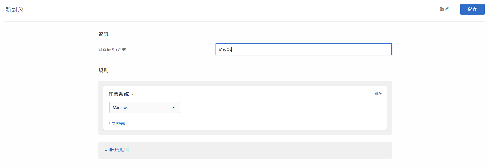

# 作業系統 

您可以鎖定使用某個作業系統的訪客。

1. 在 [!DNL Target] 介面中，按一下&#x200B;**[!UICONTROL 「對象」]**>**[!UICONTROL 「建立對象」]**。
1. 為對象命名。
1. 按一下「**[!UICONTROL 新增規則]** > **[!UICONTROL 作業系統]**」。
1. 按一下&#x200B;**[!UICONTROL 「選取」]**，然後選取下列其中一個選項:

   * Linux
   * Macintosh
   * Windows

1. (可選) 按一下&#x200B;**[!UICONTROL 「新增規則」]**&#x200B;並設定對象的其他規則。
1. 按一下&#x200B;**[!UICONTROL 「儲存」]**。

下圖顯示使用 Macintosh OS 的受眾鎖定目標訪客。

## 訓練影片: 建立對象

此影片包括關於使用對象類別的資訊。

* 建立對象
* 定義對象類別

>[!VIDEO](https://video.tv.adobe.com/v/17392)
