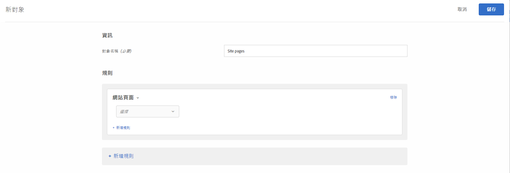
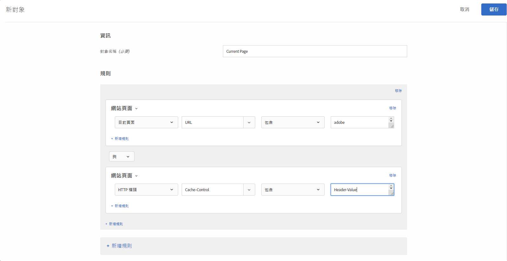

# 網頁{#site-pages}

您可以定位在您網站上特定頁面的訪客。

1. 在 [!DNL Target] 介面中，按一下&#x200B;**[!UICONTROL 「對象」]**>**[!UICONTROL 「建立對象」]**。
1. 為對象命名。
1. 按一下「**[!UICONTROL 新增規則]** > **[!UICONTROL 網站頁面]**」。

   

1. 按一下「選擇&#x200B;****」下拉式清單，選取下列其中一個選項，然後視需要設定規則。

   規則中後續下拉式清單中的可用選項和評估器會依您選擇的選項而異。 下圖顯示如果選擇[!UICONTROL 目前頁面]，則可用的選項：

   

   當您選擇[!UICONTROL 選擇]時，初始下拉式清單中提供下列選項。

   * **目前頁面：** 使用者目前所在的頁面。

      如果您選擇此選項，第二個下拉式清單中會提供下列選項：

      * URL（如需Target如何評估URL的詳細資訊，請參閱[目標與觀眾常見問答集](/help/c-target/c-troubleshooting-targets-and-audiences/troubleshooting-targets-and-audiences.md)）。
      * 網域
      * 查詢
      * 子網域
      * 頂層網域
      * 路徑
      * 雜湊 (#) 片段
   * **上一頁:** 點按目前頁面之前使用者所在的頁面。(使用者必須從上一頁點選至目前頁面，才能讓該頁面受到追蹤。如果使用者是在瀏覽器中輸入新的 URL，則上一頁就不會被追蹤。)本頁面實際內容視乎網站設計而定。舉例來說，如果目前頁面顯示的是有關特定產品的資訊，則上一頁可能是使用者在其中選擇特定商品的分類頁面 (例如顯示多台特定類型相機的頁面)，也可能是引導使用者來到最後頁面的首頁。

      如果您選擇此選項，第二個下拉式清單中會提供下列選項：

      * URL（如需Target如何評估URL的詳細資訊，請參閱[目標與觀眾常見問答集](/help/c-target/c-troubleshooting-targets-and-audiences/troubleshooting-targets-and-audiences.md)）。
      * 網域
      * 查詢
      * 子網域
      * 頂層網域
      * 路徑
   * **著陸頁面:** 著陸頁面為存取您的網站時，訪客看到的第一頁。例如，如果訪客在 Google 上點按一個連接進入類別頁面，那麼該類別頁面即為著陸頁面。如果該連接引導至您的首頁，那麼首頁即為著陸頁面。按訪客作業記憶著陸頁面。您可以依據此作業中的訪客著陸頁面，在網站實施深度指向。

      如果您選擇此選項，第二個下拉式清單中會提供下列選項：

      * URL（如需Target如何評估URL的詳細資訊，請參閱[目標與觀眾常見問答集](/help/c-target/c-troubleshooting-targets-and-audiences/troubleshooting-targets-and-audiences.md)）。
      * 網域
      * 查詢
      * 子網域
      * 頂層網域
      * 路徑
      * 雜湊 (#) 片段

      >[!NOTE]
      >
      >在變更子網域或直接更換 URL 時會重設 `landing.url` 物件。

   * **HTTP標題：** 此選項會評估Target請求的HTTP標題中的資訊。例如，如果HTTP標題包含語言資訊，您可以建立包含`Accept-Language: es`條件的規則，以定位以西班牙文存取頁面的訪客。

      如果您選擇此選項，第二個下拉式清單中會提供下列選項：

      * 接受
      * Accept-Charset
      * Accept-Encoding
      * Accept-Language
      * 授權
      * Cache-Control
      * 連線
      * Content-Length
      * 內容-MDS
      * Content-Type
      * 日期
      * 預期
      * 「寄件者」
      * 主機
      * If-Match
      * If-Modified-Since
      * If-None-Match
      * If-Range
      * If-Undified-Since
      * 最大轉發數
      * Pragma
      * 代理授權
      * 範圍
      * Referer
      * TE
      * 升級
      * User-Agent
      * 透過
      * 警告

   如果您選擇「目前頁面」[!UICONTROL 、「上一頁」[!UICONTROL 或「著陸頁面」[!UICONTROL ，則可使用「網域」]和「查詢」[!UICONTROL 選項。 ]]]選擇這些選項時，請考慮下列事項：

   * **網域:** 頁面的完整網域。指定網域時，最佳做法是使用「包含」。例如，「網域等於 facebook.com」不接受 `m.facebook.com` 或 `www.facebook.com`。「網域包含 facebook.com」則會接受 facebook.com 的任何變體。
   * **查詢:** 第一個問號 (?) 之後的 URL 內容。

      `foo.html?e0a72cb2a2c7`

1. (可選) 按一下&#x200B;**[!UICONTROL 「新增規則」]**&#x200B;並設定對象的其他規則。
1. 按一下&#x200B;**[!UICONTROL 「儲存」]**。

您也可以使用自己的「使用者定義查詢參數」或「使用者定義標題」，以建立網站頁面對象。

使用:

* 查詢參數，如果使用者選取的規則是「目前頁面」、「登陸頁面」或「上一頁」。
* 標題（如果使用者選取的規則是HTTP標題）。

如下所示:

## 疑難排解 {#ts}

* 若要讓著陸頁面對象正常運作，請求必須設定`mboxReferrer`參數（對於傳送API,`context.address.referringUrl`參數）,at.js JavaScript程式庫會使用`document.referrer`屬性從頁面擷取。 此`HTMLDocument`屬性會傳回使用者已導覽之頁面的URI。 當使用者直接導覽至頁面時，此屬性的值是空的字串（不是透過連結，而是透過書籤）。

   如果此行為不符合您的要求，請考慮執行下列其中一個動作：

   * 將[mbox參數](/help/c-implementing-target/c-implementing-target-for-client-side-web/t-mbox-download/c-understanding-global-mbox/pass-parameters-to-global-mbox.md)傳遞至[!DNL Target]以用於定位目的。
   * 使用[A/B測試活動](/help/c-activities/t-test-ab/test-ab.md)，而非著陸頁面活動。 A/B測試活動不會切換相同訪客的體驗。
   * 請改用[訪客資料](/help/c-target/c-audiences/c-target-rules/visitor-profile.md)。

* 在包含逗號的字串上使用「開頭／結尾為」求值器時，請注意這些
會評估為一組值，其中每個值會以逗號分隔。 例如，如果我們有標題的值：`Accept-Language: en,zh;q=0.9,en-IN;q=0.8,zh-CN;q=0.7`它會針對下列條件取消：
   * 從zh開始，
   * 開頭為en,
   * 以0.7結束，
   * 以0.8結束。

## 訓練影片: 建立對象

此影片包括關於使用對象類別的資訊。

* 建立對象
* 定義對象類別

>[!VIDEO](https://video.tv.adobe.com/v/17392)
