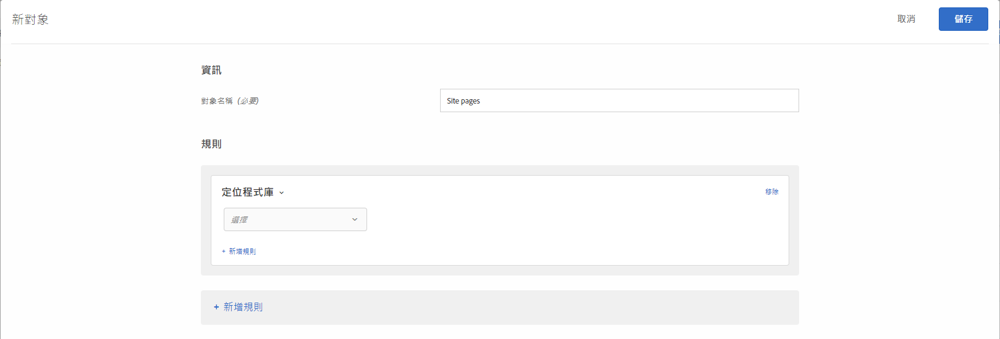

# Target 資料庫{#target-library}

根據預先建置的鎖定目標規則鎖定使用者。

Target 資料庫類別中預先建置的對象為舊版對象，並且存在於其他類別。如需詳細資訊和最佳做法，請參閱[目標和對象常見問題](/help/c-target/c-troubleshooting-targets-and-audiences/troubleshooting-targets-and-audiences.md#concept_C4EE4B8F4840430CBD798D579A8F208D)。

1. 在 [!DNL Target] 介面中，按一下&#x200B;**[!UICONTROL 「對象」]**>**[!UICONTROL 「建立對象」]**。
1. 為對象命名。
1. 按一下「**[!UICONTROL 新增規則]** > **[!UICONTROL Target 資料庫]**」。

   

1. 按一下&#x200B;**[!UICONTROL 「選取」]**，然後選取預先建立的目標規則。

   預先建立的目標規則包括「視窗作業系統」、「平板電腦裝置」、「Safari 瀏覽器」、「再度訪問的訪客」、「從 Google 引用」等等。

   當使用者代理程式包含下列其中一個字串時 (其中有些是裝置的型號)，預先定義的對象「平板電腦裝置」就已合格。您不必為這些裝置建立自訂目標規則。

   Kindle、Silk、iPad、Sony Tablet、TF101、GT-P1000、GT-P1000R、GT-P1000M、SGH-T849、SHW-M180S、GT-I9000T、BNTV250 和 Tablet PC。

1. (可選) 按一下&#x200B;**[!UICONTROL 「新增規則」]**&#x200B;並設定對象的其他規則。
1. 按一下&#x200B;**[!UICONTROL 「儲存」]**。

## 訓練影片: 建立對象

此影片包括關於使用對象類別的資訊。

* 建立對象
* 定義對象類別

>[!VIDEO](https://video.tv.adobe.com/v/17392)
