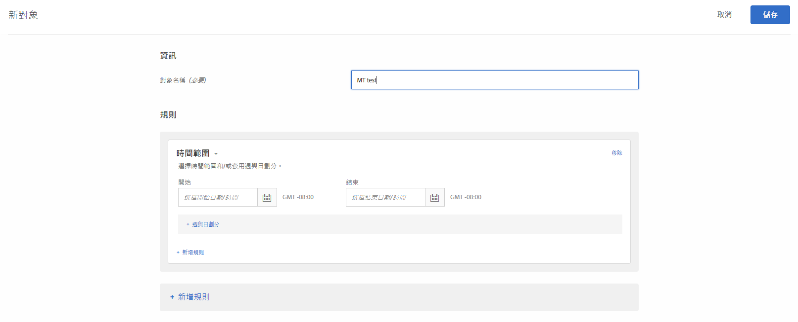
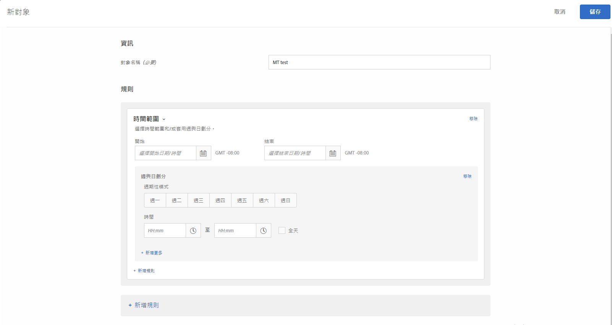

# 時間範圍{#time-frame}

您可以新增開始/結束日期和時間，以鎖定在特定時間範圍期間造訪您的網站的使用者。您也可以設定「週與日劃分」選項，來為對象鎖定目標建立週期性模式。

例如，使用[結合的臨機對象功能](/help/c-target/combining-multiple-audiences.md#concept_A7386F1EA4394BD2AB72399C225981E5)，您可以鎖定在這三天到黑色星期五期間具有特定內容且低消費的人員，以及在黑色星期五之後具有其他內容的人員。

1. 在 [!DNL Target] 介面中，按一下&#x200B;**[!UICONTROL 「對象」]**>**[!UICONTROL 「建立對象」]**。
1. 為對象命名。
1. 按一下「**[!UICONTROL 新增規則]** > **[!UICONTROL 時間範圍]**」。

   

1. 指定對象的「開始」和「結束」日期與時間。

   將開始日期保持空白，以根據活動的排程來鎖定目標。將結束日期保持空白，以繼續鎖定目標直到活動的結束日期和時間為止。

   您也可以將開始和結束日期都保持空白。這可讓您在多個活動中使用相同的對象 (而不需複製對象)，同時在活動層級控制開始和結束日期。

   >[!NOTE]
   >
   >開始/結束日期的時區會顯示為 GMT +/- NN:NN；其中 NN:NN 是 GMT 時差，會反映帳戶層級時區，而非訪客的時區。例如，加州時區會顯示為 GMT -08:00。

1. (依條件) 按一下「**[!UICONTROL 週與日劃分]**」來設定週期性模式，包括星期幾和時間。

   

   例如，您可以使用「週與日劃分」選項，只在您的客服中心有員工值班時，才向訪客顯示「立即交談」選項。

   選取一或多個星期幾，然後設定開始和結束時間。按一下「**[!UICONTROL 新增更多]**」，視需要指定其他模式。

   >[!NOTE]
   >
   >[!UICONTROL 週與日劃分]的時區會顯示為 GMT +/- NN:NN；其中 NN:NN 是 GMT 時差，會反映帳戶層級時區，而非訪客的時區。例如，加州時區會顯示為 GMT -08:00。

1. (可選) 按一下&#x200B;**[!UICONTROL 「新增規則」]**&#x200B;並設定對象的其他規則。

   請注意，您可以視需要對每一個規則重複步驟 5。

1. 按一下&#x200B;**[!UICONTROL 「儲存」]**。

## 訓練影片：建立觀眾

此影片包括關於使用對象類別的資訊。

* 建立對象
* 定義對象類別

>[!VIDEO](https://video.tv.adobe.com/v/17392)
