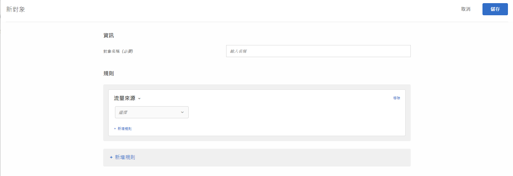

# 流量來源

建立受眾，根據參照至您網站的搜尋引擎或著陸頁面鎖定訪客。

例如，你可基於訪客瀏覽器、搜尋引擎或反向連結著陸頁面進行指向。反向連結著陸頁面是訪客為存取本作業目前頁面而點按的頁面。(例如，如果訪客在 Google 上按一下廣告，然後被帶往 `adobe.com` 的首頁，則引用登陸頁面就是 `google.com`。)

您可以合併多個流量來源建立一個複雜的目標規則。

1. 在 [!DNL Target] 介面中，按一下&#x200B;**[!UICONTROL 「對象」]**>**[!UICONTROL 「建立對象」]**。
1. 為對象命名。
1. 按一下「**[!UICONTROL 新增規則]** > **[!UICONTROL 流量來源]**」。

   

1. 按一下&#x200B;**[!UICONTROL 「選取」]**，然後選取下列其中一個選項:

   * 來自 Baidu
   * 從 Bing
   * 從 Google
   * 從 Yahoo
   * 引用登陸頁面: URL
   * 引用登陸頁面: 網域
   * 引用登陸頁面: 查詢

   視您的選擇而定，您可能需要提供其他資訊 (求值器及/或值)。

1. (可選) 按一下&#x200B;**[!UICONTROL 「新增規則」]**&#x200B;並設定對象的其他規則。
1. 按一下&#x200B;**[!UICONTROL 「儲存」]**。

您可以將目標鎖定在由特定搜尋引擎轉介至您的網站，或來自特定登陸頁面的使用者。

## 訓練影片: 建立對象  

此影片包括關於使用對象類別的資訊。

* 建立對象
* 定義對象類別

>[!VIDEO](https://video.tv.adobe.com/v/17392)
