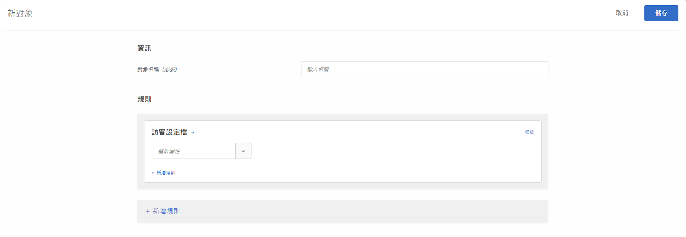

# 訪客資料

在[!DNL Adobe Target]中建立對象，以鎖定符合特定設定檔參數的訪客。

1. 在 [!DNL Target] 介面中，按一下&#x200B;**[!UICONTROL 「對象」]**>**[!UICONTROL 「建立對象」]**。
1. 為對象命名並新增選用說明。
1. 將&#x200B;**[!UICONTROL 訪客設定檔]**&#x200B;拖放至對象產生器窗格。

1. 按一下&#x200B;**[!UICONTROL 「選取」]**，然後選取下列其中一個選項:

   

   訪客設定檔參數會透過 mbox (設定檔) 來傳遞。您可以將目標鎖定在新訪客或再度訪問的訪客，或包含所有使用者。

   * [!UICONTROL 新訪客]
   * [!UICONTROL 回訪訪客]
   * [!UICONTROL 在其他測試中]
   * [!UICONTROL 不在其他測試中]
   * [!UICONTROL 工作階段首頁]
   * [!UICONTROL 不是工作階段首頁]
   * [!UICONTROL 類別相關性]

   訪客設定檔會針對每個具有新 `mboxPC` 的 mbox 呼叫，建立於本機 Edge 記憶體。閒置30分鐘後，設定檔會儲存至[!DNL Target]資料庫，並可從其他Edge存取。

   網站訪客在工作階段中途登入並取得`3rdpartyId`時，所有先前系結至`3rdPartyId`的載入設定檔屬性都立即可用。

   您可以鎖定自訂設定檔參數和 `user.` 參數。選擇您要用來鎖定目標活動的參數。如果未顯示所需的參數，則mbox尚未觸發參數。

1. （選用）為對象設定其他規則。
1. 按一下&#x200B;**[!UICONTROL 「完成」]**。

## 訓練影片：建立對象

此影片包括關於使用對象類別的資訊。

* 建立對象
* 定義對象類別

>[!VIDEO](https://video.tv.adobe.com/v/17392)
