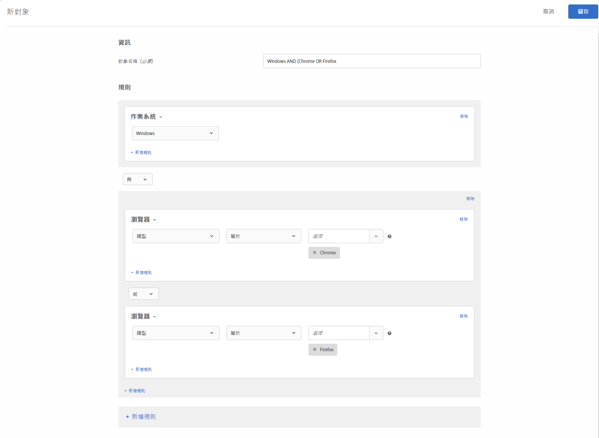

# 在 Target 中建立對象{#build-audiences-in-target}

您可以建立自訂的對象，並將對象儲存至 Target 資料庫以在您的活動中使用。您可以複製現有對象，然後可以編輯對象以建立類似的對象並結合多個對象。

## 對象概覽

對象是由可決定要從 [!DNL Target] 活動中包括或排除的規則定義。對象定義可以包括多個規則，並且每個規則可以包括多個參數。複雜的對象定義會使用布林值運算子 AND 和 OR 結合規則和參數，以讓您對哪些網站訪客會計入活動加入者能進行詳細控制。

使用 AND 結合規則或參數時，任何潛在的對象成員必須符合&#x200B;*所有*&#x200B;定義的條件，才能包括為加入者。例如，如果您定義作業系統規則 AND 瀏覽器規則，則只會在活動中包括同時使用已定義作業系統&#x200B;*與*&#x200B;已定義瀏覽器的訪客。

使用 OR 結合規則或參數時，任何潛在的對象成員只需符合任何單一定義的條件，即可包括為加入者。例如，如果您定義使用 OR 連接的多個行動規則，則將在活動中包括符合&#x200B;*任何*&#x200B;所定義條件的訪客。

您可以將這兩個布林運算子混合來建立複雜的規則; 不過，相同規則層級的運算子必須相符。使用者介面會自動套用至正確的運算子。

例如，下列規則會鎖定在 Windows 電腦上使用 Chrome *或* Firefox 的訪客:

>[!NOTE]
>
>請小心，避免建立規則來排除所有可能的對象成員。例如，某人無法同時使用 Chrome *與* Firefox 來造訪頁面。

## 建立新對象

1. 按一下上方功能表列中的&#x200B;**[!UICONTROL 「對象」]**。

   

1. 從[!UICONTROL 「對象」]清單中，按一下&#x200B;**[!UICONTROL 「+ 建立對象」]**。

   或

   若要複製現有對象，請在[!UICONTROL 「對象」]清單中將游標移至所需對象上方，然後按一下&#x200B;**[!UICONTROL 「複製」]**&#x200B;圖示。然後您可以編輯對象以建立類似的對象。

1. 輸入不重複、描述性的對象名稱。
1. 按一下&#x200B;**[!UICONTROL 「+ 新增規則」]**。

   規則可讓您將對象限制在網站訪客的子集。
1. 選取規則類型。

   每個規則類型都有其專屬的參數。請參閱[對象的類別](/help/c-target/c-audiences/c-target-rules/target-rules.md#concept_E3A77E42F1644503A829B5107B20880D)，以取得關於設定每個類型的對象規則的詳細資訊。
1. 定義規則參數。
1. 按一下&#x200B;**[!UICONTROL 「儲存」]**。

   新建立的對象會在處理延遲幾秒之後出現在清單中。如果對象未立即在清單中顯示，請嘗試搜尋對象或重新整理清單。

## 訓練影片: 建立對象 

此影片包括關於建立對象的資訊。

* 建立對象
* 定義對象類別

>[!VIDEO](https://video.tv.adobe.com/v/17392)