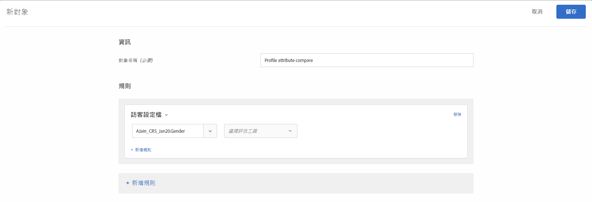
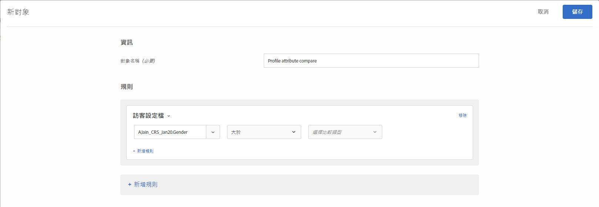
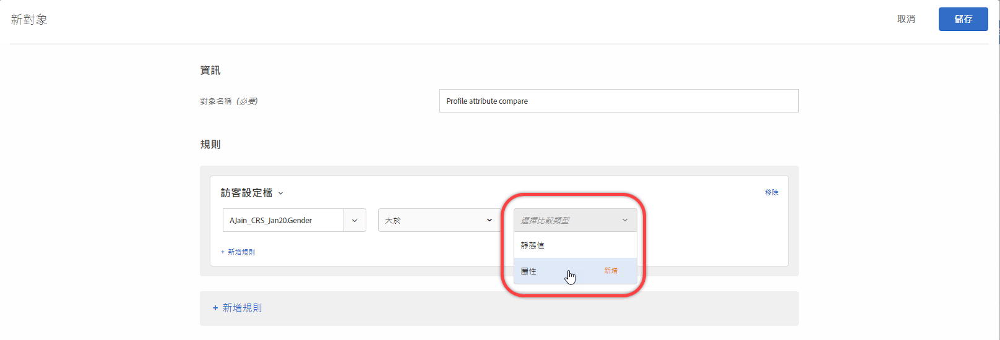
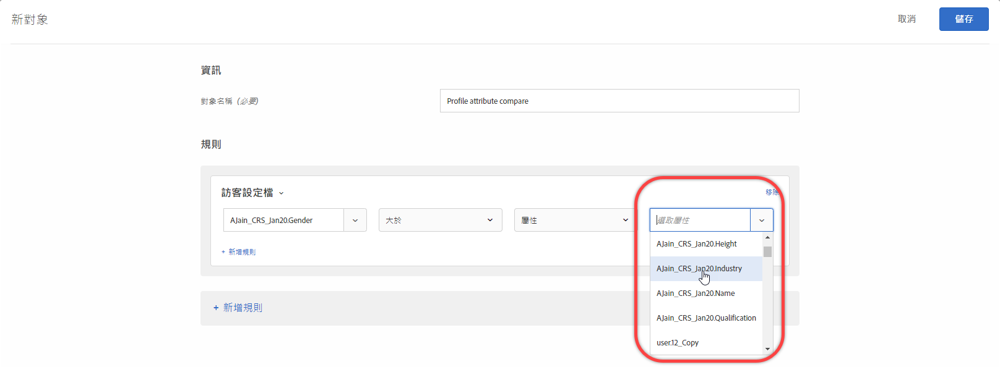

# 建立設定檔屬性比較對象{#create-a-profile-attribute-comparison-audience}

定義受眾，比較[受眾資料庫](/help/c-target/c-audiences/audiences.md)或[僅限此活動受眾](/help/c-target/creating-activity-only-audience.md)中的兩個設定檔屬性。使用大於、小於或等於這類運算子來定義對象，以動態比較兩個不同設定檔屬性的值。

>[!NOTE]
>
>此功能僅適用於[訪客設定檔](/help/c-target/c-audiences/c-target-rules/visitor-profile.md#concept_E972690B9A4C4372A34229FA37EDA38E)類別。

## 概述 {#section_303CBC78194D49A2A004945D425441E1}

對象是由可決定要從 Target 活動中包括或排除的規則定義。對象定義可以包括多個規則，並且每個規則可以包括多個參數。如果您加入的規則會使用到訪客設定檔類別，您可根據訪客設定檔屬性的特定值來定義規則，或將該屬性值與另一個訪客設定檔屬性比較。

舉例來說，假設您服務於一間家具公司，上傳了兩個客戶傾向分數至 Target:

* 在接下來 90 天內購買餐廳家具的可能性
* 在接下來 90 天內購買客廳家具的可能性

您可以建立一個對象，定義成購買餐廳家具的傾向大於購買客廳家具的傾向。Target 便會動態比較特定訪客在餐廳與客廳上的傾向分數，判斷該訪客是否符合此對象。

如需詳細資訊，請參閱[將資料傳入 Target 的方法](/help/c-implementing-target/c-considerations-before-you-implement-target/c-methods-to-get-data-into-target/methods-to-get-data-into-target.md#concept_0069C0EFB56C4700BB33F2F35C2B9B17)。

## 建立設定檔屬性比較對象 {#section_7A62FD47D5C74C3EBC3417ACDBB85013}

1. 依序按下&#x200B;**[!UICONTROL 「對象]** > **[!UICONTROL 建立對象]** > **[!UICONTROL 新新增規則]** > **[!UICONTROL 訪客設定檔」]**。
1. 從&#x200B;**[!UICONTROL 「訪客設定檔」]**&#x200B;下拉式清單選取屬性:

   

1. 選取求值器:

   

1. 從&#x200B;**[!UICONTROL 「選取比較類型」]**&#x200B;下拉式清單中選擇&#x200B;**[!UICONTROL 「屬性」]**。

   「靜態值」比較類型可讓您將訪客設定檔屬性與特定值比較。

   

   >[!NOTE]
   >
   >如果您在步驟 1 使用其中一個預設的訪客設定檔類別 (例如「新訪客」或「回頭客」)，您只能選擇靜態值選項。預設類別無法使用動態比較選項。其他無法使用動態比較選項的範例包括「工作階段首頁」、「不在其他測試中」、「非工作階段首頁」和「類別相關性」。

1. 選取您要與初始屬性比較的額外屬性。

   

## 訓練影片 {#section_3BB8DBF3418F4520B3E274B6F40AF8F3}

觀看下列影片以獲得詳細資訊，並瞭解您可使用此功能的情況:

>[!VIDEO](https://video.tv.adobe.com/v/23218/)