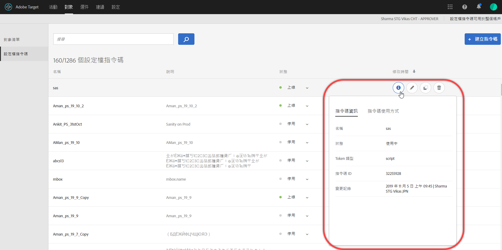
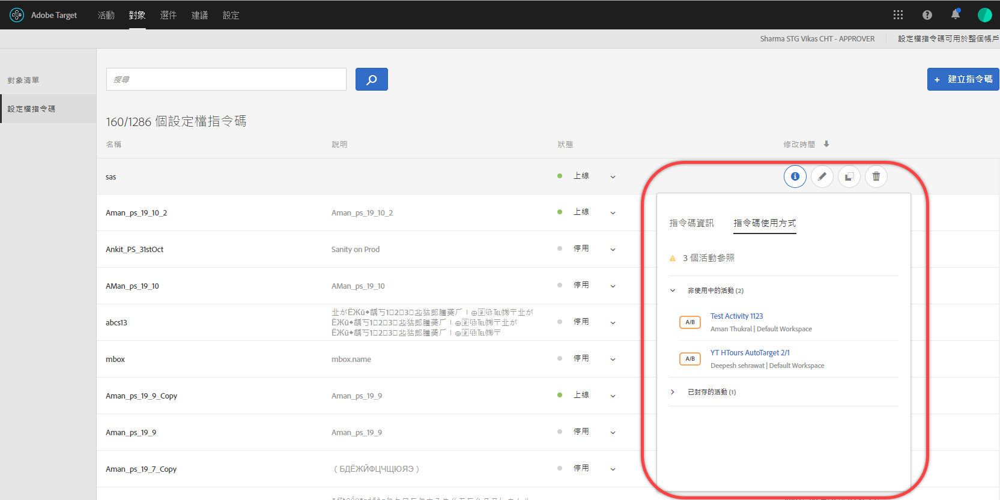
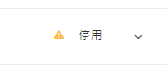
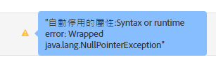

# 設定檔屬性

[!DNL Adobe Target]中的設定檔屬性是訪客專屬的參數。 這些屬性儲存於訪客的描述檔中，以提供可用於活動的訪客資訊。

使用者設定檔包含網頁訪客的人口統計和行為資訊。 此資訊可能包括年齡、性別、購買的產品、上次造訪時間等，[!DNL Target]會使用這些資訊來個人化提供給訪客的內容。

當訪客瀏覽您的網站或返回另一個工作階段時，可使用設定檔中儲存的設定檔屬性來定位內容或記錄群體篩選資訊。

若要設定設定檔屬性：

1. 按一下「**[!UICONTROL 對象]** > **[!UICONTROL 設定檔指令碼」。]**

   

1. 按一下「**[!UICONTROL 建立指令碼]**」。

   

   可用的設定檔屬性類型如下:

   | 參數類型 | 說明 |
   |--- |--- |
   | mbox | 建立 mbox 時透過頁面程式碼直接傳遞。請參閱[傳遞參數至全域 mbox](/help/c-implementing-target/c-implementing-target-for-client-side-web/t-mbox-download/c-understanding-global-mbox/pass-parameters-to-global-mbox.md)。<br>****&#x200B;注意:  具有每個 mbox 呼叫 50 個獨特設定檔屬性的限制。[!DNL Target]如果您必須將超過50個設定檔屬性傳遞至[!DNL Target]，請使用設定檔更新API方法傳遞。 如需詳細資訊，請參閱 [!DNL Adobe Target] API檔案](http://developers.adobetarget.com/api/#updating-profiles)中的[設定檔更新。 |
   | 設定檔 | 直接以 JavaScript 程式碼片段定義。這些片段可儲存執行總數（例如消費者總花費的金錢），並在每個mbox要求上執行。 請參閱下方的設定檔指令碼屬性。 |

## 設定檔指令碼屬性 {#concept_8C07AEAB0A144FECA8B4FEB091AED4D2}

以相關聯的 JavaScript 程式碼片段定義設定檔指令碼屬性。

您可以使用設定檔指令碼來跨多次造訪擷取訪客屬性。描述檔指令碼是使用伺服器端JavaScript形式，在[!DNL Target]中定義的程式碼片段。 例如，您可能會使用設定檔指令碼來擷取訪客瀏覽您網站的頻率，以及該訪客上次瀏覽的時間。

設定檔指令碼與設定檔參數不同。設定檔參數會擷取關於使用[!DNL Target]之mbox程式碼實作的訪客的資訊。

## 建立設定檔指令碼 {#section_CB02F8B97CAF407DA84F7591A7504810}

在 [!UICONTROL  介面的]「對象」[!DNL Target]標籤下可以使用設定檔指令碼。

若要新增設定檔指令碼，請按一下&#x200B;**[!UICONTROL 設定檔指令碼]**&#x200B;標籤、**[!UICONTROL 建立指令碼]**，然後撰寫您的指令碼。

或

若要複製現有的設定檔指令碼，請從[!UICONTROL 設定檔指令碼]清單中，按一下所需指令碼的刪節號圖示，然後按一下&#x200B;**[!UICONTROL 複製]**。

然後您可以編輯對象以建立類似的對象。

設定檔指令碼會針對每個位置請求，執行設定檔屬性「捕捉器」。收到位置請求時，[!DNL Target]會決定應執行哪個活動，並顯示適合該活動及該體驗的內容。 [!DNL Target] 也會追蹤活動的成功，並執行任何相關的設定檔指令碼。此程式可讓您追蹤有關造訪的資訊，例如訪客的位置、每日時間、訪客造訪網站的次數、訪客之前是否已購買等。 這些資訊會接著加到該訪客的描述檔中，以便您更有效追蹤訪客在您網站上的活動。

設定檔指令碼屬性會將 `user.` 標籤插入在屬性名稱前。例如:

```
if (mbox.name == 'Track_Interest') { 
    if (profile.get('model') == "A5" &&; profile.get('subcat') == "KS6") { 
        return (user.get('A5KS6') || 0) + 1; 
    } 
}
```

請記住下列資訊：

* 在程式碼中使用`user.get('parameterName')`參照設定檔指令碼屬性（包括本身）。
* 儲存下次執行指令碼時（下一個mbox請求時）可存取包含`user.setLocal('variable_name', 'value')`的變數。 參考包含 `user.getLocal('variable_name')` &#39;) 的變數。如果您想要參考上次請求的日期和時間，此程式就十分實用。
* 參數和值區分大小寫。 請符合您在活動或測試期間收到的參數和值的大小寫。
* 如需更多 JavaScript 語法，請參閱以下「指令碼設定檔參數的 JavaScript 參考資料」一節。
* 停用指令碼後，參數會保留在設定檔中。 其設定檔已包含活動中對象所使用參數的使用者，才符合該活動的資格。
* 在活動中使用設定檔指令碼時，無法刪除這些指令碼。
* 不建議建立使用另一個設定檔指令碼中一個設定檔指令碼結果的相依設定檔指令碼。 不保證設定檔指令碼的執行順序。

## 檢視設定檔指令碼資訊卡 {#section_18EA3B919A8E49BBB09AA9215E1E3F17}

您可以檢視設定檔指令碼資訊快顯卡，這類似選件資訊卡片。您可以透過設定檔指令碼資訊卡，檢視參考特定設定檔指令碼的活動，及其他實用中繼資料。

例如，您可以從清單按一下所需設定檔指令碼的[!UICONTROL Info]圖示([!UICONTROL Audiences] > [!UICONTROL Profile Scripts])，來存取下列設定檔指令碼資訊卡。

[!UICONTROL 指令碼資訊]頁簽包含以下資訊：名稱、說明和指令碼代碼。



按一下「**[!UICONTROL 檢視完整詳細資料]**」 ，查看參考所選設定檔指令碼的對象和活動。



>[!NOTE]
>
>[!UICONTROL 指令碼使用]標籤在下列情況中不會顯示參考所選設定檔指令碼的活動：
>
> * 活動處於[!UICONTROL Draft]狀態。
> * 活動中使用的內容或選件使用指令碼變數 (活動中的內嵌選件或「選件」資料庫中的選件)。


## Target 在某些情況下會停用設定檔指令碼 {#section_C0FCB702E60D4576AD1174D39FBBE1A7}

[!DNL Target] 在某些情況下會自動停用設定檔指令碼，例如執行太久或有太多指令。

設定檔指令碼停用時，Target UI 中的設定檔指令碼旁邊會出現黃色警示圖示，如下所示:



暫留時，會出現有關錯誤的詳細資料，如下所示:



系統停用設定檔指令碼的常見原因包括:

* 參照了未定義的變數。
* 參照了無效的值。此錯誤通常是因為參考URL值和其他使用者輸入的資料而未經過適當驗證所導致。
* 使用了太多 JavaScript 指令。[!DNL Target] 每個指令碼有2,000個JavaScript指令的限制，但無法透過手動讀取JavaScript來計算此限制。例如，Rhino 將所有函數呼叫和「新的」呼叫視為 100 個指示。對任何函式的任何呼叫會耗用100個指示。 此外，任何輸入資料的大小，例如 URL 值，皆可能影響指示計數。
* 請注意下節[最佳做法](/help/c-target/c-visitor-profile/profile-parameters.md#section_64AFE5D2B0C8408A912FC2A832B3AAE0)中醒目提示的項目。

## 最佳實務 {#best}

下列準則主要是為了協助您撰寫儘可能不會出錯或失敗的簡化描述檔指令檔，透過撰寫適當失效的程式碼處理指令碼，而無須強迫系統或指令碼暫停。這些準則是最佳實務的結果，經證明最有執行效率。您可以套用這些準則並搭配由 Rhino 開發社群所擬的原則與建議。

* 在用戶指令碼中將當前指令碼值設定為本地變數，將故障轉移設定為空字串。
* 藉由確保本地變數不是空白字串來驗證此變數。
* 使用字串型操作函式與規則運算式。
* 使用限制迴圈與開放端或 while 迴圈。
* 請勿超過 1,300 個字元或 50 個迴圈反覆。
* 請勿超過 2,000 個 JavaScript 指令。[!DNL Target] 每個指令碼有2,000個JavaScript指令的限制，但無法透過手動讀取JavaScript來計算此限制。例如，Rhino 將所有函數呼叫和「新的」呼叫視為 100 個指示。此外，任何輸入資料的大小，例如 URL 值，皆可能影響指示計數。
* 不僅要注意指令碼效能，還要注意所有指令碼的綜合效能。作為最佳做法，[!DNL Adobe]建議的指令總數少於5,000條。 計算指令數目並不明顯，但需注意的重要事項是，超過2,000個指令的指令碼會自動停用。 作用中設定檔指令碼的數量不應超過300個。 每個指令碼會隨每個單一mbox呼叫執行。 視需要執行多個指令碼。
* 在規則運算式中，開頭有點星號(例如：`/.*match/`、`/a|.*b/`)幾乎從不需要。 規則運算式搜尋會從字串中的所有位置開始 (除非受到 `^` 限制)，因此已假設點星號。如果此類規則運算式符合長度足夠的輸入資料 (可能至少有數百個字元)，指令碼執行可能會中斷。
* 如果全部失敗，將指令碼包覆在 try/catch 中。
* 下列建議可協助您限制設定檔指令碼的複雜度。 設定檔指令碼可執行有限的指令數。

   最佳做法：

   * 盡可能縮小並簡化設定檔指令碼。
   * 避免使用規則運算式，或僅使用簡單的規則運算式。 即使是簡單的運算式，也需要許多指令來評估。
   * 避免遞歸。
   * 設定檔指令碼應先進行效能測試，再新增至[!DNL Target]。 所有設定檔指令碼會在每個mbox要求上執行。 如果設定檔指令碼未正確執行，mbox要求執行時間會更長，而這可能會影響流量和轉換。
   * 如果設定檔指令碼變得太複雜，請考慮改用[回應Token](/help/administrating-target/response-tokens.md)。

* 如需詳細資訊，請參閱JS Rhino引擎檔案。

## 偵錯設定檔指令碼 {#section_E9F933DE47EC4B4E9AF2463B181CE2DA}

以下方法可用於偵錯設定檔指令碼:

>[!NOTE]
>
>在設定檔指令碼內使用[!DNL console.log]不會輸出設定檔值，因為設定檔指令碼執行伺服器端。

* **新增設定檔指令碼作為回應Token以偵錯設定檔指令碼：**

   在[!DNL Target]中，按一下&#x200B;**[!UICONTROL 管理]**，按一下&#x200B;**[!UICONTROL 回應Token]**，然後啟用您要除錯的設定檔指令碼。

   每當您載入含有[!DNL Target]的網站頁面時，來自[!DNL Target]的部分回應會包含您指定設定檔指令碼的值，如下所示：

   

* **使用mboxTrace除錯工具來除錯設定檔指令碼。**

   此方法需要授權Token，您可以按一下&#x200B;**[!UICONTROL Target]** > **[!UICONTROL Administration]** > **[!UICONTROL Implementation]** > **[!UICONTROL Generate Authorization Token]**（位於[!UICONTROL Debugger tools]區段），以產生Token。

   然後，將這兩個參數新增至「？」後的頁面URL:`mboxTrace=window&authorization=YOURTOKEN`。

   新增這些參數比回應Token的資訊量更多，因為您會取得設定檔的預先執行快照和後續快照。 它也會顯示所有可用的設定檔。

   

## 設定檔指令碼常見問題集 {#section_1389497BB6D84FC38958AE43AAA6E712}

**是否能夠使用設定檔指令碼從資料層中的頁面擷取資訊?**

由於設定檔指令碼於伺服器端執行，因此其無法直接讀取頁面。必須透過 mbox 要求或其他[將資料傳入 Target 的方法](/help/c-implementing-target/c-considerations-before-you-implement-target/c-methods-to-get-data-into-target/methods-to-get-data-into-target.md#concept_0069C0EFB56C4700BB33F2F35C2B9B17)傳遞資料。在資料位於[!DNL Target]後，設定檔指令碼可將資料讀取為mbox參數或設定檔參數。

## 指令碼設定檔參數的 JavaScript 參考資料

要有效使用指令碼配置檔案，需要簡單的Javascript知識
參數。 本節可做為快速參考資料，只需要幾分鐘，就能讓您提高使用此功能的效率。

您可以在 mbox/設定檔標籤下找到指令碼設定檔參數。您可以撰寫傳回任何 Javascript 類型 (字串、整數、陣列等) 的 Javascript 程式。

### 指令碼設定檔參數範例 {#examples}

**名稱:** *user.recency*

```
var dayInMillis = 3600 * 24 * 1000;
if (mbox.name == 'orderThankyouPage') {
    user.setLocal('lastPurchaseTime', new Date().getTime());
}
var lastPurchaseTime = user.getLocal('lastPurchaseTime');
if (lastPurchaseTime) {
    return ((new Date()).getTime() - lastPurchaseTime) / dayInMillis;
}
```

建立一個日的變數 (以毫秒為測量單位)。如果mbox名稱為`orderThankyouPage`，請設定名為`lastPurchaseTime`的本機（隱藏）的使用者設定檔屬性，以顯示目前日期和時間的值。 系統會讀取上次購買時間的值，如果已定義，[!DNL Target]會傳回自上次購買時間以來經過的時間，除以一天中的毫秒數（這會產生自上次購買以來的天數）。

**名稱:** *user.frequency*

```
var frequency = user.get('frequency') || 0;
if (mbox.name == 'orderThankyouPage') {
    return frequency + 1;
}
```

建立名為`frequency`的變數，將其初始化為先前的值，或如果沒有先前的值，則將其初始化為0。 如果 mbox 名稱為 `orderThankyouPage`，則會傳回遞增的值。

**名稱:** *user.monetaryValue*

```
var monetaryValue = user.get('monetaryValue') || 0;
if (mbox.name == 'orderThankyouPage') {
    return monetaryValue + parseInt(mbox.param('orderTotal'));
}
```

建立稱為 `monetaryValue` 的變數，查詢指定訪客目前的值 (或如果沒有先前的值，則設為 0)。如果 mbox 名稱為 `orderThankyouPage`，系統會將先前的值與傳遞給 mbox 的 `orderTotal` 參數的值相加，以傳回新貨幣值。

**名稱：** adobeQA

```
if (page.param("adobeQA"))
     return page.param("adobeQA");
else if (page.param("adobeqa"))
     return page.param("adobeqa");
else if (mbox.param("adobeQA"))
     return mbox.param("adobeQA");
```

建立名為`adobeQA`的變數，以追蹤[活動QA](/help/c-activities/c-activity-qa/activity-qa.md)的使用者。

### 物件和方法

指令碼設定檔參數可參考下列屬性和方法:

| 物件或方法 | 詳細資料 |
| --- | --- |
| `page.url` | 目前的 URL。 |
| `page.protocol` | 用於頁面的通訊協定 (http 或 https)。 |
| `page.domain` | 目前的 URL 網域 (第一個正斜線之前的所有內容)。例如，`http://www.acme.com/categories/men_jeans?color=blu e&size=small` 中的 `www.acme.com`。 |
| `page.query` | 目前頁面的查詢字串。‘?’ 之後的所有內容。例如，`http://www.acme.com/categories/mens_jeans?color=blue&size=small` 中的 `blue&size=small`。 |
| `page.param(‘<par_name>’)` | 由 `<par_name>` 指示之參數的值。如果您目前的 URL 是 Google 的搜尋頁面，而您已經輸入 `page.param('hl')`，則就 URL `http://www.google.com/search?hl=en& q=what+is+asdf&btnG=Google+Search` 而言會得到「en」。 |
| `page.referrer` | 上述同一組操作適用於反向連結和登陸（亦即referrer.url是反向連結的URL位址）。 |
| `landing.url`, `landing.protocol`, `landing.query`, 和 `landing.param` | 與頁面的該項目類似，但適用於登陸頁面。 |
| `mbox.name` | 使用中的 mbox 名稱。 |
| `mbox.param(‘<par_name>’)` | 根據使用中 mbox 的指定名稱的 mbox 參數。 |
| `profile.get(‘<par_name>’)` | 根據 `<par_name>` 名稱之由用戶端建立的使用者設定檔參數。例如，如果使用者設定名為「性別」的設定檔參數，可使用「profile.gender」擷取此值。傳回為目前訪客設定的「`profile.<par_name>`」的值；如果沒有設定任何值，則會傳回 null。請注意，`profile.get(<par_name>)`符合函式呼叫的資格。 |
| `user.get(‘<par_name>’)` | 傳回為目前訪客設定的「`user.<par_name>`」的值；如果沒有設定任何值，則會傳回 null。 |
| `user.categoryAffinity` | 傳回最佳類別的名稱。 |
| `user.categoryAffinities` | 傳回具有最佳類別的陣列。 |
| `user.isFirstSession` | 如果這是訪客的第一個工作階段，則會傳回 true。 |
| `user.browser` | 傳回 HTTP 標頭中的使用者代理程式。舉例來說，您可以建立只將目標鎖定於 Safari 使用者的運算式目標: `if (user.browser != null && user.browser.indexOf('Safari') != -1) { return true; }` |

### 常見運算子


所有標準 JavaScript 運算子皆存在且可供使用。JavaScript運算子可用於字串和數字（以及其他資料類型）。 快速簡短說明:

| 運算元 | 說明 |
| --- | --- |
| `==` | 代表相等。當兩側運算元相等時，則為 true。 |
| `!=` | 代表不相等。當兩側運算元不相等時，則為 true。 |
| `<` | 代表左側的變數小於右側的變數。若變數相等，則評估為false。 |
| `>` | 代表左側的變數大於右側的變數。若變數相等，則評估為false。 |
| `<=` | 與`<`相同，但如果變數相等，則其評估為true。 |
| `>=` | 與`>`相同，但如果變數相等，則其評估為true。 |
| `&&` | 邏輯上，「AND」左側和右側的運算式，只有在兩側皆為 true 時，才會是 true (否則則為 false)。 |
| `||` | 邏輯上，「OR」左側和右側的運算式，只有在其中一側為 true 時，才會是 true (否則則為 false)。 |
| `//` | 檢查來源是否包含目標布林值包含的所有元素 (陣列來源、陣列目標)。<br>`//` 會從目標擷取子字串 (對應 regexp)，然後將其解碼 `Array/*String*/ decode(String encoding, String regexp, String target)`。<br>此功能也支援使用常數字串值、分組 (`condition1 || condition2) && condition3`，以及規則運算式 (`/[^a-z]$/.test(landing.referring.url)`。 |

## 訓練影片：設定檔指令碼

此影片包含使用和建立設定檔指令碼的相關資訊。

* 解釋什麼是設定檔指令碼
* 解釋設定檔指令碼和設定檔參數有何不同
* 建立簡單的設定檔指令碼
* 使用「可用 Token」功能表來存取可用的選項
* 啟用和停用設定檔指令碼

>[!VIDEO](https://video.tv.adobe.com/v/17394)
