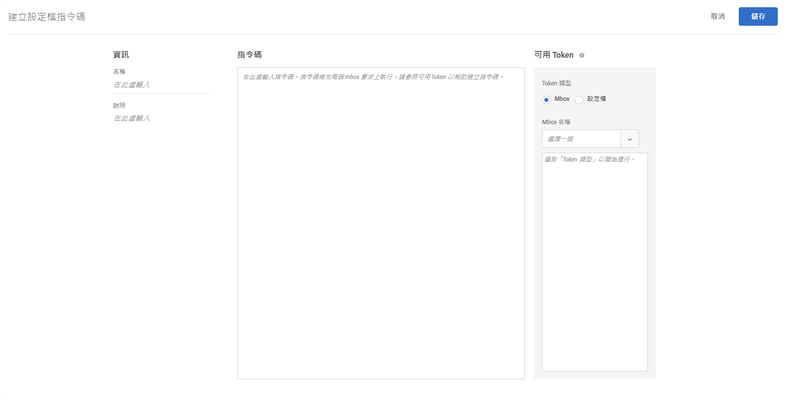

# 設定檔屬性{#profile-attributes}

描述檔屬性是訪客專屬的參數。這些屬性會儲存在訪客的描述檔中，以提供可用於活動的訪客相關資訊。

當訪客瀏覽您的網站，或當訪客返回另一個作業時，可使用儲存的描述檔屬性來定位群體篩選的內容或記錄資訊。

若要建立設定檔屬性，請按一下&#x200B;**[!UICONTROL 「對象]** &gt; **[!UICONTROL 設定檔指令碼」]**。


可用的設定檔屬性類型如下:

| 參數類型 | 說明 |
|--- |--- |
| mbox | 建立 mbox 時透過頁面程式碼直接傳遞。請參閱[傳遞參數至全域 mbox](/help/c-implementing-target/c-implementing-target-for-client-side-web/t-mbox-download/c-understanding-global-mbox/pass-parameters-to-global-mbox.md)。<br>****&#x200B;注意: Target 具有每個 mbox 呼叫 50 個獨特設定檔屬性的限制。如果您需要傳遞超過 50 個設定檔屬性至 Target，則可以使用 設定檔更新 API 方法來傳遞它們。For more information, see [Profile Update  in the Adobe Target API documentation](http://developers.adobetarget.com/api/#updating-profiles). |
| 指令碼 | 直接以 JavaScript 程式碼片段定義。其可儲存諸如客戶總花費金額等執行總數，並透過每個 mbox 請求來執行。請參閱以下的設定檔指令碼屬性。 |

## 設定檔指令碼屬性 {#concept_8C07AEAB0A144FECA8B4FEB091AED4D2}

以相關聯的 JavaScript 程式碼片段定義設定檔指令碼屬性。

您可以使用設定檔指令碼來跨多次造訪擷取訪客屬性。設定檔指令碼是 Target 內使用一種伺服器端 JavaScript 來定義的程式碼片段。例如，您可以使用設定檔指令碼來記錄訪客有多頻繁造訪您的網站，以及上次何時造訪。

設定檔指令碼與設定檔參數不同。設定檔參數使用 Target 的 mbox 程式碼實作來擷取訪客的相關資訊。

>[!NOTE]
>
>[!DNL Target] 有每個帳戶 1,000 個設定檔指令碼的限制。

## 建立設定檔指令碼 {#section_CB02F8B97CAF407DA84F7591A7504810}

在 [!UICONTROL  介面的]「對象」[!DNL Target]標籤下可以使用設定檔指令碼。

若要新增新的設定檔指令碼，請按一下&#x200B;**[!UICONTROL 「設定檔指令碼」]**&#x200B;索引標籤、**[!UICONTROL 「建立指令碼」]**，然後撰寫您的指令碼。

或

若要複製現有設定檔指令碼，請從[!UICONTROL 「設定檔指令碼」]清單中，暫留在所需的指令碼上，然後按一下&#x200B;**[!UICONTROL 「複製」]**&#x200B;圖示: (assets/icon_copy.png)

然後您可以編輯對象以建立類似的對象。



設定檔指令碼會針對每個位置請求，執行設定檔屬性「捕捉器」。收到位置請求時，Target 會決定應執行的活動，並顯示適合該活動及該體驗的內容、追蹤活動成功與否，並且執行任何相關的設定檔指令碼。這可讓您追蹤有關造訪的資訊，例如訪客的位置、當天時間、訪客已造訪網站的次數、先前是否曾經購買等。這些資訊會接著加到該訪客的描述檔中，以便您更有效追蹤訪客在您網站上的活動。

設定檔指令碼屬性會將 `user.` 標籤插入在屬性名稱前。例如:

```
if (mbox.name == 'Track_Interest') { 
    if (profile.get('model') == "A5" &&; profile.get('subcat') == "KS6") { 
        return (user.get('A5KS6') || 0) + 1; 
    } 
}
```

* 在程式碼中使用 `user.get('parameterName')` ') 來參照設定檔指令碼屬性 (包括本身)
* 儲存下次執行此指令碼時 (下一個 mbox 請求時) 可存取包含 `user.setLocal('variable_name', 'value')` ') 的變數。參考包含 `user.getLocal('variable_name')` ') 的變數。這對您想要參考上次請求的日期與時間的情況下非常有用。
* 參數和值區分大小寫。符合活動或測試期間您將收到的參數和值大小寫。
* 如需更多 JavaScript 語法，請參閱以下「指令碼設定檔參數的 JavaScript 參考資料」一節。

## 檢視設定檔指令碼資訊卡 {#section_18EA3B919A8E49BBB09AA9215E1E3F17}

您可以檢視設定檔指令碼資訊快顯卡，這類似選件資訊卡片。您可以透過設定檔指令碼資訊卡，檢視參考特定設定檔指令碼的活動，及其他實用中繼資料。

例如，藉由將游標移至「設定檔指令碼清單」(「對象 &gt; 設定檔指令碼」) 上的設定檔指令碼，然後按一下「資訊」圖示，即可存取以下設定檔指令碼資訊卡。

[!UICONTROL 「指令碼資訊」]索引標籤包含下列資訊: 名稱、狀態、Token 類型、指令碼 ID、變更記錄，以及說明。


[!UICONTROL 「指令碼使用方式」]索引標籤會列出參照所選取設定檔指令碼的活動 (及其工作區)。


>[!Note]
>
>「指令碼使用方式」索引標籤在以下情況不會顯示參照所選取設定檔指令碼的活動:
> * 活動處於「草稿」狀態。
> * 活動中使用的內容或選件使用指令碼變數 (活動中的內嵌選件或「選件」資料庫中的選件)。


## Target 在某些情況下會停用設定檔指令碼 {#section_C0FCB702E60D4576AD1174D39FBBE1A7}

[!DNL Target] 在某些情況下會自動停用設定檔指令碼，例如執行太久或有太多指令。

設定檔指令碼停用時，Target UI 中的設定檔指令碼旁邊會出現黃色警示圖示，如下所示:


暫留時，會出現有關錯誤的詳細資料，如下所示:


系統停用設定檔指令碼的常見原因包括:

* 參照了未定義的變數。
* 參照了無效的值。這通常起因於沒有適當驗證所參照的 URL 值和使用者輸入的其他資料。
* 使用了太多 JavaScript 指令。Target 具有每個指令碼 2,000 個 JavaScript 指示的限制，但這無法僅透過手動讀取 JavaScript 來計算。例如，Rhino 將所有函數呼叫和「新的」呼叫視為 100 個指示。此外，任何輸入資料的大小，例如 URL 值，皆可能影響指示計數。
* 請注意下節[最佳做法](../../c-target/c-visitor-profile/profile-parameters.md#section_64AFE5D2B0C8408A912FC2A832B3AAE0)中醒目提示的項目。

## 最佳實務 {#best}

下列準則主要是為了協助您撰寫儘可能不會出錯或失敗的簡化描述檔指令檔，透過撰寫適當失效的程式碼處理指令碼，而無須強迫系統或指令碼暫停。這些準則是最佳實務的結果，經證明最有執行效率。您可以套用這些準則並搭配由 Rhino 開發社群所擬的原則與建議。

* 在使用者指令碼中，將目前指令碼值設為本地變數，將容錯移轉設為空白字串。
* 藉由確保本地變數不是空白字串來驗證此變數。
* 使用字串架構操作功能與規則運算式。
* 使用限制迴圈與開放端或 while 迴圈。
* 請勿超過 1,300 個字元或 50 個迴圈反覆。
* 請勿超過 2,000 個 JavaScript 指令。Target 具有每個指令碼 2,000 個 JavaScript 指示的限制，但這無法僅透過手動讀取 JavaScript 來計算。例如，Rhino 將所有函數呼叫和「新的」呼叫視為 100 個指示。此外，任何輸入資料的大小，例如 URL 值，皆可能影響指示計數。
* 不僅要注意指令碼效能，還要注意所有指令碼的綜合效能。我們建議的最佳作法是總共少於 5,000 條指示。指示的計算數量並不明顯，但需要注意的重要事項是超過 2 KB 的指令碼會自動停用。您可以執行的指令碼數量沒有設定限制，但每個指令碼會在每次 mbox 呼叫時執行。視需要執行多個指令碼。
* In a regex, having dot-star in the beginning (e.g.: `/.*match/`, `/a|.*b/`) is almost never needed. The regex search starts from all positions in a string (unless bound with `^`), so dot-star is already assumed. 如果此類Regex符合足夠長的輸入資料(最低可達幾百個字元)，則會中斷指令碼執行。
* 如果全部失敗，將指令碼包覆在 try/catch 中。
* See the JS Rhino engine documentation for more information: [https://www.mozilla.org/rhino/doc.html](https://www.mozilla.org/rhino/doc.html).

## 用來測試互斥活動的設定檔指令碼 {#section_FEFE50ACA6694DE7BF1893F2EFA96C01}

您可以使用設定檔屬性來設定測試，以比較兩個或更多個活動，但請勿讓相同訪客參與每一個活動。

測試互斥的活動可避免某個活動中的訪客影響到其他活動的測試結果。當訪客同時參與多個活動時，很難判斷正提升或負提升是否來自訪客在某個活動中的體驗，或者，多個活動之間的互動是否影響一個或多個活動的結果。

例如，您可以測試您電子商務系統的兩個區域。您想要測試將「加入購物車」按鈕從藍色改為紅色。您也想要測試一套新的結帳程序，以將結帳的程序從五個步驟減為兩個步驟。如果這兩個活動都有相同的成功事件 (已完成採購)，則很難判斷紅色按鈕是否改善轉換，或者，同樣的轉換是否也因為結帳程序改善而增加。透過將測試分成互斥的活動，您可以單獨測試每個變更。

使用下列其中一個設定檔指令碼時，請注意下列資訊:

* 設定檔指令碼必須在活動啟動之前執行，而指令碼在活動期間必須保持不變。
* 此技術會減少活動中的流量，因此可能需要讓活動執行更久。當預估活動的持續時間，您必須考量此事實。

### 設定兩個活動

如果要將訪客分組，讓各組看到不同的活動，則您必須建立設定檔屬性。描述檔屬性可將訪客分到兩個或多個群組中的其中一個群組。若要設定稱為 twogroups 的描述檔屬性，您可以建立以下指令碼:

```
if (!user.get('twogroups')) { 
    var ran_number = Math.floor(Math.random() * 99); 
    if (ran_number < = 49) { 
        return 'GroupA'; 
    } else { 
        return 'GroupB'; 
    } 
}
```

`if (!user.get('twogroups'))` 決定了 *twogroups* 描述檔屬性是否設定為目前訪客。如果他們是目前訪客，則無需採取任何進一步的動作。

`var ran_number=Math.floor(Math.random() *99)` 會宣告名稱為 ran_number 的新變數，將值設為 0 到 1 之間的隨機小數，然後乘以 99 並無條件捨去，以建立一個 100 (0-99) 的範圍，這很適合用來指定看到此活動的訪客百分比。

`if (ran_number <= 49)` 開始了決定訪客會屬於哪個群組的常式。如果傳回的數字是 0-49，那麼此位訪客會被指定至 GroupA。如果該數字是 50-99，那麼此位訪客會被指定至 GroupB。群組會決定訪客可看到的活動。

建立設定檔屬性之後，設定第一個活動，規定使用者設定檔參數 user.twogroups 必須符合 GroupA 指定的值，將目標鎖定在所需的人口族群。

>[!NOTE]
>
>在頁面上方的位置選擇一個 mbox。此代碼會決定訪客是否會體驗此促銷活動。只要瀏覽器會在先處理 mbox 的情況下，您便可以使用代碼來設定此值。

設定第二個促銷活動，以便使用者描述檔參數 `user.twogroups` 可以符合指定給 GroupB 的值。

### 設定三個或更多個活動

設定三個或更多個互斥活動類似於設定兩個互斥活動，但您必須變更設定檔屬性 JavaScript，為每個活動建立單獨群組，並決定哪個群組會看到哪個活動。產生隨機數字的方式有所不同，這取決於您是建立奇數個還是偶數個群組。

例如，若要建立四個群組，請使用下列 JavaScript:

```
if (!user.get('fourgroups')) { 
    var ran_number = Math.floor​(Math.random() * 99); 
    if (ran_number < = 24) { 
        return 'GroupA'; 
    } else if (ran_number < = 49) { 
        return 'GroupB'; 
    } else if (ran_number < = 74) { 
        return 'GroupC'; 
    } else { 
        return 'GroupD'; 
    } 
}
```

在此範例中，用來產生隨機數字 (可將訪客指定至群組) 的算術會與只有兩個群組的情況下完全相同。若隨機產生一個小數，那麼請將它無條件捨去後取整數。

如果您建立了奇數個群組，或是 100 無法除盡的任何數字，那麼您不應該將小數無條件捨去後取整數。不將小數四捨五入的情況可讓您指定一個非整數的範圍。您可以變更此行來執行此作業:

`var ran_number=Math.floor(Math.random()*99);`

到:

`var ran_number=Math.random()*99;`

例如，若要將訪客平均放在三個群組中，請使用下列程式碼:

```
if (!user.get('threegroups')) { 
    var ran_number = Math.random() * 99; 
    if (ran_number < = 32.33) { 
        return 'GroupA'; 
    } else if (ran_number < = 65.66) { 
        return 'GroupB'; 
    } else { 
        return 'GroupC'; 
    } 
}
```

## 偵錯設定檔指令碼 {#section_E9F933DE47EC4B4E9AF2463B181CE2DA}

以下方法可用於偵錯設定檔指令碼:

>[!NOTE]
>
>使用設定檔指令碼中的 [!DNL console.log] 將不會輸出設定檔值，因為設定檔指令碼執行伺服器端。

* **新增設定檔指令碼作為回應 Token 以偵錯設定檔指令碼:**

   在 Target 中，按一下&#x200B;**[!UICONTROL 「設定」]**，按一下&#x200B;**[!UICONTROL 「回應 Token」]**，然後啟用您要除錯的設定檔指令碼。

   每當您使用 Target 為網站載入頁面時，Target 的部分回應將包含您提供之設定檔指令碼的值，如下所示:

   

* **使用 mboxTrace 偵錯工具以偵錯設定檔指令碼。**

   此方法需要授權 Token，您可以按一下&#x200B;**[!UICONTROL 「Target]** &gt; **[!UICONTROL 設定]** &gt; **[!UICONTROL 實作]** &gt; **[!UICONTROL 產生授權 Token」]**，以產生 Token。

   然後，將這兩個參數加入「?」後的頁面 URL: `mboxTrace=window&authorization=YOURTOKEN`。

   這比回應 Token 更具參考價值，因為您可獲得設定檔執行前和執行後的快照。它也會顯示所有可用的設定檔。

   

## 設定檔指令碼常見問題集 {#section_1389497BB6D84FC38958AE43AAA6E712}

**是否能夠使用設定檔指令碼從資料層中的頁面擷取資訊?**

由於設定檔指令碼於伺服器端執行，因此其無法直接讀取頁面。必須透過 mbox 要求或其他[將資料傳入 Target 的方法](../../c-implementing-target/c-considerations-before-you-implement-target/c-methods-to-get-data-into-target/methods-to-get-data-into-target.md#concept_0069C0EFB56C4700BB33F2F35C2B9B17)傳遞資料。將資料傳入 Target 後，設定檔指令碼即可將資料讀取為 mbox 參數或設定檔參數。

## 指令碼設定檔參數的 JavaScript 參考資料

您需要有初級的 Javascript 知識，才能有效使用指令碼設定檔參數。本節可做為快速參考資料，只需要幾分鐘，就能讓您提高使用此功能的效率。

您可以在 mbox/設定檔標籤下找到指令碼設定檔參數。您可以撰寫傳回任何 Javascript 類型 (字串、整數、陣列等) 的 Javascript 程式。

### 指令碼設定檔參數範例

**名稱:** *user.recency*

```
var dayInMillis = 3600 * 24 * 1000;
if (mbox.name == 'orderThankyouPage') {
    user.setLocal('lastPurchaseTime', new Date().getTime());
}
var lastPurchaseTime = user.getLocal('lastPurchaseTime');
if (lastPurchaseTime) {
    return ((new Date()).getTime() - lastPurchaseTime) / dayInMillis;
}
```

建立一個日的變數 (以毫秒為測量單位)。如果 mbox 名稱為 `orderThankyouPage`，請設定名為 `lastPurchaseTime` 的本機 (隱藏) 的使用者設定檔屬性，以取得目前日期和時間的值。系統會讀取上次購買時間的值，而如果有定義的值，則會傳回已超過自上次購買時間以來的時間，然後除以一天的毫秒數 (這會產生自上次購買以來的天數)。

**名稱:** *user.frequency*

```
var frequency = user.get('frequency') || 0;
if (mbox.name == 'orderThankyouPage') {
    return frequency + 1;
}
```

建立稱為頻率的變數，將其初始化為先前的值，或如果沒有先前的值，則設為 0。如果 mbox 名稱為 `orderThankyouPage`，則會傳回遞增的值。

**名稱:** *user.monetaryValue*

```
var monetaryValue = user.get('monetaryValue') || 0;
if (mbox.name == 'orderThankyouPage') {
    return monetaryValue + parseInt(mbox.param('orderTotal'));
}
```

建立稱為 `monetaryValue` 的變數，查詢指定訪客目前的值 (或如果沒有先前的值，則設為 0)。如果 mbox 名稱為 `orderThankyouPage`，系統會將先前的值與傳遞給 mbox 的 `orderTotal` 參數的值相加，以傳回新貨幣值。

### 物件和方法

指令碼設定檔參數可參考下列屬性和方法:

| 物件或方法 | 詳細資料 |
| --- | --- |
| `page.url` | 目前的 URL。 |
| `page.protocol` | 用於頁面的通訊協定 (http 或 https)。 |
| page.domain | 目前的 URL 網域 (第一個正斜線之前的所有內容)。例如，`http://www.acme.com/categories/men_jeans?color=blu e&size=small` 中的 `www.acme.com`。 |
| `page.query` | 目前頁面的查詢字串。‘?’ 之後的所有內容。例如，`http://www.acme.com/categories/mens_jeans?color=blue&size=small` 中的 `blue&size=small`。 |
| `page.param(‘<par_name>’)` | 由 `<par_name>` 指示之參數的值。如果您目前的 URL 是 Google 的搜尋頁面，而您已經輸入 `page.param('hl')`，則就 URL `http://www.google.com/search?hl=en& q=what+is+asdf&btnG=Google+Search` 而言會得到「en」。 |
| `page.referrer` | 上述同一組作業適用於轉介者和登陸 (亦即，referrer.url 將會是轉介者的 URL 位址)。 |
| `landing.url`, `landing.protocol`, `landing.query`, 和 `landing.param` | 與頁面的該項目類似，但適用於登陸頁面。 |
| `mbox.name` | 使用中的 mbox 名稱。 |
| `mbox.param(‘<par_name>’)` | 根據使用中 mbox 的指定名稱的 mbox 參數。 |
| `profile.get(‘<par_name>’)` | 根據 `<par_name>` 名稱之由用戶端建立的使用者設定檔參數。例如，如果使用者設定名為「性別」的設定檔參數，可使用「profile.gender」擷取此值。傳回為目前訪客設定的「`profile.<par_name>`」的值；如果沒有設定任何值，則會傳回 null。 |
| `user.get(‘<par_name>’)` | 傳回為目前訪客設定的「`user.<par_name>`」的值；如果沒有設定任何值，則會傳回 null。 |
| `user.categoryAffinity` | 傳回最佳類別的名稱。 |
| `user.categoryAffinities` | 傳回具有最佳類別的陣列。 |
| `user.isFirstSession` | 如果這是訪客的第一個工作階段，則會傳回 true。 |
| `user.browser` | 傳回 HTTP 標頭中的使用者代理程式。舉例來說，您可以建立只將目標鎖定於 Safari 使用者的運算式目標: `if (user.browser != null && user.browser.indexOf('Safari') != -1) { return true; }` |

### 常見運算子


所有標準 JavaScript 運算子皆存在且可供使用。JavaScript 運算子可用於字串和數字 (以及其他資料類型)。快速簡短說明:

| 運算元 | 說明 |
| --- | --- |
| `==` | 代表相等。當兩側運算元相等時，則為 true。 |
| `!=` | 代表不相等。當兩側運算元不相等時，則為 true。 |
| `<` | 代表左側的變數小於右側的變數。如果變數相等，則將評估為 false。 |
| `>` | 代表左側的變數大於右側的變數。如果變數相等，則將評估為 false。 |
| `<=` | 與 `<` 相同，但如果變數相等，則會評估為 true。 |
| `>=` | 與 `>` 相同，但如果變數相等，則會評估為 true。 |
| `&&` | 邏輯上，「AND」左側和右側的運算式，只有在兩側皆為 true 時，才會是 true (否則則為 false)。 |
| `||` | 邏輯上，「OR」左側和右側的運算式，只有在其中一側為 true 時，才會是 true (否則則為 false)。 |
| `//` | 檢查來源是否包含目標布林值包含的所有元素 (陣列來源、陣列目標)。<br>`//` 會從目標擷取子字串 (對應 regexp)，然後將其解碼 `Array/*String*/ decode(String encoding, String regexp, String target)`。<br>此功能也支援使用常數字串值、分組 (`condition1 || condition2) && condition3`，以及規則運算式 (`/[^a-z]$/.test(landing.referring.url)`。 |

## 訓練影片: 設定檔指令碼

此影片包含使用和建立設定檔指令碼的相關資訊。

* 解釋什麼是設定檔指令碼
* 解釋設定檔指令碼和設定檔參數有何不同
* 建立簡單的設定檔指令碼
* 使用「可用 Token」功能表來存取可用的選項
* 啟用和停用設定檔指令碼

>[!VIDEO](https://video.tv.adobe.com/v/17394?captions=chi_hant)