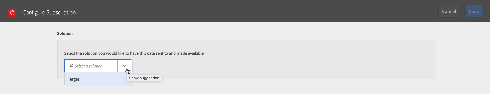

# 客戶屬性{#customer-attributes}

關於使用來自客戶關係管理 (CRM) 資料庫的企業客戶資料，在 Adobe Target 中使用 Adobe 設定檔與對象核心服務中的客戶屬性的資訊進行內容鎖定的資訊。

透過多個來源收集並儲存在 CRM 資料庫內的企業客戶資料，可用於 [!DNL Target] 來策略性地傳延最相關的內容給客戶，特別是著重在回頭的客戶上。[!DNL People] 核心服務 (先前的 Profiles and Audiences) 利用測試與最佳化來結合資料收集和分析，讓資料和分析可行。

## 客戶屬性概觀 {#section_B4099971FA4B48598294C56EAE86B45A}

「人物」核心服務屬於 [!DNL Adobe Experience Cloud] 的一部分，可提供企業一項工具來將其客戶資料推送到 [!DNL Experience Cloud] 平台。上架到 [!DNL Experience Cloud] 的資料可供所有 [!DNL Experience Cloud] 工作流程使用。[!DNL Adobe Target] 利用此資料根據屬性來鎖定回頭的客戶。[!DNL Adobe Analytics] 會利用這些屬性，並可將這些屬性用於分析和劃分。


使用客戶屬性和 Target 時請考量下列資訊:

* 在可以使用 [!UICONTROL  核心服務中的]客戶屬性[!DNL People]功能之前，您必須符合一些先決條件要求。如需詳細資訊，請參閱 *Experience Cloud 和核心服務產品文件*之[客戶屬性](https://marketing.adobe.com/resources/help/zh_TW/mcloud/attributes.html)中的「上傳客戶屬性的先決條件」。請注意，需要 [!DNL at.js] (任何版本) 或 [!DNL mbox.js] 版本 58 或更新版本。
* Adobe 並未保證會將來自 CRM 資料庫的全部客戶屬性 (訪客設定檔) 資料上架到 Experience Cloud，用於 Target 中鎖定目標。在我們目前的設計中，可能不會將少量百分比的資料上架。
* 從 Experience Cloud 匯入 Target 的客戶屬性資料存留期取決於訪客設定檔的存留期，預設為 14 天。如需詳細資訊，請參閱[訪客描述檔存留期](../../c-target/c-visitor-profile/visitor-profile-lifetime.md#concept_D9F21B416F1F49159F03036BA2DD54FD)。
* 如果 `vst.*` 參數為可識別使用者的唯一項目，只要 `authState` 為 UNAUTHENTICATED (0)，將不會擷取現有的「已驗證」設定檔。只有在 `authState` 變更為 UNAUTHENTICATED (1) 時，設定檔才會生效。

   例如，如果使用 `vst.myDataSource.id` 參數來識別使用者 (其中的 `myDataSource` 為資料來源別名)，並且沒有 MCID 或第三方 ID，則使用參數 `vst.myDataSource.authState=0` 將不會擷取可能為透過匯入客戶屬性而建立的設定檔。如果需要的行為是擷取驗證的設定檔，`vst.myDataSource.authState` 必須具備值 1 (AUTHENTICATED)。

* 您無法在 `mbox3rdPartyID` 中傳送下列字元: 加號 (+) 和正斜線 (/)。

## Target 的客戶屬性工作流程 {#section_00DAE94DA9BA41398B6FD170BC7D38A3}

完成下列步驟在 [!DNL Target] 使用 CRM 資料，如下圖所示:


您可以在 *Experience Cloud 和核心服務產品文件*的[建立客戶屬性來源及上傳資料檔案](https://marketing.adobe.com/resources/help/zh_TW/mcloud/t_crs_usecase.html)中，找到完成下列每個工作的詳細指示。

1. 建立資料檔案。

   從您的 CRM 將客戶資料匯出為 CSV 格式，以建立 [!DNL .csv] 檔案。此外，您也可以建立 zip 或 gzip 檔案進行上傳。確保 CSV 的第一列為標頭，而所有列 (客戶資料) 都有相同數量的項目。

   

   

1. 建立屬性來源及上傳資料檔案。

   指定資料來源的名稱和描述，以及別名 ID。別名 ID 是在要您的 VisitorAPI.js 的客戶屬性程式碼中使用的唯一 ID。

   >[!IMPORTANT]
   >
   >資料來源名稱和屬性名稱不得有英文句點。

   使用 HTTP 方法可上傳最高 100 MB 的資料檔案。大於 100 MB、最高 4 GB 的檔案，則可透過 FTP 上傳。

   * **HTTP:** 您可以拖放 [!DNL .csv] 資料檔案或按一下[!UICONTROL 「瀏覽」]來從您的檔案系統上傳。
   * **FTP:** 按一下 FTP 連結來[透過 FTP 上傳檔案](https://marketing.adobe.com/resources/help/zh_TW/mcloud/t_upload_attributes_ftp.html)。第一個步驟是提供 Adobe 所提供 FTP 伺服器的密碼。輸入密碼，然後按一下[!UICONTROL 「完成」]。

      現在將您的 CSV/ZIP/GZIP 檔案傳輸至 FTP 伺服器。此檔案傳輸一旦成功，請以相同名稱和 [!DNL .fin] 副檔名建立新檔案。將此空白檔案傳輸至伺服器。這表示傳輸結束，而 Experience Cloud 會開始處理資料檔案。

1. 驗證結構。

   驗證程序可讓您將顯示名稱和說明對應至已上傳的屬性 (字串、整數、數字等)。將每個屬性與其正確的資料類型、顯示名稱和說明對應。

   結構驗證完成後，按一下[!UICONTROL 「儲存」]。檔案上傳時間因大小而不同。

   

   

1. 設定訂閱及啟動屬性來源。

   按一下 **[!UICONTROL 「新增訂閱」]**，然後選取要訂閱這些屬性的解決方案。[設定訂閱](https://marketing.adobe.com/resources/help/zh_TW/mcloud/subscription.html)可使得資料在 Experience Cloud 和解決方案之間流通。啟動屬性來源可讓資料流向訂閱的解決方案。您上傳的客戶記錄將與從您的網站或應用程式傳入的 ID 訊號比對。

   

   

   執行此步驟時，請注意下列限制:

   * 使用 HTTP 方法的每個上傳的最大檔案大小為 100 MB。
   * 使用 FTP 方法的每個上傳的最大檔案大小為 4 GB。
   * 允許訂閱的屬性數量: [!DNL Target Standard] 為 5 個，而 [!DNL Target Premium] 為 200 個。

## 在 Target 中使用客戶屬性 {#section_107E3A0F0EC7478E82E6DBD17B30B756}

您可以在 [!DNL Target] 中以下列方式使用客戶屬性:

### 建立鎖定目標對象

在 [!DNL Target] 中，您可在建立對象時，從訪客資料區段選取客戶屬性。清單中的所有客戶屬性都會具備字首 &lt; data_source_name &gt;。視需要將這些屬性與其他資料屬性結合，以建立對象。


### 使用 Token 建立設定檔指令碼

可在描述檔指令碼中使用 `crs.get('<Datasource Name>.<Attribute name>')` 格式參考客戶屬性。

可以直接在選件中使用此設定檔指令碼，用於傳遞屬於目前訪客的屬性。

### 在您的網站使用 mbox3rdPartyID 以獲得成功的實作和使用狀況

將 mbox3rdPartyId 以參數的形式傳遞至 `targetPageParams()` 方法內的全域 mbox。mbox3rdPartyId 的值應該設為 CSV 資料檔案中顯示的客戶 ID。

```
<script type="text/javascript">
            function targetPageParams() {
               return 'mbox3rdPartyId=2000578';
            }
</script>
```

### 使用 Experience Cloud ID 服務

如果您使用 Experience Cloud ID 服務，您需要設定客戶 ID 和驗證狀態，才能在鎖定目標中使用客戶屬性。如需詳細資訊，請參閱 *Experience Cloud ID 服務文件*中的[客戶 ID 與驗證狀態](https://marketing.adobe.com/resources/help/zh_TW/mcvid/mcvid-authenticated-state.html)。

如需關於在 [!DNL Target] 中使用客戶屬性的詳細資訊，請參閱下列資源:

* *Experience Cloud 和核心服務產品文件*中的[建立客戶屬性來源及上傳資料檔案](https://marketing.adobe.com/resources/help/zh_TW/mcloud/t_crs_usecase.html)
* *數位行銷部落格*中的 [Customer Attributes: The More You Know, The Better You Connect](https://blogs.adobe.com/digitalmarketing/analytics/customer-attributes-know-better-connect/)

## 客戶經常遇到的問題 {#section_BE0F70E563F64294B17087DE2BC1E74C}

處理客戶屬性和 [!DNL Target] 時，您可能會遇到下列問題:

| 問題 | 詳細資料 |
|--- |--- |
| 因為設定檔太大，已移除客戶屬性 | 使用者設定檔中的特定欄位沒有字元限制，但如果設定檔變得大於 64K，則會透過移除最舊的屬性來將它截斷，直到設定檔再次低於 64K 為止。 |
| 即使在數天之後，屬性亦未列在 [!DNL Target] 的對象資料庫中 | 這通常是管線連線問題。作為解決方案，請要求您的客戶屬性團隊重新發佈摘要。 |
| 傳送未根據屬性運作 | Edge 上的設定檔尚未更新。作為解決方案，請要求您的客戶屬性團隊重新發佈摘要。 |
| 實作問題 | 請注意下列實作問題:<ul><li>訪客 ID 未正確傳遞。傳入的 ID 是 mboxMCGVID，而不是 `setCustomerId`。</li><li>傳遞的訪客 ID 正確，但 AUTHENTICATION 狀態未設為 Authenticated。</li><li>`mbox3rdPartyId` 未正確傳遞。</li> |
| `mboxUpdate` 未正確執行 | mboxUpdate 未正確搭配 `mbox3rdPartyId` 執行。 |
| 客戶屬性未匯入 Target。 | 如果在 Target 中找不到客戶屬性資料，請確保在過去 x 天曾經發生匯入，其中的 x 為 Target [訪客設定檔存留期](/help/c-target/c-visitor-profile/visitor-profile-lifetime.md)值 (依預設為 14 天)。 |

以上第 1 列和第 2 列中的問題大約造成此領域中 60% 的問題。第 3 列中的問題大約造成 30% 的問題。第 4 列中的問題大約造成 5% 的問題。其餘的 5% 則因為雜項問題。

## 訓練影片: 使用客戶屬性上傳離線資料 {#section_9A4E0FA0D0934D06BD8D5BFA673E9BD8}

此影片顯示如何將離線 CRM、支援中心、銷售點和其他行銷資料匯入 Experience Cloud People 服務，並使用其已知 ID 將其與訪客建立關聯。

>[!VIDEO](https://video.tv.adobe.com/v/17802t1/)
