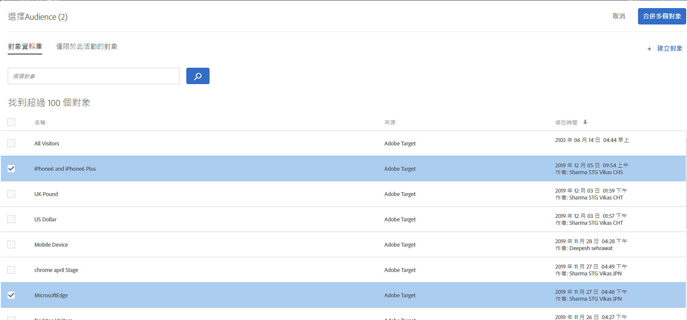
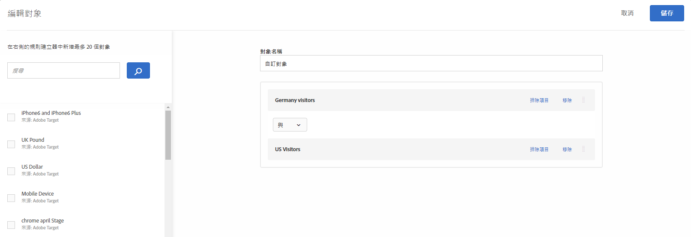
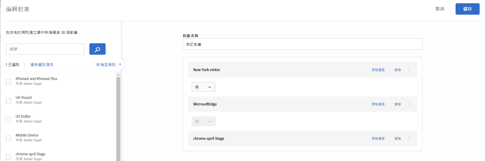
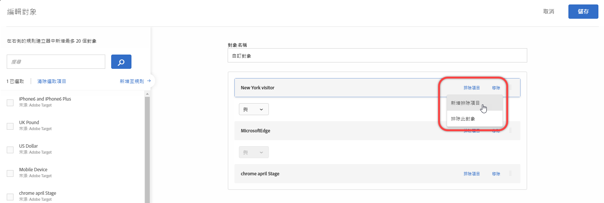
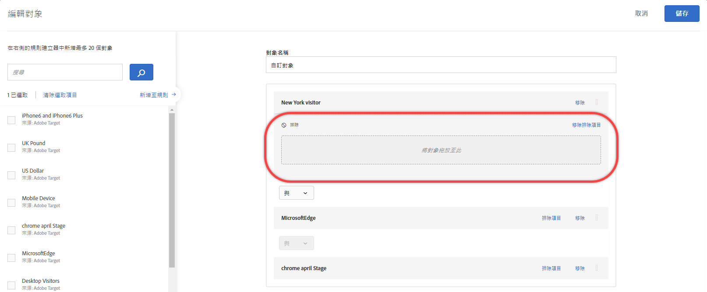
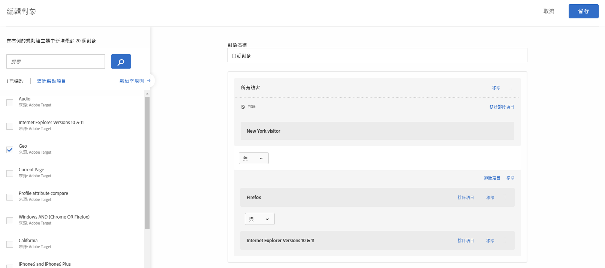
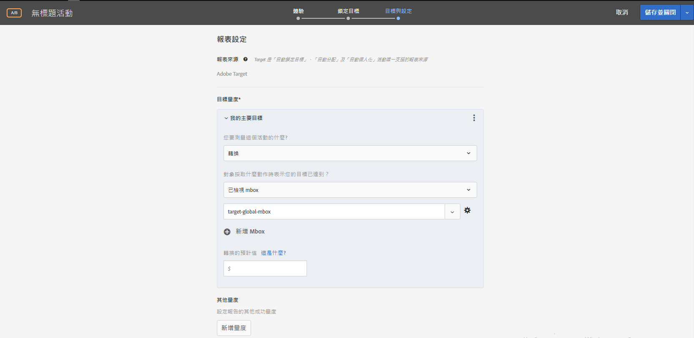
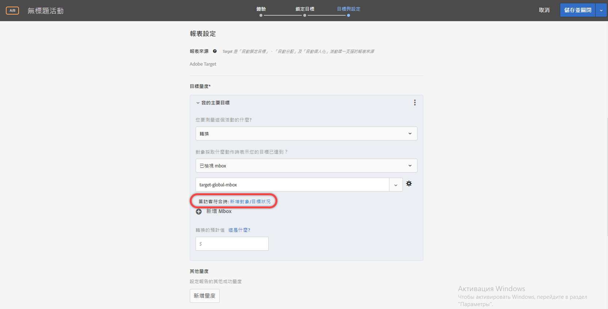
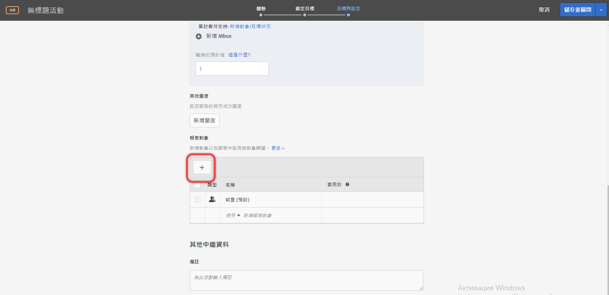

# 合併多個對象{#combine-multiple-audiences}

快速結合多個對象 (包括 Adobe Experience Cloud 對象和 Target 對象)，以建立隨選對象。您也可以從規則建立排除規則和排除對象。

假設您有「新訪客」對象和「Chrome 使用者」對象。針對特定的活動，您可能想要合併這些現有對象，以鎖定使用 Chrome 瀏覽器的新訪客作為目標。您不需要建立第三個對象並儲存在[!UICONTROL 對象]資料庫中，僅需在建立活動或編輯現有活動時合併這兩個對象。

再舉一例，您可以包含有關忠誠度狀態的特定 [!DNL Audience Manager] 區段，然後與目前工作階段中加入忠誠計劃的人所組成的 [!DNL Target] 區段合併，以鎖定所有忠誠客戶作為目標，而不需要建立第三個永久對象。

您可以使用 AND 和 OR 運算子來合併最多十個對象。

您可以在 [!DNL Target] UI 各處建立並使用合併的對象。

## Create a combined audience while creating an activity {#section_2F1CE9434CC04174B4BA2BFC89B85D77}

在三步驟引導式工作流程期間，您可以在活動的 [!UICONTROL Target] 頁面上建立隨選合併的對象。

1. 建立[活動](../c-activities/activities.md#concept_D317A95A1AB54674BA7AB65C7985BA03)，在 **[!UICONTROL 「目標]** 」頁面上，按一下三個垂直橢圓形，然後按一下 **[!UICONTROL 「取代對象]**」。

   

1. 在[!UICONTROL 「選擇對象」]頁面上，選取所需對象旁的核取方塊，以使用這些對象作為合併對象的建置區塊。

   

1. 按一下右上角的&#x200B;**[!UICONTROL 「合併多個對象」]。**

   

1. (條件式) 視需要編輯新的合併對象。

   [!UICONTROL 「編輯對象」]對話方塊可讓您將其他對象建置區塊從左側拖放到新的合併對象，還可以新增排除規則並排除對象。

   1. 您可以利用拖放功能在現有區段內新增對象，以作為第 2 層建置區塊。若要新增第 1 層建置區塊，請選取所需對象旁的核取方塊，然後按一下&#x200B;**[!UICONTROL 「新增至規則」]**。

      例如，在前述範例中，您現在想要納入結合觀眾中的Safari使用者。搜尋並拖曳「Safari Browser」觀眾至右側的「Firefox瀏覽器」方塊，如下列範例所示：

      

      請注意，兩個瀏覽器類型對象之間的運算子是 "AND"。選取「And」(&amp; D)下拉式清單，然後將它變更為「OR」，以使用Firefox或Safari為新訪客建立新的組合觀眾。請小心，避免建立規則來排除所有可能的對象成員。例如，某人無法同時使用Firefox和Safari瀏覽頁面。

      >[!NOTE]
      >
      >合併對象時，運算子 (AND 或 OR) 必須保持相同。您不能混用 &amp; 比對運算子。

   1. 若要將排除項目新增至規則，請按一下&#x200B;**[!UICONTROL 「排除項目]** &gt; **[!UICONTROL 新增排除項目」]**。

      

      將對象拖放到方塊中:

      

      例如，若要排除來自新訪客的美國訪客，您可以拖曳市場：美國觀眾放入方塊中，如下所示：

      

      此合併對象包含您的網站上所有使用 Safari 或 Firefox 的新訪客 (排除來自 San Francisco 的新訪客)。

   1. 若要從規則中排除對象，請按一下&#x200B;**[!UICONTROL 「排除項目]** &gt; **[!UICONTROL 排除此對象」]**。

      例如，您可以建立合併的對象來包含網站的所有新訪客，但排除使用 Firefox 的新訪客。不需要建立合併的對象來明確包含多個瀏覽器 (Safari、Chrome 和 Internet Explorer)，但又不包含 Firefox，直接排除使用 Firefox 的訪客更輕鬆又快速。

1. 提供已合併對象的描述性名稱，然後按一下&#x200B;**[!UICONTROL 「儲存」]**。

## Create a combined audience for use in metric targeting {#section_A42E795AFCBD4575809C5942039910F0}

您可以在活動的[!UICONTROL 「目標與設定」]頁面上建立隨選合併對象，以用於量度鎖定目標。例如，若要使用合併的對象以根據轉換來建立鎖定目標，請執行下列動作:

1. 編輯或建立[活動](../c-activities/activities.md#concept_D317A95A1AB54674BA7AB65C7985BA03)，在&#x200B;**[!UICONTROL 「目標與設定」]**&#x200B;頁面上，選取&#x200B;**[!UICONTROL 「轉換」]作為成功量度，然後選取**「已檢視 Mbox」**作為動作。**
1. 在&#x200B;**[!UICONTROL 「搜尋 Mbox」]欄位中選取所需的 Mbox。**

   

1. 按一下齒輪圖示，然後按一下&#x200B;**[!UICONTROL 「新增對象鎖定目標」]**。
1. 按一下&#x200B;**[!UICONTROL 「新增對象/目標狀況」]**&#x200B;連結，以顯示[!UICONTROL 「選擇對象」]對話方塊。

   

1. 繼續進行[步驟 2](../c-target/combining-multiple-audiences.md#section_2F1CE9434CC04174B4BA2BFC89B85D77)「在建立活動時建立結合的對象」以建立結合的對象。

## 建立合併的對象以用於報表 {#section_4682D342EFBB43C38E54B99B3A1E14CD}

您可以在活動的[!UICONTROL 「目標與設定」]頁面上建立隨選合併對象，以用於報表。

1. 編輯或建立[活動](../c-activities/activities.md#concept_D317A95A1AB54674BA7AB65C7985BA03)，在&#x200B;**[!UICONTROL 「目標與設定」]**&#x200B;頁面上，按一下&#x200B;**[!UICONTROL 「報表對象」]**&#x200B;下的[!UICONTROL 「新增對象」]圖示，以顯示[!UICONTROL 「選擇對象」]頁面。

   

1. 繼續進行[步驟 2](../c-target/combining-multiple-audiences.md#section_2F1CE9434CC04174B4BA2BFC89B85D77)「在建立活動時建立結合的對象」以建立結合的對象。

## Create a combined audience while editing an activity {#section_364A12CE96E04B61B7C18113AA586C2C}

您可以在編輯現有活動時建立隨選合併對象。

1. 在[!UICONTROL 「活動」]頁面中，暫留在所需的活動上，然後按一下&#x200B;**[!UICONTROL 「編輯」]圖示。**

   或

   按一下所需的活動以開啟，然後按一下&#x200B;**[!UICONTROL 「編輯活動」]**。

1. Click the **[!UICONTROL Configure]** &gt; **[!UICONTROL Audiences]** &gt; **[!UICONTROL Multiple Audiences]**.

   

1. 按一下活動目前對象旁的更多選項圖示 (垂直三個點)，然後按一下&#x200B;**[!UICONTROL 「變更對象」]**。

   

1. 繼續進行[步驟 2](../c-target/combining-multiple-audiences.md#section_2F1CE9434CC04174B4BA2BFC89B85D77)「在建立活動時建立結合的對象」以建立結合的對象。