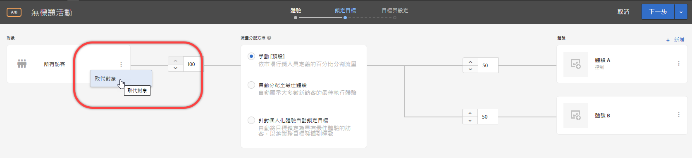

# 建立僅限於此活動的對象{#create-an-activity-only-audience}

在建立活動時，從三個步驟引導工作流程內建立僅限活動的對象。這些隨選受眾可用在相同活動內的其他位置，但不會儲存在[!UICONTROL 受眾資料庫]而用於其他活動。

僅限於此活動的對象提供下列優點:

* 您可以使用僅限於此活動的受眾，建立您僅要使用一次且不想儲存在[!UICONTROL 受眾資料庫]的受眾。這可防止[!UICONTROL 受眾資料庫]雜亂，充滿了您絕不再想要使用的受眾。
* 在[!UICONTROL 受眾資料庫]中看不到僅限於此活動的受眾。因此這些對象會獲得保護，不會受組織中的其他人不必要的變更。

1. 建立 [活動](/help/c-activities/activities.md#concept_D317A95A1AB54674BA7AB65C7985BA03)時，請在 **[!UICONTROL Target]** 頁面上按一下三個垂直的點，然後按一下&#x200B;**[!UICONTROL 取代受眾]**。

   

1. 在[!UICONTROL 選擇受眾]頁面上，按一下&#x200B;**[!UICONTROL 僅限活動的受眾]**。

   

1. 按一下&#x200B;**[!UICONTROL 「建立對象」]**。
1. 輸入描述性的對象名稱。
1. 按一下&#x200B;**[!UICONTROL 「+ 新增規則」]**。

   規則可讓您將對象限制在網站訪客的子集。

1. 選取規則類型。

   每個規則類型都有其專屬的參數。請參閱[對象的類別](/help/c-target/c-audiences/c-target-rules/target-rules.md#concept_E3A77E42F1644503A829B5107B20880D)，以取得關於設定每個類型的對象規則的詳細資訊。

1. 定義規則參數。
1. 按一下&#x200B;**[!UICONTROL 「儲存」]**。

## 考量事項

處理僅限於此活動的對象時，請記得下列資訊:

* 您可以在可視化體驗撰寫器 (VEC) 或表單式體驗撰寫器中建立僅限於此活動的對象。此功能會取代舊版 Target 中的細分規則。
* 您可以建立要在[!UICONTROL 受眾資料庫]中儲存的活動，以在其他活動中重複使用，或您可以建立僅限於此活動的受眾。儲存對象之後，您無法變更對象類型。
* 現有活動的細分已移轉至僅限於此活動的對象。
* 僅限於此活動的受眾的狀態為[!UICONTROL 已使用]或[!UICONTROL 未使用]。在儲存活動之前，會將僅限於此活動的對象顯示為「未使用」。如果維持未使用而您嘗試儲存活動，會顯示警告訊息，通知您將刪除未使用的僅限於此活動的對象。
* 您可以在可透過對象選擇器存取的快顯卡上檢視對象定義詳細資料，而不需開啟對象。
* 您可以[結合多個對象](/help/c-target/combining-multiple-audiences.md#concept_A7386F1EA4394BD2AB72399C225981E5)以建立僅限於此活動的對象。

