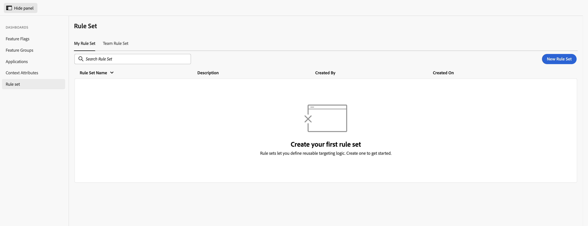
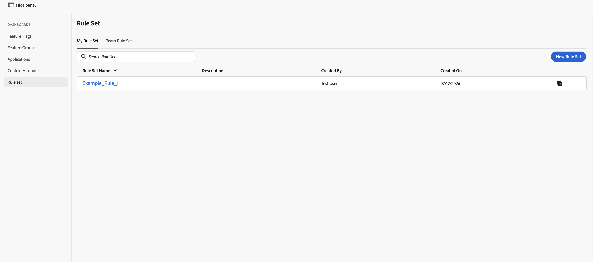
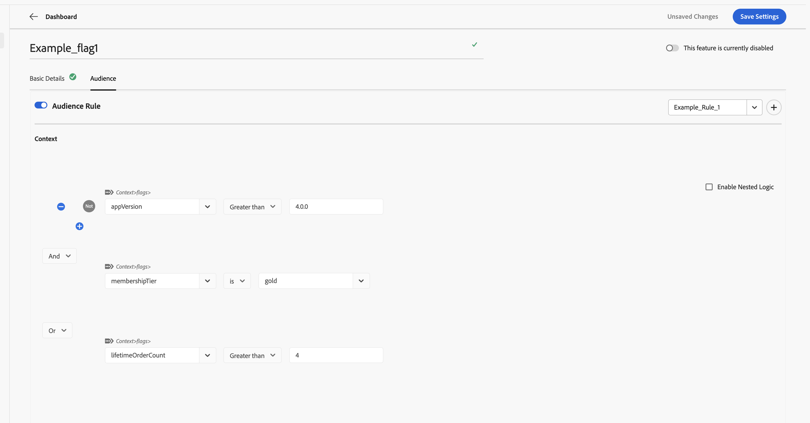

# 建立和使用規則集 {#creating-and-using-rule-sets}

規則集是可重複使用的對象內容條件集合。 當多個功能標幟或功能群組需要相同對象時，請建立規則集。 接著，您可以匯入規則集，而非為每個功能重新建立對象條件。

## 規則集需求 {#requirements}

| UI標籤 | 使用 | 必要 |
| --- | --- | --- |
| **輸入規則集** | 輸入「規則集」的名稱。 | 是 |
| **規則集描述** | 說明規則集的用途。 | 否 |
| **上下文** | 至少定義一個對象條件。 內容屬性是指已命名的欄位，例如訂閱層、應用程式版本或區域。 | 是 |

## 建立規則集 {#create-rule-set}

### 步驟1：啟動新規則集 {#step-1-start}

在旗標中，從左側導覽選取&#x200B;**規則集**，然後選取&#x200B;**新增規則集**。

**我的規則集**&#x200B;索引標籤會顯示您建立的規則集。 **團隊規則集**&#x200B;索引標籤會顯示您的團隊可用的規則集。

### 步驟2：新增規則集詳細資料和條件 {#step-2-details}

1. 輸入「規則集」的名稱。
1. 選擇性地輸入說明。
1. 在&#x200B;**內容**&#x200B;下，定義您要重複使用的對象條件。
1. 使用&#x200B;**And**&#x200B;或&#x200B;**Or**&#x200B;來合併多個條件。
1. 若要建立更複雜的運算式，請選取&#x200B;**啟用巢狀邏輯**。

### 步驟3：儲存規則集 {#step-3-save}

選取&#x200B;**儲存設定**。 儲存的規則集會顯示在&#x200B;**我的規則集**&#x200B;下。

## 在功能標幟或功能群組中使用規則集 {#use-rule-set}

### 步驟1：開啟並啟用對象設定 {#step-1-open}

開啟您要使用規則集的功能標幟或功能群組，選取&#x200B;**對象**&#x200B;標籤，然後開啟&#x200B;**對象規則**&#x200B;以啟用對象條件。

### 步驟2：選取規則集 {#step-2-select}

開啟&#x200B;**選取規則集**&#x200B;下拉式清單。 從&#x200B;**我的規則集**&#x200B;或&#x200B;**我的團隊規則集**&#x200B;中選擇規則集。

![在[對象]索引標籤中開啟選取規則集下拉式清單](assets/rule-set-select-in-audience.png)

### 步驟3：檢閱匯入的條件 {#step-3-review}

所選規則集中的內容條件會匯入至受眾。 檢閱條件，然後儲存功能標幟或功能群組。

您可以在需要相同受眾的多個功能標幟和功能群組中使用相同的規則集。

### 步驟4：儲存功能標幟或功能群組 {#step-4-save}

檢閱匯入的對象條件後，選取&#x200B;**儲存設定**。

>[!NOTE]
>
>匯入規則集會將其對象條件複製到功能標幟或功能群組中。 如果需要稍後更新對象條件，請在匯入規則集的每個功能標幟和功能群組中分別更新它們。 更新原始規則集不會自動更新先前匯入的對象。

## 從功能標幟或功能群組建立規則集 {#create-from-feature}

您也可以直接從功能標幟或功能群組的「對象」畫面建立規則集：

1. 開啟功能標幟或功能群組，然後選取「**對象**」標籤。
1. 開啟&#x200B;**對象規則**。
1. 定義您要重複使用的內容條件。
1. 選取&#x200B;**選取規則集**&#x200B;下拉式清單旁右上角的&#x200B;**+**&#x200B;按鈕。
1. 在&#x200B;**儲存規則集**&#x200B;對話方塊中，輸入規則集名稱。
1. 選取&#x200B;**儲存規則集**。

## 另請參閱 {#see-also}

* [建立您的內容屬性](creating-your-context-attributes.md)
* [在對象規則中使用內容](using-context-in-audience-rules.md)
* [功能標幟和功能群組中的對象](audience-in-feature-flags-and-feature-groups.md)

<!-- -->
