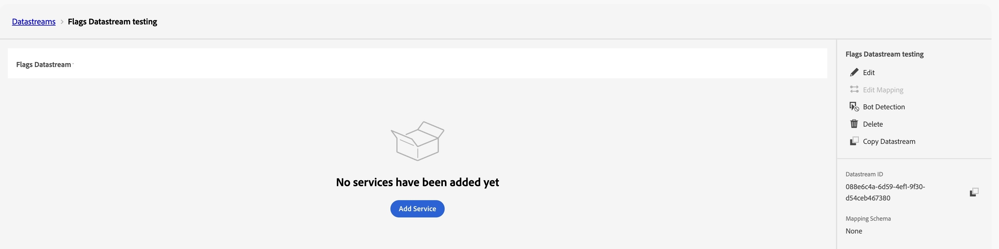
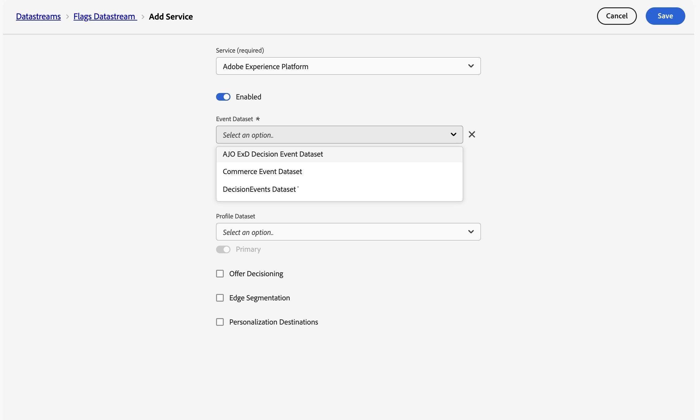
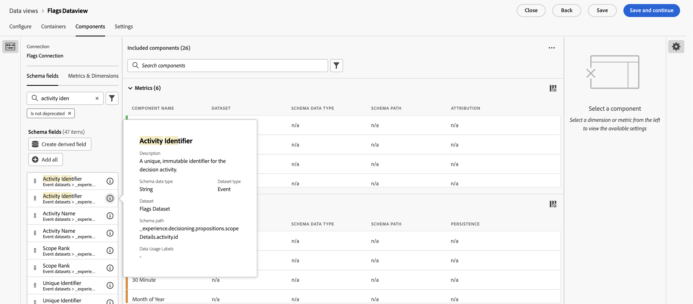

# 設定CJA功能標幟報表 {#set-up-cja-reporting}

旗標與Adobe Customer Journey Analytics (CJA)之間的整合提供統一方式，可衡量功能旗標變體對業務的影響。 隨時將CJA成功量度套用至Flags報表，並運用Customer Journey Analytics功能（例如[Experimentation面板](https://experienceleague.adobe.com/zh-hant/docs/analytics-platform/using/cja-workspace/panels/experimentation)）來評估實驗效能，並瞭解功能變體如何影響客戶行為。

## 考量事項 {#considerations}

使用Customer Journey Analytics和Flags整合前，請先考慮下列資訊：

* 您與貴組織必須具備Adobe Customer Journey Analytics (CJA)的存取權。
* **AJO ExD決定事件資料集**&#x200B;必須布建在沙箱中，以標籤曝光事件。
* 包含您要用來作為成功量度的成功轉換事件的資料集必須可供使用。

## 設定資料串流 {#set-up-datastream}

>[!NOTE]
>
>本指南僅使用Commerce體驗事件資料集和`commerce.purchases.value`作為範例。 選取適合您使用案例的結構描述和對應的成功量度欄位。

1. 在資料收集中，移至&#x200B;**資料串流**&#x200B;並建立或開啟標幟曝光資料串流。
1. 將其對應結構描述設定為&#x200B;**AJO ExD決定事件結構描述**。
1. 開啟資料串流並選取&#x200B;**新增服務**。
1. 選取現有的&#x200B;**AJO ExD決定事件資料集**&#x200B;做為事件資料集並儲存。

>[!NOTE]
>
>您剛建立的資料串流ID可用來設定資料收集標籤中的Flags擴充功能。

## 設定Customer Journey Analytics連線 {#set-up-connection}

如果您已設定連線，則可以使用現有的連線，並跳至下列步驟3。 此連線可讓Customer Journey Analytics開始從資料集中提取資料以用於報表。

1. 在Customer Journey Analytics的&#x200B;**連線**&#x200B;頁面上，選取&#x200B;**建立新連線**。
1. 使用正確的資訊設定您的[連線與資料設定](https://experienceleague.adobe.com/zh-hant/docs/analytics-platform/using/cja-connections/overview)。
1. 新增您在設定資料流時使用的ExD事件資料集。
1. 新增要做為轉換事件的資料集，然後選取&#x200B;**下一步**。
1. 在&#x200B;**新增資料集**&#x200B;對話方塊中，逐一設定每個所選資料集[&#128279;](https://experienceleague.adobe.com/zh-hant/docs/analytics-platform/using/cja-connections/create-connection#dataset-settings)的設定。

在新增任何資料集之前

## 設定資料檢視 {#set-up-data-view}

在Customer Journey Analytics中設定資料檢視。 資料檢視可確保連線中的資料可以正確使用。

1. 設定資料檢視，並確認其指向到您上方所建立的連線。 如需詳細資訊，請參閱&#x200B;*Adobe Customer Journey Analytics指南*&#x200B;中的[建立或編輯資料檢視](https://experienceleague.adobe.com/zh-hant/docs/analytics-platform/using/cja-dataviews/create-dataview)。
1. 移至&#x200B;**資料管理** > **資料檢視**。
1. 選取&#x200B;**建立新資料檢視**&#x200B;並選擇標幟CJA連線。
1. 輸入資料檢視名稱和穩定的外部ID。
1. 確認時區和行事曆設定，然後繼續執行&#x200B;**元件**。

### 設定實驗與變數維度 {#configure-experiment-variant-dimensions}

1. 將`_experience.decisioning.propositions.scopeDetails.activity.id` （對應至&#x200B;**旗標實體ID**）新增至維度，並將其重新命名為「旗標實體ID」或其他分析師易記名稱。
1. 將其內容標籤設定為「實驗中的實驗」。
1. 將`_experience.decisioning.propositions.scopeDetails.experience.id` （對應至功能旗標或功能群組的變體）新增至維度。
1. 將其內容標籤設定為「實驗中的變體」。

>[!WARNING]
>
>如果沒有這兩個實驗內容標籤，CJA Experimentation面板就無法識別標幟實驗和變體。

### 設定持續性和歸因 {#configure-persistence-attribution}

設定維度和量度，讓風險可接收後續轉換的評分。 如果沒有適當的持續性或歸因，CJA可能只會關聯與曝光在相同事件中發生的結果。

1. 在量度下新增必要的轉換欄位，例如`commerce.purchases.value`。
1. 為量度指定清楚的名稱，例如&#x200B;**購買值**。
1. 啟用歸因並選取分析所需的模型：上次接觸、首次接觸、參與率或同一次接觸。 如需歸因模型、容器和回顧期間的詳細資訊，請參閱[歸因元件](https://experienceleague.adobe.com/zh-hant/docs/analytics-platform/using/cja-workspace/attribution/models)。
1. 選取符合實驗策略的容器和回顧視窗。 具有造訪或工作階段感知回顧的「人員」容器是常見起點，但需針對您的使用案例進行驗證。
1. 儲存資料檢視。

## 另請參閱 {#see-also}

* [報告](reporting.md)

<!-- -->
