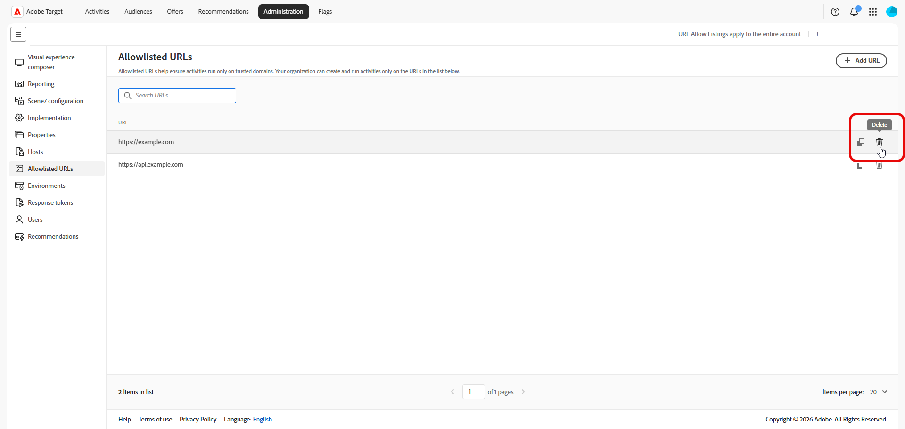

# 已加入允許清單的URL

列入允許清單的URL會定義貴組織可建立和執行[!DNL Adobe Target]體驗的受信任URL模式，包括當您使用遠端或重新導向選件時。 此清單可與[主機管理](/help/main/administrating-target/hosts.md)和[環境](/help/main/administrating-target/environments.md)搭配使用，但特別適用於允許的遠端選件URL模式和相關驗證。

若要管理加入允許清單的URL，請按一下&#x200B;**[!UICONTROL 管理]** > **[!UICONTROL 加入允許清單的URL]**。

## 管理加入允許清單的URL {#add-url}

主表格會以單一欄列出每個允許清單的圖樣。 支援的專案可包含確切的URL、萬用字元路徑或您的組織接受用於遠端體驗的模式格式。

1. 按一下&#x200B;**[!UICONTROL 新增URL]**。

   

1. 在對話方塊中，輸入您的組織必須允許的URL或模式。

   

1. 儲存您的變更。

   在模式加入允許清單後，使用者可以建立或執行依賴該URL的活動和選件，但受限於您的其他[!DNL Target]規則。

1. 使用&#x200B;**[!UICONTROL 搜尋URL]**&#x200B;欄位來篩選資料表。

1. 若要刪除URL，請尋找您不再需要之模式的列，然後按一下圖示。

   

