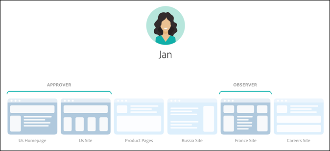

# 企業使用者權限

企業使用者許可權是一種正式管理整個企業使用者存取許可權的方法。 [!DNL Adobe Target]. 將使用者新增至 [!DNL Target]，根據其角色指派許可權，並根據不同的部門、全域位置、管道和其他邏輯群組建立團隊的工作區。 您可以將角色指派給使用者 [!UICONTROL Observer]， [!UICONTROL Editor]， [!UICONTROL Approver]，或 [!UICONTROL Publisher].

## 判斷您是否擁有企業使用者許可權的存取權

>[!NOTE]
>
>[!UICONTROL Properties and Permissions] 功能屬於 [!DNL Target] 頂級解決方案。 如果沒有 [!DNL Target] Premium 授權，就無法在 [!DNL Target] Standard 中使用它們。 
>
>您的 [!DNL Target] 實作可以使用任何版本的at.js或 [!DNL Adobe Experience Platform Web SDK].

您可以區分您的組織具有的Standard或Premium授權，方法是按一下 [!UICONTROL Administration] 頂端連結 [!DNL Target] UI。

* **[!DNL Target Standard]客戶**：如果您看到 [!UICONTROL Users] 標籤([!UICONTROL Administration > Users]) (而非 [!UICONTROL Properties] 標籤)，貴組織擁有 [!DNL Target Standard] 授權。 [!DNL Target Standard] 客戶應該遵循以下說明進行操作： [使用者](/help/main/administrating-target/c-user-management/c-user-management/user-management.md) 若要在中新增使用者並指派許可權 [!DNL Adobe Admin Console].

* **[!DNL Target Premium]客戶**：如果您看到 [!UICONTROL Properties] 標籤([!UICONTROL Administration > Properties])和 [!UICONTROL Users] 標籤，您的組織有一個 [!DNL Target Premium] 授權。 [!DNL Target Premium] 客戶應該遵循本文和[設定企業權限](/help/main/administrating-target/c-user-management/property-channel/properties-overview.md)中的指示。

## 開始使用企業許可權之前

>[!IMPORTANT]
>
>請確定您已閱讀 [警告](/help/main/administrating-target/c-user-management/property-channel/property-channel.md#section_9714311B1CD9497A86F4910F8AE635E2) 區段，然後再繼續行使企業許可權。

## 本節中使用的字詞和定義 {#section_F8D229544FEA41C3BC2EFD1F95AA0116}

在本小節中將使用下列字詞，並且對想要在中使用「屬性和許可權」功能的使用者來說，可能是新字詞 [!DNL Target] 進階。

### 屬性

屬性的本質類似於中的屬性 [!DNL Adobe Experience Platform] 因為它們使用唯一的程式碼片段來加以區分。

Web 屬性是一組規則加上一個內嵌代碼。Web 屬性可以是一或多個網域和子網域的任何群組。

透過將特定名稱/值組新增為引數，搭配任何呼叫（Target呼叫、API呼叫等）來啟用屬性 [!DNL Target].

屬性屬於特定管道 (Web、行動電話、電子郵件或 API/其他)。

### 工作區 (產品設定檔) {#workspace}

工作區可讓組織將特定一組使用者指派至特定一組屬性。工作區有許多地方皆與 [!DNL Adobe Analytics] 中的報表套裝相似。

注意：工作區稱為 [!UICONTROL Product Profiles] 在 [!DNL Adobe Admin Console for Enterprise].

如果您屬於多國組織，可能會有一個工作區用於歐洲網頁、屬性或網站，以及另一個工作區用於美洲網頁、屬性或網站。如果您屬於多品牌組織，則可能會有每個品牌的個別工作區。

使用者可以屬於多個工作區並且甚至可具有每個工作區內不同的角色。

使用者可以擁有不同的檢視 [!DNL Adobe Target] 藉由在工作區之間移動，類似於 [!DNL Analytics] 使用者有不同的檢視 [!DNL Analytics] 在報表套裝之間移動。

工作區可包含完全不同的對象、代碼選件和活動。

所有在新的企業許可權模型移轉前建立的對象和活動，都會分組到「預設工作區」，如下所述。

所有建立活動的方式 [!DNL Adobe Experience Manager] (AEM)， [!DNL Adobe Mobile Services]、和 [!DNL Adobe Target Classic] 是「預設工作區」的一部分。

### 預設工作區

內的所有現有工作區（產品設定檔） [!DNL Admin Console] 在您的組織移轉至新的企業許可權模型期間，系統會將您合併至名為「預設工作區」的單一工作區。

>[!IMPORTANT]
>
>請勿刪除預設工作區。

所有使用者角色和對所有使用者的存取權 [!DNL Target] 功能與移轉至新企業許可權模型前相同。

### 使用者群組

您可以建立使用者群組，例如開發人員、分析人員、行銷人員和高階主管。 然後，您可以跨多個Adobe產品和工作區指派許可權。 跨不同的 Adobe 產品為新團隊成員指派所有適當的權限，就如同將它們新增至特定使用者群組一樣簡單。

### 角色和許可權 {#roles-permissions}

角色和許可權會決定使用者在您中建立和管理活動所需的存取層級。 [!DNL Target] 實作。 在 [!DNL Target]，角色包括：

| 角色 | 說明 |
|--- |--- |
| [!UICONTROL Approver] | 可以建立、編輯和啟動或停止活動。 |
| [!UICONTROL Editor] | 可以在活動上線之前建立和編輯活動，但無法核准活動的啟動。 |
| [!UICONTROL Observer] | 可以檢視活動，但無法建立或編輯活動。 |
| [!UICONTROL Publisher] | 類似於 [!UICONTROL Observer] 角色（可以檢視活動，但無法建立或編輯活動）。 然而， [!UICONTROL Publisher] 角色具有啟用活動的額外許可權。 |

### 頻道

管道是指您所在 [!DNL Target] 活動可傳送至：網頁、行動應用程式、電子郵件訊息等。

建立活動時，會在目前選取的工作區中建立該活動。 您會在第一個對話方塊中看到頻道選擇選項，讓您為活動選擇所需的頻道：網頁、行動應用程式、電子郵件或其他/API。

## 許可權總覽 {#section_DC2172520DA84605B218A5E9FB6D187A}

下列資訊說明先前在中執行許可權的方式 [!DNL Target] 以及如何使用強制執行 [!UICONTROL Properties] 和 [!UICONTROL Permissions] 功能。

新的 [!UICONTROL Permissions] 功能可讓您建立不同的專案(在 [!DNL Adobe Admin Console for Enterprise])。 專案可讓您為單一使用者指派不同許可權，且這些許可權指定該使用者存取每個專案的許可權。 這些獨特的專案可與 [!DNL Adobe Analytics] 中報表套裝的運作方式比較。每個專案可以有特定的使用者具有適用一組屬性的特定角色。結果，客戶能夠根據區域、環境（開發/舞台/prod）、頻道或其他自訂條件，限制其使用者的檢視、編輯和核准存取權，如下所示：

例如，特定使用者可能會有美國網站的「核准」存取權，但只有歐洲行動應用程式的「檢視」存取權。該相同使用者可能沒有 APAC 區域中 Web 和行動屬性上提供的活動的任何存取權 (甚至是檢視)。

此 [!DNL Target] [!UICONTROL Permissions] 模型具有以下許可權角色（觀察者、編輯者、核准者和觀察者）。 本文插圖中未顯示觀察者角色。

每個角色有不同層級的權限:

| 角色 | 說明 |
|--- |--- |
| 核准者 | 可以建立、編輯和啟動或停止活動。 |
| 編輯者 | 可以在活動上線之前建立和編輯活動，但無法核准活動的啟動。 |
| 觀察者 | 可以檢視活動，但無法建立或編輯活動。 |
| 發佈者 | 類似於觀察者角色 (可以查看活動，但不能建立或編輯活動)。 不過，發佈者角色具有啟用活動的額外權限。 |

務必注意，每個使用者的角色會套用至您的帳戶中包含 [!DNL Target] 標記的每個頁面、屬性或網站上，如下所示:

新的 [!DNL Target] [!UICONTROL Permissions] 模型擁有相同的三種許可權角色（觀察者、編輯者和核准者）；不過，您可以為個別頁面、屬性或網站個別指派使用者的許可權角色，如下所示：

在此範例中，Jan 具有美國首頁和美國網站的核准者權限，以及法國網站的觀察者權限。

此外，Jan在中看不到頁面、屬性或網站 [!DNL Target] 她沒有許可權檢視的專案，如下所示：

在此範例中，Jan 看不到產品頁面、俄羅斯網站和求職網站。

## 使用案例情境 {#section_F3CE8576959E4F4CB13BEEED38311DD8}

下列使用案例有助於瞭解屬性、專案、角色和權限如何能協助您使用 [!DNL Target] 達成您的行銷目標:

### 多國組織

如果您屬於多國組織，可能會有一個工作區用於歐洲網頁、屬性或網站，以及另一個工作區用於美洲網頁、屬性或網站。重新組織之後，使用上圖中的角色，您可以設定類似於以下的工作區和權限:

* **Jan**: Jan 是組織的美國網頁、屬性和網站的 Center of Excellence 的最佳化領導者。她很可能具有 Adobe Experience Cloud 中的系統管理員權限。

  在她的角色中，她具有美國首頁和美國網站的核准者權限。透過核准者許可權，她可以建立、編輯、啟動或停止活動。

  Jan 也洽詢了法國的最佳化團隊，因此，具有法國網站的觀察者權限，該權限提供她對活動的唯讀存取。Jan 可以檢視活動，但無法建立或編輯活動。

  因為 Jan 沒有需要她看到產品頁面、俄羅斯網站或求職網站的角色，她看不到這些網站的活動。

* **Ernie**: Ernie 是組織的行銷經理，負責在美國的行銷。

  因為Ernie是組織的新人，並且對Target沒有經驗，他具有美國首頁、美國網站和產品頁面的編輯者許可權。 擁有編輯器許可權，Ernie可以在活動上線之前建立和編輯活動。 他無法核准活動的啟動 — 具有核准許可權的人（例如Jan）必須先核准活動，才能將其投入生產。

  因為 Ernie 沒有需要他看到俄羅斯網站、法國網站或求職網站的角色，他看不到這些網站的活動。

* **Diana**: Diana 現在是組織的分析師，並且已獲得美國首頁、美國網站、產品頁面、俄羅斯網站和法國網站的觀察者權限，該權限提供她對活動的唯讀存取。Diana 可以檢視活動，但無法建立或編輯活動。

  因為 Diana 沒有需要她看到求職網站的角色，她看不到這些網站的活動。

### 多品牌組織

如果您屬於多品牌組織，則可能會有每個品牌的網頁、屬性或網站的個別工作區。

重新組織之後，使用上圖中的角色，您可以設定類似於以下的專案和權限:

* **Jan**: Jan 是在醫院產品和消費者產品領域營運的醫療組織的 Center of Excellence 的最佳化領導者。她很可能具有 Adobe Experience Cloud 中的系統管理員權限。

  在她的角色中，她具有醫院網站的核准者權限。透過核准者許可權，她可以建立、編輯、啟動或停止活動。

  Jan 也洽詢了消費者產品空間的最佳化團隊，因此，具有該網站的觀察者權限，該權限提供她對活動的唯讀存取。Jan 可以檢視活動，但無法建立或編輯活動。

* **Ernie**: Ernie 是組織的行銷經理，負責消費者產品領域的行銷。

  因為Ernie是組織的新人，並且對Target沒有經驗，他具有消費者網站的編輯者許可權。 擁有編輯器許可權，Ernie可以在活動上線之前建立和編輯活動。 他無法核准活動的啟動 — 對此情境中非Jan具有「消費者網站」核准許可權的人，必須先核准活動，才能將其投入生產。

  因為 Ernie 沒有需要他看到醫院網站的角色，他看不到該網站的活動。

* **Diana**: Diana 現在是組織的分析師，並且已獲授與醫院網站和消費者網站的觀察者權限，該權限提供她對活動的唯讀存取。Diana 可以檢視活動，但無法建立或編輯活動。

## Target UI屬性和許可權接觸點 {#section_3414371393BB42999A268628B5456EC9}

您可以在 [!DNL Target] UI 的多個位置看到新的權限功能。

* **工作區（產品設定檔）下拉式清單：** 「工作區」下拉式清單會顯示在 [!UICONTROL Activities]， [!UICONTROL Audiences]、和 [!UICONTROL Offers] 頁面。 選取所需的工作區以篩選清單，以僅顯示所選取工作區中的項目。

  

* **活動建立：** 建立活動時，會在目前選取的工作區中建立該活動。 您會在第一個對話方塊中看到頻道選擇選項，讓您為活動選擇所需的頻道：網頁、行動應用程式、電子郵件或其他/API。

  

* **對象建立：** 建立對象時，會在目前選取的工作區中建立對象。
* **對象清單：** 您可以使用在工作區之間移動對象 [!UICONTROL More Actions] > [!DNL Move] 上的選項 [!UICONTROL Audiences] 頁面。
* **優惠方案建立：** 建立選件時，會在目前選取的工作區中建立該選件。
* **屬性頁面（管理>屬性）：** 您可以使用 [!UICONTROL Search] 方塊以搜尋 [!UICONTROL Property] 清單。

  

## 注意事項 {#section_9714311B1CD9497A86F4910F8AE635E2}

在中使用或設定屬性和許可權時，請考慮下列事項 [!DNL Target] Premium：

* **重要**: 請勿刪除具有活動的工作區。如果您刪除具有活動的工作區，請和Client Care合作復原這些活動。
* 使用「所有我的工作區」檢視時:

   * 您可以查看具有適當角色和權限可存取之所有工作區的活動、對象和選件。
   * 當您選取 [!UICONTROL All My Workspaces] 檢視時，新欄會新增至「活動」、「對象」和「選件」頁面。 此欄列示專案的工作區以及您與該專案相關聯的使用者許可權（觀察者、編輯者或核准者），
   * 在「所有我的工作區」檢視中建立活動、對象或選件時，您必須選取要建立項目的工作區。只能選取您具有「編輯者」或「核准者」權限的工作區。
   * 在「所有我的工作區」檢視中複製活動、對象或選件時，您必須選取要複製項目的工作區。只能選取您具有「編輯者」或「核准者」權限的工作區。

* 下列專案上的任何設定 [!UICONTROL Administration] 頁面可由任何 [!UICONTROL Approver] 在任何工作區中：

   * 可視化體驗撰寫器
   * 報表
   * Scene7設定
   * 實施
   * 屬性
   * 主機
   * 環境
   * 回應 Token
   * 使用者

* 使用者無法將資源從一個工作區 (產品設定檔) 移動至另一個。不過支援複製。
* 從 [!DNL Audiences] 頁面檢視對象時，頁面載入的速度會低於預期。如果您以任何方式與搜尋列互動，對象會較快顯示。此問題已知，並將在即將推出的更新中修正。 此問題不會影響在活動建立工作流程期間選取對象。
* 下列資源屬於新企業權限模型:

   * 在中建立的活動、對象和代碼選件 [!DNL Target Standard/Premium] 在客戶啟用許可權後即可使用。 (附註：客戶必須有權享有 [!DNL Target Premium].)
   * 屬性可以新增到預設工作區中的現有活動；但是，此方法可能會有所變更。
   * 只有在Target Premium （啟用企業許可權後）內建立的新資源（例如活動、代碼選件和對象）可供透過許可權限制使用。
   * 外部資源僅可供預設工作區中的使用者使用。預設工作區中的使用者的角色將全域適用 (所有 Target 要求 和所有 Target 資源)。

* 下列資源&#x200B;*不*&#x200B;屬於新企業權限模型:

   * 影像選件
   * 所有建議資源，包括條件資料庫、設計資料庫、目錄、建議設定。
   * 在啟用企業許可權之前於Target Premium內建立的現有資源（例如活動、代碼選件和對象）可供複製，但無法移至其他工作區。
   * 使用下列解決方案或方法建立的活動、對象、代碼選件、影像選件或任何其他資源，無法透過企業許可權模型控制，但屬於預設工作區的一部分： Target Classic、Adobe Experience Manager (AEM)、Adobe Mobile Services和透過API建立的資源。 透過 API 建立的資源包括活動、對象、代碼選件和影像選件。
   * 影像選件(儲存在 `https://[tenantName].marketing.adobe.com/content/mac/[tenantName]/target/offers.html#image-library` 目前無法透過企業許可權模型控制。
   * 當目的地連結或目的地頁面屬於活動中所包含屬性的一部分時，clickTracking和重新導向功能就會運作。 此外，使用時，clickTracking可能無法運作 `targetPageParams()` 函式。 `targetPageParamsAll()` 為建議的函數。

  [!DNL Target] 目前需要 `at_property` Token會顯示在發生追蹤的任何頁面上。 如果權杖(1)不存在，(2)未在活動設定（VEC內）時偵測到，或(3)未透過傳遞至clickTracking Target呼叫 `targetPageParamsAll()` 函式，量度不會遞增，並會顯示為「0」。

  對於使用重新導向的活動也是相同的情況。目的地頁面必須具有 `at_property` Token，並且需在 VEC 內設定時辨識。

  在未來的版本中，Target 將處理不存在 `at_property` Token 的頁面或存在不同的 `at_property` Token 的頁面。

* Adobe Developer API呼叫不支援「企業使用者許可權」功能。

## 常見問題集 {#faqs}

企業權限相關常見問題集包括下列內容:

### 如果使用者擁有多個角色和許可權，會發生什麼情況？ [#multiple-roles]

如果使用者擁有多個角色和許可權，則會套用具有階層許可權的角色。 例如，如果使用者擁有 [!UICONTROL Observer] 和 [!UICONTROL Approver] 角色， [!UICONTROL Approver] 角色已套用。

### 我可以將活動從一個工作區移動至另一個工作區嗎?

很抱歉，您無法將活動從一個工作區移動至另一個工作區。不過，您可以將活動複製到任何工作區，只要知道報告資料不會延續。 如需詳細資訊，請參閱[使用工作區時複製/編輯活動](/help/main/c-activities/edit-activity.md#section_45A92E1DD3934523B07E71EF90C4F8B6)中的「使用工作區時複製/編輯活動」。

移轉之前建立的活動會繼續在「預設工作區」中以相同方式執行，除非它們是經過編輯和指派的屬性。特定工作區底下的活動會尊重指派給該工作區的屬性，因此，行為可能不會維持移轉前的狀態。

### 我能否將對象從一個工作區移動至另一個工作區？ {#move-audience}

可以，您可以使用工具在工作區之間移動對象 [!UICONTROL More Actions] 上的選項 [!UICONTROL Audiences] 頁面。

1. 按一下 **[!UICONTROL More Actions]** 按鈕（三個點），然後按一下 **[!UICONTROL Move]**.

   

1. 從中選擇所需的工作區 **[!UICONTROL Workspace]** 下拉式清單，然後按一下 **[!UICONTROL Move]**.

   

>[!NOTE]
>
>您必須有適當的許可權才能編輯對象。 此外，對象不得用於其他活動。 如果對象正用於其他活動，而您仍想要將對象移至其他工作場所，請從正在使用對象的其他活動中移除對象。

### 即使在已指派屬性的情況下，為何仍出現錯誤訊息，指出沒有任何與此活動相關聯的屬性?

若您已實施 [!DNL Target] 含標籤 [!DNL Adobe Experience Platform] 並收到錯誤訊息，指出沒有任何與此活動相關聯的屬性，請傳遞 `at_property` 引數與 `targetPageParams` 函式。

### 如果重新導向的頁面和活動URL屬於不同屬性，是否會記錄點選追蹤轉換？

如果頁面上的頁面和活動 URL 屬於不同屬性，系統則不會記錄點擊追蹤。

假設有下列情況:

* Page1 屬於 Property1。
* Page2 屬於 Property2。
* 在活動中，Page1 會重新導向到 Page2，這包含點擊追蹤。

當訪客在瀏覽器中開啟Page1時，訪客會被重新導向至Page2。 因為 Page2 沒有傳送活動的資格，其 Target 呼叫在其回應中不會包含點擊追蹤。

如果重新導向頁面和活動 URL 屬於相同的屬性，點擊追蹤會如運期般運作。如需詳細資訊，請參閱[點擊追蹤](/help/main/c-activities/r-success-metrics/click-tracking.md)。

## 培訓影片

以下影片含有本文章探討之概念的詳細資訊。

### 訓練影片：企業許可權訓練影片 

學習目標:

* Adobe Target 使用者可以擁有的三個角色層級
* 屬性和工作區的概念，以及這些限制和分組工作如何讓您控制使用者的存取層級
* 供您的組織考慮的不同屬性範例

>[!VIDEO](https://video.tv.adobe.com/v/19042/)

### 營業時間： [!DNL Target] Premium工作區

這支影片記錄了「辦公時間」，「辦公時間」是一項由 Adobe 客戶服務團隊主導的計劃。

* 建立工作區 (產品設定檔)
* 選擇屬性。
* 新增使用者
* 更新實施

>[!NOTE]
>
>此 [!DNL Target] [!UICONTROL Administration] 功能表UI (先前稱為 [!UICONTROL Setup])經過重新設計，可提供改良的效能、縮短發布新功能所需的維護時間，並改善整個產品的使用者體驗。 下列影片中的資訊正確；不過，選項的位置可能稍有不同。

>[!VIDEO](https://video.tv.adobe.com/v/23643/)
