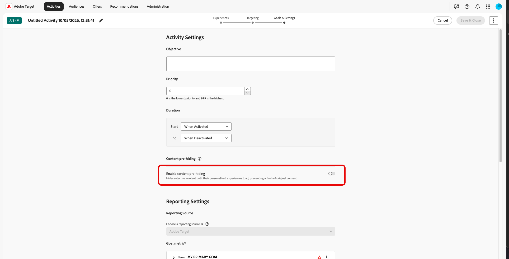

# 個人化體驗的內容預先隱藏

>[!AVAILABILITY]
>
>個人化內容的內容預先隱藏可作為&#x200B;**beta**&#x200B;功能使用。

當訪客載入頁面時，預設內容可能會短暫出現，然後由[!DNL Adobe Target]中的個人化內容取代。 這個可見的切換常稱為&#x200B;**忽隱忽現**，這是個人化方案的常見體驗問題。

透過內容預先隱藏，您可以僅隱藏頁面載入期間活動個人化之頁面的部分，藉此管理忽隱忽現的情形，讓客戶看到較少忽隱忽現的情形，以及較少的空白熒幕時間。

以下說明內容預先隱藏的運作方式，可透過帳戶預設，透過您的頁面實作和每個活動的選擇。

1. 啟用帳戶的內容預先隱藏，以設定全域預設值。 預設為關閉。 [了解更多](#content-pre-hiding-enable-account)

1. 將內容預先隱藏程式庫新增至您執行個人化活動之所有頁面的`<head>`。

1. [!DNL Target]會從已上線的[!UICONTROL Visual Experience Composer]和[!UICONTROL Enhanced Experience Composer]活動建置規則集。 規則集會列出傳送可能會變更的選擇器和區域。

   請注意，不支援[!UICONTROL Form-Based Composer]活動。

1. 程式庫會從Adobe CDN擷取該規則集，並僅在個人化內容仍在載入時預先隱藏相符元素。

1. 在&#x200B;**[!UICONTROL Goals & Settings]**&#x200B;中，您可以針對個別活動停用&#x200B;**[!UICONTROL Content pre-hiding]**，但前提是在帳戶層級啟用。 [了解更多](#content-pre-hiding-activity)

## 為您的執行個體啟用內容預先隱藏 {#content-pre-hiding-enable-account}

>[!IMPORTANT]
>
>若要啟用執行個體的內容預先隱藏，您必須是&#x200B;**管理員**。

在您啟用之前，執行個體的內容預先隱藏功能會關閉。 使用&#x200B;**[!UICONTROL Administration]** > **[!UICONTROL Implementation]**&#x200B;開啟功能、設定預設值，並存取實作團隊的下載專案。

1. 在[!DNL Target]中，按一下&#x200B;**[!UICONTROL Administration]** > **[!UICONTROL Implementation]**。

1. 從&#x200B;**[!UICONTROL Content pre-hiding]**&#x200B;功能表，啟用內容預先隱藏選項。

   

1. 如有需要，可在秒內更新&#x200B;**[!UICONTROL Pre-hiding timeout]**。

1. 按一下 **[!UICONTROL Save]**。 這會將忽隱忽現的管理設定套用至您的執行個體。

1. 啟用後，按一下&#x200B;**[!UICONTROL Download]**，然後將檔案新增至頁面`<head>`，使其在[!DNL at.js]或[!DNL Web SDK]之前載入。 如需完整的實作指示，請參閱[預先隱藏SDK的內容](https://experienceleague.adobe.com/en/docs/target-dev/developer/client-side/prehide-sdk)。

   

您的執行個體現在會使用儲存的內容預先隱藏和逾時設定，作為選擇加入之活動的預設值。

## 啟用活動的內容預先隱藏 {#content-pre-hiding-activity}

為您的執行個體啟用預先隱藏後，請選擇每個活動是否在&#x200B;**[!UICONTROL Goals & Settings]**&#x200B;中使用它。 您啟用預先隱藏的活動會在其上線時包含在目標行為中。

然後[!DNL Target]會從在[!UICONTROL Visual Experience Composer] (VEC)和[!UICONTROL Form-Based Composer]中編寫的已上線活動中建置輕量型規則集，說明傳送可以變更的選擇器和區域。

當您建立或編輯活動時：

1. 存取您要啟用預先隱藏選項的活動。

1. 存取&#x200B;**[!UICONTROL Edit activity]**&#x200B;下拉式清單並選取&#x200B;**[!UICONTROL Edit Goals & Settings]**。

   

1. 從&#x200B;**[!UICONTROL Content pre-hiding]**&#x200B;功能表，開啟&#x200B;**[!UICONTROL Enable content pre-hiding]**&#x200B;選項以選擇加入或退出預先隱藏。

   

1. 完成後，按一下&#x200B;**[!UICONTROL Save & Close]**。

在您儲存並活動上線或停用後，規則集會更新，以便預先隱藏與實際傳送的內容保持一致，而無須針對每次啟動編輯您的頁面程式碼。

在訪客端，程式庫會在每次頁面載入時從Adobe CDN擷取該規則集，並僅在需要時預先隱藏相符元素，直到個人化內容準備就緒為止。
