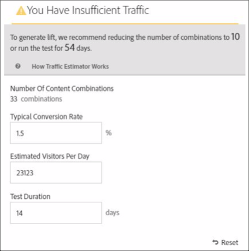

# 建立多變數測試

[!DNL Adobe Target]中的[!UICONTROL Visual Experience Composer] (VEC)可讓您輕鬆建立[!UICONTROL Multivariate Test]，以及在[!DNL Target]內修改頁面的部分。

[!DNL Target]點選編輯器可讓您挑選任何位置並新增多個選件。

[!UICONTROL Multivariate Test] (MVT)需要頁面優先的報表。 換句話說，測試會在具有您為頁面所設計體驗的特定 URL 上執行。

1. 按一下&#x200B;**[!UICONTROL Create Activity]** > **[!UICONTROL Multivariate Test]**。

   

   >[!NOTE]
   >
   >如需有關 [!DNL Target] 提供的各種活動類型及其差異的詳細資訊，請參閱[活動](/help/main/c-activities/activities.md#concept_D317A95A1AB54674BA7AB65C7985BA03)。請參閱[Target 活動類型](/help/main/c-activities/target-activities-guide.md)，協助您決定哪種活動類型最適合您的需求。

1. （視條件而定）選擇傳遞型別： [!UICONTROL Web]、[!UICONTROL Mobile]、[!UICONTROL Email]或[!UICONTROL Other/API]。

1. （視條件而定）如果您是[Target Premium](/help/main/c-intro/intro.md#premium)客戶，[請選擇工作區](/help/main/administrating-target/c-user-management/property-channel/property-channel.md)。

1. [為您要測試的頁面指定URL](/help/main/c-activities/c-multivariate-testing/t-create-multivariate-test/url.md#concept_C12E4A85FF3B4E518E3110F6CF1AF9C0)，然後按一下&#x200B;**[!UICONTROL Next]**。

   >[!NOTE]
   >
   >請使用完整的URL，開頭要包括HTTP或HTTPS。

   如果出現訊息，要求您啟用您的瀏覽器使用混合的內容，請遵循訊息中的說明。為您的瀏覽器啟用混合的內容之後，請從步驟 1 重新開始。

   [!UICONTROL Visual Experience Composer]隨即開啟。

1. 輸入活動的名稱。

   

   活動名稱的開頭不能是下列任一字元：

   | 字元 | 說明 |
   |--- |--- |
   | `=` | 等號 |
   | `+` | 加號 |
   | `-` | 減號 |
   | `@` | 「@」符號 |

   活動名稱不能包含下列任一字元順序：

   | 字元順序 | 說明 |
   |--- |--- |
   | ；= | 分號，等於 |
   | ；+ | 分號，加號 |
   | ；- | 分號，減號 |
   | ；@ | 分號， At sign |
   | ，= | 逗號，等於 |
   | ，+ | 逗號，加號 |
   | ，- | 逗號，減號 |
   | ，@ | 逗號， At sign |
   | `[`&quot; | 左方括弧，雙引號 |
   | &quot;`]` | 雙引號，右方括弧 |

1. [在每個位置中建立選件](/help/main/c-activities/c-multivariate-testing/t-create-multivariate-test/add-offers.md#concept_DCE6B45C30F7419B8EC17AFDEE8D8AA6)。

   

   您可以新增下列類型的選件:

   * HTML
   * 影像
   * 文字

1. 按一下&#x200B;**[!UICONTROL Preview]**&#x200B;以[預覽您的體驗](/help/main/c-activities/c-multivariate-testing/t-create-multivariate-test/preview-experiences.md)。

   

   您可以檢視每個體驗，以及排除不想在您的測試中包括的任何體驗。若要排除一或多個體驗，請選取所需的核取方塊，然後按一下「**[!UICONTROL Exclude]**」 。

   

1. [使用流量估算程式](/help/main/c-activities/c-multivariate-testing/t-create-multivariate-test/traffic-estimator.md#task_71AA6922AFD447EA8C5E610A78ABA714)來測試您的測試計劃的可行性。

   

   下圖顯示活動有充足的流量。

   

   下圖顯示活動有充足的流量。

   

1. 按一下「**[!UICONTROL Next]**」以進入[!UICONTROL Targeting]頁面。

1. 選擇對象和符合您要讓其進入活動之訪客的百分比。

   

   例如，您可將項目限制為所有訪客的 50%，或「加州人」觀眾的 45%。

   >[!NOTE]
   >
   >除了選取現有對象，您可以結合多個對象來建立隨選結合的對象而非建立新對象。如需詳細資訊，請參閱[合併多個對象](/help/main/c-target/combining-multiple-audiences.md#concept_A7386F1EA4394BD2AB72399C225981E5)。

1. [檢閱測試摘要](/help/main/c-activities/c-multivariate-testing/t-create-multivariate-test/test-summary.md#reference_971AB225963A4DC18EEB5B0E20F0A4A7)並進行任何需要的變更，然後按一下&#x200B;**[!UICONTROL Next]**。

1. [指定測試的目標與設定](/help/main/c-activities/c-multivariate-testing/t-create-multivariate-test/goals-and-settings.md#reference_B25389FD6F3A4989801E740364B089CC)。

1. 按一下&#x200B;**[!UICONTROL Save and Close]**&#x200B;以建立活動。

## 訓練影片：建立多變數測試(9:25) 

此影片示範如何使用[!DNL Target]三步驟引導式工作流程來規劃和建立多變數測試。

* 定義和設計多變數測試
* 建立多變數測試

>[!VIDEO](https://video.tv.adobe.com/v/17395)
