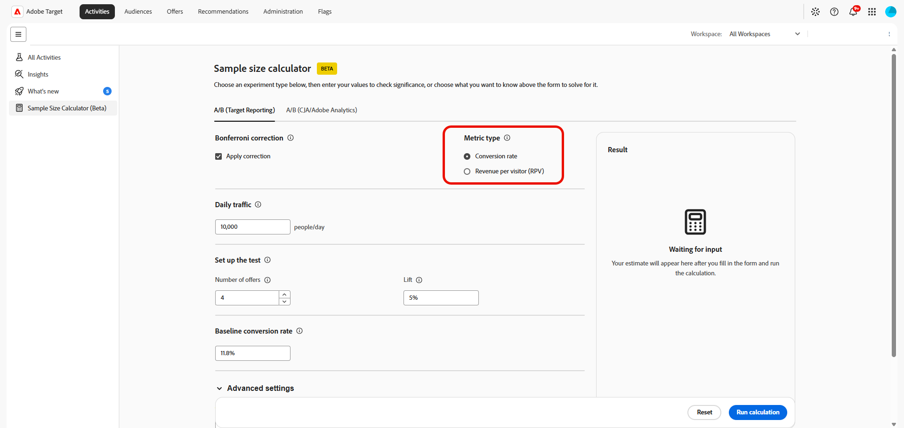

# 樣本數計算器

>[!CONTEXTUALHELP]
>id="target_sample_size_ab_daily_traffic"
>title="每日流量"
>abstract="每天有多少使用者進入實驗。 如果您不知道這個值，請選擇上方的「流量」，電腦會使用其他輸入來解決這個問題。"

>[!CONTEXTUALHELP]
>id="target_sample_size_confidence_level"
>title="信賴水準"
>abstract="在呼叫重要結果之前，您需確定結果並非隨機偶然所造成。 95% 信賴水準表示最多有 5% 的機率是誤判。 較高的值可減少誤判，但同時也需要更多資料。"

>[!CONTEXTUALHELP]
>id="target_sample_size_statistical_power"
>title="統計檢定力"
>abstract="偵測實際效果（如果存在）的機率。 80%的電源等級表示有80%的機會偵測到真正的效果。 較高的功率可減少誤判，但需要較多的流量或較長的執行時間。"

>[!CONTEXTUALHELP]
>id="target_sample_size_setup_cja"
>title="設定測試"
>abstract="這些欄位定義實驗、預期結果和結果的信賴臨界值。 繫結至您上述選取值的欄位會自動解決；其餘欄位會以您的預期值填入。"

>[!AVAILABILITY]
>
>使用此樣本大小電腦(Beta)，即表示您確認Beta是按「原樣」提供，並無任何保證。 Adobe沒有義務維護、更正、更新、變更、修改或以其他方式支援Beta。 建議您謹慎使用，切勿依賴這類Beta及/或隨附資料的正確運作或效能。 Beta視為Adobe的機密資訊。  任何「意見回饋」（有關Beta的資訊，包括但不限於您在使用Beta時遇到的問題或缺陷、建議、改進和建議）會在此指派給Adobe，包括所有權利、標題，以及對此等意見回饋的興趣。

**[!UICONTROL 樣本大小電腦]**&#x200B;可讓您在啟動實驗之前，估計規劃實驗所需的輸入值。 此計算器可協助您判斷需要多少流量、測試應執行多久、要包含多少體驗，或根據您提供的值能可靠偵測到哪些最小影響。

若要存取&#x200B;**[!UICONTROL 樣本大小電腦]**，請前往&#x200B;**[!UICONTROL 活動]**&#x200B;功能表。

## A/B （目標報告）

>[!CONTEXTUALHELP]
>id="target_sample_size_bonferroni"
>title="Bonferroni校正"
>abstract="調整信賴等級，以考慮同時比較多個選件與控制項。 只有在選件數量大於兩個時，這才重要。 它符合Adobe的公用Target計算器工具中使用的相同校正。"

>[!CONTEXTUALHELP]
>id="target_sample_size_metric_type"
>title="量度類型"
>abstract="您在衡量的量度類型。 使用「百分比」計算每個使用者有或未完成動作的二進位結果，例如點按或轉換。 「數字」可用於營收或頁面檢視等量度，這些量度的值可能會因使用者而有很大的差異。"

>[!CONTEXTUALHELP]
>id="target_sample_size_number_offers"
>title="實體數"
>abstract="實驗中的體驗數量，包括控制。 兩個以上的選件會自動套用Bonferroni校正（啟用時），以保持所有比較中的整體信賴水準準確。"

>[!CONTEXTUALHELP]
>id="target_sample_size_lift"
>title="提升度"
>abstract="相對於您要偵測之基準線的改善。 以基準的百分比輸入。 例如，11.8%基準轉換率目標為12.39%時提升5%。"

>[!CONTEXTUALHELP]
>id="target_sample_size_baseline_conversion_rate"
>title="基準轉換率"
>abstract="實驗開始前您目前的轉換率，這是控制臂平均值。 此值一律為必填。 在百分比量度中，輸入5%的百分比，例如5。 對於計數量度，請輸入原始小數值。"

預估計畫和執行A/B測試所需的輸入。 這些值可協助您決定需要多少流量、測試應執行多久，以及您實際可偵測的效果大小。

1. 存取&#x200B;**[!UICONTROL A/B （目標報告）]**&#x200B;索引標籤，以計算A/B測試的計畫輸入。

1. 啟用&#x200B;**[!UICONTROL 套用校正]**&#x200B;選項來調整您的信賴等級，以便考慮同時比較多個選件與控制項。

1. 選擇您的&#x200B;**[!UICONTROL 量度型別]**：

   * 轉換率：將此用於點按或購買等二進位結果，其中每位訪客都會完成或未完成動作。
   * 每位訪客帶來的收入：將此用於收入式量度，其中的值可能會因訪客而異。

     

1. 指定&#x200B;**[!UICONTROL 每日流量]**，即每天進入實驗的使用者人數。

1. 在&#x200B;**[!UICONTROL 設定測試]**&#x200B;下，輸入其餘的值：

   * **[!UICONTROL 選件數目]**：您的實驗中的體驗數目，包括控制項。 有兩個以上的選件會在啟用時套用Bonferroni校正，以維持整體信賴水準。

   * **[!UICONTROL 提升度]**：相對於您要偵測之基準線的相對改善。 以基準的百分比輸入，例如，11.8%基準轉換率目標12.39%的提升度為5%。

     

1. 在實驗開始之前，指定您目前體驗的&#x200B;**[!UICONTROL 基準轉換率]**。

1. 您可以展開&#x200B;**[!UICONTROL 進階統計設定]**，在選取的計算可以使用時提供額外的統計輸入。

   * **[!UICONTROL 信賴水準]**：結果不是偶然性的可能性。 95%的層級允許5%的誤判機會。

   * **[!UICONTROL 統計檢定力]**：偵測實際效果的可能性。 80%的電源可減少誤報，但需要更多流量或時間。

1. 選取&#x200B;**[!UICONTROL 執行計算]**&#x200B;以產生預估值。 選取&#x200B;**[!UICONTROL 重設]**&#x200B;以清除目前的輸入並重新啟動。

在您完成必要欄位並執行計算之後，**[!UICONTROL 結果]**&#x200B;面板會顯示預估值。 如果必填欄位不完整，面板會提示您輸入缺少的值。

計算器提供規劃實驗時的預估值。 在決定執行活動的時長時，將結果連同您的實驗設計、預期流量、基準效能和統計需求一起使用。

## A/B (CJA/Adobe Analytics)

>[!CONTEXTUALHELP]
>id="target_sample_size_number_experiences"
>title="體驗數量"
>abstract="實驗中變體的數量，包括控制組。 A/B 測試包含 2 個組。 五個變體加上一個控制組，共 6 組。 組數越多，維持統計檢定力所需的流量就越大。"

>[!CONTEXTUALHELP]
>id="target_sample_size_duration"
>title="A/B 測試持續時間"
>abstract="您的實驗將執行多少天。 較長的持續時間可使實驗有更多的時間來收集資料，讓您能可靠地檢測較小的效應。 較短的持續時間需要較大的效應或較多的每日流量，才能獲得可靠的結果。"

>[!CONTEXTUALHELP]
>id="target_sample_size_expected_improvement"
>title="預期的改進"
>abstract="值得檢測的最小改進，即您會採取行動的量度的最小變化量。 這是提升度的大小 (以百分點為單位)，而非相對於基準線的百分比變化。 例如，如果您的基準線是 5%，而提升 1 個百分點很重要，請輸入 1。"

>[!CONTEXTUALHELP]
>id="target_sample_size_variance"
>title="變異數"
>abstract="量度值的分佈方式，而非平均值。 點按率（通常是0和1）等量度通常具有低變異數，而如每使用者收入等量度則可能有高得多的變異數。 如果您不確定，請將預設值保留為1。"

預估依賴Adobe Analytics或Customer Journey Analytics資料之A/B活動的規劃輸入。 它可協助您在啟動活動之前定義實驗大小、預期提升度和測試持續時間。

1. 存取&#x200B;**[!UICONTROL A/B (CJA/Adobe Analytics)]**&#x200B;索引標籤以計算A/B測試的Planning輸入。

1. 在&#x200B;**[!UICONTROL 您要知道什麼？]**&#x200B;下，選取您要計算器判斷的值：

   * **[!UICONTROL 持續時間]**：您有一項實驗想法，並且想知道需要執行多久以及是否值得執行。
   * **[!UICONTROL 體驗數目]**：您有個位置可執行實驗，並想要瞭解您的流量可支援多少個處理。
   * **[!UICONTROL 流量量]**：您有一項實驗想知道，有多少位訪客需要達到統計顯著性。
   * **[!UICONTROL 最低可偵測效果]**：您想要執行一個實驗，但想知道您需要提升多少才能達到統計顯著性。 這有助於您評估實驗是否值得執行或計畫。

   表單中的欄位會依您選取的值而變更。 計算器使用其他輸入來決定選取的結果。

   

1. 指定&#x200B;**[!UICONTROL 每日流量]**，即每天進入實驗的使用者人數。

1. 在&#x200B;**[!UICONTROL 設定測試]**&#x200B;下，輸入其餘的值：

   * **[!UICONTROL 體驗數目]**：包含控制項的變數數目。 更多變體需要更多流量。

   * **[!UICONTROL A/B測試的持續時間]**：實驗執行的天數。 較長的測試可偵測到較小的影響。

   * **[!UICONTROL 預期的改善]**：您預期實驗產生的改善。

   * **[!UICONTROL 變數]**：量度值的分佈方式。 點進率通常具有低變異數，每位使用者的收入可能會高很多。 如果您不確定，請將預設值保留為1。

     在[Analytics檔案](https://experienceleague.adobe.com/zh-hant/docs/analytics/components/calculated-metrics/calcmetrics-reference/cm-functions#variance)中瞭解如何計算&#x200B;**[!UICONTROL 變數]**

     

1. 您可以展開&#x200B;**[!UICONTROL 進階統計設定]**，在選取的計算可以使用時提供額外的統計輸入。

   * **[!UICONTROL 信賴水準]**：結果不是偶然性的可能性。 95%的層級允許5%的誤判機會。 較低的信賴水準表示所需流量較少，但也會增加誤判的風險。

   * **[!UICONTROL 統計檢定力]**：偵測實際效果的可能性。 80%的電源可減少誤報，但需要更多流量或時間。

1. 選取&#x200B;**[!UICONTROL 執行計算]**&#x200B;以產生預估值。 選取&#x200B;**[!UICONTROL 重設]**&#x200B;以清除目前的輸入並重新啟動。

在您完成必要欄位並執行計算之後，**[!UICONTROL 結果]**&#x200B;面板會顯示預估值。 如果必填欄位不完整，面板會提示您輸入缺少的值。

計算器提供規劃實驗時的預估值。 在決定執行活動的時長時，將結果連同您的實驗設計、預期流量、基準效能和統計需求一起使用。
