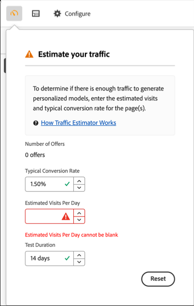
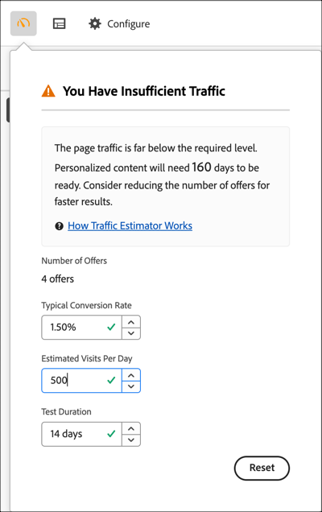
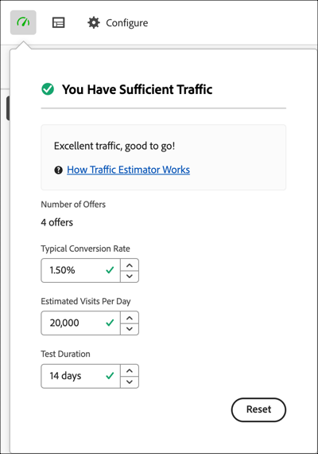

# 預估成功所需的流量

[!DNL Adobe Target] [!UICONTROL Traffic Estimator]提供的意見回饋可讓您知道您是否擁有足夠的流量讓[!UICONTROL Automated Personalization] (AP)活動能夠成功。

由於[!UICONTROL Automated Personalization]活動使用多個選件組合，因此瞭解需要多少流量才能提供有意義的結果非常重要。 [!UICONTROL Traffic Estimator]會使用您頁面的相關統計資料，以及正在測試的體驗數目，來預估讓活動成功所需的流量和測試持續時間。

[!UICONTROL Traffic Estimator]會比較預估的頁面曝光次數和頁面的一般轉換率，以判斷是否有足夠的流量產生個人化模型。 理想上，對於成功的活動，正確的樣本大小可確保個人化內容會在活動持續期間的 50% 或 14 天內就緒 (以較少者為準)。此程式可讓您有充足的時間取得個人化內容，並瞭解要傳送哪些內容。

請記住，[!DNL Target]會隨機提供體驗，直到建立個人化演演算法為止。 每個優惠方案旁的勾號圖示會顯示該優惠方案的模型何時準備就緒，[!DNL Target]何時可以開始提供個人化內容。 由於提升度僅在模型準備就緒後才可預期，因此視覺指示可讓您設定正確的預期。 在[!UICONTROL Visual Experience Composer] (VEC)中使用[!UICONTROL Traffic Estimator]取得模型準備就緒時的指引。

## 使用流量估算程式

1. 從[!UICONTROL Automated Personalization]活動中[!UICONTROL Visual Experience Composer]的[!UICONTROL Experiences]頁面，按一下[!UICONTROL Experiences]頁面左上角的&#x200B;**[!UICONTROL Traffic]**&#x200B;圖示（  ）。

   [!UICONTROL Traffic Estimator]隨即開啟。

   

   您可以再按一下圖示來隱藏[!UICONTROL Traffic Estimator]。

1. 指定一般轉換率（或您從此活動預期的轉換率）、預估每日活動曝光次數和測試持續時間。

   | 量度 | 說明 |
   | --- | --- |
   | **[!UICONTROL Number of Offers]** | 此量度會在任何排除後，根據要隨活動建立的體驗數量自動計算。 |
   | **[!UICONTROL Typical Conversion Rate]** | 此量度會根據您的估計或來自您分析系統的過去資料而以百分比表示。 |
   | **[!UICONTROL Estimated Visits Per Day]** | 此量度是根據鎖定目標條件，從能夠檢視活動的訪客得到的每日造訪次數。 此量度可以根據您的分析資料。 此數字必須是造訪次數，而非不重複訪客。 |
   | **[!UICONTROL Test Duration]** | 您要活動執行的天數。 |

   [!UICONTROL Traffic Estimator]會使用這些量度來決定執行成功測試所需的調整。

   在[!UICONTROL Traffic Estimator]頂端附近，會計算您輸入的值並顯示結果。

   

   當您變更數量時，預估即會變更。例如，如果您正在測試許多組合，而您的轉換率和曝光率太低，[!UICONTROL Traffic Estimator]會顯示測試必須執行多久才能成功。 或者，如果您的流量低，[!UICONTROL Traffic Estimator]可能會建議較少數目的選件組合，讓您執行所需天數的測試。

   如果您沒有足夠的流量，請考慮下列事項：

   * 請考慮使用[[!UICONTROL Auto-Target]](/help/main/c-activities/auto-target/auto-target-to-optimize.md)活動而非[!UICONTROL Automated Personalization]來建立體驗，並在一個體驗變數中變更數個選件。
   * 減少[!UICONTROL Automated Personalization]活動中的優惠方案組合數量。
   * 增加活動的持續時間。

   調整數字，直到[!UICONTROL Traffic Estimator]指出您有足夠的流量，然後相應地設計測試。

   

   如果流量足夠，[!UICONTROL Traffic]圖示會顯示綠色勾號。 如果流量不足，圖示會顯示紅色的警告標籤。

## 關於流量估算的常見問題

使用[!UICONTROL Traffic Estimator]時請考量下列常見問題：

### 為什麼即使我的AP活動有足夠的流量，仍沒有建立個人化模型？

在特定情況下，您的流量夠大，可以建立個人化模型，但流量可能會通知[!DNL Target]個人化模型與隨機之間沒有有意義的差異。 雖然模型是在[!DNL Target]中建立並測試，但並未部署，因為此模型並不比隨機模型好。

模型沒有優於隨機選件的可能原因可能是選件彼此之間的差異不足。 如果是這樣的話，您可以嘗試在訊息相似時讓選件在視覺上更不同，或者也可以嘗試變更訊息本身。
