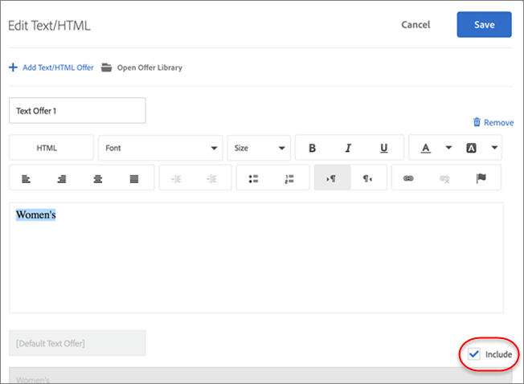

# 管理排除項目

在[!UICONTROL Automated Personalization]的[!DNL Adobe Target] (AP)活動中排除重複選件、排除特定體驗，以及排除預設內容，藉此管理排除專案。

## 允許或不允許重複選件 {#concept_4EF78013F80E48EFA024AE0274C9F037}

在[!UICONTROL Automated Personalization]活動中的不同位置使用選件資料庫中的選件時，防止重複這些選件。

例如，您可能在有 12 個產品建議的六個位置頁面上有一個活動。相同產品建議有可能放入活動中的一或多個位置。此功能可讓您防止重複選件同時顯示在相同活動內的不同位置。

1. 在[建立或編輯AP活動](/help/main/c-activities/t-automated-personalization/create-ap-activity.md)時，根據您的需求，按一下&#x200B;**[!UICONTROL Configure]**&#x200B;圖示（  ） >按一下&#x200B;**[!UICONTROL Allow Duplicate Offers]**&#x200B;以開啟或關閉此功能。

## 排除特定體驗 {#task_C17D36EF58AF4908B17A3D84CA6DE85A}

如果您想要從[!UICONTROL Automated Personalization]活動中排除某些選件組合，請排除特定體驗。

可能有某些組合無法搭配使用，或您可能正在限制測試的體驗數量，以降低活動的流量需求。

1. 在[建立或編輯AP活動](/help/main/c-activities/t-automated-personalization/create-ap-activity.md)時，按一下&#x200B;**管理內容**&#x200B;圖示（）。

   [!UICONTROL Experiences]清單顯示從所有內容和位置選項的排列中產生的每一個體驗。

1. 視需要排除體驗。

   您可以按一下&#x200B;[!UICONTROL **更多動作**]&#x200B;圖示（ ），然後按一下&#x200B;[!UICONTROL **排除**]，以排除特定體驗。

   或者，您可以選取相關體驗的核取方塊，然後按一下「**[!UICONTROL Exclude]**」，以分批排除體驗。 勾選一或多個體驗時，[!UICONTROL Exclude]圖示就會顯示。

   

   體驗現已從活動中排除，其[!UICONTROL Status]顯示為[!UICONTROL Excluded]。

## 排除預設內容 {#task_DCB4528989DF4C05A3A4729E5891D18F}

有時候，您可能不想將預設內容加入您的[!UICONTROL Automated Personalization]活動。 您可以使用此方法以在一個位置中只有一個產品建議 (與您的預設內容不同) 作為 AP 活動的一部分。

排除預設內容可有效地變更頁面其餘部分的外觀與操作方式，以適合您在 AP 活動中所測試的產品建議。例如，假設您想要符合所測試之產品建議的色板，則可以變更頁面的背景顏色，並排除預設背景顏色。

**若要使用[!UICONTROL Visual Experience Composer] (VEC)排除預設內容：**

1. 在[建立或編輯AP活動](/help/main/c-activities/t-automated-personalization/create-ap-activity.md)時，請選取您要取代的內容，然後按一下以存取&#x200B;**[!UICONTROL Change Text/HTML]**、**[!UICONTROL Change Image Offer]**&#x200B;或&#x200B;**[!UICONTROL Change Background Color]**。 可用的選項會因內容型別而異。

   

1. 建立新內容，並取消勾選預設內容右邊的&#x200B;**包含** （或在[!UICONTROL Select Content]畫面中取消勾選「預設影像/影片」）。

   <!-- Depending on the content or offer type, the [!UICONTROL Include] checkbox is in a slightly different place. 

   For Text/HTML content: 

   

   For Image/Video content: 

   

   For background color: 

   -->

<!-- 1. Click **[!UICONTROL Save]**.

   You can see the experiences created from the offers you specified under [!UICONTROL Manage Content]. You notice that no experiences are created in [!UICONTROL Manage Content] using the default offer you excluded. 

   

**To exclude default content using the [!UICONTROL Form-Based Experience Composer]:** 

1. While creating or editing an AP activity, click **[!UICONTROL Change Text/HTML]** or **[!UICONTROL Change Image Offer]** under **[!UICONTROL Content]**. 
1. In the dialog box, create your new content and uncheck **[!UICONTROL Include]** to the right of the default content (or uncheck the Default Image/Video in the [!UICONTROL Select Content] screen). 

   Depending on the content or offer type, the [!UICONTROL Include] checkbox is in a slightly different place. 

   For Text/HTML content: 

   

   For Image/Video content: 

   

1. Click **[!UICONTROL Save]**. 

   You can see the experiences created from the offers you specified under [!UICONTROL Manage Content]. You notice that no experiences are created in [!UICONTROL Manage Content] using the default offer you excluded. 

   -->
