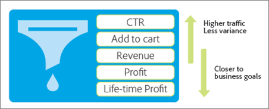

# 十個常見的 A/B 測試陷阱和避免方法

[!DNL Adobe Target] 中的 A/B 測試會形成大多數數位行銷最佳化計劃的骨幹，協助行銷人員為其訪客和客戶提供最佳化和針對性的體驗。 本文概述許多公司在執行A/B測試時深受其害的十大陷阱。 其中也包括避免這些陷阱的方法，好讓貴公司可透過測試成果獲得更高的 ROI，並在報告的 A/B 測試結果中擁有更高的可信度。

## 陷阱 1：忽略顯著水準的影響 {#section_55F5577A13C6470BA1417C2B735C6B1D}

測試報告兩個選件之間的轉換率有顯著差異，但事實上沒有，這種可能性多大? 這就是測試的&#x200B;*顯著水準*&#x200B;有助判別之處。這類誤導性的發現通常稱為誤判，而在統計領域中，這類發現又稱為I型錯誤（如果您不正確地拒絕真正的Null假設）。

當您指定 A/B 測試的顯著水準時，就是在容忍接受一項體驗優於另一項體驗但其實不是 (第一型錯誤或「偽陽性」)，還是要無視於驗證之間的統計差異但事實上真的有差異 (第二型錯誤或「偽陰性」)，在這兩者之間做取捨。*信賴水準*&#x200B;是在測試執行之前決定。

此 *信賴區間*，會在測試完成後決定，並受三個關鍵因素影響：

* 測試的樣本大小
* 顯著水準
* 母體標準差

因為行銷人員已於測試之前選取顯著水準，且無法影響母體標準差，唯一「可控制的」因素只有樣本大小。讓您覺得舒適的信賴區間所需的樣本大小，以及達到此樣本大小所花的時間，是行銷人員在測試設計期間所必須決定的關鍵決策。

另一個直接相關的術語是&#x200B;*信賴水準*，採取較為樂觀的作法。可信度等級非但不說明您收到誤判的可能性（重要性等級即是如此），反而是代表測試並未犯下該錯誤的可能性。

信賴水準和顯著水準直接相關，因為：

% - 信賴水準 = 顯著水準

在 A/B 測試中，市場行銷人員通常採用 95% 信賴準則。根據上述方程式，這相當於顯著水準 5%。以 95% 信賴水準來測試，就表示即使選件之間實際上沒有差異，您仍有 5% 的機會發現統計顯著的提升度。

下圖說明，您執行的測試越多，這些測試中至少有一個導致誤判的機率就越高。 例如，如果您使用95%信賴水準執行10次測試，偵測一或多個誤判的機會約為40% (假設沒有真正的提升度： Pr （至少一個誤判） = 1 - Pr （沒有誤判） = 1 - 0.95^10 = 40%)。

在行銷組織中，95%通常構成誤報與誤報風險的合理平衡。

不過，有兩種情況值得密切注意顯著水準及其對測試結果的含意: 測試後分割與測試多個選件。

* **測試後分割：**&#x200B;市場行銷人員在 A/B 測試結束後，通常會根據訪客區段來切割測試結果。常用區段包括瀏覽器類型、裝置類型、地理區、一天中的時間，以及新訪客還是再度訪問的訪客。這項作法稱為測試後分割，可以更深入洞察訪客區段。反過來，行銷人員也可以利用這些見解來建立更鎖定目標、更相關且更與眾不同的內容。

  如果轉換率真的沒有差異，則每次測試區段時，誤判的機率就等於顯著水準。此外，如前所述，您執行的測試越多，在這些測試中至少出現一個誤判的可能性就越大。 本質上，每一個測試後區段就代表一次獨立測試。顯著水準為5%時，您每次檢視20個測試後區段時，平均會遭受1個誤判。 上圖顯示此可能性增加的情形。

  您執行的測試越多，在這些測試中至少出現一個誤判的可能性就越大。 本質上，每一個測試後區段就代表一次獨立測試，這也增加誤判的可能性。如果區段相互關聯，這種增加的情形甚至更明顯。

  您不應該進行測試後分段嗎？ 否，測試後區段有其價值。相反地，為了避免由於測試後分割而累積的這種誤判問題，在識別測試後區段之後，請考慮在新的測試中測試此區段。或者，您可以套用 Bonferroni 校正，如下所討論。

* **測試多個選件:**&#x200B;市場行銷人員經常將兩個以上的選件 (或體驗) 相互測試。這就是為何有時會看到 A/B 測試解決方案稱為 A//B/n 測試的原因，其中，n 是您同時測試的選件數量。

  務必注意，所測試的&#x200B;*每一個*&#x200B;選件的誤判率等於顯著水準，如上所述。同樣地，在單一測試環境中有多個選件相互競爭時，實際上就是在執行多個測試。例如，假設您在 A//B/C//D/E 測試中比較五個選件，實際上會形成四次比較: 控制項至 B、控制項至 C、控制項至 D、控制項至 E。在 95% 的信賴水準下，判誤機率不是 5%，實際上是 18.5%。

  為了將整體信賴水準保持在 95%，並避免此問題，您需要採用所謂的 Bonferroni 校正。使用此校正，您只需將顯著水準除以比較次數，得出您必須達到95%信賴水準的顯著水準。

  如果對上述範例採用 Bonferroni 校正，則您會使用 5%/4 = 1.25% 顯著水準，這等同於個別測試的 97.75% 信賴水準 (100% - 1.25% = 98.75%)。如同在上述範例中，當您有四個測試時，此調整會將有效信賴水準維持在 95%。

## 陷阱 2：從統計上沒有顯著差異的多次選件測試中宣佈獲勝者 {#section_FA83977C71DB4F69B3D438AF850EF3B6}

在多次選件測試中，市場行銷人員通常會將提升度最高的選件宣佈為測試獲勝者，即使獲勝者和第二名之間沒有統計顯著的差異也一樣。當替代項之間的差異小於替代項與控制項之間的差異，就會發生此狀況。下圖說明此概念，黑色誤差線代表 95% 提升度信賴區間。每一個選項相對於控制選件的真正提升度為 95%，很可能納入信賴區間內 (誤差線所示的範圍)。

選件A和B在測試期間有最高的觀察提升度，並且在未來的測試中，選件C不太可能超過這些選件，因為C的信賴區間不會與A或B的信賴區間重疊。不過，即使選件A在測試期間具有觀察到的提升度最高，由於信賴區間重疊，選件B在未來的測試中可能表現更好。

在此，結論為選件 A 和 B 都應該視為測試的獲勝者。

測試通常不可能執行得夠久來找出替代項的真正相對效能，且替代項之間的效能差異往往太小，而難以大幅影響轉換率。在此情況下，您可以將結果解讀為不分勝負，並採用其他考量，例如與頁面的其他元素一起規劃或結合，以決定應該實作的選件。您必須透過多項測試，向多個成功者開放，這有時相當可能開啟網站開發方向的可能性。

如果您確實想要識別具有最高轉換率的選件，您可比較所有選件與其他所有選件。 在上述範例中，您有 n = 5 個選件—您必須進行 n(n-1)/2 次比較，或 5&#42;(5-1)/2 = 10 次比較。 在此情況下，Bonferroni 校正要求測試的顯著水準為 5%/10 = 0.5%，這對應於信賴水準 99.5%。然而，如此高的信賴等級可能會要求您執行測試一段不合理的長時間。

## 陷阱 3：忽略統計檢定力的影響 {#section_0D517079B7D547CCAA75F80981CBE12A}

統計檢定力是測試偵測到不同選件之間轉換率實際差異的機率。 由於轉換事件的隨機性（或統計學家喜歡將其稱為「隨機」），測試可能不會顯示統計上的顯著差異，即使最後兩個選件的轉換率之間有實際差異。 這就叫做運氣不好或機遇。未能偵測到轉換率的真正差異就稱為偽陰性 (或第二型誤差)。

有兩個關鍵因素可決定測試的檢定力。第一個是樣本大小，也就是測試包含的訪客數目。第二個是您希望測試偵測的轉換率差異大小。 這也許直覺性很強，但如果您只想偵測大的轉換率差異，測試偵測如此大的差異的機率會更高。 沿著這幾條線，您要偵測的差異越小，您需要的樣本就越大，因而取得這麼大的樣本大小所花的時間也越長。

現在的市場行銷人員在極多的測試中都動力不足。換言之，他們使用的樣本大小太小。這表示即使轉換率實際上存在實質差異，他們偵測到真肯定也是機會渺茫。事實上，如果您連續執行動力不足的測試，誤判次數可能比得上 (甚至壓過) 真肯定次數。這通常會導致對網站實作中性變更 (浪費時間)，或實際上會減少轉換率的變更。

為了避免測試動力不足，請注意動力充足測試的一般標準包括 95% 的信賴水準和 80% 的統計檢定力。這類測試提供95%的避免誤判機率，以及80%的避免誤判機率。

## 陷阱 4：使用單尾檢定 {#section_8BB136D1DD6341FA9772F4C31E9AA37C}

在特定顯著水準下，單尾檢定只需要選件之間的轉換率有較小的觀察差異，就可判定獲勝者。這種型別的測試似乎很受歡迎，因為與使用雙尾測試時相比，獲勝者可以更早且更頻繁地被呼叫。 但俗話說「天下沒有白吃的午餐」，單尾檢定有其代價。

在單尾檢定中，您是測試選件 B 是否優於選件 A。在測試開始之前，必須決定測試方向 (在統計學用語中叫做「事前」)。換言之，在起始測試&#x200B;*之前*，您必須決定是否要測試 B 優於 A，還是 A 優於 B。不過，如果您查看 A/B 測試的結果，看到 B 優於 A，*然後*&#x200B;就決定進行單尾檢定，以查明該差異是否為統計顯著，您就違反統計檢定背後的假設。違反測試的假設就表示信賴區間不可靠，且測試的誤判率高於您的預期。

您可以將單尾檢定想像成將選件交給已先入為主的法官受審。在單尾檢定的測試中，您已決定勝出選件的內容且想證明它，而非讓每個體驗有平等機會證明自己是勝者。 單尾檢定僅適用於罕見情況，其中您只有興趣某個選件是否優於另一個選件，而不是反過來。為了避免單尾檢定的問題，請使用 A/B 測試解決方案，這種測試一律採用雙尾檢定，例如 [!DNL Adobe Target]。

## 陷阱 5：監視測試 {#section_EA42F8D5967B439284D863C46706A1BA}

市場行銷人員經常會監視 A/B 測試，直到測試決定顯著結果為止。在達到統計顯著性之後，到底為何要測試?

很可惜，不是那麼簡單。並不是要阻止，而是事實證明監視結果不利於測試的有效統計顯著性。這會大幅增加誤報的可能性，並讓您的信賴區間變得不可信賴。

這似乎會造成混淆。聽起來像是說在測試中途查看結果，就會造成失去統計顯著性。實際情形並非如此。下列範例會解釋原因。

假設您模擬兩個選件的 10,000 次轉換，而兩個選件都有 10% 的轉換率。因為轉換率相同，將兩個選件彼此測試時，您應該偵測不到轉換提升度有任何差異。根據 95% 的信賴區間，在將 10,000 個觀察值全部收集之後來評估測試時，測試就產生預期的 5% 誤判率。因此，如果我們執行100項這些測試，平均會得到5個誤判（實際上，此範例中的所有誤判都是誤判，因為兩個選件的轉換率沒有差異）。 然而，如果在測試期間評估測試十次（每1,000次觀察），則假陽性率會跳升至16%。 監視測試會使誤判的風險超過三倍! 怎麼會這樣?

若要瞭解發生此情況的原因，您必須考慮在偵測到重要結果時以及未偵測到重要結果時所採取的不同動作。 偵測到統計顯著結果時，就會停止測試，並宣佈獲勝者。不過，如果結果不是統計顯著，則容許測試繼續。此狀況特別偏袒正面結果，因此使測試的有效顯著水準失真。

若要避免此問題，您應在起始測試之前，確定測試執行的足夠時間長度。 雖然在測試期間檢視測試結果可確保您正確實作測試，但在達到必要的訪客數量之前，請勿下結論或停止測試。 換言之，不准偷看!

## 陷阱 6：過早停止測試 {#section_DF01A97275E44CA5859D825E0DE2F49F}

在測試的前幾天，如果其中一個選件的表現優於或遜於其他選件，就很容易停止測試。 不過，當觀察值數目太少時，觀察到正提升度或負提升度極有可能只是機遇，因為轉換率以很少的訪客數目來算平均值。隨著測試收集更多的資料點，轉換率就會往真正長期值收斂。

下圖顯示長期轉換率相同的五個選件。選件 B 的前 2,000 位訪客轉換率不足，經過很久之後，預估轉換率才回到真正長期比率。

這種現象稱為「回歸至平均值」，如果在測試的最初幾天中表現良好的選件，到最後仍無法保持此績效等級，則會導致失望。 此外，當良好選件因為在測試初期偶然表現缺佳而未實作時，也可能導致收入損失。

很像監視測試的陷阱一樣，解決這些問題的最佳之道是在執行測試之前，決定足夠的訪客數目，然後讓測試一直執行到此數目的訪客已看到選件為止。

## 陷阱 7：在測試期間變更流量分配 {#allocation}

我們建議您在測試期間最好不要變更流量分配百分比，因為這可能會在資料正常化之前扭曲測試結果。

例如，假設您有一個A/B測試，其中將80%的流量指派給體驗A （控制）並將20%的流量指派給體驗B。在測試期間，您會將分配百分比變更為每個體驗50%。 在幾天後，您將流量分配變更為 100% 指派給體驗 B。

在此情境中，如何將使用者指派給不同體驗？

如果您將分配百分比變更為體驗 B 100%，原本分配給體驗 A (控制) 的訪客將保留其最初指派的體驗 (體驗 A)。 流量分配的變更只會影響新進入者。

如果您想要變更百分比或大幅影響每個體驗中的訪客流量，我們建議您建立新活動或複製活動，然後編輯流量分配百分比。

如果您在測試期間變更不同體驗的百分比，則需要幾天的時間才能讓資料正常化，尤其是當許多購買者為回訪訪客時。

另一個範例，如果您的A/B測試流量分配拆分為50/50，然後您將分割變更為80/20，在該變更後的頭幾天，結果可能會有所偏差。 若平均轉換時間很長，代表某人購買完成需要數小時或甚至數天的時間，而這些延遲的轉換會影響您的報表。 那麼在第一個體驗中，數字從 50% 提升到 80%，平均轉換時間為兩天，總人數中只有 50% 的訪客在測試的第一天轉換，雖然該天有 80% 的人數進入該體驗。 這使得轉換率看起來像是暴跌，但是當 80% 的訪客完成兩天的轉換處理後，即會回歸正常。

## 陷阱 8：未考量新奇效應 {#section_90F0D24C40294A8F801B1A6D6DEF9003}

如果未給與足夠時間來執行測試，可能會發生其他非預期的事情。這一次不是統計學問題，而只是訪客對於變更的反應。如果您變更網站中妥善建立的部分，則再度訪問的訪客剛開始可能比較不會完整參與新選件，因為這會改變平常的工作流程。這可能會暫時導致高階新優惠的表現不佳，直到回訪訪客習慣 — 考慮到高階優惠帶來的長期收益，只需支付很小的費用。

若要判斷新選件是否因為新穎效應或因為其真正差而表現缺佳，您可以將訪客細分為新訪客和再度訪問的訪客，並比較轉換率。 如果只是新奇效應，新選件將會贏得新訪客。 最後，當回訪訪客適應新的變更時，優惠方案也會贏得他們的青睞。

新穎效應也可能逆轉情況。訪客通常會正面回應改變，就只是因為這會帶來新的事物。一段時間後，隨著新內容不再新鮮，或不再引起訪客的興趣，轉換率就會下降。此效應很難辨認，但仔細監視轉換率的改變查明的關鍵。

## 陷阱 9：未考量思索期的差異 {#section_B166731B5BEE4E578816E351ECDEA992}

思索期是指從 A/B 測試解決方案提供選件給訪客開始，一直到訪客轉換為止的一段期間。這對於大幅影響考量期間的優惠方案可能很重要，例如，暗示截止日期的優惠方案，例如「時間限制優惠方案」。 請於本週日前購買。」

這種選件會促使訪客儘快轉換，如果在選件過期後立即停止測試，就更有利，因為替代選件可能有更長的截止時間或沒有截止時間，因此，思索期更長。期間內的替代方案會在測試終止之後獲得轉換，但如果您在截止時間最後才停止測試，則進一步的轉換不會算入測試轉換率。

下圖顯示兩位不同的訪客在星期日下午同時看見的兩個選件。選件 A 的思索期很短，訪客在當天稍後才轉換。不過，選件 B 的思索期較長，看到選件 B 的訪客思索了一下，最後在星期一上午轉換。如果您在星期日晚上停止測試，則與選件 A 相關聯的轉換會算入選件 A 的轉換量度，而與選件 B 相關聯的轉換不會算入選件 B 的轉換量度。這樣明顯不利於選件 B。

為了避免此陷阱，請預留一些時間，讓看到測試選件的訪客在測試停止接受新輸入之後得以轉換。此步驟可讓您公平比較選件。

## 陷阱 10：使用未能反映業務目標的量度 {#section_F0CD6DC7993B4A6F9BEEBB31CD1D9BEE}

市場行銷人員可能想要在上層漏斗圖中使用高流量和低變異轉換量度，例如點選率 (CTR)，以儘快達到足夠的測試轉換次數。不過，請仔細考慮 CTR 是否適合代替您想要達成的業務目標。CTR 較高的選件可容易導致收入偏低。當優惠方案吸引的訪客購買傾向較低時，或是優惠方案本身（例如折扣優惠方案）只導致收入較低時，就會發生這種情況。

以如下的滑雪選件為例。它產生的CTR比騎行優惠高，但由於訪客在遵循騎行優惠時平均花費的錢更多，將騎行優惠放在特定訪客面前時的預期收入較高。 因此，以CTR作為量度的A/B測試會挑選沒有最大化收入的優惠方案，而這可能是基本業務目標。

為了避免此問題，請仔細監視業務量度，以辨別選件帶來的業務衝擊，或者，可能的話，最好採用更接近業務目標的量度。

## 結論：辨識並避開陷阱，以確保 A/B 測試成功 {#section_54D33248163A481EBD4421A786FE2B15}

在瞭解常見的 A/B 測試陷阱之後，希望您能夠辨別何時何處可能掉入陷阱。我們也希望您已更充分瞭解 A/B 測試所涉及的某些統計學和機率概念，這些經常被認為是數學專業人士的領域。

下列步驟有助於您避免這些陷阱，並專注於從 A/B 測試中達成更好的結果：

* 根據相關的業務目標，仔細考慮測試的正確量度。
* 在測試開始之前選定信賴水準，並於測試結束之後遵循此臨界值來評估結果。
* 在測試開始之前計算樣本大小 (訪客數目)。
* 在停止測試之前，等待達到計算的樣本大小。
* 在執行測試後分段或評估多個替代方案時（例如，使用Bonferroni校正），調整信賴水準。
