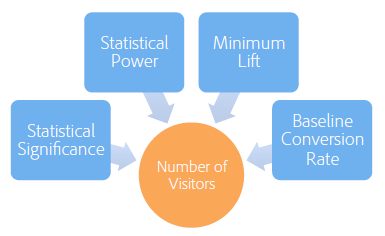

# A/B 測試該執行多久?

成功 [!UICONTROL A/B測試] 活動 [!DNL Adobe Target] 需要足夠的訪客（樣本大小）來改善轉換率。 您如何知道A/B測試要執行多久？ 本文包含 [!UICONTROL 自動分配] 活動與 [!UICONTROL Adobe Target] 樣本大小電腦可協助您確保活動有足夠的訪客達成您的目標。

在活動剛開始的幾天，如果其中一個選件表現得比其他選件好很多或差很多，就會很想停止活動。不過，當觀察值數目太少時，觀察到正提升度或負提升度極有可能只是機遇，因為轉換率以很少的訪客數目來算平均值。隨著活動收集更多的資料點，轉換率就會往真正長期值收斂。

>[!IMPORTANT]
>
>過早停止活動是執行A/B測試時可能會遭到的十大陷阱之一。 如需詳細資訊，請參閱 [十個常見的A/B測試陷阱以及避免方式](/help/main/c-activities/t-test-ab/common-ab-testing-pitfalls.md#concept_578A7947C9554868B30F12DFF9E3F8E3).

[!DNL Adobe Target] 提供工具，協助確保您的活動具有足夠大的樣本大小，以達成轉換目標：自動分配。

## 自動分配 {#auto-allocate}

安 [自動分配](/help/main/c-activities/automated-traffic-allocation/automated-traffic-allocation.md) 活動是A/B測試的類型，可從兩個或多個體驗中識別獲勝者。 自動分配測試會自動重新分配更多流量給獲勝者以增加轉換，同時測試會繼續執行和學習。

標準 A/B 測試有其固有成本。您必須耗費流量來測量每個體驗的效能，並透過分析來定奪勝出體驗。即使在您認定某些體驗勝過其他體驗之後，流量分布仍然固定。另外，很難決定樣本大小，必須等到活動執行完整個過程，您才能對獲勝者採取動作。而且，確定的獲勝者仍有可能不是真正的獲勝者。

解決方案是 [!UICONTROL 自動分配]. [!UICONTROL 自動分配可降低這項成本及定奪勝出體驗時的額外負荷。][!UICONTROL 自動分配會監控所有體驗的目標量度效能，並依比例將更多新加入者安排到表現優異的體驗。]有足夠的流量保留來探索其他體驗。即使活動仍在執行，您仍可在結果上看到活動的優點：最佳化與學習並行進行。

[!UICONTROL 自動分配會逐漸將訪客移往勝出體驗，您不必等到活動結束才決定獲勝者。]您會更快從提升中受益，因為原本安排到較差體驗的活動加入者會看到潛在的勝出體驗。

使用[!UICONTROL 自動分配]功能時，在活動達到最低轉換次數且有足夠信賴度之前，[!DNL Adobe Target] 會在活動頁面頂端顯示徽章，指出「尚未有贏家」。[!DNL Target]然後， 會透過在活動頁面的頂端顯示徽章，宣告成功體驗。

如需詳細資訊，請參閱 [自動分配概觀](/help/main/c-activities/automated-traffic-allocation/automated-traffic-allocation.md).

## Adobe [!DNL Target] 樣本大小電腦 {#section_6B8725BD704C4AFE939EF2A6B6E834E6}

如果您選擇使用手動 [!UICONTROL A/B測試] 活動而非 [!UICONTROL 自動分配], [!DNL Target] 樣本大小電腦可協助您判斷成功測試所需的樣本大小。 手動A/B測試是固定水準測試，因此計算器很有幫助。 使用計算器 [!UICONTROL 自動分配] 活動是選用項目，因為 [!UICONTROL 自動分配] 宣佈獲勝者。 計算器可提供所需樣本大小的粗略估計。 如需有關如何使用此計算機的詳細資訊，請繼續閱讀。

設定A/B測試前，請先存取Adobe Target [樣本大小計算器](https://experienceleague.adobe.com/tools/calculator/testcalculator.html).

在執行任何A/B測試之前，請務必判斷適當的樣本大小（訪客數量），以便在評估結果之前建立活動應執行的時間。 僅僅監控活動直到達到統計顯著性，就會導致信賴區間被嚴重低估，使測試變得不可靠。 這意味著只要偵測到統計顯著結果，就停止測試並宣布獲勝者。但是，如果不是統計顯著的結果，則允許繼續測試。此程序非常偏袒正面結果，這會增加誤判率，因而扭曲測試的有效顯著水準。

這可能會產生許多誤判，導致實作的選件最終無法提供預計的提升度。 提升度本身不夠令人滿意，但更嚴重的後果是，隨著時間的推移，無法準確預測提升度會削弱組織對測試的信任。

本文討論了確定樣本大小時必須平衡的因素，並介紹了估算適當樣本大小的計算器。 在任何A/B測試開始之前，使用樣本大小電腦（上方提供的連結）計算樣本大小，可確保您一律執行符合統計標準的高品質A/B測試。

有五個使用者定義參數可定義 A/B 測試。這些參數相互關聯，建立其中四個時，即可算出第五個:

* 統計顯著性
* 統計檢定力
* 最低可靠偵測提升度
* 基準轉換率
* 訪客數目

>[!IMPORTANT]
>
>若要取得準確結果，您必須先重新載入頁面，才能變更任何參數編號。

在 A/B 測試中，統計顯著性、統計檢定力、最低可靠偵測提升度及基準轉換率由分析師設定，然後從這些數目算出必要的訪客數目。本文探討這些元素，並提供如何針對特定測試判斷這些量度的准則。

下圖顯示 A/B 測試可能的四種結果:

最好是沒有偽陽性或偽陰性。不過，統計測試永遠無法保證取得零誤判。 觀察的趨勢很可能無法代表基礎轉換率。例如，在一次測試中，看看投幣時的正面或反面是否更有可能，即使投了公平的硬幣，你也可以偶然地在10次投10次投10次。 統計顯著性和檢定力協助我們將偽陽性率和偽陰性率量化，還可讓我們在給定的測試中，將這兩種比率維持在合理的水準。

### 統計顯著性 {#section_8230FB9C6D1241D8B1786B72B379C3CD}

測試的顯著性層級決定測試報告兩個不同選件之間轉換率有顯著差異（事實上，沒有實際差異）的可能性。 此情況稱為誤判或I型錯誤。 顯著水準是使用者指定的臨界值，是誤判容限與測試中必須包含的訪客數量之間的取捨。

在 A/B 測試中，最初會假設兩個選件有相同的轉換率。然後，根據此假設來計算觀察結果的機率。如果此機率（p值）小於某些預先定義的臨界值（顯著水準）, [!DNL Target] 得出結論認為，初始假設（兩個選件具有相同的轉換率）不正確。 因此，A和B的轉換率在指定顯著水準上有統計差異。

A/B 測試中常用的顯著水準是 5%，這對應於信賴水準 95% (信賴水準 = 100% - 顯著水準)。信賴水準 95% 表示每次執行測試時，即使選件之間沒有差異，仍有 5% 的機會偵測到統計顯著的提升度。

下表彙總了信賴水準的一般解釋:

| 信賴等級 | 解釋 |
|--- |--- |
| &lt; 90% | 沒有跡象顯示轉換率之間有差異 |
| 90-95% | 有微弱跡象顯示轉換率之間有差異 |
| 95-99% | 有中等跡象顯示轉換率之間有差異 |
| 99-99.9% | 有強烈跡象顯示轉換率之間有差異 |
| +99.9% | 有非常強跡象顯示轉換率之間有差異 |

建議一律使用 95% 或更高的信賴水準。

最好使用盡可能高的信賴水準，以便測試產生很少的誤判。 不過，較高的信賴水準需要較大量的訪客，因而增加執行測試所需的時間。再者，信賴水準提高會導致統計檢定力降低。

### 統計檢定力 {#section_1169C27F8E4643719D38FB9D6EBEB535}

A/B 測試的統計檢定力是指偵測到某個數量的轉換率有實質差異的機率。由於轉換事件的隨機 (推測) 本質，即使兩個選件之間的轉換率有實質差異，還是有可能沒觀察到統計顯著的差異 (只是巧合)。此情境稱為偽負或II類錯誤。

人們經常忽略統計檢定力，因為與統計顯著性相反，執行 A/B 測試不需要判定統計檢定力。不過，如果忽略統計檢定力，測試極可能因為樣本大小太小，而偵測不到不同選件的轉換率之間的實質差異。這會導致測試充滿偽陽性的結果。

我們會希望統計檢定力較高，測試才會有較大機會可識別出轉換率的實質差異，並產生較少的偽陰性結果。不過，需要較多的訪客，才能提高偵測任何指定提升度的統計檢定力，進而增加執行測試所需的時間。

統計檢定力的常用值是 80%，這表示測試有 80% 的機會偵測到差異等於最低可靠偵測提升度。測試偵測到小幅提升度的機率較低，而偵測到大幅提升度的機率較高。

### 最低可靠偵測提升度 {#section_6101367EE9634C298410BBC2148E33A9}

大部分組織需要測量轉換率中可能的最小差異，因為即使小幅提升度也值得實作。不過，如果您希望A/B測試偵測到小提升度的可能性很高，則必須包含在測試中的訪客數量將極大。 原因在於，如果轉換率的差異很小，必須以高準確度來估計兩個轉換率，才能識別差異，而這需要許多訪客。 因此，應該依商業需求來決定最低可靠偵測提升度，而且在偵測小幅提升度與花更多時間執行測試之間需要取捨。

例如，假設兩個選件 (A 和 B) 的真實轉換率分別為 10% 和 15%。如果這些選件各顯示給 100 位訪客，由於轉換的隨機本質，選件 A 所觀察到的轉換率有 95% 的機會將落在 4% 至 16% 範圍內，而選件 B 則是落在 8% 至 22% 的範圍內。在統計學上，這些範圍稱為信賴區間。代表對於預估轉換率準確度的信賴度。樣本大小越大 (越多訪客)，您對轉換率預估正確就越有信心。

下圖顯示這些機率分布。

因為兩個範圍之間有很大重疊，測試無法判斷轉換率是否不同。因此，有 100 位訪客的這項測試無法區別兩個選件。不過，如果Target每次向5,000位訪客顯示選件，則觀察到的轉換率有95%的機會分別落在9%到11%的範圍中，以及14%到16%的範圍中。

在此情況下，測試不太可能得出錯誤的結論，因此具有5,000位訪客的測試可以區分這兩個選件。 有 5,000 位訪客的測試具有大約為 +/-1% 的信賴區間。這表示測試可以偵測到大約 1% 的差異。因此，舉例來說，如果選件的真實轉換率是 10% 和 10.5%，而非 10% 和 15%，則需要更多訪客才能偵測到差異。

### 基準轉換率 {#section_39380C9CA3C649B6BE6E1F8A06178B05}

基準轉換率是控制選件 (選件 A) 的轉換率。通常，根據以往經驗，您大致上都能正確預估選件的轉換水準。如果不是這樣，例如，因為是新型的選件或創意，可讓測試執行大約一天，以粗估可用於計算樣本大小的基準轉換率。

### 訪客數目 {#section_19009F165505429E95291E6976E498DD}

在長時間執行測試的機會成本與得到偽陽性和偽陰性的風險之間，很難取得平衡。您顯然不希望決策錯誤，但也不應該因為太嚴格或僵硬的測試標準而寸步難行。

一般而言，建議採用 95% 的信賴水準和 80% 的統計檢定力。

樣本大小計算機 (上方提供的連結) 會要求您選定統計顯著性 (建議: 95%) 和統計檢定力 (建議: 80%)。輸入基準轉換率和所有選件的每日流量之後，試算表會輸出偵測到提升度 1%、2%、5%、10%、15% 和 20% (機率等於指定的測試檢定力) 所需的訪客數目。試算表也可讓使用者輸入自訂的最低可靠偵測提升度。此外，試算表會根據使用者輸入的流量水準，輸出測試所需的週數。所需的週數會四捨五入到最接近的整數週，以避免星期幾效應影響結果。

測試所能可靠辨識的最低提升度與所需的訪客數目之間需要取捨。下圖 (以基準 (控制) 轉換率 5% 而言有效) 顯示隨著訪客數目增加，報酬遞減很嚴重。在測試中增加前幾位訪客時，能夠可靠偵測的最低提升度會有極大改善，但之後需要更大量的訪客才能改善測試。此圖有助於在執行測試所需的時間 (取決於需要的訪客數目和網站流量) 與測試能夠可靠偵測的最低提升度之間做出適當取捨。

在此範例中，您可能會決定能夠偵測到提升度5%(對應於替代選件的轉換率(100%+5%)&#42;5% = 5.25%)的100項測試中，有80項是足夠的，因此每個選件的樣本大小需要為100,000位訪客。 如果網站每天有20,000位訪客，而您正在測試兩個選件，則應允許測試執行2個選件&#42;100,000/20,000 = 10天之後，就能判斷替代選件在統計上是否顯著優於控制選件。

同樣地，建議將所需時間一律四捨五入至最接近的整數週，以避免星期幾效應。因此，在此範例中，測試會執行兩週之後才評估結果。

### 每次造訪帶來的收入量度 {#section_C704C0861C9B4641AB02E911648D2DC2}

以「每次造訪帶來的收入」(RPV)作為量度時，會新增額外的差異來源，因為RPV是每筆訂單收入和轉換率(RPV =收入/ #visitors =（每筆訂單收入）的乘積 &#42; #orders)/ #訪客=每筆訂單收入 &#42; (#visitors &#42; CTR)/ #visitors =每筆訂單收入 &#42; CTR)，每個都有其自己的變數。 轉換率的變異數可直接使用數學模型來估計，但每個訂單的收入變異數是活動專屬的。 因此，請使用過去活動中此差異的相關知識，或執行A/B測試數天，以估計收入差異。 變異數是根據CSV下載檔案中的「銷售總和」、「銷售總和平方」和「訪客數」的值計算。 建立測試後，請使用試算表計算完成測試所需的時間。

樣本大小計算機 (上方提供的連結) 可協助您設定 RPV 量度。當你開啟計算器時，你會看到標籤為 [!UICONTROL RPV量度]. 使用 RPV 版的計算機時需要下列資訊:

* 控制選件的訪客數目
* 控制選件的總收入

   請確定已選取極端訂單篩選器。

* 控制選件的收入平方和

   確定已勾選極端訂單篩選。

一般而言，使用RPV作為量度需要20-30%的長時間，才能在相同測量提升度的水準上達到相同的統計信賴水準。 這是因為RPV新增了每個轉換不同訂單大小的變數。 在選擇直式轉換率和RPV作為您最終業務決策依據的量度時，應考量這一點。

## 比較多個選件時修正 {#section_1474113764224D0B85472D8B023CCA15}

每次比較兩個選件時，得到偽陽性 (即使轉換率沒有差異也觀察到統計顯著差異) 的機會等於顯著水準。例如，假設有五個選件 A/B/C/D/E，其中 A 是控制選件，然後執行四次比較 (控制對 B、控制對 C、控制對 D、控制對 E)，即使信賴水準是 95%，偽陽性的機率也會有 18.5%，因為 Pr (至少一個偽陽性) = 1 - Pr (沒有偽陽性) = 1 - 0.95 = 18.5%。在此背景下，偽陽性的定義是回報指出控制優於對立或對立優於控制，但其實兩者之間沒有差異。

## 結論 {#section_AEA2427B90AE4E9395C7FF4F9C5CA066}

使用 [!UICONTROL 自動分配] 活動， [!DNL Target] 識別兩個或多個體驗中的獲勝者，並自動重新分配更多流量給獲勝者以增加轉換，同時測試繼續執行和學習。 [!UICONTROL 自動分配可讓您輕鬆達成轉換目標，同時消除猜測工作。]

使用本文介紹的樣本大小計算器（上述連結），並允許測試以其建議的時間量執行，可確保您一律執行符合您認為適合特定測試的偽陽性和偽陰性率的高品質A/B測試。 如此可確保測試一致，且能夠可靠地偵測到您所尋找的提升度。
