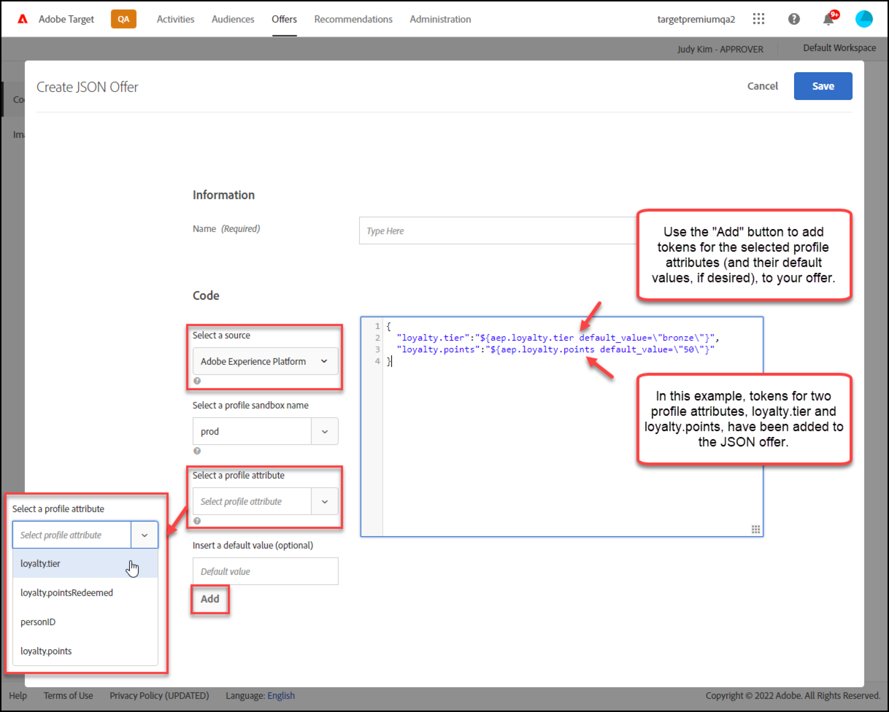

# 建立 JSON 選件

在中建立JSON選件 [!UICONTROL 優惠方案庫] in [!DNL Adobe Target] 用於 [!UICONTROL 表單式體驗撰寫器].

JSON選件可用於表單式活動，其中會啟用 [!DNL Target]若要傳送JSON格式的選件，以便在SPA架構或伺服器端整合中使用，需要決策功能。

## JSON考量事項

使用 JSON 選件時，請考量下列資訊:

* JSON選件目前僅適用於 [!UICONTROL A/B測試] 和 [!UICONTROL 體驗鎖定] (XT)活動。
* JSON選件可用於 [表單式活動](/help/main/c-experiences/form-experience-composer.md) 只有。
* 當您使用「伺服器端 API」、「行動裝置 SDK」或 NodeJS SDK 時，可直接擷取 JSON 選件。
* 在瀏覽器中，「只能」透過 at.js 1.2.3 (或更新版) 和以下方法擷取 JSON 選項: 使用 [getOffer()](https://developer.adobe.com/target/implement/client-side/atjs/atjs-functions/adobe-target-getoffer/){target=_blank}，方法是使用 `setJson` 動作。
* JSON 選件是以原生 JSON 物件提供，而不是字串。這些物件的取用者不再需要將物件當作字串來處理，再轉換成 JSON 物件。
* 不同於其他選件 (例如 HTML 選件)，JSON 選件不會自動套用，因為 JSON 選件不是視覺化選件。開發人員必須撰寫程式碼來明確利用此方法取得選件: [getOffer()](https://developer.adobe.com/target/implement/client-side/atjs/atjs-functions/adobe-target-getoffer/){target=_blank}。

## 建立JSON選件 {#section_BB9C72D59DEA4EFB97A906AE7569AD7A}

1. 按一下 **[!UICONTROL 選件]** > **[!UICONTROL 代碼選件]**.

   

1. 按一下「**[!UICONTROL 建立]** > **[!UICONTROL JSON 選件]**」。

   

1. 輸入選件名稱。
1. 在&#x200B;**[!UICONTROL 「程式碼」]**&#x200B;方塊中，輸入或貼上 JSON 程式碼。
1. 按一下&#x200B;**[!UICONTROL 儲存]**。

## JSON範例 {#section_A54F7BB2B55D4B7ABCD5002E0C72D8C9}

JSON選件僅支援使用 [表單式體驗撰寫器](/help/main/c-experiences/form-experience-composer.md). 目前只有透過直接呼叫 API 才能使用 JSON 選件。

其範例如下:

```json
adobe.target.getOffer({ 
  mbox: "some-mbox", 
  success: function(actions) { 
    console.log('Success', actions); 
  }, 
  error: function(status, error) { 
    console.log('Error', status, error); 
  } 
});
```

傳給成功回呼的動作是物件陣列。假設有單一 JSON 選件，其內容為:

```json
{ 
  "demo": {"a": 1, "b": 2} 
}
```

動作陣列會有此結構:

```json
[ 
 { 
   action: "setJson", 
   content: [{ 
     "demo": {"a": 1, "b": 2} 
   }] 
 }  
]
```

若要擷取JSON選件，請逐一查看動作，並尋找具有的動作 `setJson` 動作，然後反覆檢查內容陣列。

## 使用案例 {#section_85B07907B51A43239C8E3498EF58B1E5}

假設下列 JSON 選件傳送至您的網頁:

```json
{ 
    "_id": "5a65d24d8fafc966921e9169", 
    "index": 0, 
    "guid": "7c006504-c6f7-468d-a46f-f72531ea454c", 
    "isActive": true, 
    "balance": "$2,075.06", 
    "picture": "https://placehold.it/32x32", 
    "tags": [ 
      "esse", 
      "commodo", 
      "excepteur", 
    ], 
    "friends": [ 
      { 
        "id": 0, 
        "name": "Carla Lyons" 
      }, 
      { 
        "id": 1, 
        "name": "Ollie Mooney" 
      }, 
    ], 
    "greeting": "Hello, Stephenson Fernandez! You have 4 unread messages.", 
    "favoriteFruit": "strawberry" 
} 
  
```

下列程式碼顯示如何存取「greeting」屬性:

```json
adobe.target.getOffer({   
  "mbox": "name_of_mbox", 
  "params": {}, 
  "success": function(offer) {           
        console.log(offer[0].content[0].greeting); 
  },   
  "error": function(status, error) {           
      console.log('Error', status, error); 
  } 
});
```

## JSON選件範例，使用Real-time CDP設定檔屬性

即時CDP設定檔屬性可與Target共用，以用於HTML選件和JSON選件。 （請注意，此功能目前仍在測試中。）

範例使用案例：身為線上行銷人員，Grace希望AEP/統一設定檔與Target共用屬性值，以提供即時個人化。 使用即時CDP設定檔屬性，Grace可以使用Token取代，在Target選件中顯示AEP屬性的值。 例如，她可以使用 `${aep.profile.favoriteColor}`，或使用代號的忠誠度層級和忠誠度點數值 `${aep.loyalty.tier}` 和 `${aep.loyalty.points}`.



在上述範例中，請注意指派預設值是選用的。

## 依JSON選件類型篩選選件 {#section_52533555BCE6420C8A95EB4EB8907BDE}

您可以篩選 [!UICONTROL 選件] 資料庫（依JSON選件類型），方法是按一下 **[!UICONTROL 類型]** 下拉式清單，然後選取 **[!UICONTROL JSON]** 核取方塊。


