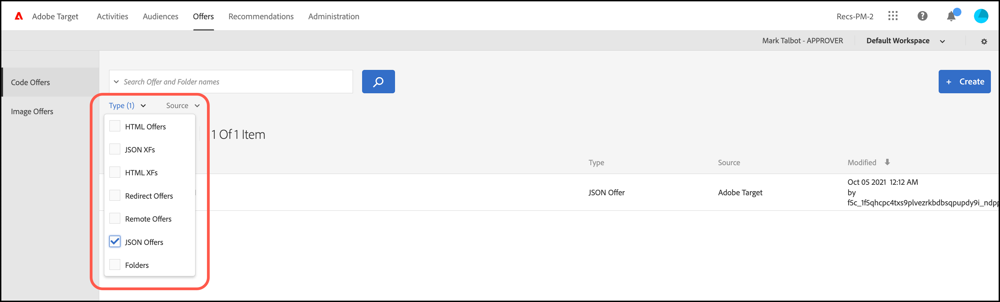

# 建立 JSON 選件

在中建立JSON優惠 [!UICONTROL 提供庫] 在 [!DNL Adobe Target] 供 [!UICONTROL 基於表單的體驗作曲家]。

JSON服務可用於基於表單的活動，從而啟用在 [!DNL Target]要在框架或伺服器端整合中發送JSON格式的優惠SPA，需要進行決策。

## JSON注意事項

使用 JSON 選件時，請考量下列資訊:

* JSON優惠當前僅適用於 [!UICONTROL A/BTest] 和 [!UICONTROL 體驗目標] (XT)活動。
* JSON服務可用於 [表格活動](/help/main/c-experiences/form-experience-composer.md) 只是。
* 當您使用「伺服器端 API」、「行動裝置 SDK」或 NodeJS SDK 時，可直接擷取 JSON 選件。
* 在瀏覽器中，「只能」透過 at.js 1.2.3 (或更新版) 和以下方法擷取 JSON 選項: 使用 [getOffer()](https://developer.adobe.com/target/implement/client-side/atjs/atjs-functions/adobe-target-getoffer/){target=_blank}，方法是使用 `setJson` 操作。
* JSON 選件是以原生 JSON 物件提供，而不是字串。這些物件的取用者不再需要將物件當作字串來處理，再轉換成 JSON 物件。
* 不同於其他選件 (例如 HTML 選件)，JSON 選件不會自動套用，因為 JSON 選件不是視覺化選件。開發人員必須撰寫程式碼來明確利用此方法取得選件: [getOffer()](https://developer.adobe.com/target/implement/client-side/atjs/atjs-functions/adobe-target-getoffer/)。

## 建立JSON優惠 {#section_BB9C72D59DEA4EFB97A906AE7569AD7A}

1. 按一下 **[!UICONTROL 優惠]** > **[!UICONTROL 代碼優惠]**。

   

1. 按一下「**[!UICONTROL 建立]** > **[!UICONTROL JSON 選件]**」。

   

1. 輸入選件名稱。
1. 在&#x200B;**[!UICONTROL 「程式碼」]**&#x200B;方塊中，輸入或貼上 JSON 程式碼。
1. 按一下&#x200B;**[!UICONTROL 儲存]**。

## JSON示例 {#section_A54F7BB2B55D4B7ABCD5002E0C72D8C9}

JSON優惠僅在使用 [基於表單的體驗作曲家](/help/main/c-experiences/form-experience-composer.md)。 目前只有透過直接呼叫 API 才能使用 JSON 選件。

其範例如下:

```json
adobe.target.getOffer({ 
  mbox: "some-mbox", 
  success: function(actions) { 
    console.log('Success', actions); 
  }, 
  error: function(status, error) { 
    console.log('Error', status, error); 
  } 
});
```

傳給成功回呼的動作是物件陣列。假設有單一 JSON 選件，其內容為:

```json
{ 
  "demo": {"a": 1, "b": 2} 
}
```

動作陣列會有此結構:

```json
[ 
 { 
   action: "setJson", 
   content: [{ 
     "demo": {"a": 1, "b": 2} 
   }] 
 }  
]
```

要提取JSON提供，請迭代操作，並使用 `setJson` 操作，然後循環訪問內容陣列。

## 用例 {#section_85B07907B51A43239C8E3498EF58B1E5}

假設下列 JSON 選件傳送至您的網頁:

```json
{ 
    "_id": "5a65d24d8fafc966921e9169", 
    "index": 0, 
    "guid": "7c006504-c6f7-468d-a46f-f72531ea454c", 
    "isActive": true, 
    "balance": "$2,075.06", 
    "picture": "https://placehold.it/32x32", 
    "tags": [ 
      "esse", 
      "commodo", 
      "excepteur", 
    ], 
    "friends": [ 
      { 
        "id": 0, 
        "name": "Carla Lyons" 
      }, 
      { 
        "id": 1, 
        "name": "Ollie Mooney" 
      }, 
    ], 
    "greeting": "Hello, Stephenson Fernandez! You have 4 unread messages.", 
    "favoriteFruit": "strawberry" 
} 
  
```

下列程式碼顯示如何存取「greeting」屬性:

```json
adobe.target.getOffer({   
  "mbox": "name_of_mbox", 
  "params": {}, 
  "success": function(offer) {           
        console.log(offer[0].content[0].greeting); 
  },   
  "error": function(status, error) {           
      console.log('Error', status, error); 
  } 
});
```

## 按JSON服務類型篩選服務 {#section_52533555BCE6420C8A95EB4EB8907BDE}

可以篩選 [!UICONTROL 優惠] 通過按一下 **[!UICONTROL 類型]** 下拉清單，然後選擇 **[!UICONTROL JSON]** 複選框。


