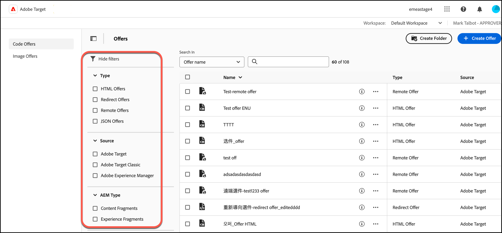

# 選件

使用 [!UICONTROL Offers] 中的資料庫 [!DNL Adobe Target] 以管理您的程式碼和影像選件內容。

>[!NOTE]
>
>本文包含更新的 [!DNL Target] 目前是Beta版計劃一部分的使用者介面。 此 [!DNL Adobe Target] 團隊通常會為特定客戶啟用新功能，以進行測試和提供回饋。 在測試期間完成後，這些功能將在未來為所有客戶啟用 [!DNL Target Standard/Premium] 發行版本和發行說明中宣佈。

按一下 **[!UICONTROL Offers]** 索引標籤在頂端 [!DNL Target] 顯示 [!UICONTROL Offers] 資料庫。

此 [!UICONTROL Offers] 資料庫包含已透過設定的選件 [!DNL Target Standard/Premium]， [!DNL Target Classic]， [!DNL Adobe Experience Manager] (AEM)， [!DNL Adobe Mobile Services] (AMS)和API。 在 [!DNL Target Classic] 或其他解決方案中建立的選件，都可以在 [!DNL Target Standard/Premium] 中編輯。

選件資料庫提供所有程式碼和影像選件的概觀，可讓您執行各種動作：

| 元素 | 說明 |
|--- |--- |
| 左側導覽邊欄 | 在清單之間切換 [!UICONTROL Code Offers] 或 [!UICONTROL Image Offers]. |
| [!UICONTROL Show filters] 圖示
 | 按一下 **[!UICONTROL Show filters]** 圖示以依據篩選優惠方案 [!UICONTROL Type]， [!UICONTROL Source]、和 [!UICONTROL AEM Type]
如需詳細資訊，請參閱 [將篩選器套用至優惠清單](#filters) 底下。 |
| 搜尋欄位 | 使用 **[!UICONTROL Search in]** 欄位以快速尋找優惠方案，或減少 [!UICONTROL Offers] 資料庫。 搜尋依據 [!UICONTROL Offer Name]， [!UICONTROL AEM Paths]，或 [!UICONTROL AEM Tags]. |
| [!UICONTROL Create Folder] | 按一下「建立資料夾」以在 [!UICONTROL Offer] 程式庫，用來儲存程式碼選件、影像選件以及其他資料夾，以建立子資料夾結構。 如需詳細資訊，請參閱 [建立選件資料夾](/help/main/c-experiences/c-manage-content/create-content-folder.md). |
| [!UICONTROL [!UICONTROL Create Offer]] | 建立優惠方案。 如需建立各種選件型別的詳細資訊，請參閱： <ul><li>HTML 選件</li><li>[json選件](/help/main/c-experiences/c-manage-content/create-json-offer.md)</li><li>[重新導向選件](/help/main/c-experiences/c-manage-content/offer-redirect.md)</li><li>[遠端選件](/help/main/c-experiences/c-manage-content/about-remote-offers.md)</li></ul> |
| 大量作業核取方塊 | 針對所有活動或選取的活動執行大量作業。
如需可用動作的清單（視您的許可權和選件狀態而定），請參閱 [執行快速動作](#quick-actions) 底下。 |
| [!UICONTROL Name] | 每個選件的名稱。
按一下 **[!UICONTROL Quick Info]** 圖示來檢視快顯示卡片中有關優惠方案的詳細資訊，包括優惠方案ID、型別、上次修改優惠方案的日期及修改者，以及其他專案。
按一下 **[!UICONTROL More actions]** 圖示（水準省略符號）來開啟功能表，讓您對活動執行快速動作。 下列動作可供使用（視您的許可權和選件狀態而定）： [!UICONTROL Edit]， [!UICONTROL Copy]， [!UICONTROL Delete]、和 [!UICONTROL Move]. 如需每個動作的詳細資訊，請參閱 [執行快速動作](#quick-actions) 底下。
按一下表格標題，依名稱的字母遞增或遞減順序排序清單。 |
| [!UICONTROL Type] | 選件型別：HTML選件， [重新導向選件](/help/main/c-experiences/c-manage-content/offer-redirect.md)， [遠端選件](/help/main/c-experiences/c-manage-content/about-remote-offers.md)、和 [JSON選件](/help/main/c-experiences/c-manage-content/create-json-offer.md). |
| [!UICONTROL Source] | 顯示優惠的建立位置： [!DNL Adobe Target]， [!DNL Adobe Target Classic]、和 [!DNL Adobe Experience Manager]. |

## 套用篩選器至選件程式庫 {#filters}

按一下 **[!UICONTROL Show filters]** 圖示(  )，以依據以下條件篩選優惠方案： [!UICONTROL Type]， [!UICONTROL Source]、和 [!UICONTROL AEM Type].

此 **[!UICONTROL Show filters]** 圖示可讓您依下列類別篩選優惠方案：

* **型別**：HTML選件， [json選件](/help/main/c-experiences/c-manage-content/create-json-offer.md)， [重新導向選件](/help/main/c-experiences/c-manage-content/offer-redirect.md)， [遠端選件](/help/main/c-experiences/c-manage-content/about-remote-offers.md).

* **來源**： [!DNL Adobe Target]， [!DNL Adobe Target Classic]、和 [!DNL Adobe Experience Manager].

* **AEM型別**： [內容片段](/help/main/c-integrating-target-with-mac/aem/content-fragments-aem.md) 和 [體驗片段](/help/main/c-integrating-target-with-mac/aem/experience-fragments-aem.md). 如需不同片段型別的詳細資訊，請參閱 [AEM體驗片段和內容片段概觀](/help/main/c-integrating-target-with-mac/aem/aem-experience-and-content-fragments.md).

## 執行快速動作 {#quick-actions}

您可以按一下適當的圖示來執行下列快速動作：

### 快速資訊

按一下 **[!UICONTROL Quick Info]** 圖示來檢視快顯示卡片中有關優惠方案的詳細資訊，包括優惠方案ID、型別、上次修改優惠方案的日期及修改者，以及其他專案。 可用選項取決於選件型別：HTML選件， [json選件](/help/main/c-experiences/c-manage-content/create-json-offer.md)， [重新導向選件](/help/main/c-experiences/c-manage-content/offer-redirect.md)， [遠端選件](/help/main/c-experiences/c-manage-content/about-remote-offers.md).

### 更多動作

按一下 **[!UICONTROL More actions]** 圖示（水準省略符號）來開啟功能表，讓您對活動執行快速動作。 下列動作可供使用（視您的許可權和選件狀態而定）： [!UICONTROL Edit]， [!UICONTROL Copy]， [!UICONTROL Delete]、和 [!UICONTROL Move].

* 編輯
* 複製
* 刪除
* 移動(例如，若要將一或多個專案移至資料夾，請按一下 **[!UICONTROL Move]** 圖示下，按一下所需的資料夾，然後按一下 **[!UICONTROL Drop]**.)

視您的許可權而定，您可能不會看到所有選項的圖示。 例如，使用者具有 [!UICONTROL Observer] 許可權沒有使用 [!UICONTROL Copy] 選項。

如需您可以在選件和資料夾上執行之工作的詳細資訊，請參閱 [使用資產庫中的內容](/help/main/c-experiences/c-manage-content/assets-working.md).

將游標移至上所需的影像選件或資料夾，以執行其他工作 [!UICONTROL Image Offers] 標籤，然後按一下所需的圖示。

選項包括:

* 選擇
* 下載
* 檢視屬性
* 編輯
* 注釋
* 複製

如需您可以在選件和資料夾上執行之工作的詳細資訊，請參閱 [使用資產庫中的內容](/help/main/c-experiences/c-manage-content/assets-working.md).

>[!NOTE]
>
>影像選件不屬於 [企業使用者許可權](/help/main/administrating-target/c-user-management/property-channel/property-channel.md) 模型。

<!--

## Viewing offer definitions {#section_6B059DD121434E6292CAB393507D010E}

You can view offer definition details on a pop-up card in the [!UICONTROL Offers] library without opening the offer.

For example, the following offer definition card for an HTML offer is accessed by hovering over an offer on the [!UICONTROL Content] list, then clicking the information icon:

The following information is available:

* Name 
* Source 
* Type 
* Offer ID 
* Offer path 
* Last Modified

Click the [!UICONTROL Offer Usage] tab to view the activities that reference a code offer in each offer's definition pop-up card. This functionality does not apply to image offers. This way you can avoid impact to other activities while editing offers. Information includes [!UICONTROL Live Activities] and [!UICONTROL Inactive Activities].

The following offer definition card for a Redirect offer:

The following information is available:

* Name 
* Source 
* Type 
* Offer ID 
* Offer Path 
* Last Modified 
* Redirect URL 
* Include all URL parameters (On or Off) 
* Pass mbox session ID (On or Off)

The following offer definition card for a Remote offer:

The following information is available:

* Name 
* Source 
* Type 
* Offer ID 
* Offer Path 
* Last Modified 
* Redirect URL Type 
* Absolute or Relative URL

## Training video: The Content Repository 

This video includes information about managing offers.

* Connection between the [Experience Cloud Asset Library](https://experienceleague.adobe.com/docs/core-services/interface/assets/creative-cloud.html) and the Target Content Library 
* Custom HTML Offers 
* Custom HTML Offer in the Visual Experience Composer

>[!VIDEO](https://video.tv.adobe.com/v/17387)

-->
