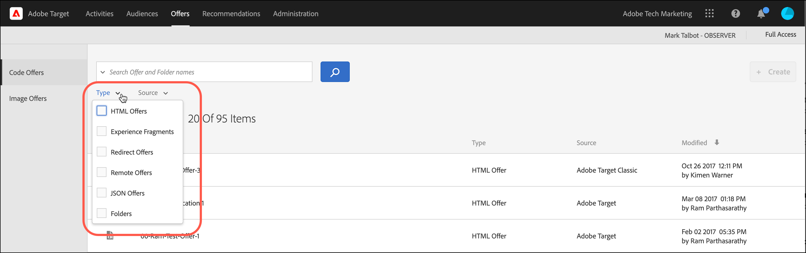

# 選件

使用 [!UICONTROL Offers] 中的資料庫 [!DNL Adobe Target] 以管理您的代碼選件和影像選件內容。

>[!NOTE]
>
>本文包含的相關資訊 [!DNL Target] 功能目前是Beta計畫的一部分。 此 [!DNL Adobe Target] 團隊通常會為特定客戶啟用新功能，以進行測試和提供回饋。 在測試期間完成後，這些功能將在未來為所有客戶啟用 [!DNL Target Standard/Premium] 發行版本和發行說明中宣佈。

1. 按一下 **[!UICONTROL Offers]** 以開啟程式庫。

   此資料庫包含已透過 [!DNL Target Standard/Premium]、[!DNL Target Classic]、[!DNL Adobe Experience Manager] (AEM)、[!DNL Adobe Mobile Services] (AMS) 和 API 來設定的選件。在 [!DNL Target Classic] 或其他解決方案中建立的選件，都可以在 [!DNL Target Standard/Premium] 中編輯。

   此 [!UICONTROL Offers] 頁面在右側有兩個索引標籤： [!UICONTROL Code Offers] 和 [!UICONTROL Image Offers] 可讓您依型別檢視優惠方案。

   

1. （可選）按一下 **[!UICONTROL Type]** 下拉式清單，依型別篩選選件(HTML選件、 [體驗片段](/help/main/c-experiences/c-manage-content/aem-experience-fragments.md)， [重新導向選件](/help/main/c-experiences/c-manage-content/offer-redirect.md)， [遠端選件](/help/main/c-experiences/c-manage-content/about-remote-offers.md)， [JSON選件](/help/main/c-experiences/c-manage-content/create-json-offer.md)、和 [資料夾](/help/main/c-experiences/c-manage-content/create-content-folder.md))。

   

1. （可選）按一下 **[!UICONTROL Source]** 下拉式清單，依來源(Adobe Target、Adobe Target Classic和Adobe Experience Manager)篩選選件。

1. （選用）將游標移至上所需的選件或資料夾，以執行其他工作 [!UICONTROL Code Offers] 標籤，然後按一下所需的圖示。

   

   選項包括:

   * 檢視(如需詳細資訊，請參閱 [檢視選件定義](#section_6B059DD121434E6292CAB393507D010E) 下。)
   * 編輯
   * 複製
   * 移動(例如，若要將一或多個專案移至資料夾，請按一下 **[!UICONTROL Move]** 圖示下，按一下所需的資料夾，然後按一下 **[!UICONTROL Drop]**.)
   * 刪除

   視您的許可權而定，您可能不會看到所有選項的圖示。 例如，使用者具有 [!UICONTROL Observer] 許可權沒有使用 [!UICONTROL Copy] 選項。

   如需您可以在選件和資料夾上執行之工作的詳細資訊，請參閱 [使用資產庫中的內容](/help/main/c-experiences/c-manage-content/assets-working.md).

1. （選用）將游標移至影像選件或資料夾上所需的位置，以執行其他工作。 [!UICONTROL Image Offers] 標籤，然後按一下所需的圖示。

   

   選項包括:

   * 選擇
   * 下載
   * 檢視屬性
   * 編輯
   * 注釋
   * 複製

   如需您可以在選件和資料夾上執行之工作的詳細資訊，請參閱 [使用資產庫中的內容](/help/main/c-experiences/c-manage-content/assets-working.md).

   >[!NOTE]
   >
   >影像選件不屬於 [企業使用者許可權](/help/main/administrating-target/c-user-management/property-channel/property-channel.md) 模型。

## 檢視選件定義 {#section_6B059DD121434E6292CAB393507D010E}

您可以在的快顯示卡片上檢視選件定義的詳細資訊 [!UICONTROL Offers] 程式庫，而不開啟選件。

例如，將游標移至上的選件上，即可存取HTML選件的下列選件定義卡 [!UICONTROL Content] 清單，然後按一下資訊圖示：

可使用下列資訊:

* 名稱
* 來源
* 類型
* 選件 ID
* 選件路徑
* 上次修改

按一下 [!UICONTROL Offer Usage] 標籤中，可檢視參照每個選件定義快顯示卡片中的程式碼選件的活動。 此功能不適用影像選件。這樣可讓您在編輯選件時，避免影響其他活動。資訊包括 [!UICONTROL Live Activities] 和 [!UICONTROL Inactive Activities].

以下是「重新導向」選件的選件定義卡片:

可使用下列資訊:

* 名稱
* 來源
* 類型
* 選件 ID
* 選件路徑
* 上次修改
* 重新導向 URL
* 包含所有URL引數（開啟或關閉）
* 傳遞mbox工作階段ID （開啟或關閉）

以下是「遠端」選件的選件定義卡片:

可使用下列資訊:

* 名稱
* 來源
* 類型
* 選件 ID
* 選件路徑
* 上次修改
* 重新導向 URL 類型
* 絕對或相對 URL

## 訓練影片：內容存放庫 

此影片包含管理選件的相關資訊。

* [Experience Cloud 資產資料庫](https://experienceleague.adobe.com/docs/core-services/interface/assets/creative-cloud.html) 與 Target 內容庫之間的連線
* 自訂 HTML 選件
* 可視化體驗撰寫器中的自訂 HTML 選件

>[!VIDEO](https://video.tv.adobe.com/v/17387)