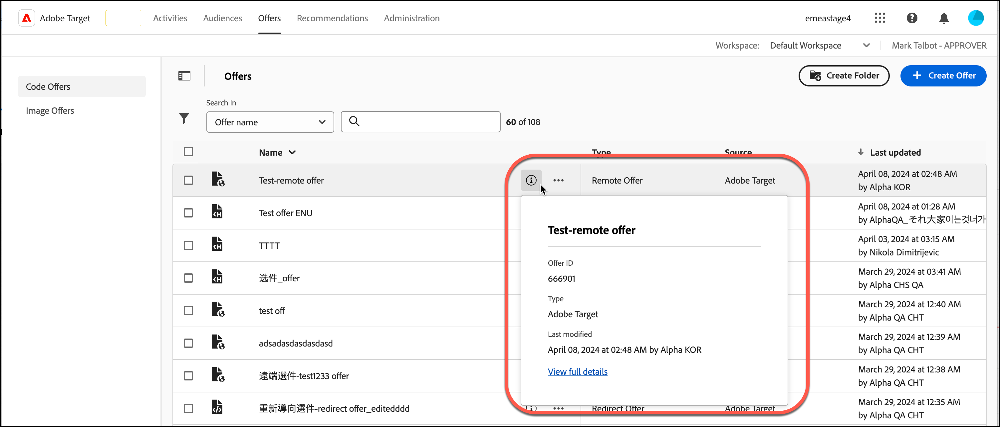

# 產品建議

在[!UICONTROL Offers]中使用[!DNL Adobe Target]資料庫來管理您的程式碼選件和影像選件內容。

1. 按一下&#x200B;**[!UICONTROL Offers]**&#x200B;以開啟資料庫。

   此資料庫包含已透過 [!DNL Target Standard/Premium]、[!DNL Target Classic]、[!DNL Adobe Experience Manager] (AEM)、[!DNL Adobe Mobile Services] (AMS) 和 API 來設定的產品建議。在 [!DNL Target Classic] 或其他解決方案中建立的產品建議，都可以在 [!DNL Target Standard/Premium] 中編輯。

   [!UICONTROL Offers]頁面在右側有兩個索引標籤： [!UICONTROL Code Offers]和[!UICONTROL Image Offers]，可讓您依型別檢視選件。

   

1. （選用）按一下&#x200B;**[!UICONTROL Type]**&#x200B;下拉式清單，依型別篩選選件(HTML選件、[體驗片段](/help/main/c-experiences/c-manage-content/aem-experience-fragments.md)、[重新導向選件](/help/main/c-experiences/c-manage-content/offer-redirect.md)、[遠端選件](/help/main/c-experiences/c-manage-content/about-remote-offers.md)、[JSON選件](/help/main/c-experiences/c-manage-content/create-json-offer.md)和[資料夾](/help/main/c-experiences/c-manage-content/create-content-folder.md))。

   

1. （選用）按一下&#x200B;**[!UICONTROL Source]**&#x200B;下拉式清單，依來源(Adobe Target、Adobe Target Classic和Adobe Experience Manager)篩選優惠方案。

1. （選用）將游標停留在[!UICONTROL Code Offers]標籤上所需的選件或資料夾上，然後按一下所需的圖示，以執行其他工作。

   

   選項包括:

   * 檢視（如需詳細資訊，請參閱下方的[檢視選件定義](#section_6B059DD121434E6292CAB393507D010E)。）
   * 編輯
   * 複製
   * 移動（例如，若要將一或多個專案移至資料夾，請按一下所需專案的&#x200B;**[!UICONTROL Move]**&#x200B;圖示、按一下所需的資料夾，然後按一下&#x200B;**[!UICONTROL Drop]**）。
   * 刪除

   視您的許可權而定，您可能不會看到所有選項的圖示。 例如，具有[!UICONTROL Observer]許可權的使用者無權使用[!UICONTROL Copy]選項。

   如需您可以在選件和資料夾上執行之工作的詳細資訊，請參閱[使用資產庫中的內容](/help/main/c-experiences/c-manage-content/assets-working.md)。

1. （選用）將游標停留在[!UICONTROL Image Offers]標籤上所需的影像選件或資料夾上，然後按一下所需的圖示，以執行其他工作。

   

   選項包括:

   * 選擇
   * 下載
   * 檢視屬性
   * 編輯
   * 注釋
   * 複製

   如需您可以在選件和資料夾上執行之工作的詳細資訊，請參閱[使用資產庫中的內容](/help/main/c-experiences/c-manage-content/assets-working.md)。

   >[!NOTE]
   >
   >影像選件不是[企業使用者許可權](/help/main/administrating-target/c-user-management/property-channel/property-channel.md)模型的一部分。

## 檢視選件定義 {#section_6B059DD121434E6292CAB393507D010E}

您可以在[!UICONTROL Offers]資料庫中的快顯示卡片上檢視選件定義詳細資料，而不需要開啟選件。

例如，按一下資訊圖示，即可存取HTML選件的下列選件定義卡片：

可使用下列資訊:

* 名稱
* 產品建議 ID
* 類型
* 上次修改

按一下[!UICONTROL View Full Details]連結以檢視選件內容以及參考代碼選件的活動。 這樣可讓您在編輯產品建議時，避免影響其他活動。資訊包括[!UICONTROL Live Activities]和[!UICONTROL Inactive Activities]。

每個卡片上的可用資訊會依選件型別而有所不同： HTML選件、[體驗片段](/help/main/c-experiences/c-manage-content/aem-experience-fragments.md)、[重新導向選件](/help/main/c-experiences/c-manage-content/offer-redirect.md)、[遠端選件](/help/main/c-experiences/c-manage-content/about-remote-offers.md)或[JSON選件](/help/main/c-experiences/c-manage-content/create-json-offer.md)。

優惠方案詳細資料功能不適用於影像優惠方案。

<!--

## Training video: The Content Repository 

This video includes information about managing offers.

* Connection between the [Experience Cloud Asset Library](https://experienceleague.adobe.com/docs/core-services/interface/assets/creative-cloud.html) and the Target Content Library 
* Custom HTML Offers 
* Custom HTML Offer in the [!UICONTROL Visual Experience Composer]

>[!VIDEO](https://video.tv.adobe.com/v/17387)

-->
