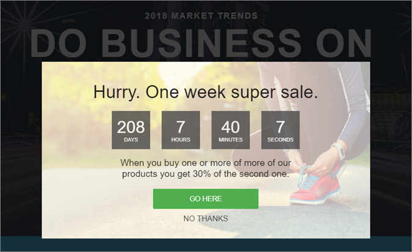

# 體驗範本

有關用於自訂程式碼的[!DNL Adobe Target]體驗範本的資訊。 [!DNL Target]體驗範本是預先編碼的範例，具有可設定的輸入，用於執行常見行銷人員使用案例。

這些體驗範本可透過 VEC 或表單式體驗撰寫器免費提供給開發人員和行銷人員，做為執行常見使用案例的起點。

目前，Adobe Marketing Cloud GitHub 提供下列範本，請參閱 [Target-Experience-Templates](https://github.com/Adobe-Marketing-Cloud/target-experience-templates)。

## Banner Carousel with Thumbnails {#section_BEEE51D47CC44A478264BBF3FEC70DAE}

[Banner Carousel with Thumbnails 體驗範本](https://github.com/Adobe-Marketing-Cloud/target-experience-templates/tree/master/banner-carousel-thumbnails)為旋轉輪播，通常用於首頁頁面、登陸頁面或其他高流量登入頁面。此輪播不會透過影像自動旋轉，可按一下主影像下方的較小影像直接進行互動。

## Banner Carousel {#section_725D4C0C4FCD41FA92BCFC910A216E2A}

[Banner Carousel 體驗範本](https://github.com/Adobe-Marketing-Cloud/target-experience-templates/tree/master/banner-carousel)為旋轉輪播，通常用於首頁頁面、登陸頁面或其他高流量登入頁面。此輪播不會透過影像自動旋轉，可按一下左箭頭和右箭頭直接進行互動。

## Banner Countdown {#section_ED9501FE096C4CD7B6D9933E0322B4AD}

[Banner Countdown 體驗範本](https://github.com/Adobe-Marketing-Cloud/target-experience-templates/tree/master/banner-countdown)為中央有倒數計時的大型橫幅，通常用於首頁頁面、登陸頁面或其他高流量登入頁面。

## Button Builder {#section_DBDD1C9A9F294FB6BABBC04B4454E59B}

[Button Builder 體驗範本](https://github.com/Adobe-Marketing-Cloud/target-experience-templates/tree/master/button)為帶有動作呼叫文字的小按鈕。可設定此按鈕，並將其放在頁面上任何地方以新增動作呼叫，或以更多可設定替代項取代現有按鈕。

## Lightbox with Countdown {#section_E1177C52F1294EA5AC48312727CD3DF4}

[Lightbox with Countdown 體驗範本](https://github.com/Adobe-Marketing-Cloud/target-experience-templates/tree/master/lightbox-countdown)為中央有倒數計時的燈箱覆蓋彈出式視窗，通常用於首頁頁面、登陸頁面或其他高流量登入頁面。

## Lightbox with Exit Intent {#section_E624C867E4CD4F2294CFC7917EFAEBD7}

[Lightbox with Exit Intent 體驗範本](https://github.com/Adobe-Marketing-Cloud/target-experience-templates/tree/master/lightbox-exit-intent)為退出意圖 (將滑鼠移至畫面右上角) 所觸發的燈箱覆蓋彈出式視窗，可部署於任何您想在最後吸引注意的 Web 屬性上。

## Lightbox {#section_EF4FBA08CE55407CAFB334340C6C1577}

[燈箱體驗範本](https://github.com/Adobe-Marketing-Cloud/target-experience-templates)為帶有內建延遲的燈箱覆蓋彈出式視窗，通常用於首頁頁面、登陸頁面或其他高流量登入頁面。

## Ribbon {#section_CCBB656265F140AEA1B200409D719000}

[Ribbon 體驗範本](https://github.com/Adobe-Marketing-Cloud/target-experience-templates/tree/master/ribbon)為插入至網頁最上方的 100% 寬度色帶，通常用於快閃特賣、免運費、安全性或天氣事件，或其他重要公告。

