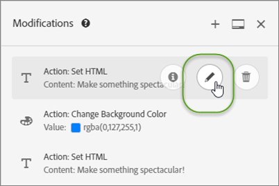
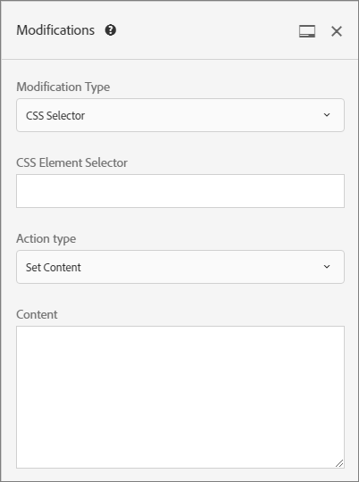
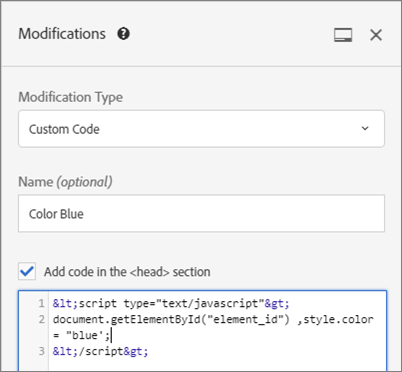

# 修改

關於 [!UICONTROL 修改] 頁面 [!DNL Adobe Target] 可讓您檢視頁面修改內容並新增其他修改內容（CSS選取器、Mbox和自訂程式碼）。

此 [!UICONTROL 修改] 頁面會顯示已在可視化體驗撰寫器(VEC)中對您的頁面所做的所有變更，以及可讓您按一下頁面上的每個元素，然後進行其他變更 [選取動作](/help/main/c-experiences/c-visual-experience-composer/viztarget-options.md#reference_3BD1BEEAFA584A749ED2D08F14732E81). 您所做的每項變更都顯示為[!UICONTROL 修改]清單中的個別動作或元素。您也可以新增修改，包括以下修改類型: CSS 選取器、Mbox。和自訂程式碼。

## 修改概觀 {#section_EE27E7572AA74397BBDED563B2B3D509}

[!UICONTROL 「修改」]頁面顯示 VEC 中對您的頁面所做的所有變更。您所做的每項變更都顯示為[!UICONTROL 修改]清單中的個別動作或元素。


當您使用 VEC 設定內容的傳送方式時，請使用「修改」頁面對 Target 選擇的選取器進行微幅變更。您可以變更內容或 HTML 屬性。您也可以編輯程式碼，在 mbox 內建立 HTML 選件的對等項。

使用「修改」頁面以:

* 檢視在可視化撰寫器中採取的動作。

   

* 編輯現有動作。暫留在所需的修改上，然後按一下&#x200B;**[!UICONTROL 「編輯」]**&#x200B;圖示。

   

   進行變更。

   

* 刪除現有動作. 暫留在所需的修改上，然後按一下&#x200B;**[!UICONTROL 「刪除」]**&#x200B;圖示。

   

* 新增修改。按一下&#x200B;**[!UICONTROL 「新增修改」]**&#x200B;或 + 圖示，然後指定您的變更，如下所述。

   

   請注意，建立修改後，Target 會在「修改」面板的頂部顯示一個 + 圖示，而不是在面板底部顯示「新增修改」按鈕。

* 沿著 Target UI 的側邊垂直固定「修改」面板，或水平固定在底部。按一下[!UICONTROL 「固定」]圖示即可切換兩種設定。

   

   下圖說明固定於畫面底部的「修改」面板:

   

## 新增修改 {#section_C7ABCD5731A048CB8F90EDC31A32EDF9}

1. 若要顯示所選取體驗的[!UICONTROL 「修改」]頁面，請在 VEC 中，按一下&#x200B;**[!UICONTROL 「修改」]** &lt;/> 圖示。

   

   >[!NOTE]
   >
   >若要在表單式體驗撰寫器中開啟「修改」面板，請建立或編輯 HTML 選件。如需詳細資訊，請參閱 [表格式體驗撰寫器](/help/main/c-experiences/form-experience-composer.md#task_FAC842A6535045B68B4C1AD3E657E56E)。

   [!UICONTROL 「修改」]頁面隨即開啟，畫面分成左側的可視化模式和右側的「修改」面板。按一下[!UICONTROL 「固定」]圖示，沿著 Target UI 的側邊垂直固定「修改」面板，或水平固定在底部。請注意，下圖中的體驗 A 先前沒有任何修改。

   

   體驗 B 在右側的[!UICONTROL 「修改」]面板中顯示先前的修改。

   

1. 若要新增修改:

   * 如果之前對體驗未進行任何修改，請按一下右側&#x200B;**[!UICONTROL 「修改」]**&#x200B;面板底部的[!UICONTROL 「新增修改」]按鈕。
   * 如果之前對體驗已經過修改，請按一下右側[!UICONTROL 「修改」]面板頂部的 + 圖示。

   「修改」面板隨即顯示:

   

1. 從&#x200B;**[!UICONTROL 「修改類型」]**&#x200B;下拉式清單中，選擇所需的類型:

   | 修改類型 | 詳細資料 |
   |--- |--- |
   | CSS 選擇器 | 在「CSS 元素選取器」方塊中，指定要修改之所需的 CSS 元素，選取動作類型 (「設定內容」或「設定屬性」)，然後填寫所需資訊和所需內容。 |
   | mbox | 指定mbox名稱和所需內容。<p>**附註**:使用at.js 2.*x*。<p>因應措施：<ul><li>如果使用at.js 2.*x*，請新增CSS選取器修改（而非Mbox修改），並在您的mbox所使用的選取器上新增內容。 </li><li>使用表單式活動(可搭配mbox和at.js 1.*x* 和at.js 2.*x*)。</li><li>使用at.js 1.*x* 在VEC中。</li></ul> |
   | 自訂程式碼 | 指定選擇性名稱，視需要選取或取消選取[!UICONTROL 「在 `<HEAD>` 區段中新增程式碼」]核取方塊，然後新增您的自訂程式碼。<p>如果您選取[!UICONTROL 「在 `<HEAD>` 區段中新增程式碼」]，則自訂程式碼會新增至 `<head>` 區段，不會等候內文或頁面載入事件便開始執行。僅新增 `<script>` 和 `<style>` 元素。新增 `<div>` 標記和其他元素可能會造成其餘的 `<head>` 元素出現在 `<body>` 中。如果您使用at.js，所有選件都會以非同步方式傳送。<p> 如果您取消選取[!UICONTROL 「在 `<HEAD>` 區段中新增程式碼」]，自訂程式碼將會在 `<body>` 標記後立即執行。請使用單一 `<div>` 將所有程式碼換行，以保存 DOM 結構。如果您使用at.js，所有選件都會以非同步方式傳送。<p>如果HTML `<BODY>` 包含 `<SCRIPT>` 和 `<DIV>`，然後 `<DIV>` 附加至 `<BODY>` 和 `<SCRIPT>` 執行於 `<HEAD>`. 此外， `<SCRIPT>` 會載入外部檔案附加至 `<HEAD>`.<p>**注意**: 指令碼會以非同步方式執行。這表示您無法使用例如 `document.write` 或類似的指令碼方法。<p>自訂程式碼提供一個非可視化介面，用於在 VEC、表單式體驗撰寫器和 HTML 選件編輯器中檢視、編輯和新增新動作。該面板提供體驗的程式碼檢視，可幫助您建立更複雜的體驗，微調現有的體驗並疑難排解問題。<p>自訂程式碼適用於熟悉 HTML、JavaScript 和 CSS 的進階使用者。程式碼檢視可協助您潤飾或微調變更，或修正選取器問題。也可用來新增自訂程式碼和動作。您也可以新增一個以上的自訂程式碼，並可選擇為每個自訂程式碼命名。<p>**注意**: 自訂程式碼目前僅適用於 A/B 和體驗鎖定目標 (XT) 活動。如果已套用重新導向選件，則會停用覆蓋的自訂程式碼。<p>自訂程式碼支援下列使用案例:<ul><li>新增要在頁面頂端執行的自訂 JavaScript、HTML 或 CSS</li><li>修改之後檢視或編輯 VEC 所產生的程式碼</li><li>設定選取器的 HTML 內容 (僅限 CSS 選取器)</li><li>設定 HTML 元素的屬性</li><li>新增要在地區 mbox 中傳送的選件內容</li><li>在 DOM 就緒時交換，使用 jQuery</li><li>在 DOM 就緒上交換，無 jquery (不支援 Internet Explorer 8)</li><li>透過 &quot;elementOnLoad&quot; 外掛程式，與 DOM 輪詢交換</li><li>自訂重新導向</li></ul>自訂程式碼提供:<ul><li>行號讓使用性更好。</li><li>語法醒目提示，協助您避免 HTML 選件的語法不正確。</li><li>可建立多個自訂程式碼，並為每個程式碼提供選擇性名稱。建立多個自訂程式碼可讓日後偵錯更加輕鬆。例如，您可以使用描述性名稱為每個修改建立個別的自訂程式碼，而不是建立單一自訂程式碼來完成多個修改。擁有個別的自訂程式碼使您的修改更加模組化且易於管理。請注意，活動中的多個自訂程式碼無法保證依照其建立順序執行。</li></ul>「修改」面板分成可視化模式和程式碼模式。兩種模式會維持同步。在視覺上所做的每一項修改，在程式碼檢視中都有相應的一列。同樣地，程式碼檢視提交的每個變更都會顯示在視覺體驗中。按一下程式碼檢視中的任何一列，會在視覺化頁面上選取相應的元素。<p>自訂程式碼支援 HTML、指令碼和樣式。任何有效的 HTML 程式碼或指令碼都可新增或編輯。 |

1. 視需要新增其他修改。

## 自訂程式碼使用案例 {#section_26CB3360097D400FB02E20AE5FDBA352}

**[!UICONTROL 「自訂程式碼」]**&#x200B;面板包含在頁面載入開始時執行的程式碼。

您可以在 `<head>` 標記中執行 JavaScript 程式碼。程式碼執行時不會等待 DOM 中出現 `<body>` 標記。

後續視覺化動作的選取器，會根據此標籤中新增的 HTML 元素而定。

「自訂程式碼」面板通常用於將 JavaScript 或 CSS 新增至頁面頂端。



使用&#x200B;**[!UICONTROL 「自訂程式碼」]**&#x200B;標籤來執行下列動作:

* 使用內嵌 JavaScript 或外部 JavaScript 檔案的連結

   例如，若要變更元素的顏色:

   ```javascript
   <script type="text/javascript"> 
   document.getElementById("element_id").style.color = "blue"; 
   </script> 
   ```

* 設定內嵌樣式或外部樣式表的連結

   例如，若要定義覆蓋元素的類別:

   ```html
   <style> 
   .overlay 
   { position: absolute; top:0; left: 0; right: 0; bottom: 0; background: red; } 
   </style> 
   ```

* 新增 HTML 程式碼片段來定義新元素

   例如，使用下列 HTML 程式碼片段，採用以上定義的 CSS 類別來建立覆蓋 `<div>`:

   ```html
   <div class="overlay"></div>
   ```

* 在 DOM 就緒時交換，使用 jQuery

下列使用JQuery的範例假設客戶的網站在 [!DNL Target] 會執行選件。

```javascript
<style>#default_content {visibility:hidden;}</style> 
<script> 
jQuery( document ).ready(function() { 
    jQuery("#default_content").html( "<span style='color:red'>Hello <strong>Again</strong></span>" ); 
    jQuery("#default_content").css("visibility","visible"); 
}); 
</script> 
```

* 在 DOM 就緒上交換，無 jQuery (不支援 Internet Explorer 8)

   ```javascript
   <style>#default_content {visibility:hidden;}</style> 
   <script> 
   document.addEventListener("DOMContentLoaded", function(event) {  
       document.getElementById("default_content").innerHTML = "<span style='color:red'>Hello <strong>Again</strong></span>"; 
       document.getElementById("default_content").style.visibility="visible"; 
   }); 
   </script> 
   ```

* 自訂重新導向，傳遞現有參數、`s_tnt` 參數 (適用於舊版與 Analytic 的整合)、轉介者參數及 mbox 工作階段

   ```javascript
   <style type="text/css">body{display:none!important;}</style> 
   <script type="text/javascript"> 
    var qs='';window.location.search?qs=window.location.search+'&':qs='?'; 
    window.location.replace('//www.mywebsite.com/'+qs+'s_tnt=${campaign.id}:${campaign.recipe.id}:${campaign.recipe.trafficType}&s_tntref='+encodeURIComponent(document.referrer)+'&mboxSession='+mboxFactoryDefault.getSessionId().getId()+''+window.location.hash+''); 
   </script> 
   ```

* 新增 Adobe Target 體驗範本以用於自訂程式碼。Target 體驗範為具有可設定輸入的預先編碼樣本，以用於執行常見的行銷人員使用案例。這些體驗範本可透過 VEC 或表單式體驗撰寫器免費提供給開發人員和行銷人員，做為執行常見使用案例的起點。使用案例包括 lightbox、carousel、countdown 等。

   如需詳細資訊，請參閱[體驗範本](/help/main/c-experiences/c-visual-experience-composer/c-vec-code-editor/experience-templates.md#concept_109BBD7EABC04DD39E6B7B1687786652)。

## 自訂程式碼最佳作法 {#section_10DFFD9FB92A43C1BB444A45E0272B28}

**請一律將自訂程式碼包裝在一個元素中。**

例如:

```html
<div id="custom-code"> 
// My Code goes here 
</div>
```

如果需要任何修改，請在此容器內變更。

如果不再需要自訂程式碼，只要將此容器保持空白即可，不要移除。這可確保其他體驗修改不受影響。

**針對在程式碼編輯器中對頁面所做的修改，請勿使用元素 ID &quot;CDQID&quot;。**

對於 Target 在頁面上修改的任何元素，Target 會套用值為 &quot;CDQID&quot; 的新元素 ID。因為此 ID 由 Target 套用，不可再用於程式碼編輯器中任何進一步的修改或調整。

**請勿在自訂程式碼指令碼中執行 document.write 動作。**

指令碼會非同步執行。此經常造成 `document.write` 動作出現在頁面上的錯誤位置。不建議在自訂程式碼中建立的指令碼中使用 `document.write`。

**如果您建立元素然後修改，請勿刪除原始元素。**

每個變更都會在「修改」面板中建立一個新元素。因為第二個動作會修改元素 1，如果刪除元素 1，則動作就沒有可修改的項目，變更也就失去作用。如需詳細資訊，請參閱以下的「疑難排解」。

**如果您對以相同 URL 為目標的兩個活動使用自訂程式碼功能，請特別小心。**

對於以相同 URL 為目標的兩個活動，如果您使用自訂程式碼功能，則兩個活動都會將 JavaScript 注入頁面中。Target 會自動決定傳送內容的順序。請確定程式碼不依賴位置。您必須確保程式碼中沒有衝突。

## 疑難排解自訂程式碼 {#section_6C965CBC31C348D7AA5B57B63DAB9E7F}

**我收到警告，說明由於頁面中的結構變更，無法套用動作。其含義是:**

訊息指出自從上次儲存此活動之後，您頁面的結構已變更。

使用「瀏覽」模式可能會遇到遺失的選取器。如警告訊息所示，建議您刪除再重建每一個體驗，以確保顯示的內容符合您所預期。


***當我刪除元素時，出現警告指出「刪除此動作可能會影響後續動作」。其含義是:***

例如，如果您已採取兩個動作:

* 已新增類別至元素 1
* 已編輯元素 1 的 HTML

每個變更都會在「修改」面板中建立一個新元素。因為第二個動作會修改元素 1，如果您刪除元素 1，第二個動作便沒有任何項目需要修改，因此變更不再有作用。

換句話說，如果新增帶有文字的元素，然後在個別動作中，使用不同的文字編輯該元素，則「修改」面板會將這兩個動作顯示為個別元素。編輯元素時，您會建立可修改您原始建立元素的新元素，包含編輯的文字。如果您之後刪除原始元素，編輯後文字將找不到編輯後的元素，因此將不會顯示。第二個元素會維持在元素的清單中，但它不會影響頁面，因為它變更的元素已不再存在。

***我在指令碼中使用 `document.write` 來建立的元素沒有出現在我預期的地方。***

指令碼會非同步執行。此經常造成 `document.write` 動作出現在頁面上的錯誤位置。Adobe 建議不要在自訂程式碼建立的指令碼中使用 `document.write`。

***我的 JavaScript 會顯示自訂程式碼中的錯誤。*** 

任何非有效 JavaScript 的內嵌 JavaScript 都會在自訂程式碼中顯示錯誤。

***我無法復原自訂程式碼中的變更。*** 

目前，「修改」面板和自訂程式碼中的編輯和刪除動作不支援復原。復原其中一個操作可能會導致 VEC 中的體驗與自訂程式碼中可見的實際動作不一致。但是，自訂程式碼中的動作處於正確狀態，而且對傳送沒有影響。這是 UI 問題。若要重新整理體驗，請儲存再重新開啟，或移至下一步再回來。任一動作都會重新載入體驗，因此它會按預期顯示，並與「修改」面板中的動作一致。

**自訂代碼在 Internet Explorer 8 中未產生預期結果。**

Target 不再支援 IE8。
