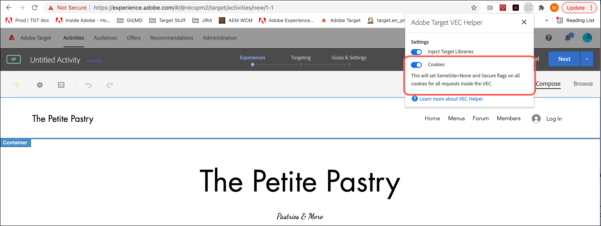

# 疑難排解可視化體驗撰寫器和增強體驗撰寫器的相關問題

顯示中有時出現的問題和其他問題 [!DNL Adobe Target] [!UICONTROL 視覺體驗作曲家] (VEC)和 [!UICONTROL 增強的體驗作曲家] (EEC)。

## Google Chrome SameSite cookie 執行政策對 VEC 和 EEC 有何影響？ {#samesite}

請注意使用以下Chrome版本時影響VEC和EEC的更改：

>[!NOTE]
>
>以下更改會影響下面概述的所有三個更新：
>
> * 將 *不* 在未安裝VEC幫助程式擴展並為站點的受密碼保護頁面啟用的情況下，可以使用VEC。 您的站點登錄Cookie被視為第三方Cookie，不會在VEC編輯器中以「瀏覽」模式隨登錄請求一起發送。 唯一的例外是您的站點登錄Cookie已具有 `SameSite=None` 和 `Secure` 屬性集。


**Chrome 94（2021年9月21日）**:計畫對Chrome 94版本（2021年9月21日）進行即將進行的更改，以下更改將影響所有使用Chrome 94+瀏覽器版本的用戶：

* 命令行標誌 `--disable-features=SameSiteByDefaultCookies,CookiesWithoutSameSiteMustBeSecure` 將被刪除。

**鉻91（2021年5月25日）**:對Chrome 91版本（2021年5月25日）實施的更改將影響所有使用Chrome 91+瀏覽器版本的用戶：

* The flags `#same-site-by-default-cookies` and `#cookies-without-same-site-must-be-secure` have been removed from `chrome://flags`. This behavior is now enabled by default.

**鉻80（2020年8月）**:隨著2020年8月實施的更改，所有使用Chrome 80+瀏覽器版本的用戶：

* 將 *不* 能夠下載 [!DNL Target] 編輯活動時（當站點上尚未提供這些檔案時）建立庫。 這是因為下載呼叫是從客戶域向安全域發出 [!DNL Adobe] 域，並作為未經驗證而被拒絕。
* 歐共體將 *不* 函式，因為它無法為Cookie設定SameSite屬性 `adobemc.com domain`。 如果沒有此屬性，瀏覽器將拒絕這些Cookie，導致EEC失敗。

### 確定阻止的Cookie

要確定哪些Cookie因SameSite Cookie實施策略而被阻止，請使用Chrome中的「開發人員工具」。

1. 要訪問「開發人員工具」，在查看Chrome中的VEC時，按一下 **[!UICONTROL 省略號]** 表徵圖，位於Chrome的右上角> **[!UICONTROL 更多工具]** > **[!UICONTROL 開發人員工具]**。
1. 按一下 **[!UICONTROL 網路]** 頁籤，然後查找已阻止的cookie。

   >[!NOTE]
   >
   >Use the **[!UICONTROL Has blocked cookies]** checkbox to make finding blocked cookies easier.

   下圖顯示了阻止的cookie:

   

### [!DNL Adobe Target] VEC幫助程式擴展

從0.7.1版開始， [!DNL Adobe Target] VEC幫助程式瀏覽器擴展添加 `SameSite=None` 和 `Secure` 在擴展UI中開啟「Cookie」切換時，對來自VEC內編輯的網頁的響應的所有Cookie的屬性：



### 備選方案和變通辦法

使用以下選項之一確保VEC和EEC繼續按預期工作：

* 下載並使用更新的 [VEC幫助程式擴展](https://chrome.google.com/webstore/detail/adobe-target-vec-helper/ggjpideecfnbipkacplkhhaflkdjagak?hl=en)。
* 使用Mozilla Firefox瀏覽器。 Firefox尚未強制執行此策略。
* 使用以下標誌從命令行運行GoogleChrome，直到2021年9月21日。 9月21日之後，需要Cookie的功能在VEC中將不再有效，如登錄或Cookie同意彈出窗口。 If you update to Chrome 94, you must manually generate cookies with `SameSite=none` and `Secure` on your websites.

   ```
   --disable-features=SameSiteByDefaultCookies,CookiesWithoutSameSiteMustBeSecure
   ```

## 是 [!DNL Target] 支援多級Iframe?

[!DNL Target] 不支援多重層級 iframe。如果網站載入的iframe具有子iframe，則at.js僅與父iframe交互。 [!DNL Target] 資料庫不會與子項 iframe 互動。

作為因應措施，您可以使用子項 iframe 的 URL 在體驗中新增頁面。

## 當我嘗試編輯頁面時，我只看到了進度環而非我的頁面。(VEC 和 EEC) {#section_313001039F79446DB28C70D932AF5F58}

如果URL包含#字元，則可能會出現這種情況。 若要修正問題，請在可視化體驗撰寫器中切換至「瀏覽」模式，然後切換回「撰寫」模式。進度環應該會消失，並且頁面應該會載入。

## 內容安全策略(CSP)標頭阻止 [!DNL Target] 我網站上的庫。 (VEC 和 EEC) {#section_89A30C7A213D43BFA0822E66B482B803}

如果您的網站的 CSP 標頭封鎖 Target 資料庫，然後載入網站但防止編輯，請確保 Target 資料庫未遭到封鎖。

>[!NOTE]
>
>除了下列資訊外，您還可以使用適用於 Google Chrome 的 [Adobe Target VEC Helper 瀏覽器擴充功能](/help/main/c-experiences/c-visual-experience-composer/r-troubleshoot-composer/vec-helper-browser-extension.md)。


作為解決方案，您可以設定 Requestly 規則來移除 CSP 標頭，如下所示:


您可以為造成資源無法在 VEC 內載入的任何標頭設定類似的 Requestly 規則。

對於 Requestly，一旦需要移除標頭，您就應該執行下列任一動作:

* 為要在 VEC 中開啟的 URL 新增 URL 規則，如此一來，便僅有那些 URL 的標頭會移除。
* 在 VEC 中編輯時啟用規則，並在不使用 VEC 時停用規則。

## 重新編輯已儲存的活動時，VEC 或 EEC 似乎損毀或未初始化。(VEC 和 EEC) {#section_5AC3BA8F8FBB451EA814F298D0645E54}

如果在定義體驗之後，於可視化體驗撰寫器外部變更了網站，開啟活動進行重新編輯時，會找不到稍早採取動作所在的選取器。頁面似乎損毀，並且未顯示警告。

## VEC 或 EEC 未顯示我的旋轉橫幅和包含 JavaScript 的其他內容。(VEC 和 EEC) {#section_8B5BE6EB050B42D6A14A054724C41330}

依預設，可視化體驗撰寫器會封鎖 JavaScript 元素。如果您在可視化體驗撰寫器設定中停用 JavaScript，則可以使用這些元素。根據網站的設定方式，一些項目可能會繼續不正確地顯示或保持無法使用。

## 在頁面上變更一個元素時，變更了多個元素。(VEC 和 EEC) {#section_309188ACF34942989BE473F63C5710AF}

如果您在頁面的多個元素上使用相同的 DOM 元素 ID，變更這些元素中的一個會變更具有該 ID 的所有元素。若要防止發生此問題，一個 ID 應該僅在每個頁面上使用一次。這是HTML的標準最佳做法。 有關詳細資訊，請參見 [頁面修改方案](/help/main/c-experiences/c-visual-experience-composer/r-troubleshoot-composer/vec-scenarios.md#concept_A458A95F65B4401588016683FB1694DB)。

## 我無法編輯 iFrame-busting 網站的體驗。(VEC 和 EEC) {#section_9FE266B964314F2EB75604B4D7047200}

此問題可透過啟用增強體驗撰寫器來解決。Click **[!UICONTROL Administation]** > **[!UICONTROL Visual Experience Composer]**, then select the check box that enables the Enhanced Experience Composer. 增強體驗撰寫器使用 Adobe 管理的 Proxy 來載入您的頁面進行編輯。此代理允許在iFrame Brige站點上進行編輯，並允許在尚未添加Adobe Target代碼的站點和頁面上進行編輯。 在新增程式碼之後，才會將活動傳送至網站。有些網站可能無法透過增強體驗撰寫器載入，在此情況下，您可以取消勾選此選項，以透過 iFrame 載入可視化體驗撰寫器。

>[!NOTE]
>
>對於您在本機託管的頁面或無法從您的網路外部存取的頁面，Adobe Proxy 伺服器無法存取這類頁面，且無法在 EEC 中開啟。這些頁面可能包括測試 URL、使用者接受測試 (UAT) URL，或本機主控的頁面。

## 我想要在尚未完成 mbox/target 實施的頁面上設定測試。(VEC 和 EEC) {#section_DE63BCCB5B124E10A71FA579B582A80A}

請參閱以上的「我無法編輯 iFrame-busting 網站的體驗」。

## 具有「編輯文字/HTML」或「變更文字/HTML」的粗體和斜體文字樣式未在我的頁面上顯示。有時文字會在套用這些樣式變更之後消失。(VEC 和 EEC) {#section_7A71D6DF41084C58B34C18701E8774E5}

如果您對 A/B 或體驗鎖定目標活動使用可視化體驗撰寫器中的&#x200B;**[!UICONTROL 編輯文字/HTML]**，或對自動個人化或多變數測試活動使用&#x200B;**[!UICONTROL 變更文字/HTML]**，以讓文字粗體或斜體，這些樣式可能無法在頁面上套用，或文字會從可視化體驗撰寫器中的頁面消失。This happens because of the way the rich-text editor applies these styles might interfere with the website markup.

如果您看見此問題:

1. 按一下 RTF 格式編輯器中的&#x200B;**[!UICONTROL 「HTML」]**&#x200B;按鈕來進入來源編輯模式。
1. 尋找樣式文字元素。

   * 針對粗體文字，將 `<strong>` 元素變更為 `<b>`。

   * 針對斜體文字，將 `<em>` 元素變更為 `<i>`。

## 針對自動個人化活動，影像交換在 VEC 或 EEC 中似乎損毀。(VEC 和 EEC) {#section_88AABFDFE6A3420299B0D508B12A3994}

新增影像選件至位置以取得 VEC 或 EEC 中原始影像空間的完整尺寸。在傳遞時，影像不會展開並且如原樣顯示，因此對傳遞沒有影響。
