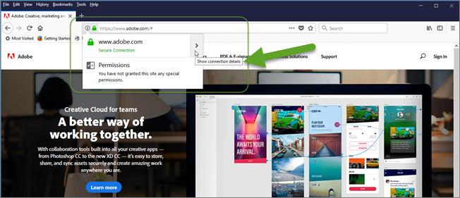

# 疑難排解[!UICONTROL 增強體驗撰寫器的相關問題]

顯示問題有時在 [!DNL Adobe Target] [!UICONTROL 增強的體驗作曲家] (EEC)。

## EEC 不會載入無法在公用 IP 上存取的內部 QA URL。 {#section_D29E96911D5C401889B5EACE267F13CF}

這可以通過允許列出以下IP地址來解決。 這些IP地址用於EEC代理使用的Adobe伺服器。 只有針對活動編輯才需要這些資訊。訪問您站點的訪問者不需要列出這些IP地址。

請讓您的IT團隊允許列出以下IP地址：

* 34.253.100.20
* 34.248.100.23
* 52.49.228.246
* 54.205.42.123
* 107.22.177.39
* 52.201.5.105
* 52.193.211.177
* 18.180.24.249
* 52.194.154.154

您可能會在 [!DNL Target]:

`Error: Your website domain (ISP) is blocking the [!UICONTROL Enhanced Experience Composer]. You can allowlist the [!UICONTROL Enhanced Experience Composer]'s IP addresses or turn off [!UICONTROL Enhanced Experience Composer] in [!UICONTROL Configure] > [!UICONTROL Page Delivery] menu.`

下列是您可能會看見此錯誤訊息的原因和修正此情況的補救方式:

* **問題：** 您的網站域(ISP)正在阻止 [!UICONTROL 增強的體驗作曲家]。

   **補救：** 允許列出上面列出的IP地址。

* **問題：** 允許列出IP地址，但您的網站不支援TLS 1.2版。 [!DNL Target] 當前使用預設配置1.2。在 [!DNL Target] 18.4.1（2018年4月25日），預設配置支援TLS 1.0。有關詳細資訊，請參見 [TLS（傳輸層安全性）加密更改](/help/main/c-implementing-target/c-considerations-before-you-implement-target/tls-transport-layer-security-encryption.md#concept_CC1001E9D3AE4BABAF90B8311B0A6451)。

   **解決方案:**[!UICONTROL  請參閱下列問題: 增強可視化體驗撰寫器不會在我使用 TLS 1.2 的網站上安全頁面中載入。]

## EEC 不會在我使用 TLS 1.0 的網站上安全頁面中載入。(僅限 EEC) {#section_C5B31E3D32A844F68E5A8153BD17551F}

您可能會在「The Conter」中看到上述錯誤消息 [!UICONTROL 增強的視覺體驗作曲家] 不會載入到我網站上的安全頁面。」 如果上述IP地址被允許列出，但您的網站不支援TLS 1.2版。 [!DNL Target] 當前使用預設配置1.2。在 [!DNL Target] 18.4.1（2018年4月25日），預設配置支援TLS 1.0。有關詳細資訊，請參見 [TLS（傳輸層安全性）加密更改](/help/main/c-implementing-target/c-considerations-before-you-implement-target/tls-transport-layer-security-encryption.md#concept_CC1001E9D3AE4BABAF90B8311B0A6451)。

若要使用 Firefox 檢查您的網站的 TLS 版本 (其他瀏覽器有類似的步驟):

1. 在 Firefox 中開啟受影響的網站。
1. 在瀏覽器的位址列按一下&#x200B;**[!UICONTROL 「顯示網站資訊」]**&#x200B;圖示。

   

1. 按一下&#x200B;**[!UICONTROL 「顯示連線詳細資料」]**>**[!UICONTROL 「詳細資訊」]**。

   

1. 在技術詳細資料下檢查 TLS 版本資訊:

   

1. 如果發現網站顯示 TLS 1.0，請參閱 [TLS (傳輸層安全性) 加密變更](/help/main/c-implementing-target/c-considerations-before-you-implement-target/tls-transport-layer-security-encryption.md#concept_CC1001E9D3AE4BABAF90B8311B0A6451)，獲得 Target 的 TLS 支援政策相關資訊。若要補救目前狀況 (2018 年 9 月 12 日前有效)，請聯絡[客戶服務](/help/main/cmp-resources-and-contact-information.md#reference_ACA3391A00EF467B87930A450050077C)以取得您的 TLS 版本和網域的組態。

## 載入已啟用 Proxy 的網站時，我看到逾時或「拒絕存取」錯誤。(僅限 EEC) {#section_60CBB9022DC449F593606C0E6252302D}

確定您的環境中未封鎖 Proxy IP。
