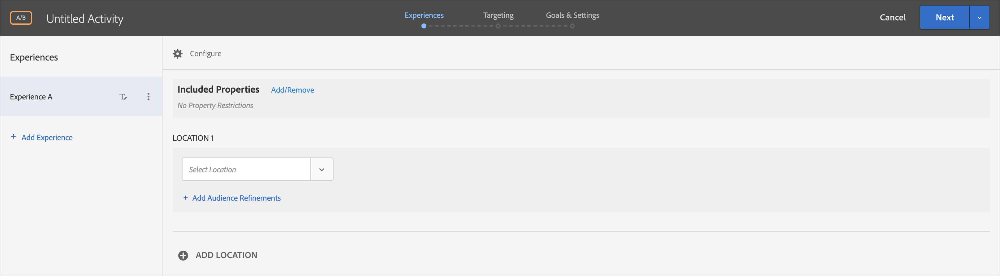

# 表單式體驗撰寫器

此 [!DNL Adobe Target] [!UICONTROL 表單式體驗撰寫器] 是非視覺化體驗和選件建立介面，對於建立體驗以供在中使用很實用 [!UICONTROL A/B測試], [!UICONTROL 體驗鎖定], [!UICONTROL Automated Personalization]，和 [!UICONTROL Recommendations] 活動 [!UICONTROL 可視化體驗撰寫器] (VEC)無法使用或實際使用。 例如，您可以使用表單式體驗撰寫器來建立體驗和選件，以便在電子郵件、資訊站和語音助理中傳送。

如果您要建立 [!UICONTROL Recommendations] 活動，則沒有體驗。 選擇您的條件和設計。如果您選擇多個條件或設計， [!UICONTROL 目標] 自動產生體驗。

1. 按一下&#x200B;**[!UICONTROL 「建立活動」]**，然後選取您要建立的活動類型。

   此 [!UICONTROL 表單式體驗撰寫器] 可供 [!UICONTROL A/B測試], [!UICONTROL 體驗鎖定], [!UICONTROL Automated Personalization]，和 [!UICONTROL Recommendations] 活動。

1. 選擇 **[!UICONTROL 表單]** 從 [!UICONTROL 建立活動] 對話框。

1. （條件性）選擇工作區和屬性。

1. 按&#x200B;**[!UICONTROL 「下一步」]**。

   此 [!UICONTROL 表單式體驗撰寫器] 開啟。

   

   如果您要建立 [!UICONTROL Recommendations] 活動。 [!UICONTROL Recommendations 活動未包括體驗。]

1. 按一下「[!UICONTROL 未命名的活動].&quot;
1. 選取位置。

   當您按一下 [!UICONTROL 選擇位置] 框中，將顯示可用位置清單。 選取這些位置中的一個。

   您也可以輸入此處未列出的位置。如果您尚未在頁面上建立或檢視 mbox，則此項目相當實用。輸入位置的名稱。輸入尚未存在的位置時請注意。如果拼字或大寫不符合進行 mbox 呼叫時使用的拼字或大寫，將不會傳送活動。手動輸入的位置將保存到可用位置清單中。 下次您嘗試選取手動輸入的位置時，將可從 [!UICONTROL 選擇位置] 該活動的下拉式清單。

   >[!NOTE]
   >
   >在活動建立期間建立手動輸入的位置不會自動建立新位置。 位置名稱僅儲存在活動的內容中。 有內容傳送呼叫時，就會建立位置。 在建立位置後，該位置將可用於其他活動、建立對象等。 從可用位置的下拉式清單中。

1. 按一下 **[!UICONTROL 新增對象細分]**，選擇一或多個 [對象](/help/main/c-target/target.md#concept_A782F8481A5041EBA75103CB26376522) 針對此活動，然後按一下 **[!UICONTROL 完成]**.

   

   在 [!UICONTROL 表單式體驗撰寫器]，細分已取代為完整的對象功能。 現有活動的細分已移轉至 [僅限於此活動的對象](/help/main/c-target/creating-activity-only-audience.md#concept_A6BADCF530ED4AE1852E677FEBE68483).

1. 選取您要在該位置中顯示的內容類型。

   

1. 針對您選取的內容類型指定內容。

   **變更 HTML 選件:** 選擇 HTML 選件。

   **變更影像選件:** 選擇儲存在 Target 內容資料庫中的影像。

   您也可以新增連結至影像 (點進、目的地、登陸等等)。

   1. 按一下[!UICONTROL 「變更影像選件」]。
   1. 選取需要的影像，然後按一下[!UICONTROL 「編輯連結」]。
   1. 指定您的網站上需要的 URL 或頁面，然後按一下[!UICONTROL 「更新」]。

   **變更 JSON 選件:** 選擇 JSON 選件。

   **變更體驗片段:** 選擇體驗片段。如需詳細資訊，請參閱 [體驗片段](/help/main/c-experiences/c-manage-content/aem-experience-fragments.md).

   **變更重新導向選件:** 選擇重新導向選件。如需詳細資訊，請參閱 [建立重新導向選件](/help/main/c-experiences/c-manage-content/offer-redirect.md).

   **變更遠端選件:** 選擇遠端選件。如需詳細資訊，請參閱 [建立遠端選件](/help/main/c-experiences/c-manage-content/about-remote-offers.md).

   **建立 HTML 選件:**

   1. 按一下[!UICONTROL 「選件」]，然後選取[!UICONTROL 「代碼選件」]索引標籤。
   1. 按一下[!UICONTROL 「建立] > [!UICONTROL HTML 選件」]。
   1. 輸入選件名稱。
   1. 在「程式碼」方塊中，輸入或貼上 HTML 程式碼。
   1. 按一下[!UICONTROL 「儲存」]。

   **建立 JSON 選件:**

   1. 按一下[!UICONTROL 「選件」]，然後選取[!UICONTROL 「代碼選件」]索引標籤。
   1. 按一下「[!UICONTROL 建立] > [!UICONTROL JSON 選件]」。
   1. 輸入選件名稱。
   1. 在「程式碼」方塊中，輸入或貼上 JSON 程式碼。
   1. 按一下[!UICONTROL 「儲存」]。

   **新增建議：**

   若為Recommendations活動，「內容」下拉式清單會提供 [!UICONTROL 新增建議] 選項。 按一下&#x200B;**[!UICONTROL 「新增建議」]**，然後選取頁面類型。然後遵循介面中定義的步驟來[建立Recommendations 活動](/help/main/c-recommendations/t-create-recs-activity/create-recs-activity.md)。

   在表單式體驗撰寫器選取「Recommendations」條件時，已有直接連結，可連結至選取的條件卡片，讓您輕鬆快速編輯條件。

   

   在 Target 三步驟引導式工作流程的「鎖定目標」頁面:

   

   **新增優惠方案決策：**

   新增在中建立的選件 [!DNL Adobe Journey Optimizer] (AJO)至 [!DNL Adobe Target] 活動，使用offer decisioning向網站或行動網站上的訪客呈現最佳動態選件和體驗。 此選項可供手動使用 [!UICONTROL A/B測試] 和 [!UICONTROL 體驗鎖定] (XT)活動。

   如需詳細資訊，請參閱[使用報價決策](/help/main/c-integrating-target-with-mac/ajo/offer-decision.md)。

1. (可選，適用於 [!UICONTROL A/B測試], [!UICONTROL Automated Personalization]，和 [!UICONTROL 體驗鎖定] 活動)若要對其他位置重複此程式，請按一下 **[!UICONTROL 添加位置]** 並設定位置和內容。
1. 按一下 **[!UICONTROL 下一個]**，然後照常對您的活動類型完成活動建立步驟。

* [建立 A/B 測試](/help/main/c-activities/t-test-ab/t-test-create-ab/test-create-ab.md)
* [建立體驗鎖定目標活動](/help/main/c-activities/t-experience-target/t-xt-create/xt-create.md#task_D6B3429AC31549E1A70EDF04B3DDC765)
* [建立 Recommendations 活動](/help/main/c-recommendations/t-create-recs-activity/create-recs-activity.md#task_6874328773C64C44A73F0A130AD3F96F)

## 訓練影片：表單式撰寫器 

此影片提供表單式撰寫器的示範。

* 使用表單式體驗撰寫器建立活動
* 瞭解使用表單式體驗撰寫器與可視化體驗撰寫器的時機
* 使用細分來鎖定位置

>[!VIDEO](https://video.tv.adobe.com/v/17390)
