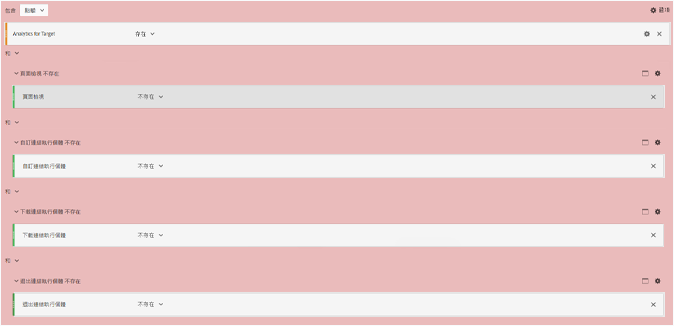

# 在 A4T 中將膨脹的造訪和訪客計數減到最少

有關可協助您在使用 [!DNL Adobe Analytics] 作為 [!DNL Adobe Target] (A4T) 的報告來源時，將膨脹的造訪和訪客計數影響降到最低的資訊。

>[!IMPORTANT]
>在 2016 年 11 月 14 日，Adobe Analytics 已針對 Target 使用 Analytics 報表 (A4T) 的客戶變更部分資料的處理方式。這些變更讓 Adobe Target 資料更能與 Adobe Analytics 的資料模型對應。這些變更已對使用 A4T 的所有客戶展開。這些變更特別能解決在執行 Target 活動時，有些客戶所注意到膨脹的訪客計數的問題。
>
>此變更不溯及既往。 如果您的歷史報表顯示膨脹的計數，而您想要從報表中將其排除，您可以建立虛擬報表套裝，如下所述。
>
>此外，有數個 JavaScript 程式庫已更新，以協助將膨脹的計數降至最低。 Adobe 建議您升級至下列程式庫版本 (或更新版本)：
>
>* Experience Cloud 訪客 ID 服務: visitorAPI.js 版本 2.3.0 或更新版本。
>* Adobe Analytics: appMeasurement.js 版本 2.1。
>* Adobe Target: at.js 0.9.6 版或更新版本 (若 A4T 使用重新導向選件，則不包括 1.1.0 版)。

## 哪些部分有了變更？ {#section_9CCF45F5D66D48EBA88F3A178B27D986}

當使用 [!DNL Adobe Analytics] 來測量 [!DNL Target] 活動 (稱為 A4T) 時，[!DNL Analytics] 會收集當頁面上沒有 [!DNL Target] 活動時無法提供的額外資料。 這是因為 [!DNL Target] 活動會在頁面頂端觸發呼叫，但 [!DNL Analytics] 通常是在頁面底部觸發其資料收集呼叫。 在目前的 A4T 實作中，每當 [!DNL Target] 活動作用中時，Adobe 都會包含這項額外資料。 此後，Adobe 僅在同時觸發 [!DNL Target] 和 [!DNL Analytics] 標記時，才會包含這項額外資料。

## Adobe 為何做出此變更？ {#section_92380A4BD69E4B8886692DD27540C92A}

Adobe 對自己的資料準確性和品質感到自豪。 當觸發 [!DNL Target] 標記但未觸發 [!DNL Analytics] 標記時，Analytics 會記錄「部分資料」(有時稱為「非拼接點擊」)。 如果沒有 [!DNL Target] 活動，[!DNL Analytics] 就不會擷取這些非拼接點擊。 儘管在 [!DNL Analytics] 報告中包含此部分資料會提供額外資訊，但是當沒有 [!DNL Target] 活動執行時，還會造成各期的歷史資料不一致。 此狀況可能會為一段時間內分析趨勢的 [!DNL Analytics] 使用者帶來問題。 為了確保 [!DNL Analytics] 中資料的一致性，Adobe 會排除所有部分資料。

## 是什麼造成了部分資料？ {#section_C9C906BEAA7D44DAB9D3C03932A2FEB8}

Adobe 有一些客戶遇過在 [!DNL Analytics] 中的部分資料比率很高的情況。 部分資料比率很高可能是因為實作不當所造成，但也有其他合理的原因。

部分資料經確認的原因包括下列各項：

* **不相符的報表套裝 ID (實作):** 在活動設定指定的報表套裝不符合傳送測試所在頁面上的報表套裝。無法在 [!DNL Analytics] 伺服器上協調資料，所以看起來像是部分資料。
* **頁面速度緩慢：**[!DNL Target] 呼叫位在頁面頂端，[!DNL Analytics] 呼叫則通常位在頁面底部。 如果頁面載入速度很慢，則在 [!DNL Target] 呼叫觸發後、[!DNL Analytics] 呼叫觸發前，訪客離開頁面的可能性會提高。 在連線通常較緩慢的行動網站上，頁面速度緩慢特別會造成問題。
* **頁面錯誤：**&#x200B;如果發生 JavaScript 錯誤或每個接觸點 (Experience Cloud ID 服務、Target 和 Analytics) 都未觸發的其他狀況，便會產生部分資料。
* **[!DNL Target] 活動中的重新導向選件：**&#x200B;對於使用 A4T 的活動中的重新導向選件，您的實作必須符合特定的最低要求。 此外，還有您必須知道的重要資訊。 如需詳細資訊，請參閱[重新導向選件 - A4T 常見問題集](/help/main/c-integrating-target-with-mac/a4t/r-a4t-faq/a4t-faq-redirect-offers.md#section_FA9384C2AA9D41EDBCE263FFFD1D9B58)。
* **舊版程式庫：**&#x200B;在過去一年，Adobe 已對我們的 JavaScript 程式庫 ([!DNL appMeasurement.js]、`at.js` 和 `visitorAPI.js`) 進行多項改善，以確保盡可能有效率地傳送資料。 若要進一步了解實作需求，請參閱[實作之前](/help/main/c-integrating-target-with-mac/a4t/before-implement.md#concept_046BC89C03044417A30B63CE34C22543)。

## 減少部分資料的最佳做法為何？ {#section_065C38501527451C8058278054A1818D}

檢閱以下步驟來減少部分資料的收集：

| 步驟 | 任務 |
| --- | --- |
|  | 確保 [!DNL Target] 中選取的報表套裝與顯示活動的頁面上的報表套裝相同。 |
|  | 確保 visitorAPI.js、appMeasurement.js 和 at.js 程式庫都採用 A4T 相容的版本。 若要進一步瞭解實作需求，請參閱[實作之前](/help/main/c-integrating-target-with-mac/a4t/before-implement.md)。 |
|  | 確保已在離開頁面的所有 [!DNL Target] 和 [!DNL Analytics] 呼叫上設定 SDID，而且它們都相符。 使用網路分析器或偵錯工具來確保 [!DNL Target] 呼叫上的 `mboxMCSDID` 參數符合 [!DNL Analytics] 呼叫中的 SDID 參數。 |
|  | 確認實作程式庫在您的網站上以正確的順序載入網站。如需詳細資訊，請參閱 [Analytics for Target 實作](/help/main/c-integrating-target-with-mac/a4t/a4timplementation.md)。 |

## 該如何知道我有多少部分資料？ {#section_89B663E2824A4805AB934153508A0F4B}

雖然此資訊無法直接在 [!DNL Analytics] 中取得，您可以聯絡 Adobe 客戶服務來擷取「部分資料」報表。此報表用意在協助偵錯。

## 該如何檢視沒有部分資料的歷史趨勢？ {#section_4C9DED560FAD4428B362DDA2064897C3}

此處理變更只會影響發行日期 (2016 年 11 月 14 日) 之後的資料。 如果您想要調整歷史量度使其相符，Adobe 建議您建立區段來排除部分資料。

與此變更相關的下列資訊包含的指示可幫助您定義區段和將區段套用至虛擬報表套裝，使得此區段一律會套用至您的 [!DNL Analytics] 檢視。

在多數情況下，一個 [!DNL Target] 點擊會與每個網頁上的一個 [!DNL Analytics] 點擊拼接。如果 [!DNL Target] 和 [!DNL Analytics] 呼叫中同時有一個一致的 SDID，且相同頁面上的 [!DNL Experience Cloud ID] 呼叫中有一個 [!DNL Analytics] (MCID)，便會發生此拼接。[!DNL Target] 通常也會有 MCID，但如果對 [!DNL Target] 的呼叫發生在訪客 ID 傳回之前，則由於 SDID 的緣故，該點擊仍會被計入。 同時，使用者必須停留在頁面上夠長的時間，才能在觸發 [!DNL Target] 呼叫之後觸發 [!DNL Analytics] 呼叫。 這是理想的情況。

**部分資料點擊：**&#x200B;使用者有時留在頁面上的時間不夠長，因而無法傳送 [!DNL Analytics] 呼叫，但是 [!DNL Target] 會有正確的 MCID。 此情況會產生部分資料點擊 (沒有 [!DNL Analytics] 頁面瀏覽的點擊)。 如果這些使用者回到您的網站並檢視包含 [!DNL Analytics] 程式碼的頁面，即會將他們正確地計為回頭的訪客。 如果您的頁面上只有 [!DNL Analytics] 程式碼，則您會遺漏這些點擊。 有些用戶端不想要這些點擊的資料，因為它們會讓某些度量 (造訪) 膨脹，並讓其他度量 (每次造訪的頁面瀏覽數、每次造訪時間等) 縮小。 您也會看見沒有任何頁面瀏覽數的造訪。 不過，保留此資料仍有有效的原因。

為了將部分資料點擊最小化，您可以讓您的頁面載入更快，更新為最新版本的程式庫，或建立排除這些點擊的[虛擬報表套裝](https://experienceleague.adobe.com/docs/analytics/components/virtual-report-suites/vrs-workflow/vrs-create.html?lang=zh-Hant)。如需逐步指示，請參閱 *Analytics 元件指南*&#x200B;中的[建立虛擬報表套裝](https://experienceleague.adobe.com/docs/analytics/components/virtual-report-suites/vrs-workflow/vrs-create.html?lang=zh-Hant)。

下圖顯示虛擬報表套裝的區段定義:

建立虛擬報表套裝時，指定區段定義的下列組態 (如上圖所示):

* **顯示點擊:**
* Analytics for Target: 已存在
* 和
* 頁面檢視: 不存在
* 和
* 自訂連結例項: 不存在
* 和
* 下載連結例項: 不存在
* 和
* 結束連結例項: 不存在

**孤立點擊:** 少數情況下，使用者未持在頁面上夠長的時間，使得 Analytics 呼叫和 Target 未取得正確的 MCID。Adobe 將這些點擊定義為「孤立的」點擊。 這些點擊代表的是客戶很少回來，以及他們不當地膨脹了造訪和訪客計數。

若要將這些「孤立」點擊最小化，您可以建立可排除這些點擊的[虛擬報表套裝](https://experienceleague.adobe.com/docs/analytics/components/virtual-report-suites/vrs-workflow/vrs-create.html?lang=zh-Hant)，如以上所述。

## 這對我的 [!DNL Target] 報告有何意義？ {#section_AAD354C722BE46D4875507F0FCBA5E36}

一旦發生此變更，您可能會發現新訪客數及線上測試的造訪次數減少，因為 [!DNL Adobe] 不會處理傳入的部分資料。 對其他 [!DNL Analytics] 量度的轉換和點擊將不會變更。
