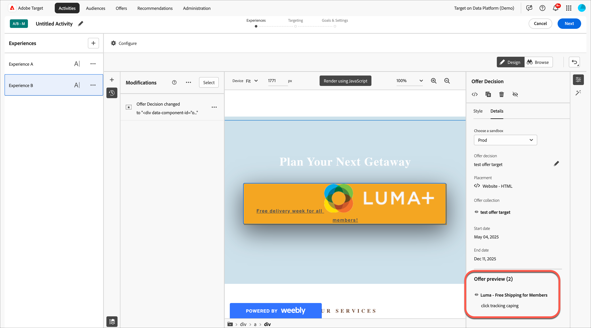

# 使用報價決策

將[!DNL Adobe Target]與[!DNL Adobe Journey Optimizer]優惠決定搭配使用，以決定並為您的網頁和行動裝置上的訪客傳遞下一個最佳優惠。

使用[!UICONTROL Visual Experience Composer] (VEC)或[!UICONTROL Form-Based Composer]，將在[!DNL Adobe Journey Optimizer]中建立的優惠決定新增至[!DNL Target]活動（手動[!UICONTROL A/B Test]或[!UICONTROL Experience Targeting]），以測試並傳遞個人化優惠給您的訪客（由[!DNL Target]提供支援的輸入頻道）。

如需[!DNL Adobe Journey Optimizer]和優惠決定的詳細資訊，請參閱&#x200B;*[!DNL Journey Optimizer]*&#x200B;檔案中的下列主題：

* [開始使用Journey Optimizer](https://experienceleague.adobe.com/docs/journey-optimizer/using/get-started/get-started.html?lang=zh-Hant)

* [關於決定管理](https://experienceleague.adobe.com/docs/journey-optimizer/using/offer-decisioning/get-started-decision/starting-offer-decisioning.html?lang=zh-Hant)

## 先決條件

若要在[!DNL Target]中使用報價決策，您需要下列專案：

* 使用[Adobe Experience Platform Web SDK](https://experienceleague.adobe.com/docs/target-dev/developer/client-side/aep-web-sdk.html?lang=zh-Hant){target=_blank}實作的[!DNL Adobe Target Standard]或[!DNL Adobe Target Premium]。

  使用at.js或其他[!DNL Target] SDK實作[!DNL Target]時，此功能無法使用。

* [!DNL Adobe Journey Optimizer Ultimate] (AJO + Offer Decisioning)或[!DNL Adobe Experience Platform]以及[!UICONTROL Offer Decisioning]應用程式服務附加元件。

## 範例使用案例

下列範例是有關如何使用[!DNL Target]/[!DNL Adobe Journey Optimizer]整合以在[!DNL Target]活動中使用報價決定的使用案例：

### 運動產品銷售

作為運動聯盟的行銷人員，您想要個人化首頁（桌上型電腦和行動網站上）的內容。 您想要根據多個維度個人化內容，並提供優惠方案給商店相關的加盟商品。 您有興趣：

* 訪客最喜愛的團隊
* 最近的運動員/玩家活動（例如，團隊移動、合約更新或受傷）

例如，您想要針對下列各個區域提供個人化體驗：Dortmund、Frankfurt和Bochum，以及這些團隊的隱含和明確粉絲使用者。 做為量度，您想要檢視商品網站的造訪與點按次數。

您想要在預設體驗和個人化體驗（包括優惠決定，每個地區和團隊各有優惠）之間設計[!UICONTROL A/B Test]活動（50/50分割）。 您想要使用此活動來判斷個人化體驗與控制體驗的轉換和提升度。

### 遊戲串流平台

身為遊戲組織的行銷人員，您想要為德國、法國、墨西哥和巴西等不同地區的桌上型電腦和行動使用者提供遊戲串流平台的個人化優惠。 當訪客從其中一個地區存取桌上型電腦或行動網站時，您想要以當地語言提供遊戲串流的優惠，並以當地貨幣提供對應的價格。

在[!DNL Adobe Journey Optimizer]中，您可以為每個目標地理區域建立個人化首頁主圖優惠，以及包含預設首頁主圖的遞補優惠。 然後，您可以建立納入這些優惠及其適用性規則的優惠決定。 然後，在[!DNL Target]中，您可以建立[!DNL Experience Targeting] (XT)活動，並將該優惠決定插入您的案頭或行動網站，以將個人化體驗傳遞給訪客。

## 建立使用優惠決定的體驗：

1. 在[!UICONTROL Visual Experience Composer] (VEC)中編輯或建立手動[!UICONTROL A/B Test]或[!UICONTROL Experience Targeting] (XT)活動時，按一下頁面元素以顯示[選項功能表](/help/main/c-experiences/c-visual-experience-composer/viztarget-options.md)。

   視覺化體驗撰寫器中的

   >[!NOTE]
   >
   >您也可以在[[!UICONTROL Form-Based Experience Composer]](/help/main/c-experiences/form-experience-composer.md)中建立使用[!UICONTROL Offer Decisions]的體驗。

1. 按一下&#x200B;**[!UICONTROL Replace Content]**，然後按一下&#x200B;**[!UICONTROL Offer Decision]**。

   [!UICONTROL Offer Decision]選項僅在編輯或建立[手動[!UICONTROL A/B Test]](/help/main/c-activities/t-test-ab/test-ab.md#types)或[[!UICONTROL Experience Targeting]](/help/main/c-activities/t-experience-target/experience-target.md) (XT)活動時可用。 此選項不適用於其他活動型別。 選單中的可用選項會依所選元素而有所不同。

   視覺化體驗撰寫器中的

1. 在VEC右側的&#x200B;**[!UICONTROL Add Offer Decision]**&#x200B;欄中，選取所需的沙箱，然後按一下選取優惠決定.placement。

   [!DNL Adobe Experience Platform]中的[沙箱](https://experienceleague.adobe.com/docs/experience-platform/sandbox/ui/overview.html?lang=zh-Hant){target=_blank}可讓您將執行個體分割到虛擬環境中。 例如，您可能有生產環境和測試環境。 [!DNL Adobe Journey Optimizer]中的[位置](https://experienceleague.adobe.com/docs/journey-optimizer/using/offer-decisioning/create-components/creating-placements.html?lang=zh-Hant){target=_blank}有助於確保正確的優惠方案內容顯示在正確位置。

   

1. 選取想要的優惠位置和優惠決定，然後按一下&#x200B;**[!UICONTROL Add]**。

   

   您的網站會顯示在VEC中，您可以在其中看到[!UICONTROL Modifications]邊欄中新建立的優惠決定。 您可以按一下[!UICONTROL Offer Decision]邊欄底部[!UICONTROL Offer Preview]下的優惠以檢查優惠決定。

   <!--You can examine the various offers contained in the offer by clicking the appropriate icon at the bottom of the [!UICONTROL Offer Preview] dialog box, including the fallback offer. A fallback offer is the default offer displayed when a visitor is not eligible for any of the personalized offers in the collection.-->

   

1. 完成三步驟引導式工作流程的[!UICONTROL Targeting]和[!UICONTROL Goals & Settings]步驟，以完成建立活動。

   >[!IMPORTANT]
   >
   >若要確保[!DNL Target]活動已個人化，請確定目前的活動開始/結束日期與[!DNL Adobe Journey Optimizer]中優惠決定的開始/結束日期一致。 如果[!DNL Target]開始/結束日期在優惠決定的開始/結束日期範圍之外，則會向訪客顯示預設[!DNL Target]內容。

## 附註和限制

處理優惠決定時，請考量下列資訊：

* 此Offer Decisioning整合適用於以[Adobe Experience Platform Web SDK](https://experienceleague.adobe.com/docs/target-dev/developer/client-side/aep-web-sdk.html?lang=zh-Hant){target=_blank}為基礎的[!DNL Target]實施。 透過at.js或其他[!DNL Target] SDK實作[!DNL Target]時，此功能無法使用。

* [!DNL Target]/[!DNL Adobe Journey Optimizer]整合僅支援[手動[!UICONTROL A/B Test]](/help/main/c-activities/t-test-ab/test-ab.md#types)和[[!UICONTROL Experience Targeting]](/help/main/c-activities/t-experience-target/experience-target.md) (XT)活動。 此功能不適用於其他活動型別。

* 如果您在活動中使用報價決策，則無法使用[[!UICONTROL Analytics as the reporting source]](/help/main/c-integrating-target-with-mac/a4t/a4t.md) (A4T)。 如果您在活動中使用報價決策，請在活動設定期間在[!UICONTROL Goals and Settings]頁面中選擇[!DNL Target]作為報告來源。

* 具有文字/html內容型別的選件不支援deliveryURL內容傳送。 只有在使用者端負責明確擷取及撰寫內容時，才可透過[表單式體驗撰寫器](/help/main/c-experiences/form-experience-composer.md)支援deliveryURL。

* [!DNL Target]報告不提供優惠決定層級報告。

* 將包含優惠決定之[!DNL Target]體驗的[QA連結](/help/main/c-activities/c-activity-qa/activity-qa.md)視覺化，會影響[!DNL Adobe Journey Optimizer]中針對這些優惠決定所設定的頻率上限。
