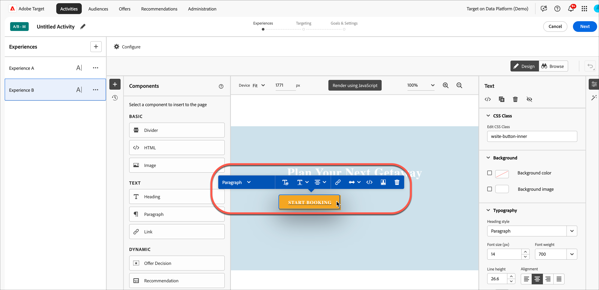
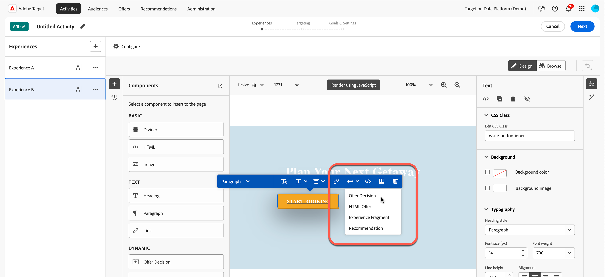

# 使用報價決策

使用 [!DNL Adobe Target] 替換為 [!DNL Adobe Journey Optimizer] 優惠決定，決定並為您的網頁和行動裝置訪客提供下一個最佳優惠。

新增在中建立的優惠決定 [!DNL Adobe Journey Optimizer] 至 [!DNL Target] 活動（手動） [!UICONTROL A/B測試] 或 [!UICONTROL 體驗鎖定])使用 [!UICONTROL 視覺化體驗撰寫器] (VEC)或 [!UICONTROL 表單式撰寫器] 若要在提供支援的傳入頻道上測試個人化優惠方案並傳送給訪客，請 [!DNL Target].

如需有關的詳細資訊 [!DNL Adobe Journey Optimizer] 和優惠決定，請參閱 *[!DNL Journey Optimizer]* 檔案：

* [開始使用 Journey Optimizer](https://experienceleague.adobe.com/docs/journey-optimizer/using/get-started/get-started.html)

* [關於決定管理](https://experienceleague.adobe.com/docs/journey-optimizer/using/offer-decisioning/get-started-decision/starting-offer-decisioning.html)

## 必要條件

若要在中使用優惠決定 [!DNL Target]，您需要下列專案：

* [!DNL Adobe Target Standard] 或 [!DNL Adobe Target Premium] 使用實作 [Adobe Experience Platform Web SDK](https://experienceleague.adobe.com/docs/target-dev/developer/client-side/aep-web-sdk.html){target=_blank}.

   實作時無法使用此功能 [!DNL Target] 使用at.js或其他 [!DNL Target] SDK。

* [!DNL Adobe Journey Optimizer Ultimate] (AJO +Offer decisioning)或 [!DNL Adobe Experience Platform] 和 [!UICONTROL offer decisioning] 應用程式服務附加元件。

## 範例使用案例

以下範例說明如何使用 [!DNL Target]/[!DNL Adobe Journey Optimizer] 整合以使用優惠決定 [!DNL Target] 活動：

### 運動產品銷售

作為體育聯盟的行銷人員，您想要個人化首頁上的內容（案頭版和行動版網站上的）。 您想要根據多個維度個人化內容，並向商店相關特許商品提供優惠方案。 您有興趣：

* 訪客最喜愛的團隊
* 最近的運動員/播放器活動（例如，團隊移動、合約更新或受傷）

例如，您想要為下列每個地區提供個人化體驗：多特蒙德、法蘭克福和波鴻以及這些團隊的隱含和明確粉絲使用者。 作為量度，您想要檢視商品網站的造訪和點按次數。

您想要設計 [!UICONTROL A/B測試] 活動（50/50分割）在預設體驗和個人化體驗（包括優惠決定，以及每個地區和團隊的優惠）。 您想要使用此活動來判斷個人化體驗與控制體驗的轉換和提升度。

### 遊戲串流平台

作為遊戲組織的行銷人員，您想要為來自不同地理位置的桌上型電腦和行動使用者提供遊戲串流平台的個人化優惠：德國、法國、墨西哥和巴西。 當訪客從其中一個地區存取桌上型電腦或行動網站時，您想要以當地語言提供遊戲串流的優惠方案，並以當地貨幣的相應價格提供。

在 [!DNL Adobe Journey Optimizer]，您可以為每個鎖定目標的地理位置建立個人化的首頁主圖優惠，加上具有預設首頁主圖的遞補優惠。 然後，您可以建立包含這些優惠及其適用性規則的優惠決定。 然後，在 [!DNL Target]，您可以建立 [!DNL Experience Targeting] (XT)活動，並將該優惠決定插入您的案頭或行動網站，為訪客提供個人化體驗。

## 建立使用優惠決定的體驗：

1. 編輯或建立手動時 [!UICONTROL A/B測試] 或 [!UICONTROL 體驗鎖定] (XT)活動 [!UICONTROL 視覺化體驗撰寫器] (VEC)，按一下頁面元素以顯示 [選項功能表](/help/main/c-experiences/c-visual-experience-composer/viztarget-options.md).

   

   >[!NOTE]
   >
   >您也可以建立使用下列專案的體驗 [!UICONTROL 優惠決定] 在 [[!UICONTROL 表單式體驗撰寫器]](/help/main/c-experiences/form-experience-composer.md).

1. 按一下 **[!UICONTROL 插入在前]**， **[!UICONTROL 插入在後]**，或 **[!UICONTROL 取代內容]**，然後按一下 **[!UICONTROL 優惠決定]**.

   此 [!UICONTROL 優惠決定] 選項在編輯或建立時可用 [手動 [!UICONTROL A/B測試]](/help/main/c-activities/t-test-ab/test-ab.md#types) 或 [[!UICONTROL 體驗鎖定]](/help/main/c-activities/t-experience-target/experience-target.md) (XT)活動。 此選項不適用於其他活動型別。 選單中的可用選項會因所選元素而異。

   

1. 在 **[!UICONTROL 新增優惠決定]** 對話方塊中，選取所需的沙箱和位置。

   A [沙箱](https://experienceleague.adobe.com/docs/experience-platform/sandbox/ui/overview.html){target=_blank} in the [!DNL Adobe Experience Platform] lets you partition your instance into virtual environments. For example, you might have a production environment and a staging environment. A [placement](https://experienceleague.adobe.com/docs/journey-optimizer/using/offer-decisioning/create-components/creating-placements.html){target=_blank} 在 [!DNL Adobe Journey Optimizer] 有助於確保正確的選件內容顯示在正確的位置。

   

1. 選取所需的優惠決定，然後按一下 **[!UICONTROL 建立]**.

   

   您的網站會顯示在VEC中，您可以在其中看到新建立的優惠決定 [!UICONTROL 修改] 窗格顯示在右側。 您可以將滑鼠停留在修改上，然後按一下 [!UICONTROL 預覽] 圖示以檢查優惠決定。

   

   您可以按一下選件底部的適當圖示，以檢視選件中包含的各種選件。 [!UICONTROL 優惠預覽] 對話方塊，包括遞補優惠。 遞補優惠是當訪客不符合集合中任何個人化優惠的資格時，所顯示的預設優惠。

   

1. 完成完成活動以建立活動 [!UICONTROL 目標定位] 和 [!UICONTROL 目標與設定] 三步驟引導式工作流程的步驟。

   >[!IMPORTANT]
   >
   >若要確保 [!DNL Target] 活動已個人化，請確定目前的活動開始/結束日期與中優惠決定的開始/結束日期同步 [!DNL Adobe Journey Optimizer]. 如果 [!DNL Target] 開始/結束日期在優惠決定的開始/結束日期範圍（預設值）之外 [!DNL Target] 向訪客顯示內容。

   

## 附註和限制

處理優惠決定時，請考量下列資訊：

* offer decisioning整合適用於 [!DNL Target] 根據的實作 [Adobe Experience Platform Web SDK](https://experienceleague.adobe.com/docs/target-dev/developer/client-side/aep-web-sdk.html){target=_blank}. 實作時無法使用此功能 [!DNL Target] 使用at.js或其他 [!DNL Target] SDK。

* 此 [!DNL Target]/[!DNL Adobe Journey Optimizer] 整合支援 [手動 [!UICONTROL A/B測試]](/help/main/c-activities/t-test-ab/test-ab.md#types) 和 [[!UICONTROL 體驗鎖定]](/help/main/c-activities/t-experience-target/experience-target.md) (XT)活動。 此功能不適用於其他活動型別。

* 您無法使用 [[!UICONTROL Analytics作為報表來源]](/help/main/c-integrating-target-with-mac/a4t/a4t.md) (A4T)。 選擇 [!DNL Target] 作為中的報表來源 [!UICONTROL 目標與設定] 活動設定期間的頁面（若您在活動中使用優惠決定）。

* 具有text/html內容型別的選件不支援deliveryURL內容傳送。 傳遞網址受到支援，透過 [表單式體驗撰寫器](/help/main/c-experiences/form-experience-composer.md) 只有當使用者端負責明確擷取和撰寫內容時。

* [!DNL Target] 報告不提供優惠決定層級報告。

* 視覺化 [QA連結](/help/main/c-activities/c-activity-qa/activity-qa.md) 的 [!DNL Target] 包含優惠決策的體驗會影響中設定的頻率上限 [!DNL Adobe Journey Optimizer] 用於這些優惠決定。
