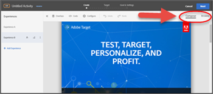

# Target 最佳化和個人化常見問答

關於使用 Adobe Target 中功能常見問答的清單，以及相關資訊和連結。

## 一般資訊 {#section_CE5713B5AAC341C9A75586C107797FA3}

**我如何知道其他客戶運用 Adobe Target 獲得更好的結果？**

以下只是我們一些[客戶成功故事](https://www.adobe.com/in/marketing-cloud/target/resources.html#x)。看看像您這樣的客戶如何運用 Target 來改善最佳化和個人化以達成業務目標。

請注意，其中的部分案例研究是利用 Adobe Target Premium 的功能。

**我可以在何處瞭解最新的 Target 功能？**

請參閱[發行說明](/help/main/r-release-notes/release-notes.md#reference_8FE40B43A5A34DDF8F26A53D55EE036A)來查看有關最新版本的詳細資料。所有[過去版本](/help/main/r-release-notes/release-notes-for-previous-releases.md)的相關資訊也可在線上取得。

**Adobe 有社群/論壇可讓我尋找關於 Target 的答案和詳細資訊嗎？**

查看 [ Target 社群論壇](/help/main/cmp-resources-and-contact-information.md#concept_9C203A8AED054DFFA9A504811DB6BA42)，我們在這裡提供客戶協助，更重要的是，我們希望像您這樣的實踐者能夠彼此協助。畢竟，社群和論壇的成功仰賴於其成員活躍的參與。成為社群的一員，並貢獻與尋求您的問題的答案。

**Target 支援什麼瀏覽器？**

請閱讀我們的 [受支援的瀏覽器](https://developer.adobe.com/target/before-implement/supported-browsers/){target=_blank}矩陣以取得詳細資訊。 請注意，有以下兩個方面：Target Standard/Premium Experience Cloud 介面支援與桌面/裝置上的使用者瀏覽器支援。

## 活動 {#section_CB95B3BF9934445DB98E8A7E22FC2CF6}

**我可以在使用控制體驗時執行統計上嚴謹的活動來尋找成功和失敗體驗嗎？**

使用 [A/B 測試](/help/main/c-activities/t-test-ab/test-ab.md#task_05E33EB15C4D4459B5EAFF90A94A7977) (手動鎖定目標選項) 與[樣本大小計算機](/help/main/c-activities/t-test-ab/sample-size-determination.md#section_286EB6E671184239BB1552F0387DAEB5)來獲得最佳結果。

**我如何知道何時可停止活動？**

冒然地停止活動可能會造成錯誤的結論。請注意[常見易犯錯誤並確保避免犯錯的最佳做法](/help/main/c-activities/t-test-ab/common-ab-testing-pitfalls.md#section_DF01A97275E44CA5859D825E0DE2F49F)。另請參閱 [A/B 測試該執行多久？](/help/main/c-activities/t-test-ab/sample-size-determination.md)

**如果時間很短，我如何執行活動？**

**我可以在測試時為我的目標最佳化嗎？**

請使用[報表來判斷獲勝者體驗](/help/main/c-activities/automated-traffic-allocation/determine-winner.md#concept_5741A89ED7224E1285A3BC34B2CCD0F9)。

**我可以以某個層級的個人化作為活動的必要部分來執行活動嗎？**

查看 [自動鎖定目標](/help/main/c-activities/auto-target/auto-target-to-optimize.md) 選項。

**我如何知道哪個類型的活動最適合我的需要？**

請參閱 [Target 活動指南](/help/main/c-activities/target-activities-guide.md#concept_D974B0918EB74B3B8CB07ACD32BF37A1)來瞭解 Adobe Target 所提供的每個選項對哪些案例而言有意義。

也請務必考慮 [Recommendations 活動](/help/main/c-recommendations/recommendations.md#concept_7556C8A4543942F2A77B13A29339C0C0)。

**我如何找出頁面上的哪個元素組合其成功有貢獻，以及每個元素有幫助的程度如何？**

請查看[全階乘多變數 (MVT) 活動](/help/main/c-activities/c-multivariate-testing/multivariate-testing.md#concept_628695CDC71B449B8DCC2F5654C11499)中的元素貢獻分析，看看它是否符合您的需求。

請注意，流量需求會隨著 MVT 活動增加。

**我可以跨不同頁面結構的多個頁面執行活動嗎？**

**我可以套用位在不同位置 (例如，結帳漏斗) 的選件嗎？**

請試用[多頁活動功能](/help/main/c-experiences/c-visual-experience-composer/multipage-activity.md#concept_277E096063E14813AC5D8EDFA1D2ED48)，它可讓您在體驗內使用多個頁面。

**我如何確保一旦達到目標 (主要或次要)，使用者絕不會再次進入活動，而是之後會看到不同活動？**

藉由使用隨著每個目標提供的[進階設定](/help/main/c-activities/t-test-ab/t-test-create-ab/ab-goals-and-settings.md#section_E2FE441AFB324E498793ABB025ED9974)選項，即可容易達成此目標。您有選項可決定在使用者達到目標後應該發生什麼，以及您希望計數遞增的方式。

因此，在此情況中，您可以選擇「增加計數、釋出使用者以及禁止重新進入」以及「預設/其他活動內容」以達成目標。也請查看其他選項。

**我已在我的活動中建立多個目標。我可以建立一連車的目標作為報表和分析用途的漏斗嗎？**

**例如，我想要在使用者達成目標 A 時考慮目標 B，使得我可以追蹤特定漏斗的數量。**

Target 有一個健全的方式可達成此目標，就是利用我們的「度量相依性」功能。只需要[在其他成功度量上新增相依性](/help/main/c-activities/r-success-metrics/success-metrics.md#section_7CE95A2FA8F5438E936C365A6D43BC5B)。您有類似「達到」和「未達到」之類的選項，並能夠以多個方式結合度量來建立您需要的任何組合。

**我如何清楚知道關於如何設定活動以達成我的目標？**

這就是[目標](/help/main/c-activities/t-test-ab/t-test-create-ab/ab-goals-and-settings.md#reference_B25389FD6F3A4989801E740364B089CC)的功能。

您應該從知道要對什麼進行最佳化開始。是收入、轉換或參與？ 這些選項的每個都可在目標小節中取得。而您可以對這每個項目，進一步定義為了符合達到目標的資格，使用者在您的網站會進行的動作。

這是透過三個步驟引導工作流程的步驟 3 中的「主要目標」設定來達成。您可以也可以新增其他目標，如此可幫助您獲得更好的報表

**我可以將活動排程在固定時間開始和結束嗎？**

使用三個部分活動工作流程的[目標和設定中的排程功能](/help/main/c-activities/t-test-ab/t-test-create-ab/ab-goals-and-settings.md#section_DCBDC354261F420EBD4B43EA34947BAC)步驟，指定開始和結束日期。

記得啟動活動。只有線上活動才會遵循指定的排程。達到結束日期之後，活動會進入「已結束」狀態。

**我可以只對鎖定目標步驟進行變更，而不要完成整個三個步驟引導工作流程來進行編輯？**

[從活動概觀頁面直接進入您所選的必要步驟](/help/main/c-activities/edit-activity.md#concept_BB064C0D4A194BD1A1AE7CCA1E6BB8F0)，然後使用「儲存並關閉」選項從該步驟結束，便可輕鬆進行這個操作。

**我可以停留在特定步驟上，持續修改活動 (例如選件文字或自訂代碼)，然後在另一個索引標籤中執行 QA 嗎？**

這也是可能的。只要[使用可用來進行遞增變更而不需離開此步驟的「儲存」選項](/help/main/c-activities/edit-activity.md#concept_BB064C0D4A194BD1A1AE7CCA1E6BB8F0)。

**我如何對我剛剛建立的活動進行預覽和 QA？**

請使用[功能強大的 QA 模式功能](/help/main/c-activities/c-activity-qa/activity-qa.md)來執行 QA。您可以與您的 QA 團隊共用連結，並同時端對端測試活動，包括報表，以非常確定在活動上線後，它能如預期並如測試般運作。

**我如何使用 Target 的決策功能來獲得可以在單一頁面應用程式 (SPA) 或伺服器端整合中使用的體驗/選件？**

使用功能強大的[表單式活動](/help/main/c-experiences/form-experience-composer.md#task_FAC842A6535045B68B4C1AD3E657E56E)搭配 [JSON 選件](/help/main/c-experiences/c-manage-content/create-json-offer.md#concept_63C7BEE1F0DB4A7596D997219B7C136D)來達成您的目標。

**我已設定兩個活動。我如何知道訪客最後會看到哪個活動？**

**我可以設定一些活動的優先順序嗎？**

使用 Target 三個步驟引導工作流程步驟 3 (「目標與設定」頁面) 上可用的優先順序設定來[定義活動的優先順序](/help/main/c-activities/t-test-ab/t-test-create-ab/ab-goals-and-settings.md#section_DCBDC354261F420EBD4B43EA34947BAC)。

提供兩個選項:

* 預設，具有三個層級 (低/中/高)
* 自訂，範圍從 0 到 999。對於「自訂」，請啟用「精細的優先順序」功能 (「管理>視覺體驗撰寫器」)。

## 對象 {#section_FA6314777ABC46D8B198D6F388051460}

**我可以在活動特定的活動中建立對象區段嗎？ 我不認為應該在對象資料庫中建立這類對象，因為沒有重複使用的係數。**

開始使用[僅限於此活動的對象功能](/help/main/c-target/creating-activity-only-audience.md#concept_A6BADCF530ED4AE1852E677FEBE68483)來定義活動本端的對象。

**我如何根據使用者的位置鎖定使用者？**

請試用[地理位置對象](/help/main/c-target/c-audiences/c-target-rules/geo.md#concept_5B4D99DE685348FB877929EE0F942670)。閱讀此功能相關的準確性層級。

**我可以根據工作階段中頁面上的部分屬性來鎖定使用者嗎？**

最好的方式會是使用 mbox 和 [自訂對象](/help/main/c-target/c-audiences/c-target-rules/custom-parameters.md#concept_C4C6E00D7C5A4BE9B72D471DB2E3027B)來提供合適的體驗。

**我可以根據跨多個造訪的訪客屬性提供體驗嗎？**

**我可以隨機將流量分割到兩個儲桶嗎？**

請試用[設定檔指令碼功能](/help/main/c-target/c-visitor-profile/profile-parameters.md#concept_8C07AEAB0A144FECA8B4FEB091AED4D2)。它是功能強大的方式，可將體驗個人化，不過需要您編寫程式碼。

**我可以從一些少量的訪客開始活動嗎？**

使用 [Target 三步驟引導式工作流程的步驟 2 (「鎖定目標」頁面)](/help/main/c-activities/t-test-ab/t-test-create-ab/ab-audience.md#concept_A268236C1224451DB7844BF67F41A087) 所提供的百分比分配控制項目，決定您要如何設定活動。

**我也有 Adobe Analytics 並且想要用它與 Target 搭配使用。整合這兩個解決方案我能獲得什麼重要功能？**

查看產品的下列方面:

* [Analytics for Target (A4T)](/help/main/c-integrating-target-with-mac/a4t/a4t.md#concept_7540C8C04259434AB6EE33B09F47A1DE)
* [客戶屬性](https://developer.adobe.com/target/before-implement/methods-to-get-data-into-target/customer-attributes/)
* [對象](/help/main/c-integrating-target-with-mac/mmp.md)

## 體驗 {#section_5959536B8D6A4BEA8FAA1273338F3451}

**我可以在相同頁面結構的多個頁面上執行活動嗎？**

請查看[範本規則](/help/main/c-experiences/c-visual-experience-composer/temtest.md#task_2539D51A18044F82B0D9895636546781)以將許多類似結構的頁面併入活動中，同時仍在提供的單一 URL 上建立體驗。

**我對於我嘗試在可視化體驗撰寫器 (VEC) 中載入我的頁面時出現的「允許您的瀏覽器載入指令碼」訊息感到很困擾。我如何避免此情況？**

這是因為您的網站有混合的內容，而是同時擷取HTTP和HTTPS資源的網站。 請要求您的 IT 團隊完成改用 HTTPS。

在他們完成之前，請遵循[在您的瀏覽器中啟用混合的內容](/help/main/c-experiences/c-visual-experience-composer/r-troubleshoot-composer/mixed-content.md#concept_46D022D50280468C9EF6D5DF6EFC911C)中的指示，來允許您的瀏覽器載入混合內容。這是多數現代瀏覽器的安全性功能。

**我可以在我的網站上嘗試可視化體驗撰寫器 (VEC)，即使 Target at.js 資料庫尚未部署？**

嘗試使用[增強體驗撰寫器](/help/main/c-experiences/experiences.md#section_34265986611B4AB8A0E4D6ACC25EF91D)載入頁面。

**為什麼我的網站沒有在可視化體驗撰寫器 (VEC) 內載入？**

請嘗試運用說明頁面中概述的[疑難排解資訊](/help/main/c-experiences/c-visual-experience-composer/r-troubleshoot-composer/troubleshoot-composer.md#reference_77743144F10143A3A89D56E116D296E4)。如果這些方法都沒有效，請向 [Adobe 支援](/help/main/cmp-resources-and-contact-information.md#reference_ACA3391A00EF467B87930A450050077C)求助。。

我們也提供[表單式方法](/help/main/c-experiences/form-experience-composer.md#task_FAC842A6535045B68B4C1AD3E657E56E)可以排除您的障礙。

也請閱讀[增強體驗撰寫器](/help/main/c-experiences/experiences.md#section_34265986611B4AB8A0E4D6ACC25EF91D)何時與為何很實用。您可能也必須求助您的 IT 部門來 [將 Adobe 的 proxy 伺服器也加入允許清單 ](/help/main/c-experiences/c-visual-experience-composer/experience-composer-best-practices.md#concept_E284B3F704C04406B174D9050A2528A6)。

**我有回應式網站。建立活動時，我如何確定我考慮的是重要裝置？**

請試用[行動檢視區](/help/main/c-experiences/c-visual-experience-composer/mobile-viewports.md#concept_8E45527C4ABC41D59AA3553BEDC76FA5)功能。請注意，它只有在增強體驗撰寫器已啟用時才有作用。

**我有多個網域。其中一個網域必須已啟用增強體驗撰寫器，而其他網域則需要將它停用。我應該怎麼做？**

您一律可以使用[活動層級的 Enhanced Experience Composer 選項](/help/main/c-experiences/experiences.md#section_34265986611B4AB8A0E4D6ACC25EF91D)來覆寫預設設定 (「管理」 > 「Visual Experience Composer」)。

**為什麼我看不到可交換影像的選項？**

請聯絡 Adobe [以確保您的帳戶已設定為可使用 Scene7](/help/main/administrating-target/scene7-settings.md#task_37AD0768EFBA4E588955FE3D5DD670A5)。一旦佈建，您將可以輕鬆將一個影像與另一個影像交換。

**我想要在兩個不同體驗，例如固定折扣與百分比折扣之間測試，但我想要正確地鎖定體驗 (對來自不同國家/地區的人顯示不同地區設定文字或不同貨幣)。我應該怎麼做？**

使用[多個體驗版本功能](/help/main/c-activities/t-test-ab/t-test-create-ab/target-experience-to-multiple-audiences.md#task_0138112E283A4A5B9F8AB9AAF2FBC2FF)，您便可輕鬆達成此目標。請注意在這類測試中傳送的細微差別

**我如何看到我在可視化體驗撰寫器 (VEC) 中進行的修改？**

我們會一律將您的變更顯示在[代碼編輯器](/help/main/c-experiences/c-visual-experience-composer/c-vec-code-editor/vec-code-editor.md#concept_B3A6E9EE3A60406DB640E205EA1745B5)中。「修改」索引標籤會顯示您套用至選件的 CSS 選取器或 mbox。

請注意，CSS 選取器為 Sizzle 選取器。您可以使用此區段來快速進行次要的修改或刪除某些選件。

**我想要隨著實驗/活動傳送 JavaScript 以快速修改一些動態元素或只是傳送呼叫給第三方解決方案。我應該怎麼做？**

其中一種方式是使用[自訂代碼編輯器](/help/main/c-experiences/c-visual-experience-composer/c-vec-code-editor/vec-code-editor.md#concept_B3A6E9EE3A60406DB640E205EA1745B5)。請開始將您的 JavaScript 放在區段中，系統即會將它傳送。視您的需求而定，您可以選擇將它放在標頭或主體中傳送。

**為什麼我無法通過可視化體驗撰寫器 (VEC) 的登入頁面，或是進入我沒有特定 URL、深藏在其中的頁面？**

使用撰寫和瀏覽功能來導覽至所選擇的頁面，並開始建立您的體驗。

**我如何從 Target 三個步驟引導工作流程的步驟 2 (「鎖定目標」頁面) 前往我所選擇的體驗？**

按一下步驟 2 上體驗前端的縮圖，然後您將登陸在您所選擇的體驗。

**我是過去的 Target Classic 使用者。我可以在某些使用案例下使用我的 mbox 嗎？**

使用[表單式方法](/help/main/c-experiences/form-experience-composer.md#task_FAC842A6535045B68B4C1AD3E657E56E)來建立活動。

**為什麼我看不到需要的選件/體驗，而是看到一些其他活動？**

使用我們的[除錯程式](/help/main/c-activities/c-troubleshooting-activities/content-trouble.md#concept_D2548B486C984B1E97ED7A72075B8EEA)，檢查是否有[活動衝突](/help/main/c-experiences/c-visual-experience-composer/activity-collisions.md#concept_0BC6B929592744DFA7DA01FF4F91052E)。

## 選件 {#section_A547B1EAD0B34FD38D3B87AAF62E3963}

**我不想嘗試進行次要的變更，而是想要測試全新、完全不同的頁面。**

**我想要將使用者引導至登陸頁面，例如，全新啟動。**

**我應該怎麼做？**

我們提供[重新導向 URL 功能](/help/main/c-experiences/c-manage-content/offer-redirect.md#task_33C80CD722564303B687948261484F94)，可讓您將使用者重新導向至所選擇的頁面 (使用或不使用目前的查詢參數)。

**為什麼我的 QA 程序中沒有發生內容傳送？**

您的網站的元素上可能有動態 ID、重複的 ID 或動態類別。您可能必須在帳戶層級 (或是在活動層級，如果問題是網域或頁面特定) 評估網站偏好設定選項。請參閱 [CSS 選取器](/help/main/administrating-target/visual-experience-composer-set-up.md#css)。

**為什麼我看不到需要的選件/體驗，而是看到一些其他活動？**

使用我們的[除錯程式](/help/main/c-activities/c-troubleshooting-activities/content-trouble.md#concept_D2548B486C984B1E97ED7A72075B8EEA)，檢查是否有[活動衝突](/help/main/c-experiences/c-visual-experience-composer/activity-collisions.md#concept_0BC6B929592744DFA7DA01FF4F91052E)。

**我可以使用 Target 的決策功能來獲得可以在單一頁面應用程式 (SPA) 或伺服器端整合中使用的體驗/選件？**

使用功能強大的[表單式活動](/help/main/c-experiences/form-experience-composer.md#task_FAC842A6535045B68B4C1AD3E657E56E)搭配 [JSON 選件](/help/main/c-experiences/c-manage-content/create-json-offer.md#concept_63C7BEE1F0DB4A7596D997219B7C136D)來達成您的目標。

## 報表 (包括 Analytics for Target—A4T) {#section_8AECC69BEEB7422E894E7EC44A50BA0A}

**我也有 Adobe Analytics 並且想要用它與 Target 搭配使用。整合這兩個解決方案我能獲得什麼重要功能？**

查看產品的下列方面:

* [目標分析(A4T)](/help/main/c-integrating-target-with-mac/a4t/a4t.md#concept_7540C8C04259434AB6EE33B09F47A1DE)

* [客戶屬性](https://developer.adobe.com/target/before-implement/methods-to-get-data-into-target/customer-attributes/)

* [對象](/help/main/c-integrating-target-with-mac/mmp.md)

**我可以在多個使用者區段上分解報表嗎？**

這是三個步驟引導工作流程活動工作流程步驟 3「目標與設定」頁面上所提供[報表對象功能](/help/main/c-activities/t-test-ab/t-test-create-ab/ab-goals-and-settings.md#section_13119392051044FBA6387D9B3B1C43CF)的功能。

您可以選擇新增 50 個這類區段，以及應用程式點 (活動項目或特定度量)，以擁有功能強大的方式進行分解。

請注意，Target 會就這點從您新增這些對象的時間點收集資料，因此，如果您在執行測試之前誤新增區段，那就不好了。

**我無法在執行活動之前定義對象。我覺得 Target 活動中報表對象的這一點很具限制性。**

**我怎麼做才能讓此程序簡單點？**

這是可方便使用 [Analytics for Target (A4T)](/help/main/c-integrating-target-with-mac/a4t/a4t.md#concept_7540C8C04259434AB6EE33B09F47A1DE) 的位置。如果您有 Adobe Analytics，只需將來源選擇為 Analytics，便可消除此限制。現在您可以隨時對任何對象執行分析，並且不需預先定義報表對象。

**我可以執行離線報表計算？**

使用[匯出報表至 CSV 和下載訂單詳細資料至 CSV 選項](/help/main/c-reports/c-report-settings/downloading-data-in-csv-file.md) (位於報表頁面上) 來下載需要的報表資料。

**我可以變更評估報表的控制體驗，或變更訪客造訪的計算方法嗎？**

使用[報表頁面上的設定齒輪圖示](/help/main/c-reports/c-report-settings/report-settings.md#concept_4BB6A7FDAB6F4806A632F9CD989B8BFA)來進行這些變更。進一步閱讀這些設定以瞭解計算方式的差異。

**我應該如何解譯報表？**

我們已嘗試使用如下的功能，盡可能讓報表直覺化：[信賴區間長條圖、提升界限、顯著性/可信度和多個度量選項、表格和圖表檢視、執行平均等等](/help/main/c-reports/c-report-settings/report-settings.md#concept_4BB6A7FDAB6F4806A632F9CD989B8BFA)，以實現功能強大且容易的報表分析。顯然地，如果您使用 [Analytics for Target(A4T)](/help/main/c-integrating-target-with-mac/a4t/a4t.md#concept_7540C8C04259434AB6EE33B09F47A1DE) 活動進行進一步分析對象，便可查看 Analytics。

## 回應 Token {#section_C2A7118B4B62482A9D630C2212112A3D}

**我可以使用第三方系統 (例如 Google Analytics 或 ClickTale) 來執行整合，以便傳遞已傳送給使用者的活動資訊進行分析？**

我們也有針對此情形的解決方案，請使用[回應 Token 功能](/help/main/administrating-target/response-tokens.md#concept_2B21B222F6A344D68CA5929817E836C4)。

## 疑難排解 {#section_6B8B4DC62AE34066A8C55915E9EC6C19}

**我如何知道 Adobe Target 的可用性狀態？**

使用 Adobe「系統狀態」頁面來檢視 Adobe 產品和 Experience Cloud 解決方案，包括 Target 的狀態。此頁面可協助您判斷您遇到的問題是否是因為系統更新或日常的維護。

**您有疑難排解指南嗎？**

很抱歉得知您遇到了問題。查看[疑難排解 Target](/help/main/r-troubleshooting-target/troubleshooting-target.md#reference_A9DB82675D044BD8861F6752A4EE6839) 得許多疑難排解主題的連結。

## Target 行動應用程式 {#section_07BA89F2C38747158ECD5B153274AEAF}

**我們有行動 SKU。我可以建立行動裝置活動？**

若要在行動裝置上最佳化和個人化，您需要使用 [表單式活動](/help/main/c-experiences/form-experience-composer.md#task_FAC842A6535045B68B4C1AD3E657E56E) 以及 [AdobeSDK](https://developer.adobe.com/target/implement/mobile/enable-target-in-sdk/){target=_blank}。 查看有關 [適用於行動應用程式的Target](https://developer.adobe.com/target/implement/mobile/){target=_blank}。

## Target API {#section_714E85EFF6E3400389EF2E40D538E1DA}

**我可以在何處進一步瞭解 Target API？**

我們提供詳盡的 API 相關文件。請參閱 [傳送API、NodeJS SDK和Recommendations API檔案](https://developer.adobe.com/target/實作/伺服器端/){target=_blank}。
