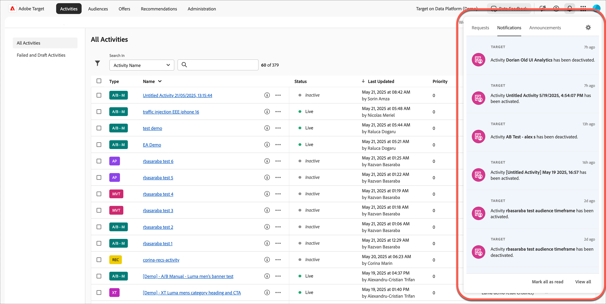

# 了解 [!DNL Target] UI

使用者介面以邏輯且方便使用的格式排列，以協助您充分運用 [!DNL Adobe Target]。以下簡短概述可協助您熟悉[!DNL Target]，並提供連結，以取得更深入的資訊和逐步指示。

## [!DNL Target] UI標頭

[!DNL Target] UI頂端的標題包含一些頁簽和選項，可協助您導覽解決方案的不同功能。 您也可以切換組織和[!DNL Adobe Experience Cloud]解決方案、提供意見回饋(如果您是Beta程式的一部分)、存取AI小幫手、取得說明和通知、管理您的[!DNL Adobe]設定檔，以及登出[!DNL Target]。

左側的標籤可讓您存取[!DNL Target]的各種功能，稍後將討論這些功能。 首先，我們先討論右側的選項，然後再討論標籤。

### [!UICONTROL Organization]

*組織*&#x200B;是可讓管理員設定用戶、群組，以及控制 [!DNL Adobe Experience Cloud] 中單一登入存取的實體。組織的作用就像一個登入公司，涵蓋所有的 [!DNL Experience Cloud] 產品和解決方案。最常見的組織就是您的公司名稱。不過，公司可以有許多組織。

如果您的公司有多個組織，請從[!UICONTROL Organization]下拉式清單中選取所需的組織：

### [!UICONTROL Beta Feedback]

（視條件而定）如果您隸屬於官方[!DNL Target] Beta方案，您可能會看到[!UICONTROL Beta Feedback]圖示。

提供意見回饋的描述，包括適用的檔案或熒幕擷取畫面，以及任何其他必要的詳細資料，然後按一下&#x200B;**[!UICONTROL Submit]**。

### [!DNL AI Assistant]

（視條件而定）如果您的組織已授予您使用[!DNL AI Assistant]的權利，請按一下[!DNL AI Assistant]圖示。

如需詳細資訊，請參閱[Adobe Experience Platform AI助理概述](/help/main/c-intro/ai-assistant.md)。

### 說明

按一下[!UICONTROL Help]圖示（ ）可讓您存取資訊、影片、部落格等，以協助您更有效地使用[!DNL Target]。 您可以建立支援票證、尋找支援電話號碼、透過Twitter提出問題，或提供有關[!DNL Target]的意見回饋，讓我們瞭解[!DNL Target]團隊的表現。

### 請求、通知和公告 {#notifications-announcements}

[!UICONTROL Requests]、[!UICONTROL Notifications]和[!UICONTROL Announcements]面板可協助您隨時掌握[!DNL Adobe Target]的所有最新資訊。 主動通知可協助您隨時掌握[!DNL Adobe Experience Cloud]解決方案和[!DNL Target]事件的狀態。 主動公告會提醒您發生中斷事件和維護事件。

按一下標題中的[!UICONTROL Notifications]圖示（  ）以檢視通知：

面板包含[!UICONTROL Requests]、[!UICONTROL Notifications]和[!UICONTROL Announcements]的索引標籤。

以下區段包含每個標籤的相關資訊，以及如何設定通知和公告：

#### [!UICONTROL Requests]

在[!UICONTROL Requests]面板中接收有關[!DNL Adobe]產品和解決方案、您與其他使用者的共同作業以及其他相關更新的重要資訊。

當有人傳送請求給您核准物件或授予物件存取權時，該請求會顯示在[!UICONTROL Requests]面板中。

#### 通知 {#notifications}

[!DNL Target]個事件通知包含下列專案：

* **活動**：當活動被批准或停用時（手動或達到其開始或結束日期時），所有活動類型的通知。 通知包含具有活動概述頁面連結的活動名稱。

  通知是可設定的，並且預設會由產品管理員、發佈者和核准者在活動工作區中接收[!DNL Target Premium]帳戶。 針對[!DNL Target Standard]帳戶，所有發行者和核准者都會收到通知。

  通知的格式如下所示：

   * `Activity {target.activity.name} has been activated`

   * `Activity {target.activity.name} has been deactivated`

* **設定檔指令碼**：手動或由[!DNL Target]啟動或停用設定檔指令碼時通知。

  通知是可設定的，而且預設會由[!DNL Target Premium]和[!DNL Target Standard]帳戶的產品管理員和核准者接收。

  通知的格式如下所示：

   * `Profile Script {target.profileScript.name} has been activated`
   * `Profile Script {target.profileScript.name} has been deactivated`

* **Recommendations摘要**：手動或由[!DNL Target]啟動或停用[!DNL Recommendations]摘要時通知。 當[!DNL Recommendations]摘要失敗時也會傳送通知。

  通知是可設定的，而且預設會由[!DNL Target Premium]帳戶的產品管理員和核准者接收。 [!DNL Recommendations]是[!DNL Target Premium]功能，無法在[!DNL Target Standard]中使用。

  通知的格式如下所示：

   * `Feed  {target.feed.name} has been activated`
   * `Feed {target.feed.name} has been deactivated`
   * `Feed {target.feed.name} has failed`
   * `Feed {target.feed.name} has failed to import from source`

您可以將個別通知標示為已讀取，方法是暫留在所需的通知上，然後按一下[!UICONTROL Mark as Read] （  ）圖示。 您可以按一下面板底部的[!UICONTROL Mark as Read]或[!UICONTROL View All]，將所有通知標籤為已讀取或檢視所有通知。

您也可以將游標移至通知上，按一下[!UICONTROL Snooze] （  ）圖示，設定要再次收到通知的提醒。 接著，您可以選取想要收到通知的時間：5分鐘、15分鐘、1小時或明天。

#### 公告

主動公告會提醒您發生中斷事件和維護事件。

如需深入資訊，請參閱[Adobe狀態](https://status.adobe.com/)頁面。

### 設定通知和公告

若要編輯您的通知偏好設定：

1. 按一下[!UICONTROL Edit Preferences] （ ）圖示，然後按一下左側邊欄中的&#x200B;**[!UICONTROL Notifications]**。
1. 在&#x200B;**[!UICONTROL Target]**&#x200B;底下，選取要如何通知您：

   * [!UICONTROL In-app]
   * [!UICONTROL Email]
   * [!DNL Slack]

1. 選取您要視為高優先順序的類別。

   >[!NOTE]
   >
   >&quot;[!UICONTROL New releases]&quot;和&quot;[!UICONTROL Updates on content]&quot;是套用至[!DNL Target]的唯一通知類別。 其他類別適用於其他[!DNL Adobe]解決方案。

1. 選取您希望警報在瀏覽器中顯示的通知。

   這些警報會出現在瀏覽器的右上角幾秒鐘。 您可以選擇檢視高優先順序類別、所有類別，或隱藏所有通知快顯視窗。 您也可以設定是否希望通知保持可見，直到關閉為止，或者您可以設定通知持續時間。

1. 選取您想要接收通知電子郵件的頻率：

   * [!UICONTROL Don't send emails]
   * [!UICONTROL Instant notifications]
   * [!UICONTROL Daily digest]
   * [!UICONTROL Weekly digest]

1. 設定工作區的Slack通知。

### 應用程式切換器

應用程式切換器可讓您快速存取您可存取的 [!DNL Adobe Experience Cloud] 解決方案。

### 輪廓

按一下您的輪廓頭像以編輯您的 [!DNL Adobe Experience Cloud] 偏好設定或登出 [!DNL Target]。您也可以存取或編輯您的 [!DNL Adobe] 輪廓。

現在，讓我們討論[!DNL Target]標題左側的標籤。

## 活動

**[!UICONTROL Activities]**&#x200B;清單是您開啟[!DNL Target]時的預設檢視。 您可以從此頁面建立活動，並管理現有活動。

如需[!DNL Target]中可用活動型別的深入資訊，請參閱[活動](/help/main/c-activities/activities.md)，並進一步瞭解[!UICONTROL Activity]清單的使用者介面。

## 客群

按一下「**[!UICONTROL Audiences]**」標籤以顯示[!UICONTROL Audiences]清單，您可在其中建立對象並管理現有對象。

對象是看到鎖定活動的一組類似的活動加入者。 受眾是具有相同特性的一組人員，例如新訪客、回頭客或來自中西部的回頭客。 [!UICONTROL Audience]功能可讓您將不同的內容和體驗鎖定在特定對象，利用在正確時間向正確的人員顯示正確的訊息來最佳化您的數位行銷。 如果驗明訪客屬於目標客群，[!DNL Target] 會根據活動建立期間所定義的條件，決定要顯示的體驗。

如需[!DNL Target]中對象型別的深入資訊，請參閱[建立對象](/help/main/c-target/c-audiences/create-audience.md)，並進一步瞭解[!UICONTROL Audience]清單的使用者介面。

## 產品建議

按一下「**[!UICONTROL Offers]**」標籤以顯示[!UICONTROL Offers]清單，您可在其中建立體驗和選件，並管理現有的體驗和選件。

體驗可以是產品建議、影像、文字、按鈕、影片或將這些不同元素加以組合，放在頁面、整個網頁或一組頁面上，可能會形成購買漏斗或一些其他的頁面邏輯順序。也可以是語音助理的回應、客戶服務指令碼，或甚至是飲料機的個人化口味。您可以在 [!DNL Target] 活動中測試或個人化體驗。

如需[!DNL Target]中選件型別的深入資訊，請參閱[選件](/help/main/c-experiences/c-manage-content/manage-content.md)，並進一步瞭解[!UICONTROL Offer]清單的使用者介面。

## 推薦

按一下&#x200B;**[!UICONTROL Recommendations]**&#x200B;索引標籤以存取[!DNL Target Recommendations]。

>[!NOTE]
>
>[!UICONTROL Recommendations] 活動是 [!DNL Target Premium] 解決方案內建的功能。在沒有[!DNL Target Premium]授權的[!DNL Target Standard]中無法使用[!UICONTROL Recommendations]活動。 如需更多資訊，請參閱 *Target 簡介*&#x200B;中的 [Target Premium](/help/main/c-intro/intro.md#premium)。

[!UICONTROL Recommendations]活動可依據先前的使用者活動或其他演演算法，自動顯示可能使客戶感興趣的產品或內容。 推薦有助於將客戶引導至他們可能尚不知道的相關項目。

如需[!DNL Target]中[!UICONTROL Recommendations]的深入資訊，請參閱[Recommendations](/help/main/c-recommendations/recommendations.md)，並進一步瞭解[!UICONTROL Recommendations]使用者介面。

## 管理

按一下&#x200B;**[!UICONTROL Administration]**&#x200B;索引標籤以存取[!UICONTROL Administration]頁面。

[!UICONTROL Administration]頁面可讓您管理[!DNL Target]，包括[!UICONTROL Visual Experience Composer] (VEC)、報告、[!DNL Scene7]組態、實作、主機、環境、回應權杖、使用者和建議的組態設定。

如需深入資訊，請參閱[管理 Target 概觀](/help/main/administrating-target/administrating-target.md)，並進一步瞭解使用者介面。

## 可視化體驗撰寫器 (VEC)

除了[!DNL Target] UI，您也應該熟悉VEC UI。 如需詳細資訊，請參閱[[!DNL Visual Experience Composer] 選項](/help/main/c-experiences/c-visual-experience-composer/viztarget-options.md)。
