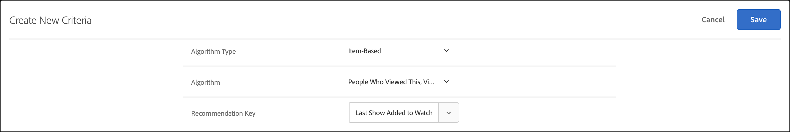

#  條件

中的標準 [!DNL Adobe Target] [!DNL Recommendations] 是根據預定的訪問者行為集確定推薦哪些產品或內容的規則。 條件可以基於人氣趨勢、訪客的目前和過去行為，或類似的產品和內容。您可以新增多個條件，將多個建議類型彼此測試。

以下各節詳細說明了可用於每個鍵的條件鍵和建議邏輯。 按一下連結可獲取詳細資訊。

## 垂直產業 {#section_936BCFCF234C49A2BEC1C38AAC2D71AF}

在建立標準時，您可以根據建議活動的目標選擇行業垂直型。

| 垂直產業 | 目標 |
|--- |--- |
| 零售/電子商務 | 轉換帶動購買 |
| 潛在客戶開發/B2B/金融服務 | 轉換但未購買 |
| 媒體/出版 | 參與 |

其它條件選項會根據您選擇的行業縱向進行更改。 您可以在 **[!UICONTROL Recommendations>設定]** 或者，可以為每個條件指定行業垂直。

## 算法類型 {#section_885B3BB1B43048A88A8926F6B76FC482}

您選擇的算法類型決定了可用的算法。 有幾種算法類型，在設定 [!DNL Recommendations] 的子菜單。

下表說明了各種算法類型及其附帶的算法。

| 算法類型 | 何時使用 | 可用算法 |
| --- | --- | --- |
| [!UICONTROL 基於購物車] | 根據用戶的購物車內容提出建議。 | <ul><li>看過這些的人</li><li>看過這些的人，買了那些</li><li>買這些，買那些的人</li></ul>有關詳細資訊，請參見 [基於購物車](/help/main/c-recommendations/c-algorithms/base-the-recommendation-on-a-recommendation-key.md#cart-based) 在 *基於建議密鑰的建議*。 |
| [!UICONTROL 基於受歡迎度] | 根據項目在整個站點的總體受歡迎程度或用戶最喜愛或查看次數最多的類別、品牌、流派等中項目的受歡迎程度來提出建議。 | <ul><li>在整個站點上查看的最多</li><li>按類別查看的最多數</li><li>按物料屬性查看的最多數</li><li>網站上的暢銷產品</li><li>按類別排列的暢銷產品</li><li>按物料屬性列出的最大銷售者</li><li>按分析度量排在前面</li></ul> |
| [!UICONTROL 基於項] | 根據查找與用戶當前正在查看或最近已查看的項目類似的項目來提出建議。 | <ul><li>檢視過此項目、也檢視了其他項目的使用者</li><li>瀏覽過此項目、但購買了其他項目的使用者</li><li>購買了此項目、也購買了其他項目的使用者</li><li>具有相似屬性的項</li></ul> |
| [!UICONTROL 基於用戶] | 根據用戶的行為提出建議。 | <ul><li>最近查看的項目</li><li>推薦給您</li></ul> |
| [!UICONTROL 自定義條件] | 根據您上載的自定義檔案提出建議。 | <ul><li>自定義算法</li></ul> |

有關每個算法的詳細資訊，請參見 [基於建議密鑰的建議](/help/main/c-recommendations/c-algorithms/base-the-recommendation-on-a-recommendation-key.md)。

## 使用自定義建議密鑰 {#custom-key}

您還可以根據自定義配置檔案屬性的值來提供建議。

>[!NOTE]
>
>可將自定義配置檔案參數傳遞給 [!DNL Target] 通過JavaScript、API或整合。 有關自定義配置檔案屬性的詳細資訊，請參閱 [訪問者簡介](/help/main/c-target/c-visitor-profile/visitor-profile.md)。

例如，假設您要根據用戶最近添加到隊列的影片來顯示推薦影片。

1. 按一下 **[!UICONTROL Recommendations]** > **[!UICONTROL 標準]**。

1. 按一下 **[!UICONTROL 建立條件]** > **[!UICONTROL 建立條件]**。

1. 填寫 [基本資訊部分](/help/main/c-recommendations/c-algorithms/create-new-algorithm.md#info)。

1. 在 [推薦算法](/help/main/c-recommendations/c-algorithms/create-new-algorithm.md#rec-algo) 選擇 **[!UICONTROL 基於項]** 從 **[!UICONTROL 算法類型]** 清單框。

1. 選擇 **[!UICONTROL 看過這個的人，看過]** 從 **[!UICONTROL 算法]** 清單框。

1. 從 **[!UICONTROL 建議密鑰]** 清單(例如， [!UICONTROL 上次添加到監視清單的顯示])。

   

## 查看條件資訊 {#section_7162DE58E4594FD688A4D7FDB829FD8B}

您可以將游標移至卡片上並按一下卡片上的「資訊」圖示，這樣無需開啟條件，即可在快顯卡上查看條件詳情。

按一下&#x200B;**[!UICONTROL 「演算法資訊」]**&#x200B;索引標籤，即可查看選取條件的一般資訊，包括名稱、說明、垂直產業、頁面類型、建議金鑰、建議邏輯和演算法 ID。

按一下&#x200B;**[!UICONTROL 「演算法使用情形」]**&#x200B;索引標籤，即可查看參照選取條件的活動清單。該卡列出活動、非活動和草稿活動。 按一下「即時活動」/「非活動活動」/「擬定活動」下拉清單以查看引用該標準的活動的整個清單。 您可以按一下活動連結以開啟活動並編輯。

>[!NOTE]
>
>的 [!UICONTROL 算法使用] 功能目前僅支援Recommendations活動。 A/BTest、自動分配、自動目標和體驗目標(XT)活動當前不支援此功能，這些活動包括 [建議作為要約](/help/main/c-recommendations/recommendations-as-an-offer.md)。
