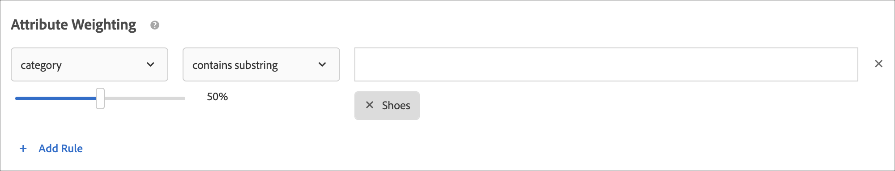

# 建立條件

中的標準 [!UICONTROL Adobe Target] [!UICONTROL Recommendations] 控制 [!UICONTROL Recommendations] 活動。 建立條件以顯示最適合您的活動的建議。這些條件會使用訪客的動作來決定要顯示的內容或產品。

以下幾節說明如何建立新條件。

## 存取「建立新條件」畫面

有多個方式可進入[!UICONTROL 「建立新條件」]畫面。根據您達到畫面的方式，部分畫面選項可能有所不同。

* 在 **[!UICONTROL Recommendations]** > **[!UICONTROL 條件]** 程式庫畫面，按一下 **[!UICONTROL 建立條件]** > **[!UICONTROL 建立條件]**. 您在這裡建立的條件會自動可供所有 [!DNL Recommendations] 活動使用。
* 建立 [!DNL Recommendations] 使用的活動 [!UICONTROL 可視化體驗撰寫器] (VEC)，系統會立即將您帶至 [!UICONTROL 選取條件] 畫面 [!UICONTROL 使用Recommendations取代], [!UICONTROL 插入Recommendations在前]，或 [!UICONTROL 插入Recommendations在後]. 然後，您可以選取可用條件，或按一下 **[!UICONTROL 建立條件]**. 如果您建立新條件，則可以選擇儲存您的條件以搭配其他條件使用 [!DNL Recommendations] 活動。 如需詳細資訊，請參閱 [建立Recommendations活動](/help/main/c-recommendations/t-create-recs-activity/create-recs-activity.md).
* 編輯 [!DNL Recommendations] 活動時，請在頁面上的[!UICONTROL 「Recommendations 位置」]方塊中按一下，然後選取&#x200B;**[!UICONTROL 「變更條件」]**。在 [!UICONTROL 選取條件] 按一下 **[!UICONTROL 建立條件]**. 您將可以選擇儲存您的新條件以搭配其他 [!DNL Recommendations] 活動使用。

下列步驟假設您存取 [!UICONTROL 建立新條件] 使用第一個方法進行篩選：the **[!UICONTROL Recommendations]** > **[!UICONTROL 條件]** 程式庫畫面。

1. 按一下 **[!UICONTROL Recommendations]** > **[!UICONTROL 條件]**.

1. 按一下 **[!UICONTROL 建立條件]** > **[!UICONTROL 建立條件]**.

   

1. 在以下各節中配置資訊。

## [!UICONTROL 基本資訊] {#info}

1. 輸入&#x200B;**[!UICONTROL 條件名稱]**。

   這是用來說明該條件的「內部」名稱。例如，您可能想要將您的條件稱為「利潤最高的產品」，但您不想要將該標題公開顯示。請參閱下一個步驟來設定公開顯示的標題。

   

1. 輸入公開顯示的&#x200B;**[!UICONTROL 顯示標題]**，以在使用此條件的任何 Recommendations 頁面上顯示。

   例如，使用此條件來顯示建議時，您可能想要顯示「瀏覽過此項目、也瀏覽了其他項目的使用者」或「類似產品」。

1. 輸入條件的簡短&#x200B;**[!UICONTROL 說明]**。

   說明應可協助您識別條件，並可能包含關於條件用途的資訊。

1. 根據建議活動的目標選取垂直產業。

   | 垂直產業 | 目標 |
   |--- |--- |
   | 零售/電子商務 | 轉換帶動購買 |
   | 潛在客戶開發/B2B/金融服務 | 轉換但未購買 |
   | 媒體/出版 | 參與 |

   其他條件選項將根據您選取的垂直產業而變更。

1. 選取一個&#x200B;**[!UICONTROL 頁面類型]**。

   您可以選取多個頁面類型。

   產業垂直和頁面類型可共同用來分類您儲存的條件，讓您可輕鬆對其他 [!DNL Recommendations] 活動重複使用條件。

## [!UICONTROL Recommendations演算法] {#rec-algo}

1. 選取 **[!UICONTROL 演算法類型]** 和 **[!UICONTROL 演算法]**:

   

   | 演算法類型 | 使用時機 | 可用演算法 |
   | --- | --- | --- |
   | [!UICONTROL 購物車型] | 根據使用者的購物車內容提供建議。 | <ul><li>瀏覽過這些項目、也瀏覽過這些項目的使用者</li><li>瀏覽過這些、也購買了的人</li><li>購買、購買的人</li></ul> |
   | [!UICONTROL 人氣] | 根據網站上某個項目的整體人氣，或根據使用者最喜愛或最常檢視的類別、品牌、類型等項目的人氣，提出建議。 | <ul><li>網站上檢視次數最多</li><li>按類別檢視次數最多</li><li>依項目屬性檢視次數最多</li><li>網站最暢銷商品</li><li>最暢銷商品類別</li><li>依項目屬性的最暢銷商品</li><li>依Analytics量度排名前</li></ul> |
   | [!UICONTROL 項目型] | 根據找到與使用者目前檢視或最近檢視的項目類似的項目來提供建議。 | <ul><li>檢視過此項目、也檢視了其他項目的使用者</li><li>瀏覽過此項目、但購買了其他項目的使用者</li><li>購買了此項目、也購買了其他項目的使用者</li><li>具有類似屬性的項目</li></ul> |
   | [!UICONTROL 使用者型] | 根據使用者的行為提出建議。 | <ul><li>最近查看的項目</li><li>建議您</li></ul> |
   | [!UICONTROL 自訂條件] | 根據您上傳的自訂檔案提出建議。 | <ul><li>自訂演算法</li></ul> |

   >[!NOTE]
   >
   >如果您選取 **[!UICONTROL 項目]**/ **[!UICONTROL 具有類似屬性的媒體]**，您將可以選擇設定 [內容相似度規則](#similarity).

1. 視需要選取 **項目屬性** 和 **要比對的設定檔屬性**, **建議金鑰**, **篩選索引鍵**，和/或 **Analytics量度** 來設定演算法。

剩餘的演算法設定選項會依所選演算法而有所不同。 若要完成演算法的設定，請選取 [!UICONTROL 建議金鑰], [!UICONTROL 篩選索引鍵], [!UICONTROL 共同發生基準], [!UICONTROL Analytics量度]，和/或 [!UICONTROL 項目屬性] 和 [!UICONTROL 要比對的設定檔屬性].

如需有關選擇 [!UICONTROL 建議金鑰]，請參閱 [讓建議以建議索引鍵為依據](/help/main/c-recommendations/c-algorithms/base-the-recommendation-on-a-recommendation-key.md).

## [!UICONTROL 資料來源] {#data-source}

1. 選取所需 **[!UICONTROL 行為資料來源]**: [!UICONTROL Adobe Target] 或 [!UICONTROL Analytics].

   >[!NOTE]
   >
   >此 [!UICONTROL 行為資料來源] 只有在您的實作 [Analytics for Target](/help/main/c-integrating-target-with-mac/a4t/a4t.md) (A4T)。

   

   如果您選擇 [!UICONTROL Analytics]，請選取需要的報表套裝。

   如果條件使用 [!DNL Adobe Analytics] 作為行為資料來源，條件建立後可用時間會根據其他條件是否已使用選取的報表套裝和回顧期間而定，如下所述：

   * **一次性報表套裝設定**: 報表套裝第一次搭配指定資料範圍回顧期間使用時，[!DNL Target Recommendations] 可能需要二到七天才能從 [!DNL Analytics] 完全下載所選報表套裝的行為資料。此時間範圍取決於 [!DNL Analytics] 系統負載。
   * **使用已可取得之報表套裝的全新或已編輯的條件**: 建立新條件或編輯現有條件時，如果所選報表套裝已搭配 [!DNL Target Recommendations] 使用，且資料範圍小於或等於所選資料範圍，資料即可立即使用且不需要一次性設定。在此情況下，或是在未修改所選報表套裝或資料範圍時已編輯演算法的設定，演算法會在 12 小時內執行或重新執行。
   * **現有演算法執行**: 資料會每天從 [!DNL Analytics] 流動到 [!DNL Target Recommendations]。例如，針對[!UICONTROL 已檢視的相關性]建議，當使用者檢視某個產品時，產品檢視追蹤呼叫會以近乎即時的速度傳送到 [!DNL Analytics]。[!DNL Analytics] 資料會在隔天很早推送到 [!DNL Target]，且 [!DNL Target] 會在 12 小時內執行演算法。

   如需詳細資訊，請參閱 [將Adobe Analytics與Target Recommendations搭配使用](/help/main/c-recommendations/c-algorithms/use-adobe-analytics-with-recommendations.md).

1. 設定 **[!UICONTROL 回顧期間]** 決定要顯示哪些建議時，要使用的可用歷史使用者行為資料的時間範圍。 此選項適用於所有演算法，但具有類似屬性的項目和自訂演算法除外。

   

   如果您的網站經常有大量流量和行為變更，請選擇較短的資料時段。較短的時段可讓 [!DNL Recommendations] 對於市場和您的業務中的變更更具回應力。例如，較短的時段表示 [!DNL Recommendations] 將在您的訪客開始季節性購物 (例如開學購物或聖誕節) 時偵測訪客行為中的變更，並將對這些購物季建議適當的項目。

   如果您沒有許多資料，或訪客行為不會經常變更，則可以選取較長的時段。不過，對許多網站而言，較短的時段會產生較高品質的建議。

   可用的資料範圍為:

   | 回顧期間選項 | 更新頻率（暫留時顯示） | 支援的alogrims |
   | --- | --- | --- |
   | 六小時 | 演算法每3到6小時執行一次 | [!UICONTROL 人氣] 選取時的演算法 [!UICONTROL 行為資料來源] is [!DNL Adobe Target] |
   | 一天 | 演算法每12到24小時執行一次 | [!UICONTROL 人氣] 算法 |
   | 兩天 | 演算法每12到24小時執行一次 | <ul><li>[!UICONTROL 人氣] 算法</li><li>[!UICONTROL 項目型] 算法</li><li>[!UICONTROL 使用者型] 算法</li><li>[!UICONTROL 購物車型] 算法</li></ul> |
   | 一週 | 演算法每24到48小時執行一次 | <ul><li>[!UICONTROL 人氣] 算法</li><li>[!UICONTROL 項目型] 算法</li><li>[!UICONTROL 使用者型] 算法</li><li>[!UICONTROL 購物車型] 算法</li></ul> |
   | 兩週 | 演算法每24到48小時執行一次 | <ul><li>[!UICONTROL 人氣] 算法</li><li>[!UICONTROL 項目型] 算法</li><li>全部 [!UICONTROL 使用者型] 算法</li><li>[!UICONTROL 購物車型] 算法</li></ul> |
   | 一個月（30天） | 演算法每24到48小時執行一次 | <ul><li>[!UICONTROL 人氣] 算法</li><li>[!UICONTROL 項目型] 算法</li><li>[!UICONTROL 使用者型] 算法</li><li>[!UICONTROL 購物車型] 算法</li></ul> |
   | 兩個月（61天） | 演算法每24到48小時執行一次 | <ul><li>[!UICONTROL 人氣] 算法</li><li>[!UICONTROL 項目型] 算法</li><li>[!UICONTROL 使用者型] 算法</li><li>[!UICONTROL 購物車型] 算法</li></ul> |

## [!UICONTROL 備份內容] {#content}

[!UICONTROL 備份內容] 規則決定如果建議的項目數未填滿 [建議設計](/help/main/c-recommendations/c-design-overview/design-overview.md). [!DNL Recommendations] 條件可能傳回較您的設計所需更少的建議。例如，如果您的設計有四個項目的位置，但您的條件僅導致建議兩個項目，您可以將其餘的位置保留為空白，您可以使用備用建議來填入額外的位置，或選擇不顯示建議。

1. （可選）滑動 **[!UICONTROL 部分設計呈現]** 切換至「開啟」位置。

   將盡可能多地填滿槽，但設計範本可能包含剩餘槽的空白空間。 如果已停用此選項，且沒有足夠的內容可填入所有可用位置，則不會提供建議，而會改為顯示預設內容。

   如果您想要讓建議與空白位置搭配使用，請啟用此選項。 如果您想要根據您的條件在建議位置填入內容，而空白位置則填入您網站中類似或熱門內容，請使用備份建議，如下一個步驟所述。

1. （可選）滑動 **[!UICONTROL 顯示備份內容]** 切換至「開啟」位置。

   在設計中的任何剩餘空白位置中，隨機選取您網站上檢視次數最多的產品。

   使用備用建議可確保您的建議設計能填滿所有可用的位置。 假設您有4 x 1設計，如下圖所示：

   

   假設您的條件僅導致建議兩個項目。 如果您啟用 [!UICONTROL 部分設計呈現] 選項，前兩個槽已填滿，但其餘兩個槽仍為空。 不過，如果您啟用 [!UICONTROL 顯示備份Recommendations] 選項，前兩個槽會根據您指定的條件填入，其餘兩個槽則會根據您的備份建議填入。

   下列矩陣顯示使用 [!UICONTROL 部分設計呈現] 和 [!UICONTROL 備份內容] 選項：

   | 部分設計呈現 | 備份內容 | 結果 |
   |--- |--- |--- |
   | 已停用 | 已停用 | 如果傳回的建議少於設計呼叫的數目，則會以預設內容取代建議設計，並且不顯示建議。 |
   | 已啟用 | 已停用 | 系統會轉譯設計，但如果傳回的建議少於設計呼叫的數目，則可能包含空格。 |
   | 已啟用 | 已啟用 | 備用建議會填滿可用的設計「槽」，以完整呈現設計。 如果因套用包含規則至備用建議而限制了合格備用建議的數量，以致設計無法填滿，則會轉譯部分設計。 如果條件未傳回任何建議，並且包含規則將備用建議限制為零，則會以預設內容來取代設計。 |
   | 已停用 | 已啟用 | 備用建議會填滿可用的設計「槽」，以完整呈現設計。 如果因套用包含規則至備用建議而限制了合格備用建議的數量，以致設計無法填滿，則會以預設內容取代設計，並且不顯示建議。 |

   如需詳細資訊，請參閱 [使用備份建議](/help/main/c-recommendations/c-algorithms/backup-recs.md).

1. （條件性）如果您選取 **[!UICONTROL 顯示備份內容]** 在上一步中，您可以啟用 **[!UICONTROL 將包含規則套用至備用建議]**.

   包含規則會決定建議中包含哪些項目。 可用的選項取決於您的垂直產業。

   如需更多詳細資料，請參閱 [指定包含規則](#inclusion) 下方。

## 內容相似度 {#similarity}

使用[!UICONTROL 內容相似度]規則根據項目或媒體屬性來提出建議。

>[!NOTE]
>
>如果您選取 **[!UICONTROL 項目型]**/ **[!UICONTROL 具有類似屬性的媒體]** 演算法類型和演算法可讓您選擇設定內容相似度規則。

內容相似度會比較項目屬性關鍵字並根據不同項目有多少共通的關鍵字進行建議。根據內容相似度的建議不需要過去的資料即可傳送強大的結果。

使用內容相似度來產生建議對於新項目來說尤其有效，它不太可能在使用&#x200B;*瀏覽過此項目、也瀏覽了其他項目的使用者*&#x200B;和根據過去行為之其他邏輯的建議中顯示。您也可以使用內容相似度，為沒有過去的購買或其他歷史資料的新訪客產生實用的建議。

選取 **[!UICONTROL 項目型]**/ **[!UICONTROL 具有類似屬性的媒體]**，您可以選擇建立規則，以增加或減少在決定建議時特定項目屬性的重要性。 對於書籍之類的項目，您可能想要增強&#x200B;*風格*、*作者*、*系列*&#x200B;之類屬性的重要性，以建議類似的書籍。

因為內容相似度使用關鍵字來比較項目，有些屬性，例如&#x200B;*訊息*&#x200B;或&#x200B;*說明*&#x200B;可能會對比較產生「雜訊」。您可以建立規則來忽略這些屬性。

依預設，所有屬性會設為&#x200B;*「基線」*。除非您要變更此設定，否則您不需建立規則。

>[!NOTE]
>
>內容相似度演算法可能會使用隨機抽樣來計算項目之間的相似度。 因此，不同演算法執行之間，項目之間的相似度評等可能會有所不同。

## 包含規則 {#inclusion}

有數個選項可以協助您縮減在建議中顯示的項目。您可以在建立條件或促銷活動時使用包含規則。

包含規則屬於可選; 不過，設定這些詳細資料可讓您對於建議中出現的項目擁有更多控制。您設定的每個詳細資訊都會進一步縮小顯示條件。

例如，您可以選擇只顯示存貨超過 50 雙且價格介於 $25 和 $45 之間的女鞋。您也可以加權每個屬性，讓對於您業務更為重要的項目可以更常顯示。

另一個範例是，您可以選擇對造訪您的網站、僅來自特定城市且擁有所需大學學位的訪客顯示職缺。

包含規則選項可能因垂直產業而不同。依預設，包含規則會套用至備用建議。

>[!IMPORTANT]
>
>您應該謹慎使用包含規則。例如，如果您的組織具有規則，要求在顯示某個品牌時不建議其他品牌，則這些選項很有用。不過，此功能有機會成本。將活動條件通常會顯示的某些項目限制為不要顯示時，您可能會遺失提升度百分比。

利用 AND 聯合包含規則。必須符合所有規則，才能在建議中納入某個項目。

如先前所提及，若要建立簡單的包含規則，僅顯示存貨大於 50 且價格介於 $25 與 $45 之間的女鞋，請執行下列步驟:

1. （條件性）滑動 **[!UICONTROL 是否允許建議最近購買的項目？]** 切換至「開啟」位置。

   此設定是根據 `productPurchasedId`。預設行為是不推薦先前購買的項目。大多數情況下，您不會想推銷客戶最近已購買的項目。如果您銷售的是客戶一般只會購買一次的項目，例如獨木舟，則此相當實用。如果您銷售的是人們反複回來購買的產品，如洗髮水或其他個人產品，則應啟用此選項。

1. 設定您要建議之產品的價格範圍。
1. 設定您要建議之產品的存貨量下限。
1. 設定建議只在項目符合您的特定條件時才顯示。

   

   您可以指定僅在符合清單中的其中一項屬性，或不符合一項或多項指定的條件時，才包括項目。

   可用的評估工具取決於您在第一個下拉式清單中選擇的值。您可以列出多個項目。這些項目會使用 OR 來評估。

   多個規則會使用 AND 來結合。

   >[!NOTE]
   >
   >此選項會限制建議中所顯示的項目。不會限制在哪些頁面中顯示建議。若要限制建議顯示的位置，請在體驗撰寫器中選取頁面。

如需詳細資訊，請參閱 [使用動態和靜態包含規則](/help/main/c-recommendations/c-algorithms/use-dynamic-and-static-inclusion-rules.md).

## 屬性加權 {#weighting}

您可以新增多個規則，根據內容目錄的重要資訊或中繼資料來「微調」演算法，讓某些項目更有可能顯示。

例如，您可以對在售項目套用較高的加權，以便在建議中更頻繁地顯示它們。不完全排除非售項目，但它們的顯示頻率較低。多種加權屬性皆可套用至相同的演算法，並能依據建議中的拆分流量測試加權屬性。

1. 選擇值。

   根據數個可用條件中的一個，值會決定較可能顯示的項目類型。

1. 選擇一個求值器。

1. 輸入關鍵字以完成規則屬性。

   例如，完成規則可能是「類別包含子字串鞋子」。

   

1. 選取要指派至規則的加權。

   選項範圍從 0 到 100 (增量為 25)。

1. 如有需要，可新增其他規則。

完成時，按一下&#x200B;**[!UICONTROL 「儲存」]**。

如果您要建立新的 [!UICONTROL Recommendations] 活動或編輯現有的活動，依預設會選取&#x200B;**[!UICONTROL 「儲存條件以供稍後使用」]**&#x200B;核取方塊。如果您不想在其他活動中使用條件，請在儲存之前清除核取方塊。

## 訓練影片：在Recommendations中建立條件(12:33) 

此影片包含下列資訊:

* 建立條件
* 建立條件序列
* 上傳自訂條件

>[!VIDEO](https://video.tv.adobe.com/v/27694?quality=12)
