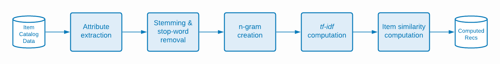

# Target 推薦演算法背後的科學

深入說明中使用的演算法 [!DNL Adobe Target Recommendations]包括模型訓練的邏輯和數學細節，以及模型服務過程。

模型訓練是指 [!DNL Adobe Target] 學習算法。 模型服務是 [!DNL Target] 會向您的網站訪客提供建議（也稱為內容傳送）。

[!DNL Target] 在中包含下列廣泛的演算法類型 [!DNL Recommendations]:

* **項目型演算法**:納入遵循「已檢視/已購買此項目的使用者也已檢視/已購買這些項目」邏輯的演算法。 這些演算法會分組在傘狀詞項目協同篩選下，以及 [!UICONTROL 具有類似屬性的項目] 演算法。

* **使用者型演算法**:納入 [!UICONTROL 最近查看] 和 [!UICONTROL 建議您] 演算法。

* **基於人氣的演算法**:包含演算法，可傳回整個網站上最常檢視或最常購買的項目，或依類別或項目屬性最常檢視或最常購買的項目。

* **購物車型演算法**:納入多項目型建議，並搭配「已檢視/已購買這些項目的使用者，也已檢視/已購買這些項目」邏輯。

* **自訂條件**:根據上傳至的自訂檔案包含建議 [!DNL Target].

>[!NOTE]
>
>如需每個演算法類型和個別演算法的一般資訊，請參閱 [讓建議以建議索引鍵為依據](/help/main/c-recommendations/c-algorithms/base-the-recommendation-on-a-recommendation-key.md).

上述許多演算法都是以一或多個索引鍵存在為基礎。 這些索引鍵可用於在內容傳送時（提出建議時）擷取類似項目。 客戶指定的索引鍵可以包含訪客正在檢視的目前項目、已檢視或已購買的最後項目、最常檢視的項目、目前類別或最喜愛的類別。 其他演算法（例如購物車或使用者型建議）會使用隱式索引鍵（客戶無法設定）。 如需詳細資訊，請參閱 *建議索引鍵*，在 [讓建議以建議索引鍵為依據](/help/main/c-recommendations/c-algorithms/base-the-recommendation-on-a-recommendation-key.md#keys). 不過，請注意，這些索引鍵只與模型提供時間（內容傳送）相關。 這些鍵不會影響「離線」或模型訓練時間邏輯。

以下幾節將以稍不同於上述演算法類型的方式分組演算法。 以下是基於模型訓練邏輯相似性的分組。

## 物料 — 物料協作篩選

演算法包括：

* [!UICONTROL 瀏覽過此項目、也瀏覽了其他項目的使用者]
* [!UICONTROL 瀏覽過此項目、但購買了其他項目的使用者]
* [!UICONTROL 購買了此項目、也購買了其他項目的使用者]

項目 — 項目協同篩選建議演算法的基礎，是您應使用許多使用者的行為模式（因此是協作的），為指定項目提供有用的建議（例如，篩選可能建議的項目目錄）。 雖然有許多不同的算法屬於 [協同過濾](https://en.wikipedia.org/wiki/Collaborative_filtering)，這些演算法通常以行為資料來源作為輸入。 在 [!DNL Target Recommendations]，這些輸入即為使用者對項目的不重複檢視和購買。

針對「已檢視/購買此項目的使用者也已檢視/購買這些項目」演算法，目標是計算所有對項目之間的相似度s(A,B)。 對於指定項目A，最上層建議會依其相似度s(A,B)排序。

相似度的一個範例是項目之間的共同出現：購買兩個項目的使用者人數的簡單計數。 雖然直覺上如此，但這種衡量標準是天真的，因為它偏向於推薦熱門項目。 例如，如果在雜貨店裡，大部分人都買麵包，麵包會與所有物品有很高的共發性，但這並不一定是一個好的建議。 [!DNL Target] 而是使用更精密的相似度量，稱為對數似然比(LLR)。 當兩個項目（A和B）的共同發生概率與它們不共同發生的概率非常不同時，此數量就很大。 為了具體，請考量 [!UICONTROL 瀏覽過此項目、但購買了其他項目的使用者] 演算法。 購買B的機率為時，LLR的相似度較大 *not* 無論是否有人看了A

例如，若

項目A不應建議項目B。提供此對數似然比相似度計算的完整詳細資訊 [在此PDF](/help/main/c-recommendations/c-algorithms/assets/log-likelihood-ratios-recommendation-algorithms.pdf).

實際演算法實施的邏輯流程如下圖所示：

這些步驟的詳細資訊如下：

* **輸入資料**:行為資料，以您 [實作Target](https://experienceleague.corp.adobe.com/docs/target-dev/developer/recommendations.html){target=_blank} or from [Adobe Analytics](/help/main/c-recommendations/c-algorithms/use-adobe-analytics-with-recommendations.md){target=_blank}.

* **模型訓練**:

   * **資料清理和取樣**:若為具有N天回顧的演算法，系統會先篩選行為資料，以僅包含這N天的資料。 然後會套用收集規則和全域排除，以移除任何不應建議的項目。 最後，任何與超過1,000個項目互動的訪客，其使用資料僅取樣1,000個項目。
   * **項目相似度計算**:這是核心的計算步驟：根據此相似性分數計算所有候選項目對和項目排名對之間的對數似然比相似度。
   * **離線篩選**:最後，套用任何其他適用的動態篩選（例如動態類別排除）。 在此步驟後，系統會全域快取預先計算的建議，以便供使用。

* **模型服務**:Recommendations內容的傳送來源 [!DNL Target]&#39;s [全局「邊緣」網路](/help/main/c-intro/how-target-works.md#concept_0AE2ED8E9DE64288A8B30FCBF1040934). 向提出mbox要求時 [!DNL Target] 而且，建議內容應傳送至頁面，並要求適當 [項目索引鍵](/help/main/c-recommendations/c-algorithms/base-the-recommendation-on-a-recommendation-key.md#keys) 針對recommendations演算法會從請求剖析或從使用者設定檔查詢，然後用來擷取在先前步驟中計算的建議。 此時會在適當的 [設計](/help/main/c-recommendations/c-design-overview/create-design.md) 已呈現。

## 內容相似度

算法包括：

* [!UICONTROL 具有類似屬性的項目]

在這種演算法中，如果兩個項目的名稱和文字說明在語義上相似，則視為相關項目。 不同於大多數建議演算法必須使用行為資料來源，內容相似度演算法使用產品目錄的中繼資料來衍生項目之間的相似度。 [!DNL Target] 因此，在所謂的「冷啟動」案例中(例如，在 [!DNL Target] 活動)。

雖然在 [!DNL Target]其內容相似度算法與其他基於項的算法相同，模型訓練步驟大不相同，涉及一系列自然語言處理和預處理步驟，如下圖所示。 相似性計算的核心是使用經修改的tf-idf向量的余弦相似性來表示目錄中的每個項目。

這些步驟的詳細資訊如下：

* **輸入資料**:如前所述，此演算法完全以目錄資料為基礎(擷取至 [!DNL Target] via a [目錄摘要、實體API或來自頁面更新的](https://experienceleague.corp.adobe.com/docs/target-dev/developer/recommendations.html){target=_blank}.

* **模型訓練**:

   * **屬性擷取**:應用規則靜態篩選、目錄規則和全局排除後，該算法從實體架構中提取相關的文本欄位。 [!DNL Target] 會自動使用實體屬性中的名稱、訊息和類別欄位，並嘗試從自訂中擷取任何字串欄位 [實體屬性](/help/main/c-recommendations/c-products/entity-attributes.md). 此程式的完成方式是確保該欄位的大部分值不能以數字、日期或布林值形式剖析。
   * **詞乾和止字移除**:為了更精確的文字相似度比對，請謹慎移除非常常見的「停止」字詞，這些字詞不會大幅改變項目的意義（例如「was」、「is」、「and」等）。 同樣，詞乾詞也是指將尾碼不同的字詞減少到其根字的過程，其含義相同（例如&quot;connect&quot;、&quot;connecting&quot;和&quot;connection&quot;），都有相同的根字：&quot;connect&quot;)。 [!DNL Target] 用的是雪球鞋。 [!DNL Target] 首先執行自動語言檢測，最多可停止50種語言的字詞移除和18種語言的詞乾分析。
   * **n-gram建立**:在前述步驟之後，每個字詞會視為代號。 將令牌的連續序列組合成單個令牌的過程稱為n-gram建立。 [!DNL Target]的算法最多可考慮2克。
   * **tf-idf計算**:下一步包括建立tf-idf向量，以反映項目說明中代號的相對重要性。 對於項目i中的每個代號/詞語t，在目錄D中，具有 |D|項，首先計算術語頻率TF(t, i)（術語在項i中出現的次數），以及文檔頻率DF(t, D)。 實質上，代號存在的項目數。 然後，tf-idf測量

      

      [!DNL Target] 使用Apache Spark的 *tf-idf* 功能實作，此功能會在hood底下將每個Token雜湊至218個Token的空間。 在此步驟中，也可根據 [條件](/help/main/c-recommendations/c-algorithms/create-new-algorithm.md#similarity).

   * **項目相似度計算**:使用近似余弦相似性來完成最終項相似性計算。 對於兩個項目， *A* 和 *B*，對於向量tA和tB，余弦相似度定義為：

      

      為避免計算所有N x N項目之間的相似性時出現顯著的複雜性， *tf-idf* 向量會遭截斷，僅包含其最大500個項目，然後使用此截斷的向量表示來計算項目之間的余弦相似性。 與其他近似最近鄰(ANN)技術（如局部敏感哈希）相比，該方法對稀疏向量相似度計算具有更強的魯棒性。

   * **模型服務**:此程式與前一節所述的項目 — 項目協同篩選技術相同。

## 多鍵建議

演算法包括：

* 購物車型建議
* [!UICONTROL 建議您]

最近新增的 [!DNL Target] 建議演算法套裝包括 [!UICONTROL 建議您] 和一系列以購物車為基礎的建議演算法。 這兩種演算法都使用協作篩選技術來形成個別項目型建議。 在服務期間，使用者的瀏覽記錄中會有多個項目(針對 [!UICONTROL 建議您])，或使用者的目前購物車（針對購物車型建議）來擷取這些以項目為基礎的建議，然後這些建議會合併以形成建議的最終清單。 請注意，有許多種類的個人化建議演算法。 選擇多鍵演算法表示當訪客有任何瀏覽記錄且建議可更新以回應最新的訪客行為後，即可立即使用建議。

這些演算法以項目型建議區段中所述的基本協作篩選技術為基礎，但也納入超參數調整以決定項目之間的最佳相似度量。 演算法會對每位使用者執行行為資料的時間順序分割，並訓練先前資料的建議模型，同時嘗試預測使用者在之後檢視或購買的項目。 產生最佳的相似度量度 [平均精確度](https://en.wikipedia.org/wiki/Evaluation_measures_(information_retrieval)。

下圖顯示模型訓練和評分步驟的邏輯：

這些步驟的詳細資訊如下：

* **輸入資料**:這與項目 — 項目協作篩選(CF)方法相同。 [!UICONTROL 兩者皆建議您] 和購物車型演算法使用行為資料，以您 [實作Target](https://experienceleague.corp.adobe.com/docs/target-dev/developer/recommendations.html){target=_blank} or from [Adobe Analytics](/help/main/c-recommendations/c-algorithms/use-adobe-analytics-with-recommendations.md){target=_blank}.

* **模型訓練**:

   * **資料清理和取樣**:這同樣等同於協作篩選方法，合作篩選方法會套用回顧期間，將行為資料篩選至適當的日期範圍，然後套用目錄規則和全域排除。 與超過1,000個項目互動的訪客只會考慮其最近1,000個使用方式。
   * **列車試驗分段**:對每個用戶執行按時間順序分割的用法，將其前80%的用法分配給訓練資料，其餘20%分配給測試資料。
   * **項目相似度模型訓練**:核心項目相似度計算不同於 [!UICONTROL 建議您] 和基於購物車的算法。 針對 [!UICONTROL 建議您]，項目向量具有維NUsers，其中每個條目表示項目用戶的隱式評級之和 — 購買項目的權重為項目視圖的2倍。 若為購物車型建議，項目向量會有二進位項目；如果僅考慮工作階段內行為，則每個工作階段都會有新項目。 否則，此項目向量中會有每個訪客的項目。

   訓練步驟會計算幾種向量相似度：LLR相似度([此處討論](/help/main/c-recommendations/c-algorithms/assets/log-likelihood-ratios-recommendation-algorithms.pdf))、余弦相似度（先前定義）和標準化L2相似度，定義為：

   

   * **項目相似性模型評價**:模型評估是採用前一步驟中產生的建議，對測試資料集進行預測。 線上計分階段會透過按時間順序排序測試資料集中每個使用者的項目使用情況，然後針對已排序的項目子集提出100個建議，以嘗試預測後續的檢視和購買。 資訊擷取量度， [平均精確度](https://en.wikipedia.org/wiki/Evaluation_measures_(information_retrieval)，用於評估這些建議的品質。 此量度會考量建議的順序，並偏好建議清單中較上方的相關項目，這是排名系統的重要屬性。
   * **模型選取**:離線評估後，會選取平均精確度最高的模型，並針對其計算所有個別項目 — 項目建議。
   * **離線篩選**:模型訓練的最後階段是應用任何適用的動態濾波器。 在此步驟後，系統會全域快取預先計算的建議，以便供使用。

* **模型服務**:與先前提供建議的演算法不同，在提供建議時需要指定單一索引鍵以供擷取，接著應用業務規則， [!UICONTROL 建議您] 而以購物車為基礎的演算法則採用更複雜的執行階段程式。

   * **多鍵檢索和合併**:若是購物車型建議，在購物車中最多傳遞10個項目會視為擷取的索引鍵，而每個建議的加權均等。 針對 [!UICONTROL 建議您]，最多可將前五個獨特檢視項目和前五個獨特購買項目視為擷取索引鍵，而購買項目產生的建議加權倍於檢視項目產生的建議。 合併建議時，如果一個項目出現在多個個別建議清單中，則會新增其加權相似度分數。 此階段的建議最終清單就是重新加權建議的合併清單，依遞減順序排名。
   * **篩選**:接著，會套用篩選規則，例如移除先前檢視和/或購買的項目，以及其他動態業務規則。

這些程式在下圖中顯示，訪客已檢視項目A並購買項目B。系統會以每個項目標籤下方顯示的離線相似度分數來擷取個別建議。 擷取後，建議會與加權相似度分數合併。 最後，在客戶已指定先前檢視和購買的項目必須篩選掉的案例中，篩選步驟會從建議清單中移除項目A和B。

## 人氣

演算法包括：

* [!UICONTROL 網站上檢視次數最多]
* [!UICONTROL 按類別檢視次數最多]
* [!UICONTROL 依項目屬性檢視次數最多]
* [!UICONTROL 網站最暢銷商品]
* [!UICONTROL 最暢銷商品類別]
* [!UICONTROL 依項目屬性的最暢銷商品]

[!DNL Target] 針對網站上檢視次數最多的項目，以及最暢銷的銷售項目，或依項目屬性或類別劃分，提供以人氣為基礎的演算法。 基於人氣的演算法會根據指定時間範圍內檢視或購買該項目的工作階段數來排名項目。

所有這些演算法都會結合匯總行為資料，其中檢視和購買項目的工作階段總數會以每小時和每日解析度記錄。 接著，個別演算法會找出客戶設定回顧期間中檢視次數最多或購買次數最多的項目。

個別演算法的細微差別如下：

* [!UICONTROL 網站上檢視次數最多] 和 [!UICONTROL 網站最暢銷商品] 依分別檢視或購買這些項目的工作階段總數來排名項目。 輸出是建議項目的單一（無索引鍵）清單。
* 「依類別/項目屬性檢視的最暢銷商品」多為建議，依檢視或購買這些項目的工作階段總數排序項目，但依項目類別或特定項目屬性分組。 輸出是建議項目清單，由類別值或項目屬性值輸入。

## 最近查看

「最近檢視」建議演算法可讓建議在工作階段內個人化。 此演算法不需要離線的「模型訓練」。 相反， [!DNL Target] 使用唯一 [訪客資料](/help/main/c-target/c-visitor-profile/visitor-profile.md) 維護已在指定工作階段中檢視的項目執行中清單，並可在建議活動中顯示這些項目。 這可即時更新建議和下一頁個人化。

## 自訂條件

自訂條件可讓客戶 [上傳自己的建議 [!DNL Target]](/help/main/c-recommendations/c-algorithms/recommendations-csv.md)，提供重要的彈性，並允許「自攜型號」功能。 自訂條件會取代 [!UICONTROL 項目型] 建議，但線上上內容傳送階段期間，其行為與「項目型」建議演算法類似，即會使用單一索引鍵來擷取建議，然後套用業務規則/篩選器。
