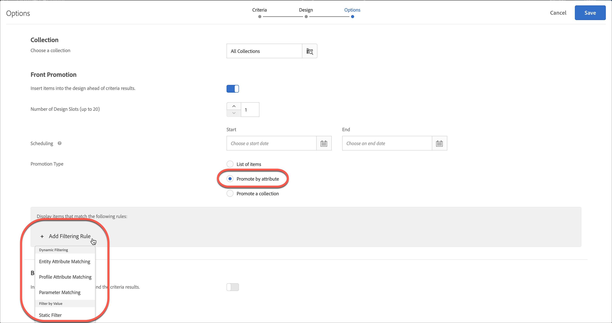

# 使用動態和靜態包含規則

有關在[!DNL Adobe Target]中建立條件和促銷活動的包含規則，以及新增動態或靜態篩選規則以便為您的建議取得更佳結果的資訊。

對於條件和促銷活動，建立和使用包含規則的過程很相似，就如同使用案例和範例很相似一樣。本節將說明條件和促銷活動以及如何使用包含規則。

## 將篩選規則新增至條件 {#section_CD0D74B8D3BE4A75A78C36CF24A8C57F}

當您[建立條件](/help/main/c-recommendations/c-algorithms/create-new-algorithm.md#task_8A9CB465F28D44899F69F38AD27352FE)時，請按一下&#x200B;**[!UICONTROL Add Filtering Rule]**&#x200B;底下的&#x200B;**[!UICONTROL Inclusion Rules]**。

可用的選項依選取的行業別和建議金鑰而不同。

## 將篩選規則新增至促銷活動 {#section_D59AFB62E2EE423086281CF5D18B1076}

在[建立促銷活動](/help/main/c-recommendations/t-create-recs-activity/adding-promotions.md#task_CC5BD28C364742218C1ACAF0D45E0E14)時，請選取&#x200B;**[!UICONTROL Promote by Attribute]**，然後按一下&#x200B;**[!UICONTROL Add Filtering Rule]**。

## 篩選類型 {#section_0125F1ED10A84C0EB45325122460EBCD}

以下小節列出條件和促銷活動的[!UICONTROL Dynamic Filtering]與[!UICONTROL Filter by Value]的篩選選項型別：

### 動態篩選

動態包含規則比靜態包含規則更強大，而且會產生更好的結果和參與。 考慮以下事項：

* 動態包含規則會透過比對使用者設定檔引數或mbox呼叫中的屬性來傳送建議。

  例如，您可以建立「最受歡迎的條件」建議。 從傳回的建議集中，您可以針對使用者存取顯示建議的頁面時傳遞的屬性，即時篩選掉任何建議。

* 使用靜態規則來限制建議中包含的專案（而不使用集合）。

* 您可以視需要建立儘可能多的動態包含規則。 包含規則是以 AND 運算子來結合。必須符合所有規則，才能在建議中納入某個項目。

下列選項適用於動態篩選：

| 動態篩選選項 | 詳細資料 |
| --- | --- |
| [實體屬性比對](/help/main/c-recommendations/c-algorithms/entity-attribute-matching.md) | 比較一批潛在的建議專案與使用者已有互動的特定專案，以動態篩選。 當您想要顯示最能吸引訪客的建議（例如訪客最喜愛的品牌）時，請使用[!UICONTROL Entity Attribute Matching]。 |
| [輪廓屬性比對](/help/main/c-recommendations/c-algorithms/profile-attribute-matching.md) | 比較專案（實體）與使用者設定檔中的值，以動態篩選。 當您想要顯示符合儲存在訪客設定檔中的值（例如大小或最喜愛的品牌）的建議，請使用[!UICONTROL Profile Attribute Matching]。 |
| [參數比對](/help/main/c-recommendations/c-algorithms/parameter-matching.md) | 比較專案（實體）與請求（API或mbox）中的值，以動態篩選。 使用[!UICONTROL Parameter Matching]來建議符合頁面引數或訪客引數的內容，例如裝置維度或地理位置。 |

### 按值篩選

下列選項可依值篩選：

| 依值選項篩選 | 詳細資料 |
| --- | --- |
| [靜態篩選器](/help/main/c-recommendations/c-algorithms/static-value.md) | 手動輸入一或多個要篩選的靜態值。 |

## 可用的運運算元 {#operators}

動態條件和促銷活動比靜態條件和促銷活動強大得多，並產生更好的結果和參與。

下列範例提供如何在行銷工作中使用動態促銷和排除的一般概念：

| 運算子 | 範例 |
| --- | --- |
| Equals  （適用於實體屬性比對、設定檔屬性比對、引數比對和靜態篩選。） | 如果在動態促銷活動中使用「等於」運運算元，當訪客檢視您網站上的專案時（例如產品、文章或電影），您可以促銷下列來源的其他專案：<ul><li>相同品牌</li><li>相同類別</li><li>來自自家品牌的相同類別和</li><li>相同商店</li></ul> |
| 不等於  （適用於實體屬性比對、設定檔屬性比對、引數比對和靜態篩選。） | 如果在動態促銷活動中使用「不等於」運運算元，當訪客檢視您網站上的專案時（例如產品、文章或電影），您可以促銷下列來源的其他專案：<ul><li>另一部電視劇</li><li>不同的型別</li><li>不同的產品系列</li><li>不同的樣式ID</li></ul> |
| 不包含子字串  （適用於實體屬性比對、設定檔屬性比對、引數比對和靜態篩選。） | 使用「不包含子字串」運運算元時，當訪客檢視您網站上的專案時（例如產品），您可以促銷如下的其他專案：<ul><li>標題不含粗字</li></ul> |
| 開頭為  （適用於實體屬性比對、設定檔屬性比對、引數比對和靜態篩選。） | 使用「開頭為」運運算元時，當訪客檢視您網站上的專案時（例如產品），您可以促銷如下的其他專案：<ul><li>產品名稱以iPhone開頭</li></ul> |
| 結尾為  （適用於實體屬性比對、設定檔屬性比對、引數比對和靜態篩選。） | 使用「結尾為」運運算元時，當訪客檢視您網站上的專案時（例如產品），您可以促銷如下的其他專案：<ul><li>內容結尾是EN，表示英文</li></ul> |
| 大於或等於  （適用於實體屬性比對、設定檔屬性比對、引數比對和靜態篩選。） | 使用「大於或等於」運運算元時，當訪客檢視您網站上的專案時（例如產品），您可以促銷如下的其他專案：<ul><li>成本相同或更昂貴</li></ul> |
| 小於或等於  （適用於實體屬性比對、設定檔屬性比對、引數比對和靜態篩選。） | 使用「小於或等於」運運算元時，當訪客檢視您網站上的專案時（例如產品），您可以促銷如下的其他專案：<ul><li>成本相同或較便宜</li><li>排除較便宜的專案</li></ul> |
| 介於 之間（適用於實體屬性比對、設定檔屬性比對和引數比對）。 | 如果在動態促銷活動中使用「介於」運運算元，當訪客檢視您網站上的專案時（例如產品、文章或電影），您可以促銷如下的其他專案：<ul><li>更貴</li><li>更便宜</li><li>成本加減30%</li><li>同季的後續集數</li><li>系列中先前的書籍</li></ul> |
| 包含在清單 中（可搭配設定檔屬性比對和引數比對）。 | 在設定檔屬性比對中使用「包含在清單中」運運算元，當訪客檢視您網站上的專案時（例如產品、文章或電影），您可以促銷如下的其他專案：<ul><li>可在訪客的地理位置中使用</li></ul>**範例**：您只想建議訪客地理區域中可用的專案。 您的篩選規則可能如下所示： `availableGeographies list contains an item in user.currentGeography` **注意**：使用此運運算元時，規則的[右側](#caveats)應該會有清單。 |
| 未包含在清單 中（可用於設定檔屬性比對和引數比對。） | 在設定檔屬性比對中使用「不在清單中」運運算元，當訪客檢視您網站上的專案時（例如產品、文章或電影），您可以排除下列其他專案：<ul><li>在訪客已檢視的最後10個專案清單中</li></ul></ul>**範例**：您不想要促銷訪客最近檢視過且沒有興趣的專案。 您的篩選規則可能如下所示： `id is not contained in list user.lastViewedItems` **注意**：使用此運運算元時，規則的[右側](#caveats)應該會有清單。 |
| 清單包含 中的專案（適用於實體屬性比對、設定檔屬性比對和引數比對）。 | 在設定檔屬性比對中使用「清單中包含專案」運運算元，當訪客檢視您網站上的專案時（例如體育賽事或音樂會），您可以促銷如下的其他專案：<ul><li>與訪客最喜愛的團隊之一相關聯</li></ul>**範例**：您想要建議與訪客最喜愛的團隊之一相關聯的遊戲。 您的篩選規則可能如下所示： ` teamsPlaying list contains an item in user.favoriteTeams` **注意**：使用此運運算元時，規則的[兩面](#caveats)中應該會有清單。 |
| 清單在 中不包含專案（適用於實體屬性比對、設定檔屬性比對和引數比對）。 | 在引數屬性比對中使用「清單不包含專案」運運算元，當訪客檢視您網站上的專案時（例如產品、文章或電影），您可以排除下列其他專案：<ul><li>包含在禁止型別清單中</li></ul>**範例**：您想要排除成人訪客可用的專案，例如菸草和酒精。 您的篩選規則可能如下所示： `itemType is not contained in list mbox.prohibitedTypes` **注意**：使用此運運算元時，規則的[兩面](#caveats)中應該會有清單。 |
| 清單包含 中的所有專案（適用於實體屬性比對、設定檔屬性比對和引數比對）。 | 在設定檔屬性比對中使用「清單包含所有專案」運運算元，當訪客檢視您網站上的專案時（例如工作發佈或配方），您可以促銷如下的其他專案：<ul><li>包含一組技能</li><li>包含一組必要的要素</li></ul>**範例1**：假設訪客有一組技能(Java、C++和HTML)。 目錄中的專案是具有所需技能(Java和HTML)的工作。 建議工作給訪客之前，請確定訪客的設定檔包含所有必要的技能。 您的篩選規則可能如下所示： `profile.jobSeekerSkills contains all items in entity.requiredSkills` **範例2**：假設使用者有食品櫃配料清單。 配方包含所需成分的清單。 建議訪客的配方之前，請確定訪客的設定檔包含所有必要的要素。 您的篩選規則可能如下所示： `profile.ingredientsInPantry contains all items in recipe.ingredientsRequired` **注意**：使用此運運算元時，規則的[兩面](#caveats)中應該會有清單。 |
| 清單未包含 中的所有專案（適用於實體屬性比對、設定檔屬性比對及引數比對）。 | 在實體屬性比對中使用「清單不包含中的所有專案」運運算元，當訪客檢視您網站上的專案時（例如體育賽事或音樂會），您可以促銷如下的其他專案：<ul><li>不要包含一組團隊</li></ul>**範例**：假設一項體育賽事包含兩支球隊。 訪客的設定檔指出該訪客不想檢視這些團隊的遊戲。 如果您希望確保這些團隊在玩遊戲，您不會推薦遊戲。 您的篩選規則可能如下所示： `profile.leastfavoriteTeams does not contain all items in entity.teamsPlaying` **注意**：使用此運運算元時，規則的[兩面](#caveats)中應該會有清單。 |

## 依實體屬性比對、設定檔屬性比對及引數比對來篩選時，處理空白值 {#section_7D30E04116DB47BEA6FF840A3424A4C8}

您可選擇數個選項，在依[!UICONTROL Entity Attribute Matching]、[!UICONTROL Profile Attribute Matching]及[!UICONTROL Parameter Matching]篩選退出條件及促銷活動時處理空白值。

以前，如果值空白，則不會傳回結果。如果條件有空白值，則「如果 *x* 為空白」下拉式清單可讓您選擇適當的動作來執行，如下圖所示:

若要選取所需的動作，請將游標停留在齒輪圖示()上，然後選擇所需的動作：

| 動作 | 可用於 | 詳細資料 |
|--- |--- |--- |
| [!UICONTROL Ignore this filtering rule] | [!UICONTROL Profile Attribute Matching]和[!UICONTROL Parameter Matching] | 此動作是[!UICONTROL Profile Attribute Matching]和[!UICONTROL Parameter Matching]的預設值。 此選項會指定忽略規則。例如，假設有三個篩選規則，而第三個規則未傳遞任何值，為了避免不傳回任何結果，您可以直接用空白值忽略第三個規則。 |
| [!UICONTROL Do not show any results for this criteria] （僅限條件） | [!UICONTROL Entity Attribute Matching]、[!UICONTROL Profile Attribute Matching]和[!UICONTROL Parameter Matching] | 此動作是[!UICONTROL Entity Attribute Matching]的預設值。 在新增此選項之前，此動作是[!DNL Target]處理空白值的方式：不顯示此條件的結果。 |
| [!UICONTROL Do not promote any items （僅限促銷活動）] | [!UICONTROL Entity Attribute Matching]、[!UICONTROL Profile Attribute Matching]和[!UICONTROL Parameter Matching] | 此動作是[!UICONTROL Entity Attribute Matching]的預設值。 在新增此選項之前，此動作是[!DNL Target]處理空白值的方式：不顯示此條件的結果。 |
| [!UICONTROL Use a static value] | [!UICONTROL Entity Attribute Matching]、[!UICONTROL Profile Attribute Matching]和[!UICONTROL Parameter Matching] | 如果值為空白，您可以選擇使用靜態值。 |

## 注意事項 {#caveats}

>[!IMPORTANT]
>
>使用「等於」和「不等於」運算子時，在執行階段，動態條件或促銷活動中的不同資料類型可能不相容。如果左側有預先定義的屬性或自訂屬性，請在右側明智地使用[!UICONTROL Value]、[!UICONTROL Margin]、[!UICONTROL Inventory]和[!UICONTROL Environment]值。

下表顯示有效規則，以及在執行階段可能不相容的規則:

| 相容規則 | 可能不相容的規則 |
|--- |--- |
| value - 介於 - 目前項目的 90% 和 110% - salesValue | salesValue - 介於 - 目前項目的 90% 和 110% - value |
| value - 介於 - 目前項目的 90% 和 110% - value | clearancePrice - 介於 - 目前項目的 90% 和 110% - margin |
| margin - 介於 - 目前項目的 90% 和 110% - margin | storeInventory - 等於 - 目前項目的 - inventory |
| inventory - 等於 - 目前項目的 - inventory |  |
