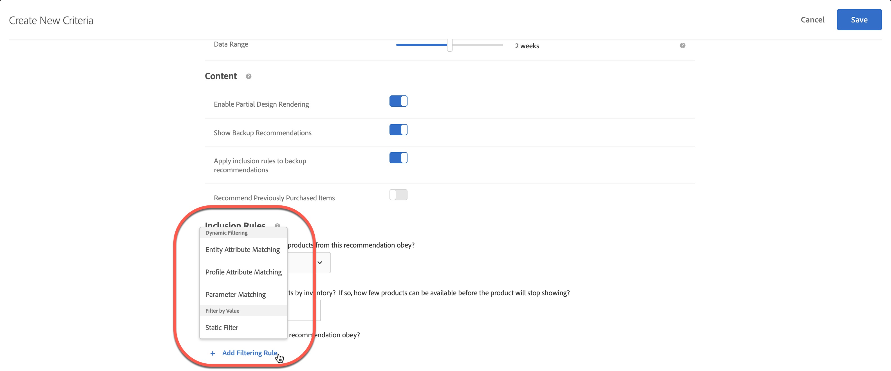
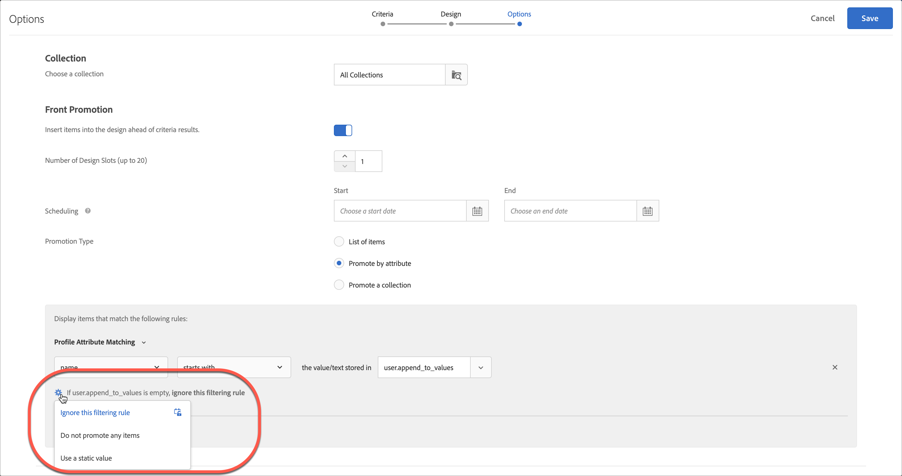

#  使用動態和靜態包含規則

有關為以下項目建立條件和促銷活動包含規則的資訊： [!DNL Adobe Target] 和新增動態或靜態篩選規則，為建議取得更佳結果。

對於條件和促銷活動，建立和使用包含規則的過程很相似，就如同使用案例和範例很相似一樣。本節將說明條件和促銷活動以及包含規則的使用。

## 將篩選規則新增至條件 {#section_CD0D74B8D3BE4A75A78C36CF24A8C57F}

[建立條件時](/help/main/c-recommendations/c-algorithms/create-new-algorithm.md#task_8A9CB465F28D44899F69F38AD27352FE)，請按一下&#x200B;**[!UICONTROL 「包含規則」]**&#x200B;下的&#x200B;**[!UICONTROL 「新增篩選規則」]**。

可用的選項依選取的行業別和建議金鑰而不同。

## 將篩選規則新增至促銷活動 {#section_D59AFB62E2EE423086281CF5D18B1076}

[建立促銷活動](/help/main/c-recommendations/t-create-recs-activity/adding-promotions.md#task_CC5BD28C364742218C1ACAF0D45E0E14)時，請選取&#x200B;**[!UICONTROL 「依屬性促銷」]**，然後按一下&#x200B;**[!UICONTROL 「新增篩選規則」]**。

## 篩選類型 {#section_0125F1ED10A84C0EB45325122460EBCD}

以下各節列出 [!UICONTROL 動態篩選] 和 [!UICONTROL 依值篩選] 對於條件和促銷活動：

### 動態篩選

動態包含規則比靜態包含規則更強大，且可產生更佳的結果和參與。 考慮以下事項:

* 動態包含規則會透過比對使用者設定檔參數或mbox呼叫中的屬性來傳送建議。

   例如，您可以建立「最受歡迎條件」建議。 從一組傳回的建議中，您可以根據使用者存取顯示建議的頁面時傳遞的屬性，即時篩選出任何建議。

* 使用靜態規則來限制建議中包含的項目（而非使用集合）。

* 您可以視需要建立任意數量的動態包含規則。 包含規則是以 AND 運算子來結合。必須符合所有規則，才能在建議中納入某個項目。

動態篩選可使用下列選項：

| 動態篩選選項 | 詳細資料 |
| --- | --- |
| [實體屬性比對](/help/main/c-recommendations/c-algorithms/entity-attribute-matching.md) | 比較一批潛在的建議項目與使用者已有互動的特定項目，以動態篩選。 使用 [!UICONTROL 實體屬性比對] 當您想要顯示最可能吸引訪客的建議時，例如訪客最喜愛的品牌。 |
| [設定檔屬性比對](/help/main/c-recommendations/c-algorithms/profile-attribute-matching.md) | 比較項目（實體）與使用者設定檔中的值，以動態篩選。 使用 [!UICONTROL 設定檔屬性比對] 當您想要顯示符合訪客設定檔中儲存之值的建議時，例如大小或最喜愛的品牌。 |
| [參數比對](/help/main/c-recommendations/c-algorithms/parameter-matching.md) | 比較項目（實體）與請求（API或mbox）中的值，以動態篩選。 使用 [!UICONTROL 參數比對] 建議符合頁面參數或訪客參數的內容，例如裝置維度或地理位置。 |

### 按值篩選

下列選項可供依值篩選：

| 依值篩選選項 | 詳細資料 |
| --- | --- |
| [靜態篩選器](/help/main/c-recommendations/c-algorithms/static-value.md) | 手動輸入一或多個要篩選的靜態值。 |

## 可用運算子 {#operators}

動態條件和促銷活動比靜態條件和促銷活動更強大，並產生更好的結果和參與。

下列範例提供關於如何在行銷工作中使用動態促銷和排除的一般概念：

| 運算元 | 範例 |
| --- | --- |
| 等於 （適用於實體屬性比對、設定檔屬性比對、參數比對及靜態篩選）。 | 在動態促銷活動中使用「等於」運算子，當訪客檢視您網站上的項目時（例如產品、文章或電影），您可以促銷下列來源的其他項目：<ul><li>相同品牌</li><li>相同類別</li><li>來自品牌的相同類別AND</li><li>同一家商店</li></ul> |
| 不等於 （適用於實體屬性比對、設定檔屬性比對、參數比對及靜態篩選）。 | 在動態促銷活動中使用「不等於」運算子，當訪客檢視您網站上的項目時（例如產品、文章或電影），您可以促銷下列來源的其他項目：<ul><li>另一部電視劇</li><li>不同的類型</li><li>不同的產品系列</li><li>不同樣式ID</li></ul> |
| 不包含子字串 （適用於實體屬性比對、設定檔屬性比對、參數比對及靜態篩選）。 | 使用「不包含子字串」運算子，當訪客檢視您網站上的項目時（例如產品），您可以促銷符合下列條件的其他項目：<ul><li>標題不包含粗體字</li></ul> |
| 開頭為 （適用於實體屬性比對、設定檔屬性比對、參數比對及靜態篩選）。 | 使用「開頭為」運算子，當訪客檢視您網站上的項目（例如產品）時，您可以促銷符合下列條件的其他項目：<ul><li>產品名稱以iPhone開頭</li></ul> |
| 結尾為 （適用於實體屬性比對、設定檔屬性比對、參數比對及靜態篩選）。 | 使用「結尾為」運算子，當訪客檢視您網站上的項目（例如產品）時，您可以促銷符合下列條件的其他項目：<ul><li>內容以EN結尾，表示英語</li></ul> |
| 大於或等於 （適用於實體屬性比對、設定檔屬性比對、參數比對及靜態篩選）。 | 使用「大於或等於」運算子，當訪客檢視您網站上的項目時（例如產品），您可以促銷符合下列條件的其他項目：<ul><li>成本相同或更貴</li></ul> |
| 小於或等於 （適用於實體屬性比對、設定檔屬性比對、參數比對及靜態篩選）。 | 使用「小於或等於」運算子，當訪客檢視您網站上的項目時（例如產品），您可以促銷符合下列條件的其他項目：<ul><li>成本相同或成本更低</li><li>排除較便宜的項目</li></ul> |
| 介於 （可用於實體屬性比對、設定檔屬性比對和參數比對。） | 在動態促銷活動中使用「介於」運算子，當訪客檢視您網站上的項目時（例如產品、文章或電影），您可以促銷下列其他項目：<ul><li>更貴</li><li>較便宜</li><li>成本加或減30%</li><li>同一季的後幾集</li><li>系列中的前幾本書</li></ul> |
| 包含在清單中 （可搭配設定檔屬性比對和參數比對使用）。 | 在設定檔屬性比對中使用「包含在清單中」運算子，當訪客檢視您網站上的項目時（例如產品、文章或電影），您可以促銷下列其他項目：<ul><li>可在訪客的地理位置中使用</li></ul>**範例**:您只想建議訪客地理區域中可用的項目。 您的篩選規則看起來可能像： `availableGeographies list contains an item in user.currentGeography` **附註**:使用此運算子時， [右側](#caveats) 規則。 |
| 未包含在清單中 （可搭配設定檔屬性比對和參數比對使用）。 | 在設定檔屬性比對中使用「不包含在清單中」運算子，當訪客檢視您網站上的項目時（例如產品、文章或電影），您可以排除以下項目：<ul><li>在訪客已檢視的前10個項目清單中</li></ul></ul>**範例**:您不想促銷訪客最近已檢視且不感興趣的項目。 您的篩選規則看起來可能像： `id is not contained in list user.lastViewedItems` **附註**:使用此運算子時， [右側](#caveats) 規則。 |
| 清單包含 （可用於實體屬性比對、設定檔屬性比對和參數比對。） | 在設定檔屬性比對中使用「清單包含項目在」運算子，當訪客檢視您網站上的項目時（例如體育活動或音樂會），您可以促銷下列其他項目：<ul><li>與訪客最喜愛的團隊之一相關聯</li></ul>**範例**:您想要建議與訪客最喜愛的其中一個團隊相關聯的遊戲。 您的篩選規則看起來可能像： ` teamsPlaying list contains an item in user.favoriteTeams` **附註**:使用此運算子時， [兩邊](#caveats) 規則。 |
| 清單中不包含項目 （可用於實體屬性比對、設定檔屬性比對和參數比對。） | 在參數屬性比對中使用「list does not contain a in」運算子，當訪客檢視您網站上的項目時（例如產品、文章或電影），您可以排除以下項目：<ul><li>包含在禁止類型清單中</li></ul>**範例**:您想要排除成年人可用的項目，例如煙草和酒精。 您的篩選規則看起來可能像： `itemType is not contained in list mbox.prohibitedTypes` **附註**:使用此運算子時， [兩邊](#caveats) 規則。 |
| 清單包含 （可用於實體屬性比對、設定檔屬性比對和參數比對。） | 在設定檔屬性比對中使用「清單包含所有項目」運算子，當訪客檢視您網站上的項目時（例如工作發佈或方式），您可以促銷符合下列條件的其他項目：<ul><li>包括一組技能</li><li>包括一組所需配料</li></ul>**範例1**:假設訪客有一組技能(Java、C++和HTML)。 目錄中的項目是具有必要技能(Java和HTML)的工作。 在向訪客建議工作之前，您要確定訪客的設定檔包含所有必要的技能。 您的篩選規則看起來可能像： `profile.jobSeekerSkills contains all items in entity.requiredSkills` **範例2**:假設使用者有食品配料清單。 食譜上有一份所需配料的清單。 在向訪客建議方式之前，請確定訪客的設定檔包含所有必要的配料。 您的篩選規則看起來可能像： `profile.ingredientsInPantry contains all items in recipe.ingredientsRequired` **附註**:使用此運算子時， [兩邊](#caveats) 規則。 |
| 清單不包含 （可用於實體屬性比對、設定檔屬性比對和參數比對。） | 在實體屬性比對中使用「list does not contain all items in」運算子，當訪客檢視您網站上的項目時（例如體育賽事或音樂會），您可以促銷符合下列條件的其他項目：<ul><li>不包括一組團隊</li></ul>**範例**:假設體育賽事包含兩個球隊。 訪客的設定檔指出此訪客不想檢視這些團隊的遊戲。 如果這些團隊在玩，您想確保不建議使用遊戲。 您的篩選規則看起來可能像： `profile.leastfavoriteTeams does not contain all items in entity.teamsPlaying` **附註**:使用此運算子時， [兩邊](#caveats) 規則。 |

## 依實體屬性比對、設定檔屬性比對和參數比對來篩選時處理空白值 {#section_7D30E04116DB47BEA6FF840A3424A4C8}

篩選依據時，您可以選擇數個選項來處理空值 [!UICONTROL 實體屬性比對], [!UICONTROL 設定檔屬性比對]，和 [!UICONTROL 參數比對] 退出條件和促銷活動。

以前，如果值空白，則不會傳回結果。如果條件有空白值，則「如果 *x* 為空白」下拉式清單可讓您選擇適當的動作來執行，如下圖所示:

若要選取所需的動作，請將滑鼠指標暫留在齒輪圖示上()，然後選擇所需的動作：

| Action | 可用於 | 詳細資料 |
|--- |--- |--- |
| [!UICONTROL 忽略此篩選規則] | [!UICONTROL 設定檔屬性比對] 和 [!UICONTROL 參數比對] | 此動作是 [!UICONTROL 設定檔屬性比對] 和 [!UICONTROL 參數比對]. 此選項會指定忽略規則。例如，假設有三個篩選規則，而第三個規則未傳遞任何值，為了避免不傳回任何結果，您可以直接用空白值忽略第三個規則。 |
| [!UICONTROL 不顯示此條件的任何結果] （僅限條件） | [!UICONTROL 實體屬性比對], [!UICONTROL 設定檔屬性比對]，和 [!UICONTROL 參數比對] | 此動作是 [!UICONTROL 實體屬性比對]. 此動作為 [!DNL Target] 新增此選項前已處理的空值：此條件不會顯示任何結果。 |
| [!UICONTROL 不促銷任何項目 （僅限促銷活動）] | [!UICONTROL 實體屬性比對], [!UICONTROL 設定檔屬性比對]，和 [!UICONTROL 參數比對] | 此動作是 [!UICONTROL 實體屬性比對]. 此動作為 [!DNL Target] 新增此選項前已處理的空值：此條件不會顯示任何結果。 |
| [!UICONTROL 使用靜態值] | [!UICONTROL 實體屬性比對], [!UICONTROL 設定檔屬性比對]，和 [!UICONTROL 參數比對] | 如果值為空白，您可以選擇使用靜態值。 |

## 注意事項 {#caveats}

>[!IMPORTANT]
>
>使用「等於」和「不等於」運算子時，在執行階段，動態條件或促銷活動中的不同資料類型可能不相容。使用 [!UICONTROL 值], [!UICONTROL 利潤], [!UICONTROL 庫存]，和 [!UICONTROL 環境] 如果左側有預先定義的屬性或自訂屬性，右側的值會明智地顯示。

下表顯示有效規則，以及在執行階段可能不相容的規則:

| 相容規則 | 可能不相容的規則 |
|--- |--- |
| value - 介於 - 目前項目的 90% 和 110% - salesValue | salesValue - 介於 - 目前項目的 90% 和 110% - value |
| value - 介於 - 目前項目的 90% 和 110% - value | clearancePrice - 介於 - 目前項目的 90% 和 110% - margin |
| margin - 介於 - 目前項目的 90% 和 110% - margin | storeInventory - 等於 - 目前項目的 - inventory |
| inventory - 等於 - 目前項目的 - inventory |  |
